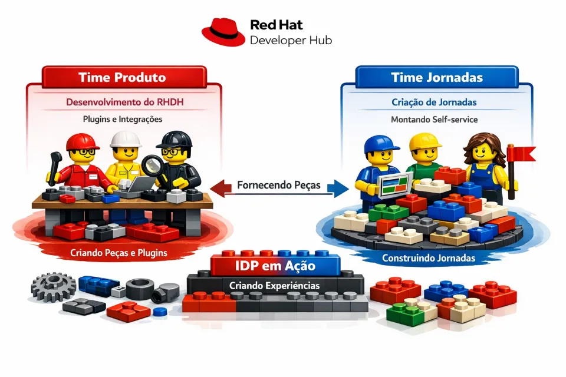

Padronização, Migração e Governança de Pipelines GitHub: fortalecimento da segurança, automação e confiabilidade das entregas de software

No contexto da evolução das práticas de DevSecOps e da ampliação do uso de automações em pipelines corporativos, tornou-se necessário estabelecer maior padronização, governança e segurança nos processos de integração e entrega contínua utilizados pelas equipes de desenvolvimento. O cenário anterior apresentava heterogeneidade de parâmetros, referências descentralizadas, uso extensivo de secrets distribuídos e dependência de imagens externas, elevando riscos operacionais, de segurança e de manutenção.

Para endereçar esse cenário, foi conduzido um conjunto integrado de ações voltadas à padronização dos parâmetros de pipelines para aplicações Android, validação estrutural de workflows, jobs e solutions, bem como a verificação e consolidação de referências a templates reutilizáveis. As atividades incluíram a validação de arquivos, correção de dependências, saneamento de referências inconsistentes e consolidação dos ajustes por meio do merge controlado de pull requests, assegurando aderência aos padrões definidos.

Paralelamente, foi executada a migração em lotes de pipelines para GitHub Actions, acompanhada de testes de sistemas de informação já migrados, garantindo a continuidade operacional e a confiabilidade das automações. Como reforço à segurança da cadeia de suprimentos de software, foi realizada a análise, validação e upload de aproximadamente 80% das imagens de aplicações para o ACR privado da CAIXA, reduzindo dependências externas e ampliando o controle institucional.

Complementarmente, foram mapeados todos os componentes instaláveis dos runners do GitHub, realizado o levantamento completo de secrets e variables necessários aos pipelines e efetuado o cadastro centralizado desses artefatos na organization, fortalecendo a governança e a rastreabilidade. A iniciativa foi concluída com uma prova de conceito de Code Quality, avaliando mecanismos de controle da qualidade do código, e com a inclusão do DNS da distribuição CloudFront no sumário das tasks, ampliando a visibilidade técnica das soluções entregues.

O conjunto dessas ações resultou em uma base mais estável, segura e padronizada para as automações de CI/CD, contribuindo diretamente para a resiliência das entregas, redução de riscos operacionais e melhoria da previsibilidade dos ciclos de desenvolvimento e implantação.

ver menos

-----
🚀 Como funciona a divisão de atividades no FusionX (IDP)?

Você já se perguntou como organizamos as entregas dentro do FusionX para garantir evolução contínua da plataforma e, ao mesmo tempo, foco total na experiência do desenvolvedor?

Hoje, estruturamos nossas frentes de atuação em dois pilares principais:

🔹 IDP Produto (Capítulo de Codificação)
Responsável pela evolução da plataforma em si.
Essa frente atua diretamente no desenvolvimento do frontend, na criação de novos módulos e plugins, além de liderar iniciativas voltadas à experiência do desenvolvedor (DevEx). Seu foco está em construir e evoluir as capacidades da plataforma, garantindo que o FusionX continue moderno, intuitivo e aderente às necessidades dos times. 

🔹 IDP Jornadas (CoE Nuvem e DevSecOps)
Responsável por transformar essas capacidades em valor prático para os usuários.
Essa frente utiliza os módulos e plugins já disponibilizados para criar jornadas e automações, estruturando fluxos que simplificam o dia a dia dos desenvolvedores.
Seu foco é orquestrar e padronizar processos, promovendo agilidade, governança e produtividade.

💡 Em essência:

O IDP Produto constrói a plataforma
O IDP Jornadas constrói as jornadas sobre a plataforma

Essa divisão permite maior especialização, melhor qualidade nas entregas e uma evolução mais consistente do FusionX como nossa plataforma central de desenvolvimento.

👉 Com isso, conseguimos equilibrar inovação tecnológica com eficiência operacional, colocando o desenvolvedor no centro de tudo.

comentarios:

Leonardo Amorim Goncalves conversa com o colega... Pensei aqui, sobre o scaffolds, será que conseguimos deixar o repo com internal pra fomentar a colaboração? dai o Helbert Oscar de Aguiar Silva abre um PR com as sugestões dele e a gente avalia.

Helbert Oscar de Aguiar Silva veja com o Leo, mas no canal oficial é cxnde04
Leonardo Amorim Goncalves
28 de mai.
Opa, Helbert Oscar de Aguiar Silva e Danilo Sousa de Oliveira, nós estamos atualmente em processo de virada de chave de ownership desses scaffolders para o Capítulo de Codificação  (Nilson Donizeti Massarenti Junior). Mas bora conversar sobre isso sim, Helbert Oscar de Aguiar Silva!

-------------------
 gente sabe que o dia a dia de desenvolvimento pode ser incrível… mas também pode ter aqueles momentos que dão vontade de abrir um ticket com o universo 😅

Pensando nisso, lançamos uma pesquisa rápida (prometo!) pra ouvir você — sem filtro e sem burocracia. Queremos entender o que mais dói hoje e, principalmente, o que dá pra melhorar de verdade.

💡 E já vamos direto ao ponto:
Qual foi aquele ticket que você nunca esqueceu (pelos piores motivo...
ver mais
Gosto de abrir chamados (tickets) 😅

Luiz Felipe de Almeida Leite
27 de mai.
*Qual foi aquele ticket que você nunca esqueceu (pelos piores motivos)?
Instalação de software no geral é muita burocracia. Felizmente tenho acesso ao WSL e consigo manter 90% das ferramentas atualizadas sem realizar chamado.

*Se você tivesse um “delete” mágico na TI, o que você eliminaria?
Eliminaria o máximo barreiras possível entre os "times", reduziria a burocracia nos processos e simplificaria os passos para colocar em produção novos projetos, permitindo estágios intermediários em que o cl...ver mais
🚀 Está lembrado do Workshop Nuvem & Esteira DevSecOps, que aconteceu em 14/ABR?

O workshop reuniu grandes players do mercado — AWS, Microsoft, Google Cloud, IBM e Red Hat — trazendo insights sobre:

✅ Inovações em Cloud e DevSecOps ✅ Aplicações de IA generativa e agentes autônomos ✅ Práticas de segurança e governança ✅ Casos reais e oportunidades no setor financeiro

📌 Acesse agora o conteúdo completo, assista às palestras e continue sua jornada de aprendizado:

👉 Workshop Nuvem & Esteira DevSecOps

Se você quer se aprofundar nas tendências que estão transformando a estratégia digital da CAIXA, este conteúdo é para você!

💡 O aprendizado não para — aproveite para explorar e fortalecer suas competências em tecnologias que estão moldando o futuro da CAIXA!

Anúncio postado em O365GRP-Escola de TI em 26 de mai. de 2026

ver menos

Prova de Conceito do Github Code Qualy: Ferramenta gratuita nativamente integra ao ecossistema do GitHub

A necessidade de ampliar o controle de qualidade do código-fonte e reforçar os mecanismos de governança técnica no ciclo de desenvolvimento motivou a execução de uma Prova de Conceito (PoC) de uma ferramenta de análise estática de código integrada nativamente ao GitHub, denominada GitHub Code Quality. A iniciativa esteve alinhada às diretrizes de evolução da maturidade DevSecOps e à estratégia de antecipação de controles de qualidade e segurança.

A entrega consistiu na validação da capacidade da ferramenta em realizar análises automáticas diretamente nos repositórios, identificando vulnerabilidades, falhas de qualidade, desvios de padrões e más práticas de codificação ainda nas fases iniciais do desenvolvimento. A solução foi avaliada quanto à sua aderência aos fluxos existentes, integração com pipelines e geração de feedback contínuo aos desenvolvedores, reforçando o conceito de shift left no tratamento de riscos técnicos.

Como desdobramento estratégico da PoC, foi definida a continuidade da iniciativa por meio da atuação conjunta da equipe técnica de Qualidade, visando a integração das funcionalidades do GitHub Code Quality com as capacidades já consolidadas do Sonar. Essa integração tem como objetivo unificar e complementar as análises de qualidade, ampliando a cobertura, a consistência dos critérios técnicos e a visibilidade institucional sobre a saúde do código-fonte.

O resultado esperado dessa evolução é o fortalecimento de um ecossistema integrado de qualidade de código, com maior padronização, rastreabilidade e governança, contribuindo para a redução de riscos operacionais, aumento da confiabilidade das aplicações e melhoria contínua do ciclo de entrega de software, em alinhamento às diretrizes de estabilidade, segurança e eficiência operacional da CAIXA.

-------------------

🚀 Como funciona a divisão de atividades no FusionX (IDP)?

Você já se perguntou como organizamos as entregas dentro do FusionX para garantir evolução contínua da plataforma e, ao mesmo tempo, foco total na experiência do desenvolvedor?

Hoje, estruturamos nossas frentes de atuação em dois pilares principais:

🔹 IDP Produto (Capítulo de Codificação)
Responsável pela evolução da plataforma em si.
Essa frente atua diretamente no desenvolvimento do frontend, na criação de novos módulos e plugins, além de liderar iniciativas voltadas à experiência do desenvolvedor (DevEx). Seu foco está em construir e evoluir as capacidades da plataforma, garantindo que o FusionX continue moderno, intuitivo e aderente às necessidades dos times. 

🔹 IDP Jornadas (CoE Nuvem e DevSecOps)
Responsável por transformar essas capacidades em valor prático para os usuários.
Essa frente utiliza os módulos e plugins já disponibilizados para criar jornadas e automações, estruturando fluxos que simplificam o dia a dia dos desenvolvedores.
Seu foco é orquestrar e padronizar processos, promovendo agilidade, governança e produtividade.

💡 Em essência:

O IDP Produto constrói a plataforma
O IDP Jornadas constrói as jornadas sobre a plataforma

Essa divisão permite maior especialização, melhor qualidade nas entregas e uma evolução mais consistente do FusionX como nossa plataforma central de desenvolvimento.

👉 Com isso, conseguimos equilibrar inovação tecnológica com eficiência operacional, colocando o desenvolvedor no centro de tudo.

---
🚀 Ambiente Sandbox: Liberdade para experimentar, segurança para entregar!

O CoE de Nuvem e DevSecOps traz uma grande novidade: o ambiente SANDBOX está disponível no portal do desenvolvedor FusionX.

💡Um ambiente controlado, projetado para permitir experimentação segura sem riscos ao ambiente corporativo, acelerando a inovação de forma responsável.

☁️ Ambiente em nuvem criado a partir da esteira DevSecOps corporativa.

🏆 Durante o Hackathon do Caixaverso, o SANDBOX foi utilizado em cenário real, com 250 pessoas e 284 repositórios criados, comprovando seu potencial como aceleradora de inovação.

⚠️ _Uso exclusivo para experimentação._

Benefícios:

🔒 Redução de riscos operacionais
Permite experimentação isolada, evitando impactos em ambientes produtivos e garantindo maior segurança para o negócio.

⚡ Aceleração da inovação
Facilita a validação rápida de ideias, protótipos e novas tecnologias, reduzindo o time-to-market das soluções.

📈 Fomento à cultura DevSecOps
Incentiva boas práticas de automação, segurança e entrega contínua desde a fase de experimentação.

🧑‍💻 Autonomia para os times
Empodera desenvolvedores e squads com liberdade para testar, aprender e evoluir sem dependências operacionais complexas.

💰 Otimização de custos
Evita uso indevido de ambientes produtivos para testes, contribuindo para uma gestão mais eficiente dos recursos em nuvem.

🔄 Padronização tecnológica
Garante que os experimentos já nasçam alinhados à esteira corporativa, facilitando a transição para ambientes oficiais.

🚀 Aumento da produtividade
Reduz barreiras de entrada para testes e desenvolvimento, permitindo que os times foquem no que realmente importa: gerar valor.

---
Sobre a pergunta 01: sim, pela console do Ansible Automation Plataform é possível fazer agendamentos (schedules) para as Job Templates.

O Ansible agenda e executa códigos do Git?
Pergunta 01: O Ansible além de executar códigos do Git ele executa de forma agendada?

Pergunta 02: É necessário ter um código pronto no Git. Ou seja, se preciso pegar dados de emails do outlook e importá-los para uma lista do Sharepoint é necessário ter este código funcional que o Ansible vai identificar se é java, python e o vai executar?

Sobre a pergunta 02: sim, o AAP sincroniza com o projeto no GIT e de lá ele pega a ultima versão do playbook (arquivo.yml) que será executado pelo ansible-core em background. O ansible-core se conecta ao host de destino e faz tudo em Python, por isso o pré requisito o pyhton instalado no host-alvo do inventário para que ele receba a configuração.
---
Esteira DevSecOps Unificada no GitHub com CI/CD Escalável, Seguro e Padronizado

Implantação e consolidação de uma esteira DevSecOps unificada no GitHub para aplicações Java e workloads na AWS, combinando padronização de CI, migração de repositórios críticos, melhoria de experiência do desenvolvedor (DX), execução elástica de pipelines via runners dinâmicos na AWS (ARC) e controles de qualidade e segurança integrados (CodeQL e Sonar) — garantindo geração de artefatos consistente, escalabilidade sob demanda e adoção acelerada da nova plataforma de engenharia.

A nova esteira DevSecOps no GitHub entrega aos times de desenvolvimento uma experiência unificada, escalável e orientada à qualidade desde o primeiro commit, por meio de pipelines padronizadas e reutilizáveis, integradas nativamente à AWS.

Com essa entrega, os usuários passam a contar com:

Build e integração contínua simplificados, inclusive para projetos Java multimódulos, com geração padronizada de artefatos prontos para execução na AWS.

Maior produtividade e autonomia, apoiadas por pipelines intuitivas com menus interativos, reduzindo erros operacionais e dependência de configurações manuais.

Escalabilidade automática das execuções, através de runners do GitHub Actions orquestrados dinamicamente na AWS, eliminando filas e gargalos de pipeline.

Segurança e qualidade incorporadas ao fluxo de desenvolvimento, com análises automatizadas via CodeQL e Sonar, incluindo suporte a binários e packages institucionais.

Adoção acelerada da nova plataforma de engenharia, com migração de repositórios críticos e alinhamento aos padrões modernos de DevSecOps.

---

Estabelecimento do Comitê da Plataforma do Desenvolvedor (IDP)

Instituição do Comitê da Plataforma do Desenvolvedor (IDP), com participação da SUART, do CoE Nuvem e DevSecOps e do Capítulo de Codificação, responsável por definir, priorizar e orquestrar de forma integrada todas as demandas relacionadas ao IDP na CAIXA.

Benefícios esperados:

Fortalecimento da governança do IDP

Integração efetiva entre áreas estratégicas da CAIXA

Maior alinhamento das decisões à estratégia institucional

Redução de conflitos, duplicidades e retrabalho

Aumento da previsibilidade e da maturidade da Plataforma do Desenvolvedor.

Evolução das Jornadas do FusionX como Plataforma de IDP

Evolução das jornadas do FusionX (IDP), contemplando a adequação e padronização dos fluxos departamentais, com ajustes em campos obrigatórios, comportamento de criação de grupos no Entra ID e disponibilização do uso em modo DEMO.

A entrega inclui a eliminação de inconsistências organizacionais e o alinhamento das jornadas às normas institucionais, ao contexto departamental e ao modelo ágil de mudanças, bem como a criação de novas jornadas estratégicas, tais como templates para bibliotecas Angular e serviço automatizado de migração de repositórios do DevOps Services com pipelines clássicas.

Adicionalmente, foram realizados aprimoramentos nas jornadas de criação de repositórios, incluindo a implementação de um serviço específico para by-pass controlado de regras organizacionais, e a automação da criação de repositórios de qualidade, incorporando controles de qualidade desde o início do ciclo de vida dos projetos.

Com essas evoluções, o FusionX se consolida como plataforma central de IDP, promovendo maior governança, padronização, agilidade e qualidade na entrega de soluções digitais.

