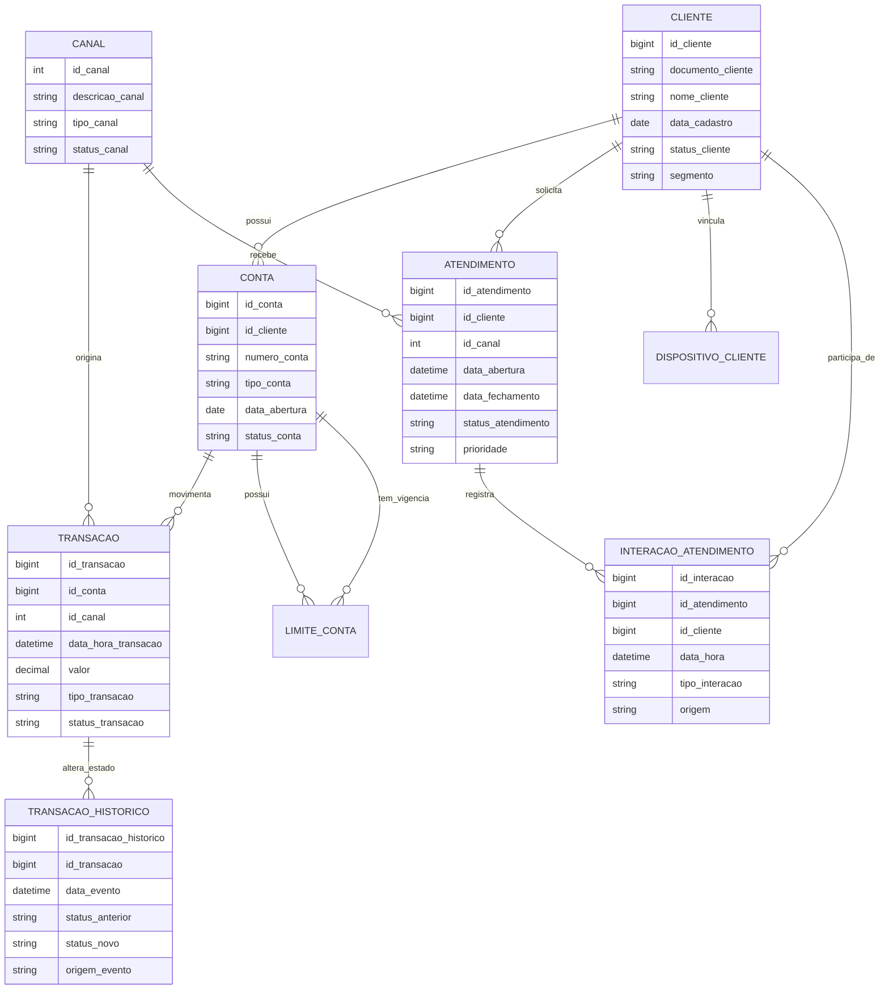

# Produção Temática — PSI nº 15358 — SIADL

**Tema:** Estudo de Caso do Sistema de Atendimento Digital — SIADL
**Função:** Coordenador de Projetos/Processos Matriz — GECPA
**Abordagem:** cenário hipotético, com foco em Administração de Dados, Administração de Banco de Dados, governança, modelagem conceitual e modelagem física para ambiente SQL Server OLTP crítico.

---

## 1. Introdução executiva

O SIADL apresenta um conjunto de sintomas típicos de degradação estrutural do ambiente de dados: inconsistência de informações, lentidão generalizada, timeout em operações críticas, crescimento acelerado de tabelas transacionais, aumento de incidentes, picos de CPU e consumo excessivo de memória. Em um ambiente SQL Server 2025 com aproximadamente 12 TB, mais de 10 mil usuários simultâneos e cerca de 25 mil transações por minuto, esses sintomas não devem ser tratados apenas como problema de infraestrutura ou de tuning pontual. Eles indicam fragilidade combinada de **modelagem, governança, desenho físico, ciclo de vida, qualidade de dados e sustentação operacional**.

Minha proposta como coordenador técnico é organizar a intervenção em quatro eixos integrados: primeiro, corrigir o **modelo conceitual**, estabilizando entidades, domínios, relacionamentos, cardinalidades e regras de negócio; segundo, redesenhar o **modelo físico**, adequando tipos de dados, chaves, índices, particionamento, compactação, segurança e disponibilidade; terceiro, estabelecer um **plano de trabalho claro entre ADs, DBAs e squad**, com fronteiras de atuação e ritos de governança; e quarto, implantar uma **estratégia proativa e corretiva de evolução**, capaz de acompanhar crescimento vegetativo e reduzir incidentes sem depender exclusivamente de ações emergenciais.

A diretriz central é que o modelo físico pode divergir do conceitual apenas quando houver necessidade objetiva de performance, escalabilidade, manutenção ou disponibilidade, sempre com salvaguardas de integridade, rastreabilidade e documentação no modelo. Não proponho migração para microsserviços ou APIs, pois o próprio cenário informa que o SIADL não possui essa arquitetura e a Produção Temática exige solução estrutural no banco relacional existente.

---

## 2. Diagnóstico técnico da situação atual

### 2.1 Síntese dos problemas encontrados na DDL

| Problema identificado                         | Causa técnica                                                                                               | Impacto no SIADL                                                                             | Direção de solução                                                                                                                    |
| --------------------------------------------- | ------------------------------------------------------------------------------------------------------------ | -------------------------------------------------------------------------------------------- | ----------------------------------------------------------------------------------------------------------------------------------------- |
| Uso de`TIMESTAMP` para datas de negócio    | No SQL Server,`TIMESTAMP`/`ROWVERSION` não armazena data/hora; é contador binário de versão de linha | Datas semanticamente inválidas, inconsistência em auditoria, ordenação e particionamento | Substituir por`DATETIME2(3)` para data/hora e `DATE` quando não houver hora; usar `ROWVERSION` apenas para concorrência otimista. |
| `ATENDIMENTO.canal VARCHAR(30)`             | Canal como texto livre, apesar de existir tabela CANAL                                                       | Grafias divergentes, domínio duplicado, inconsistência de relatórios e filtros            | Criar FK`ATENDIMENTO → CANAL`.                                                                                                         |
| Status como`VARCHAR(20)` em várias tabelas | Ausência de domínio/constraint; repetição textual em tabelas bilionárias                                | Alto consumo de espaço, baixa seletividade, risco de status inválidos                      | Criar domínios controlados ou códigos`TINYINT/SMALLINT` com FK/CHECK.                                                                 |
| Ausência de particionamento                  | Tabelas com centenas de milhões/bilhões tratadas como monolitos                                            | Scans extensos, manutenção longa, expurgo caro, backup pesado                              | Particionamento mensal por data de negócio/evento nas tabelas massivas.                                                                  |
| PK clustered sequencial em`BIGINT`          | Inserção concentrada na última página em tabelas de alta concorrência                                   | Contenção por`PAGELATCH_EX`, picos de CPU e latência                                    | Solução definitiva: clustered composta por data+id alinhada à partição; paliativo:`OPTIMIZE_FOR_SEQUENTIAL_KEY`.                   |
| Ausência de índices não clusterizados      | Consultas por conta/período, cliente/status e limite vigente não têm suporte                              | Scans, timeouts, consumo de CPU/memória                                                     | Índices covering, filtrados e alinhados às partições.                                                                                 |
| `CHECK (valor > 0)` em transação          | Regra pode impedir estorno/ajuste negativo                                                                   | Risco de contorno indevido ou rejeição de operação válida                               | Preferir estorno como novo evento/transação de tipo específico; se negócio exigir negativo, revisar regra.                            |
| LIMITE_CONTA sem controle de vigência        | Não há garantia de único limite vigente ou não sobreposição                                            | Risco de múltiplos limites ativos para mesma conta/tipo                                     | Índice único filtrado para vigente e validação transacional de sobreposição.                                                        |
| Ausência de auditoria e classificação      | Sem colunas de criação/alteração e sem marcação de dados sensíveis                                    | Fragilidade de rastreabilidade, LGPD, sigilo e investigação                                | Colunas de auditoria, classificação OR016, SQL Audit/TDE/criptografia conforme sensibilidade.                                           |
| TRANSACAO_HISTORICO tratada como tabela comum | Histórico append-only de 10 bi, 30% a.m., sem estratégia específica                                       | Crescimento explosivo e manutenção inviável                                               | Particionamento por`DH_EVENTO`, compressão forte, append-only, retenção/arquivamento por partição.                                 |

### 2.2 Projeção de volumetria e insustentabilidade

A gravidade do cenário fica evidente quando a taxa mensal é composta por 12 meses. Considerando crescimento mensal informado:

| Entidade              | Volume atual | Crescimento | Projeção aproximada em 12 meses | Implicação                                                                                |
| --------------------- | -----------: | ----------: | --------------------------------: | ------------------------------------------------------------------------------------------- |
| ATENDIMENTO           |       800 mi |    20% a.m. |                            7,1 bi | Exige particionamento, índices por status/data/cliente e ciclo de vida.                    |
| INTERACAO_ATENDIMENTO |         1 bi |    20% a.m. |                            8,9 bi | Histórico granular não pode ficar sem partição e compressão.                           |
| TRANSACAO             |         4 bi |    30% a.m. |                         93–94 bi | Supera em centenas de vezes o gatilho de avaliação de particionamento de 100M linhas/ano. |
| TRANSACAO_HISTORICO   |        10 bi |    30% a.m. |                            233 bi | Deve ser tratado como append-only particionado, comprimido e com retenção formal.         |

O diagnóstico, portanto, deixa de ser apenas “há lentidão” e passa a ser: o desenho atual não está aderente a um ambiente OLTP crítico de altíssima volumetria. A ausência de particionamento descumpre a disciplina prevista para tabelas com grande crescimento; a ausência de compactação amplia I/O e pressão de memória; a ausência de ciclo de vida mantém dados antigos na área quente; e a ausência de domínios/relacionamentos formais gera inconsistência de dados.

---

## 3. Modelo conceitual ideal

### 3.1 Princípios conceituais aplicados

O modelo conceitual ideal separa claramente dados mestres, dados transacionais, dados operacionais, dados históricos e dados de domínio. CLIENTE, CONTA e CANAL são entidades centrais de referência; ATENDIMENTO e TRANSACAO representam fatos operacionais/transacionais; INTERACAO_ATENDIMENTO e TRANSACAO_HISTORICO são entidades históricas/dependentes; LIMITE_CONTA é entidade temporal de vigência de negócio; DISPOSITIVO_CLIENTE é entidade operacional de segurança/antifraude vinculada ao cliente.

Também considero a especialização conceitual de CLIENTE em pessoa física e pessoa jurídica, ainda que o físico possa manter um único cadastro com atributo de segmento/tipo quando essa decisão estiver alinhada ao modelo corporativo e ao dado mestre de clientes. Essa especialização deve ser descrita conceitualmente, pois muda regras de documento, nome, validação e conformidade.

### 3.2 Diagrama conceitual em Mermaid

> Arquivo auxiliar para reconstrução em Draw.io/PowerDesigner: `04-especificacao-drawio-powerdesigner-siadl.md`.



### 3.3 Tabela conceitual por entidade

| Entidade              | Classe conceitual                                                 | Responsabilidade                                  | Relacionamentos/cardinalidades                           | Regras principais                                                                                                |
| --------------------- | ----------------------------------------------------------------- | ------------------------------------------------- | -------------------------------------------------------- | ---------------------------------------------------------------------------------------------------------------- |
| CLIENTE               | Entidade forte; dado mestre                                       | Representar pessoa física/jurídica atendida     | 1:N CONTA, ATENDIMENTO, DISPOSITIVO_CLIENTE e INTERACAO  | Documento único, status controlado, classificação de dado sensível, possibilidade de especialização PF/PJ. |
| CONTA                 | Entidade forte dependente do cliente; transacional de referência | Representar conta usada nas transações          | N:1 CLIENTE; 1:N TRANSACAO e LIMITE_CONTA                | Número de conta único, status controlado, vínculo obrigatório a cliente.                                     |
| CANAL                 | Entidade de domínio                                              | Padronizar canais de atendimento/transação      | 1:N TRANSACAO; 1:N ATENDIMENTO                           | Canal ativo/inativo controlado; não deve ser texto livre.                                                       |
| ATENDIMENTO           | Entidade transacional/operacional                                 | Registrar solicitação, reclamação ou serviço | N:1 CLIENTE; N:1 CANAL; 1:N INTERACAO                    | Abertura obrigatória, fechamento opcional, status e prioridade controlados, ciclo de vida definido.             |
| INTERACAO_ATENDIMENTO | Entidade histórica/dependente                                    | Registrar eventos/interações de um atendimento  | N:1 ATENDIMENTO; N:1 CLIENTE por participação/rastreio | Append-only preferencial; data/hora obrigatória; origem e tipo controlados.                                     |
| DISPOSITIVO_CLIENTE   | Entidade operacional de segurança                                | Registrar dispositivo vinculado ao cliente        | N:1 CLIENTE                                              | Hash único, classificação sensível, data de vínculo, status se houver desvinculação.                      |
| LIMITE_CONTA          | Entidade temporal de vigência de negócio                        | Registrar limites por tipo e período             | N:1 CONTA                                                | Não pode haver mais de um limite vigente por conta/tipo; vigências não devem se sobrepor.                     |
| TRANSACAO             | Entidade transacional crítica                                    | Registrar operação financeira                   | N:1 CONTA; N:1 CANAL; 1:N TRANSACAO_HISTORICO            | Valor, tipo e status controlados; estorno preferencialmente como novo evento; auditoria obrigatória.            |
| TRANSACAO_HISTORICO   | Entidade histórica append-only                                   | Preservar mudança de estado da transação       | N:1 TRANSACAO                                            | Imutável após gravação; particionada por evento; compressão e retenção específicas.                      |

### 3.4 Regras de negócio conceituais obrigatórias

1. Um CLIENTE pode possuir zero ou muitas CONTAS; uma CONTA pertence obrigatoriamente a um CLIENTE.
2. Um CLIENTE pode abrir zero ou muitos ATENDIMENTOS; um ATENDIMENTO pertence obrigatoriamente a um CLIENTE.
3. Um ATENDIMENTO deve ser registrado em um CANAL válido; o atributo textual `canal` deve ser substituído por relacionamento com CANAL.
4. Uma TRANSACAO ocorre em uma CONTA e por um CANAL válido.
5. Uma TRANSACAO pode possuir muitos eventos de histórico; cada evento pertence a uma única TRANSACAO.
6. LIMITE_CONTA possui vigência de negócio; para uma mesma conta e tipo de limite, não deve haver vigências sobrepostas.
7. Status, tipo, origem e prioridade não devem ser textos livres em tabelas massivas; devem ser domínios controlados.
8. INTERACAO_ATENDIMENTO e TRANSACAO_HISTORICO devem preservar trilha histórica; alteração física para performance não pode eliminar rastreabilidade.

---

## 4. Modelo físico ideal

### 4.1 Diretrizes físicas

O modelo físico proposto respeita o conceito negocial, mas adapta armazenamento, chaves, índices e particionamento para o cenário de altíssima volumetria. As principais decisões são:

| Decisão física                                  | Aplicação                                                                                                                                                                     |
| ------------------------------------------------- | ------------------------------------------------------------------------------------------------------------------------------------------------------------------------------- |
| Trocar`TIMESTAMP` por `DATETIME2(3)`/`DATE` | Todas as datas de negócio;`ROWVERSION` apenas para concorrência otimista.                                                                                                   |
| Padronizar nomenclatura                           | Usar prefixos de classe como`NU_`, `CO_`, `DT_`, `DH_`, `VR_`, `IC_`, `DE_` e tabelas `TB_`.                                                                    |
| Particionar tabelas massivas por data             | `TB_ATENDIMENTO` por `DH_ABERTURA`, `TB_INTERACAO_ATENDIMENTO` por `DH_INTERACAO`, `TB_TRANSACAO` por `DH_TRANSACAO`, `TB_TRANSACAO_HISTORICO` por `DH_EVENTO`. |
| Clustered composta por data+id                    | Alinha a PK à partição e viabiliza SWITCH/expurgo; reduz manutenção monolítica.                                                                                           |
| Índices não clusterizados alinhados             | Suportar extrato por conta/período, atendimento por cliente/status, limite vigente e histórico por transação.                                                               |
| Compressão por temperatura                       | PAGE como padrão normativo; avaliar ROW nas partições muito quentes se o custo de CPU justificar.                                                                            |
| RCSI                                              | Reduz bloqueio leitura×escrita em consultas OLTP, com dimensionamento de tempdb.                                                                                               |
| Query Store e estatísticas incrementais          | Detectar regressões de plano e manter estatísticas por partição.                                                                                                            |
| Segurança                                        | TDE para banco, auditoria, mascaramento/criptografia conforme classificação, privilégio mínimo.                                                                             |
| Disponibilidade                                   | Always On Availability Groups, réplica legível para relatórios/checks e política RTO/RPO definida com o negócio.                                                           |

### 4.2 Exemplo de função/esquema de particionamento

```sql
CREATE PARTITION FUNCTION PF_SIADL_MES (DATETIME2(3))
AS RANGE RIGHT FOR VALUES
('2026-01-01', '2026-02-01', '2026-03-01', '2026-04-01');

CREATE PARTITION SCHEME PS_SIADL_MES
AS PARTITION PF_SIADL_MES
TO (FG_2025_12, FG_2026_01, FG_2026_02, FG_2026_03, FG_2026_04);
```

A granularidade mensal é adequada porque o crescimento é mensal e as consultas críticas tendem a usar período. A política deve prever criação antecipada de partições futuras, SWITCH OUT de partições frias, compactação diferenciada e eventual expurgo conforme decisão do gestor da informação.

### 4.3 Pseudo-DDL resumida das tabelas críticas

#### 4.3.1 TRANSACAO — antes → depois

**Antes:** `id_transacao BIGINT PRIMARY KEY`, `data_hora_transacao TIMESTAMP`, sem partição, sem compressão e sem índice por conta/período.

**Depois proposto:**

```sql
CREATE TABLE dbo.TB_TRANSACAO (
    DH_TRANSACAO        DATETIME2(3) NOT NULL,
    NU_TRANSACAO        BIGINT       NOT NULL,
    NU_CONTA            BIGINT       NOT NULL,
    CO_CANAL            SMALLINT     NOT NULL,
    CO_TIPO_TRANSACAO   TINYINT      NOT NULL,
    CO_STATUS_TRANSACAO TINYINT      NOT NULL,
    VR_TRANSACAO        DECIMAL(18,2) NOT NULL,
    DH_INCLUSAO         DATETIME2(3) NOT NULL CONSTRAINT DF_TB_TRANSACAO_DH_INC DEFAULT SYSUTCDATETIME(),
    CO_USUARIO_INCLUSAO VARCHAR(30)  NULL,
    RV_TRANSACAO        ROWVERSION,
    CONSTRAINT PK_TB_TRANSACAO PRIMARY KEY CLUSTERED (DH_TRANSACAO, NU_TRANSACAO)
        WITH (DATA_COMPRESSION = PAGE) ON PS_SIADL_MES(DH_TRANSACAO),
    CONSTRAINT CK_TB_TRANSACAO_VR CHECK (VR_TRANSACAO <> 0)
) ON PS_SIADL_MES(DH_TRANSACAO);

CREATE INDEX IX_TB_TRANSACAO_CONTA_PERIODO
ON dbo.TB_TRANSACAO (NU_CONTA, DH_TRANSACAO)
INCLUDE (NU_TRANSACAO, CO_TIPO_TRANSACAO, CO_STATUS_TRANSACAO, VR_TRANSACAO, CO_CANAL)
ON PS_SIADL_MES(DH_TRANSACAO);
```

Sobre estornos: a recomendação principal é tratar estorno como novo evento/transação com tipo específico, preservando trilha contábil e imutabilidade. Se o negócio exigir valores negativos, a regra `CHECK` deve ser alterada de forma governada e documentada.

#### 4.3.2 TRANSACAO_HISTORICO — append-only

```sql
CREATE TABLE dbo.TB_TRANSACAO_HISTORICO (
    DH_EVENTO             DATETIME2(3) NOT NULL,
    NU_TRANSACAO          BIGINT       NOT NULL,
    DH_TRANSACAO          DATETIME2(3) NOT NULL,
    NU_TRANSACAO_HIST     BIGINT       NOT NULL,
    CO_STATUS_ANTERIOR    TINYINT      NULL,
    CO_STATUS_NOVO        TINYINT      NOT NULL,
    CO_ORIGEM_EVENTO      TINYINT      NOT NULL,
    DH_INCLUSAO           DATETIME2(3) NOT NULL CONSTRAINT DF_TB_TRH_DH_INC DEFAULT SYSUTCDATETIME(),
    CONSTRAINT PK_TB_TRANSACAO_HISTORICO PRIMARY KEY CLUSTERED
        (DH_EVENTO, NU_TRANSACAO, NU_TRANSACAO_HIST)
        WITH (DATA_COMPRESSION = PAGE) ON PS_SIADL_MES(DH_EVENTO)
) ON PS_SIADL_MES(DH_EVENTO);

CREATE INDEX IX_TB_TRH_TRANSACAO
ON dbo.TB_TRANSACAO_HISTORICO (NU_TRANSACAO, DH_EVENTO)
INCLUDE (CO_STATUS_ANTERIOR, CO_STATUS_NOVO, CO_ORIGEM_EVENTO)
ON PS_SIADL_MES(DH_EVENTO);
```

Essa tabela deve ser append-only. Alterações devem ser vedadas por regra de aplicação, permissão e auditoria, exceto correção controlada por processo formal.

#### 4.3.3 ATENDIMENTO — canal como domínio e índice filtrado

```sql
CREATE TABLE dbo.TB_ATENDIMENTO (
    DH_ABERTURA            DATETIME2(3) NOT NULL,
    NU_ATENDIMENTO         BIGINT       NOT NULL,
    NU_CLIENTE             BIGINT       NOT NULL,
    CO_CANAL               SMALLINT     NOT NULL,
    DH_FECHAMENTO          DATETIME2(3) NULL,
    CO_STATUS_ATENDIMENTO  TINYINT      NOT NULL,
    CO_PRIORIDADE          TINYINT      NOT NULL,
    DH_INCLUSAO            DATETIME2(3) NOT NULL CONSTRAINT DF_TB_ATD_DH_INC DEFAULT SYSUTCDATETIME(),
    RV_ATENDIMENTO         ROWVERSION,
    CONSTRAINT PK_TB_ATENDIMENTO PRIMARY KEY CLUSTERED (DH_ABERTURA, NU_ATENDIMENTO)
        WITH (DATA_COMPRESSION = PAGE) ON PS_SIADL_MES(DH_ABERTURA)
) ON PS_SIADL_MES(DH_ABERTURA);

CREATE INDEX IX_TB_ATD_CLIENTE_PERIODO
ON dbo.TB_ATENDIMENTO (NU_CLIENTE, DH_ABERTURA)
INCLUDE (NU_ATENDIMENTO, CO_CANAL, CO_STATUS_ATENDIMENTO, CO_PRIORIDADE, DH_FECHAMENTO)
ON PS_SIADL_MES(DH_ABERTURA);

CREATE INDEX IX_TB_ATD_ABERTOS
ON dbo.TB_ATENDIMENTO (CO_STATUS_ATENDIMENTO, DH_ABERTURA)
INCLUDE (NU_ATENDIMENTO, NU_CLIENTE, CO_CANAL, CO_PRIORIDADE)
WHERE DH_FECHAMENTO IS NULL;
```

#### 4.3.4 LIMITE_CONTA — vigência aplicativa + auditoria temporal

Vigência de negócio não é a mesma coisa que versionamento de sistema. O período `DT_INICIO_VIGENCIA`/`DT_FIM_VIGENCIA` representa validade negocial do limite. A tabela temporal do SQL Server, quando usada, deve complementar a auditoria de alterações sistêmicas, não substituir a vigência de negócio.

```sql
CREATE TABLE dbo.TB_LIMITE_CONTA (
    NU_LIMITE              BIGINT       NOT NULL,
    NU_CONTA               BIGINT       NOT NULL,
    CO_TIPO_LIMITE         TINYINT      NOT NULL,
    VR_LIMITE              DECIMAL(18,2) NOT NULL,
    DT_INICIO_VIGENCIA     DATE         NOT NULL,
    DT_FIM_VIGENCIA        DATE         NULL,
    DH_INCLUSAO            DATETIME2(3) NOT NULL CONSTRAINT DF_TB_LIM_DH_INC DEFAULT SYSUTCDATETIME(),
    DH_INICIO_SISTEMA      DATETIME2(7) GENERATED ALWAYS AS ROW START NOT NULL,
    DH_FIM_SISTEMA         DATETIME2(7) GENERATED ALWAYS AS ROW END NOT NULL,
    PERIOD FOR SYSTEM_TIME (DH_INICIO_SISTEMA, DH_FIM_SISTEMA),
    CONSTRAINT PK_TB_LIMITE_CONTA PRIMARY KEY (NU_LIMITE),
    CONSTRAINT CK_TB_LIMITE_VALOR CHECK (VR_LIMITE >= 0),
    CONSTRAINT CK_TB_LIMITE_VIGENCIA CHECK (DT_FIM_VIGENCIA IS NULL OR DT_FIM_VIGENCIA > DT_INICIO_VIGENCIA)
)
WITH (SYSTEM_VERSIONING = ON (HISTORY_TABLE = dbo.TB_LIMITE_CONTA_HISTORICO));

CREATE UNIQUE INDEX UX_TB_LIMITE_CONTA_VIGENTE
ON dbo.TB_LIMITE_CONTA (NU_CONTA, CO_TIPO_LIMITE)
WHERE DT_FIM_VIGENCIA IS NULL;
```

A não sobreposição completa de intervalos históricos deve ser validada por transação controlada, procedure ou trigger, pois o índice filtrado garante apenas o vigente aberto.

### 4.4 Estratégia de índices e estatísticas

| Consulta crítica provável       | Índice recomendado                                | Justificativa                                        |
| --------------------------------- | -------------------------------------------------- | ---------------------------------------------------- |
| Extrato por conta e período      | `(NU_CONTA, DH_TRANSACAO) INCLUDE (...)`         | Evita scan em TRANSACAO e usa partition elimination. |
| Atendimentos por cliente/período | `(NU_CLIENTE, DH_ABERTURA) INCLUDE (...)`        | Suporta consulta de histórico de atendimento.       |
| Atendimentos abertos              | Índice filtrado`WHERE DH_FECHAMENTO IS NULL`    | Mantém índice pequeno e seletivo.                  |
| Limite vigente por conta/tipo     | Índice único filtrado                            | Garante integridade e performance.                   |
| Histórico por transação        | `(NU_TRANSACAO, DH_EVENTO)`                      | Recupera trilha sem varrer bilhões de eventos.      |
| Relatórios em partições frias  | Columnstore em histórico/frio, se isolado do OLTP | Acelera analítico sem penalizar escrita quente.     |

As estatísticas devem ser incrementais por partição quando aplicável. A manutenção deve usar operações online/resumable e por partição para respeitar a janela reduzida.

### 4.5 Segurança e disponibilidade

O SIADL manipula dados cadastrais, financeiros, dispositivos e trilhas de atendimento. Portanto, deve haver classificação de informação no modelo, segregação de perfis, privilégio mínimo, auditoria SQL e proteção em repouso. Dados como documento do cliente, hash de dispositivo e informações financeiras devem ser avaliados para mascaramento, criptografia de coluna ou Always Encrypted conforme arquitetura de segurança e necessidade de consulta.

Para disponibilidade, recomendo Always On Availability Groups, réplica legível para relatórios e rotinas pesadas, política de backup/restore testada, CHECKDB em réplica quando compatível, definição formal de RTO/RPO com o negócio e plano de backout para mudanças estruturais.

---

## 5. Justificativa das intervenções conceitual × físico

| Intervenção física                               | Diverge do conceitual?                                  | Justificativa                                                                | Salvaguarda de integridade                                                |
| --------------------------------------------------- | ------------------------------------------------------- | ---------------------------------------------------------------------------- | ------------------------------------------------------------------------- |
| Particionamento mensal                              | Não altera o conceito; altera armazenamento            | Reduz manutenção, viabiliza expurgo e melhora eliminação de partição   | Modelo documenta chave de partição e retenção.                        |
| PK clustered composta por data+id                   | Sim, pois o identificador conceitual pode ser apenas id | Necessária para alinhar PK à partição e reduzir manutenção monolítica | Unique/constraints adicionais preservam identificação lógica.          |
| Índices covering                                   | Sim, criam redundância física                         | Reduz scans, CPU e timeouts                                                  | Governança de índices, revisão de não usados e documentação.        |
| Índice filtrado de limite vigente                  | Não altera o conceito; materializa regra               | Garante um vigente por conta/tipo e acelera consulta                         | CHECKs e validação transacional de sobreposição.                      |
| Status corrente na TRANSACAO + histórico           | Desnormalização controlada                            | Status corrente evita buscar sempre o último histórico em OLTP             | Histórico append-only e regra de sincronismo transacional.               |
| Rejeição de repetir dados de CLIENTE em TRANSACAO | Não aplicável                                         | Evita anomalia e quebra do dado mestre                                       | Consultas usam FK/índices ou materializações controladas fora do OLTP. |
| Compressão PAGE                                    | Não altera o conceito                                  | Reduz I/O e espaço em 12 TB                                                 | Teste de CPU e exceção documentada pelo ABD.                            |
| Temporal table em LIMITE_CONTA                      | Complementa, não substitui vigência                   | Audita alterações sistêmicas                                              | Vigência de negócio permanece em colunas próprias.                     |
| Columnstore em partições frias                    | Divergência física condicional                        | Acelera consultas analíticas em dados frios                                 | Aplicar só fora da área de escrita quente e com validação ABD.        |

O princípio de decisão é: **o físico diverge por necessidade medida, nunca por atalho**. Toda divergência deve estar documentada, validada e monitorada.

---

## 6. Plano de trabalho para ADs e DBAs — item (a)

### 6.1 Fronteiras de atuação

| Dimensão                 | ADs — Administração de Dados                                                           | DBAs/ABD — Administração de Banco de Dados                        | Dinâmica com desenvolvimento                   |
| ------------------------- | ----------------------------------------------------------------------------------------- | -------------------------------------------------------------------- | ----------------------------------------------- |
| Modelo conceitual/lógico | Conduzir entendimento negocial, entidades, cardinalidades, domínios, glossário e regras | Apoiar viabilidade quando regra impactar armazenamento               | Refinamento com PO, analista e desenvolvedores. |
| Modelo físico            | Definir e validar aderência a padrão, nomenclatura, normalização e documentação     | Implementar/ajustar DDL, storage, índices, partições, compressão | Revisão conjunta antes de script.              |
| Qualidade e integridade   | Definir regras de qualidade, domínios e validações                                     | Apoiar constraints, jobs e diagnóstico técnico                     | Histórias devem trazer regras de dados.        |
| Performance               | Avaliar impacto de modelagem e evitar desenho ruim                                        | Tuning, waits, índices, planos, estatísticas, particionamento      | Testes de carga e Query Store.                  |
| Segurança                | Classificação da informação, metadados, LGPD/sigilo                                   | Permissões, auditoria, criptografia, backup seguro                  | Security by design no refinamento.              |
| Disponibilidade           | Validar impacto de mudança no modelo e consumidores                                      | Backup/restore, HA, janela, rollback, manutenção                   | Plano de implantação e backout.               |
| Metadados                 | Dicionário, linhagem, catálogo e análise de impacto                                    | Atualização técnica a partir do SGBD                              | Sincronizar modelo aprovado e banco real.       |
| Mudança emergencial      | Avaliar impacto e regularizar modelo posterior                                            | Atuar tempestivamente em índices/armazenamento quando permitido     | Registro, comunicação e pós-mortem.          |

### 6.2 Ritos de trabalho no squad

**Definition of Ready para demandas com impacto em dados:** regra de negócio clara, entidade afetada, volume esperado, cardinalidade, dados sensíveis, critérios de retenção, consultas críticas, necessidade de histórico, regra de integridade, impacto em consumidores e plano de teste.

**Definition of Done:** modelo atualizado, dicionário preenchido, pré-validação executada, laudo/parecer quando aplicável, DDL revisada por DBA, scripts idempotentes e versionados, plano de rollback, teste de carga em cenário representativo, evidência de plano de execução, observabilidade definida e atualização de metadados.

**Ritos periódicos:** refinamento com AD Time, consultoria/validação com AD Tático, checkpoint DBA de volumetria e performance, revisão quinzenal de débitos técnicos de banco, comitê mensal de crescimento/partições/retenção e pós-incidente com plano preventivo.

### 6.3 Papel do coordenador técnico

Como representante do Capítulo, minha atuação é remover zonas cinzentas entre AD, DBA e desenvolvimento. O AD não deve ser acionado apenas ao final para “validar tabela pronta”; deve atuar desde o refinamento. O DBA não deve ser acionado apenas para executar script; deve participar da solução física quando há volumetria crítica. Ao mesmo tempo, intervenções emergenciais de desempenho pelo DBA devem ser registradas e sincronizadas posteriormente com o modelo e os metadados, evitando divergência permanente entre desenho aprovado e banco real.

---

## 7. Estratégia de evolução das demandas de banco — item (b)

### 7.1 Atuação proativa

| Dimensão exigida   | Mecanismo proativo                                                                         | Indicador mínimo                                                   | Resultado esperado                                   |
| ------------------- | ------------------------------------------------------------------------------------------ | ------------------------------------------------------------------- | ---------------------------------------------------- |
| Desenho/arquitetura | Comitê técnico de modelo, revisão de domínios, normalização e ciclo de vida          | Demandas com modelo validado antes da construção                  | Menos retrabalho e menos inconsistência.            |
| Performance         | Query Store, waits, top queries, índices ausentes/não usados, estatísticas incrementais | P95/P99 de queries críticas, CPU, I/O, page life expectancy, waits | Redução de timeouts e regressões.                 |
| Integridade         | TE169 para dados inconsistentes, domínios, FK, CHECK, regras de vigência                 | Taxa de erro por regra, registros inválidos por entidade           | Saneamento e prevenção de novas inconsistências.  |
| Segurança          | Classificação OR016, trilha de auditoria, privilégio mínimo, criptografia/mascaramento | Acessos indevidos, objetos sem classificação, auditorias          | Conformidade com LGPD/sigilo.                        |
| Disponibilidade     | Particionamento, manutenção online/resumable, Always On, backup testado                  | RTO/RPO, sucesso de backup, tempo de manutenção                   | Menor indisponibilidade e recuperação previsível. |

A gestão de capacidade deve projetar mensalmente crescimento por tabela e partição. Para o SIADL, a projeção de TRANSACAO e TRANSACAO_HISTORICO deve ser tratada como indicador executivo, pois a taxa de 30% a.m. torna qualquer estratégia reativa insuficiente. Também é necessário questionar a premissa com o negócio e a aplicação: se o crescimento decorrer de log redundante, reprocessamento ou gravação indevida, a solução inclui saneamento da geração; se for crescimento legítimo, a solução é escalar a arquitetura física, retenção e consultas.

### 7.2 Atuação corretiva tempestiva

O runbook de incidente deve seguir a sequência: identificar sintoma → classificar severidade → mapear waits/locks/deadlocks/timeouts → localizar query/plano/objeto → verificar mudança recente → aplicar contenção segura → validar efeito → registrar evidência → abrir ação preventiva.

Exemplos de correção tempestiva:

| Incidente                            | Ação imediata                                                                       | Ação estrutural posterior                                          |
| ------------------------------------ | ------------------------------------------------------------------------------------- | -------------------------------------------------------------------- |
| Timeout em extrato por conta         | Índice emergencial por conta/período, se tecnicamente aprovado                      | Reavaliar modelo de índices e particionamento.                      |
| Picos de CPU por scan em histórico  | Forçar análise de plano, estatística, índice adequado ou segregação de consulta | Mover consulta analítica para réplica/partição fria/columnstore. |
| Bloqueios leitura×escrita           | Avaliar RCSI, transações longas, índices e isolamento                              | Revisar padrões de acesso e desenho transacional.                   |
| Crescimento explosivo de histórico  | Bloquear fonte de duplicidade, medir geração, criar retenção emergencial          | Implantar ciclo de vida e sliding window.                            |
| Dados inconsistentes em canal/status | Trava de domínio e rotina de saneamento                                              | Revisar modelo conceitual e processo TE169.                          |

### 7.3 TE169 e TE174 dentro da estratégia

Para dados inconsistentes, aplico o processo de qualificação de dados nas entidades com evidência de problema, especialmente CLIENTE, ATENDIMENTO e domínios de status/canal. O ciclo deve definir regras de qualidade, medir inconsistências, analisar causas, homologar plano de melhoria e criar monitoramento periódico.

Para metadados, cada mudança estrutural relevante deve ser precedida de análise de impacto: quais tabelas, relatórios, integrações, rotinas batch, cargas e usuários consomem o dado. Essa visão evita que uma correção física em tabela crítica quebre consumidores ou gere perda de rastreabilidade.

---

## 8. Roadmap de implantação

| Fase                          | Horizonte    | Ações                                                                                                                                         | Responsáveis                | Resultado esperado                                         |
| ----------------------------- | ------------ | ----------------------------------------------------------------------------------------------------------------------------------------------- | ---------------------------- | ---------------------------------------------------------- |
| 0 — Contenção              | 0–30 dias   | Baseline de waits, Query Store, índices emergenciais, correção de estatísticas, diagnóstico TE169 inicial, validação de crescimento real | DBA, AD, squad               | Redução imediata de timeouts e visibilidade do problema. |
| 1 — Correção conceitual    | 30–60 dias  | Domínios, relacionamento ATENDIMENTO→CANAL, regras de vigência, dicionário, classificação de dados                                        | AD Time, AD Tático, PO      | Modelo conceitual estável e governado.                    |
| 2 — Reestruturação física | 60–120 dias | Particionamento mensal, PK composta, compressão, índices alinhados, RCSI, manutenção por partição                                         | DBA/ABD, AD, desenvolvimento | Banco preparado para volumetria crítica.                  |
| 3 — Ciclo de vida            | 90–150 dias | Política quente/morno/frio, SWITCH, arquivamento, expurgo por cenário de retenção                                                           | PO, AD, DBA, operação      | Redução de volume quente e manutenção previsível.     |
| 4 — Sustentação contínua  | Permanente   | Dashboards, comitê de capacidade, revisão de índices, pós-mortem, atualização de metadados                                                | Coordenador, AD, DBA, squad  | Evolução proativa e redução de incidentes.             |

---

## 9. Riscos e mitigadores

| Risco                                                                    | Probabilidade |     Impacto | Mitigador                                                                                     |
| ------------------------------------------------------------------------ | ------------: | ----------: | --------------------------------------------------------------------------------------------- |
| Reestruturação de PK/FK em tabela bilionária causar indisponibilidade |          Alta |        Alto | Implantação faseada, shadow table/partição, testes em massa, janela controlada, rollback. |
| Índice novo melhorar uma query e piorar escrita                         |        Média |        Alto | Teste de carga, Query Store, monitoramento de waits e revisão de índices não usados.       |
| Compressão aumentar CPU                                                 |        Média | Médio/Alto | Avaliar por partição; PAGE em frio/morno e ROW/sem compressão apenas com laudo ABD.        |
| Retenção definida sem negócio                                         |        Média |        Alto | Apresentar cenários e exigir decisão do gestor/PO.                                          |
| Dados saneados voltarem a ficar inconsistentes                           |          Alta |        Alto | TE169 com causa raiz, constraints/domínios e monitoramento periódico.                       |
| Mudança física quebrar consumidor                                      |        Média |        Alto | TE174/linhagem, análise de impacto, comunicação e homologação.                           |
| RCSI pressionar tempdb                                                   |        Média |      Médio | Dimensionamento de tempdb, monitoramento de version store e transações longas.              |
| Columnstore prejudicar OLTP quente                                       |  Baixa/Média |      Médio | Aplicar apenas em partições frias/réplica/ambiente analítico, com validação.            |

---

## 10. Conclusão executiva

A solução proposta trata o SIADL como ativo corporativo crítico de dados. O modelo conceitual corrige a semântica de entidades, domínios, relacionamentos e regras de negócio. O modelo físico transforma essa semântica em uma arquitetura viável para 12 TB, 25 mil transações por minuto e crescimento acelerado, usando particionamento, compactação, índices, estatísticas, segurança, disponibilidade e ciclo de vida. O plano de ADs e DBAs cria sinergia com o squad e reduz retrabalho. A estratégia de evolução fecha o ciclo, combinando atuação proativa, correção tempestiva, qualificação de dados e metadados.

Com isso, os sintomas deixam de ser tratados como incidentes isolados e passam a ser administrados por um modelo sustentável de governança técnica: desenho adequado, performance previsível, integridade mensurável, segurança documentada e disponibilidade compatível com um sistema corporativo de atendimento digital em larga escala.

---

## 11. Checklist de cobertura

| Exigência                          | Atendida? | Onde aparece          |
| ----------------------------------- | --------: | --------------------- |
| Modelo conceitual ideal             |       Sim | Seção 3             |
| Conceitos de modelagem conceitual   |       Sim | Seções 3.1 a 3.4    |
| Modelo físico ideal                |       Sim | Seção 4             |
| Justificativa conceitual × físico |       Sim | Seção 5             |
| Plano de trabalho ADs e DBAs        |       Sim | Seção 6             |
| Fronteiras de atuação             |       Sim | Seção 6.1           |
| Dinâmica com squad                 |       Sim | Seção 6.2           |
| Estratégia proativa e corretiva    |       Sim | Seção 7             |
| Crescimento vegetativo              |       Sim | Seções 2.2 e 7      |
| Desenho/arquitetura                 |       Sim | Seções 3, 4 e 7     |
| Performance                         |       Sim | Seções 2, 4 e 7     |
| Integridade                         |       Sim | Seções 3, 4 e 7.3   |
| Segurança                          |       Sim | Seções 4.5 e 7      |
| Disponibilidade                     |       Sim | Seções 4.5, 7 e 9   |
| `TIMESTAMP` incorreto             |       Sim | Seção 2.1           |
| ATENDIMENTO→CANAL                  |       Sim | Seções 2.1 e 3      |
| Status/domínios                    |       Sim | Seções 2.1 e 3      |
| Particionamento                     |       Sim | Seções 4.2, 4.3 e 7 |
| Compressão                         |       Sim | Seções 4 e 5        |
| Índices                            |       Sim | Seção 4.4           |
| LIMITE_CONTA vigência              |       Sim | Seção 4.3.4         |
| Auditoria/classificação           |       Sim | Seções 4.5 e 7      |
| Append-only histórico              |       Sim | Seção 4.3.2         |
| Não propor microsserviços/APIs    |       Sim | Seção 1             |
