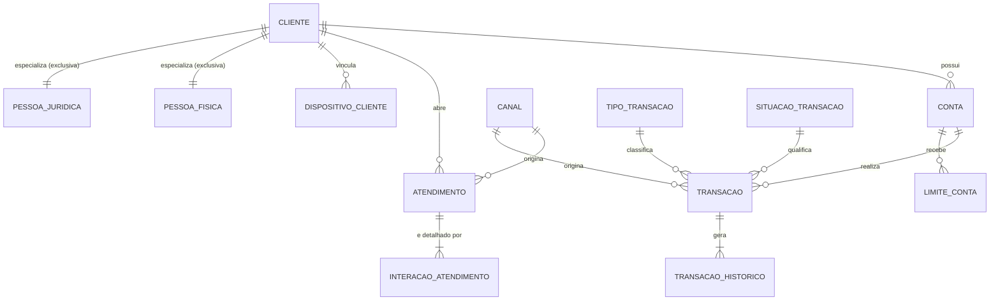

# ESTUDO DE CASO SIADL — DIAGNÓSTICO, MODELOS DE DADOS CONCEITUAL E FÍSICO IDEAIS E PLANO DE ATUAÇÃO COORDENADA DE ADs E DBAs

**PSI nº 15358 — Coordenador de Projetos/Processos Matriz — GECPA**
**Tema:** Estudo de Caso do Sistema de Atendimento Digital — SIADL
*Documento técnico elaborado sobre cenário hipotético, sem uso de informações confidenciais.*

---

## 1. Introdução Executiva

O SIADL é um ativo crítico: atende milhões de clientes por dia, sustenta mais de 10 mil usuários simultâneos e processa cerca de 25 mil transações por minuto sobre uma base Microsoft SQL Server 2025 de aproximadamente 12 TB, em regime OLTP com janela reduzida de manutenção e sem integração com APIs ou microsserviços — premissa que respeito integralmente nesta proposta: toda a solução é construída dentro do ambiente relacional existente.

Os sintomas relatados — dados inconsistentes, lentidão generalizada, *timeouts* em operações críticas, crescimento acelerado das tabelas transacionais, aumento de incidentes, picos de CPU e consumo excessivo de memória — não são problemas independentes. São manifestações de **três causas estruturais** que o diagnóstico a seguir comprova na própria DDL: (i) **modelo de dados com defeitos de tipagem, domínio e integridade**, a começar pelo uso de `TIMESTAMP` para datas de negócio; (ii) **modelo físico não dimensionado para a volumetria**, sem particionamento, sem compressão e sem estratégia de índices, em desacordo objetivo com os padrões corporativos de modelagem (TE074); e (iii) **ausência de gestão do ciclo de vida do dado e de processo estruturado de evolução**, permitindo que tabelas de bilhões de linhas cresçam sem retenção, expurgo ou monitoramento.

Como coordenador técnico e representante do Capítulo de Administração e Banco de Dados na Plataforma, conduzo a resposta em quatro entregas encadeadas: **diagnóstico como auditoria de conformidade** (seção 2), **modelo conceitual ideal** (seção 3), **modelo físico ideal com justificativa individual de cada afastamento do conceitual** (seções 4 e 5), e a dimensão gerencial — **plano de trabalho de ADs e DBAs** (seção 6) e **estratégia de evolução proativa e corretiva** (seção 7) — complementadas por roadmap e riscos. O objetivo é devolver ao SIADL **previsibilidade, integridade, segurança e disponibilidade**, com solução implantável em ambiente crítico e janela curta.

---

## 2. Diagnóstico Técnico — Auditoria de Conformidade da Situação Atual

Adoto postura de auditoria: cada achado é confrontado com o padrão corporativo aplicável, com **causa → impacto → direcionamento**.

### 2.1 Projeção de volumetria (a régua do problema)

| Tabela                        | Volume atual | Crescimento | Projeção 12 meses* | Gatilho TE074 3.2.8.3 (100 mi linhas/ano) |
| ----------------------------- | -----------: | ----------- | -------------------: | ----------------------------------------- |
| TRANSACAO_HISTORICO           |        10 bi | 30% a.m.    |              ~235 bi | Superado ~2.250×                         |
| TRANSACAO                     |         4 bi | 30% a.m.    |               ~94 bi | Superado ~940×                           |
| INTERACAO_ATENDIMENTO         |         1 bi | 20% a.m.    |              ~8,9 bi | Superado ~79×                            |
| ATENDIMENTO                   |       800 mi | 20% a.m.    |              ~7,1 bi | Superado ~63×                            |
| LIMITE_CONTA                  |         1 bi | 20% a.a.    |               1,2 bi | Superado 2×                              |
| CONTA                         |       500 mi | 20% a.a.    |               600 mi | Superado 1×                              |
| CLIENTE / DISPOSITIVO_CLIENTE |   100/150 mi | 10% a.a.    |           110/165 mi | Abaixo/limite                             |

\* Crescimento composto mantidas as taxas informadas.

**Sobre a premissa de 30% a.m.:** um crescimento composto dessa ordem multiplica a base por ~23 em um ano — fisicamente insustentável em qualquer arquitetura. Como coordenador, **questiono formalmente essa premissa junto ao gestor de negócio** antes de dimensionar: é comum que taxas assim decorram de gravação redundante (o mesmo evento registrado múltiplas vezes em TRANSACAO_HISTORICO), *log* técnico verboso confundido com histórico negocial, ou ausência de expurgo mascarando o crescimento líquido. Proponho solução para os dois cenários: **(a) se a taxa estiver inflada** — saneamento da geração (deduplicação de eventos, gravação apenas de mudanças de estado negociais, consolidação de eventos técnicos em observabilidade, fora do banco transacional); **(b) se a taxa for real** — arquitetura de escoamento contínuo (particionamento agressivo + arquivamento mensal automático + compressão + revisão das consultas que releem histórico, padrão consagrado em sistemas de alta volumetria do segmento financeiro), com gestão de capacidade projetando storage e I/O trimestralmente.

### 2.2 Achados na DDL (não conformidades e defeitos técnicos)

| #  | Achado                                                                       | Evidência na DDL                                                                         | Padrão violado / risco                                                                                                                                                     | Impacto no sintoma                                                                                                      | Direcionamento                                                                                   |
| -- | ---------------------------------------------------------------------------- | ----------------------------------------------------------------------------------------- | --------------------------------------------------------------------------------------------------------------------------------------------------------------------------- | ----------------------------------------------------------------------------------------------------------------------- | ------------------------------------------------------------------------------------------------ |
| 1  | **`TIMESTAMP` em todas as colunas de data**                          | `data_cadastro TIMESTAMP`, `data_hora_transacao TIMESTAMP` etc.                       | TE074/Anexo IV: para SQL Server, data+hora =**DATETIME2**; no SQL Server `TIMESTAMP` é sinônimo depreciado de `ROWVERSION` — **não armazena data/hora** | Causa direta de "dados inconsistentes": nenhuma regra temporal (vigência, apuração, ordenação de eventos) funciona | Migrar para`DATETIME2(3)`/`DATE`; `ROWVERSION` só onde houver concorrência otimista real |
| 2  | **`ATENDIMENTO.canal VARCHAR(30)` texto livre**                      | A tabela CANAL existe e é referenciada por TRANSACAO, mas ATENDIMENTO grava texto        | Quebra de domínio; inconsistência de grafia; redundância                                                                                                                 | Dados inconsistentes; joins impossíveis por canal                                                                      | FK`NU_CANAL` para a tabela de domínio (correção conceitual e física)                       |
| 3  | **Status/tipo como `VARCHAR(20/30)` sem domínio**                   | `status_cliente`, `status_transacao`, `tipo_transacao`, `prioridade`...           | Sem CHECK/FK; texto repetido bilhões de vezes                                                                                                                              | Inconsistência + desperdício de página/buffer (memória!)                                                            | Tabelas de domínio +`TINYINT`                                                                 |
| 4  | **Ausência total de particionamento**                                 | Nenhuma tabela particionada                                                               | **TE074 3.2.8.3** (gatilho 100 mi linhas/ano) e **3.2.8.6** (HISTORICO segue o critério da transacional)                                                       | Manutenção não cabe na janela; expurgo por DELETE inviável; varreduras gigantes                                     | Particionamento mensal por data nas 4 massivas (seção 4)                                       |
| 5  | **Ausência de compressão**                                           | Nenhum`DATA_COMPRESSION`                                                                | **TE074 3.2.9.1**: PAGE é o *default* normativo para SQL Server; a **não** compressão é que exige relatório técnico do ABD (3.2.9.3)                    | I/O e buffer inflados (memória e CPU); guias corporativos registram 40–70% de redução com PAGE                      | PAGE em dados mornos/frios, ROW no quente                                                        |
| 6  | **PK clustered em `id BIGINT` sequencial nas massivas**              | Todas as PKs                                                                              | Hotspot de*last-page insert* (contenção PAGELATCH_EX) com 25 mil TPM                                                                                                    | Timeouts e waits de latch nos horários de pico                                                                         | Seção 4.3 (chave composta alinhada à partição; paliativo tático)                           |
| 7  | **Nenhum índice não clusterizado**                                   | DDL não declara nenhum                                                                   | Consultas críticas (extrato por conta+período, atendimentos por cliente, limite vigente) forçam*scan*                                                                  | Lentidão generalizada, CPU alta                                                                                        | Estratégia de índices da seção 4.4                                                           |
| 8  | **`CHECK (valor > 0)` em TRANSACAO**                                 | `ck_valor_transacao`                                                                    | Regra de negócio ambígua para estornos/ajustes                                                                                                                            | Risco de contorno indevido pela aplicação                                                                             | Seção 4.6 (análise comparativa)                                                               |
| 9  | **LIMITE_CONTA sem garantia de vigência única**                      | Nada impede vigências sobrepostas por conta+tipo                                         | Regra temporal sem enforcement                                                                                                                                              | Limites conflitantes = inconsistência com efeito financeiro                                                            | Índice único filtrado (seção 4.5)                                                            |
| 10 | **Sem colunas de auditoria e sem classificação de dados sensíveis** | Nenhuma tabela tem quem/quando;`documento_cliente`, `hash_dispositivo` sem tratamento | Rastreabilidade mínima ausente; LGPD/sigilo bancário (OR016/CR439)                                                                                                        | Impossível responder "quem alterou o quê"; exposição regulatória                                                   | Colunas técnicas padrão + classificação + mascaramento                                       |
| 11 | **Nomenclatura fora do padrão corporativo**                           | `id_cliente`, `nome_cliente`, `data_cadastro`...                                    | **TE074/Anexo II**: colunas nomeadas por prefixo de classe (`NU_`, `NO_`, `DT_`, `DH_`, `VR_`, `IC_`, `CO_`...), em português, singular                | Modelo não passaria no pré-validador; glossário incoerente                                                           | DDL proposta na seção 4 demonstra o antes → depois                                            |
| 12 | **TRANSACAO_HISTORICO (append-only) tratada como tabela comum**        | Sem partição, sem compressão, sem retenção                                           | TE074 3.2.6/3.2.8.6 e padrões de tabela de log (TE197)                                                                                                                     | O dado frio domina backup, buffer e janela                                                                              | Classe própria: partição + PAGE + arquivamento (seção 4.7)                                  |

**Complementos do diagnóstico:** estatísticas — em tabelas de bilhões de linhas o limiar automático de atualização chega tarde; estimativas ruins gerariam planos ineficientes e *memory grants* superdimensionados, coerentes com os picos de memória; concorrência — sem RCSI, leituras bloqueiam escritas nos pontos quentes; governança de mudanças — o estado da DDL evidencia que alterações chegaram a produção sem o ciclo formal de validação de modelos (pré-validação → laudo do AD → implementação do DBA), o que a seção 6 corrige.

---

## 3. Modelo de Dados Conceitual Ideal

### 3.1 Conceitos aplicados

O modelo aplica integralmente os conceitos da modelagem conceitual, do fundamental ao específico, conforme padrão corporativo (notação pé-de-galinha, português, singular, normalização mínima 3FN):

- **Entidades fortes:** CLIENTE, CONTA — existem por si, identidade própria, ciclo de vida longo;
- **Entidades fracas/dependentes:** INTERACAO_ATENDIMENTO (não existe sem ATENDIMENTO), TRANSACAO_HISTORICO (não existe sem TRANSACAO), LIMITE_CONTA e DISPOSITIVO_CLIENTE (dependência existencial de CONTA/CLIENTE);
- **Entidades de domínio:** CANAL, TIPO_TRANSACAO, SITUACAO_TRANSACAO, TIPO_ATENDIMENTO, SITUACAO_ATENDIMENTO, PRIORIDADE — vocabulários controlados, pequenos, estáveis, governados pelo AD;
- **Entidade histórica (append-only):** TRANSACAO_HISTORICO — imutável após inserção, trilha de mudanças de estado;
- **Generalização/especialização:** CLIENTE especializado em **PESSOA FÍSICA** e **PESSOA JURÍDICA** (especialização total e exclusiva — todo cliente é PF ou PJ, nunca ambos), sugerida pelos atributos `documento` (CPF×CNPJ) e `segmento`. Atributos comuns permanecem na superentidade; específicos (ex.: data de nascimento ×  natureza jurídica) nas subentidades;
- **Atributos:** simples (nome), identificadores (número do documento — chave candidata natural), derivados (idade — não persistido) e de estado (situação, por domínio);
- **Cardinalidades e opcionalidade:** explícitas em todos os relacionamentos, nomeados por verbo;
- **Regras de negócio e ciclo de vida:** por entidade (tabela 3.3);
- **Separação de classes de dados:** mestres (CLIENTE, CONTA), transacionais (TRANSACAO, ATENDIMENTO), operacionais (INTERACAO_ATENDIMENTO, LIMITE_CONTA, DISPOSITIVO_CLIENTE), históricos (TRANSACAO_HISTORICO) e domínio (CANAL e demais).

### 3.2 Diagrama conceitual proposto



> 🔴 **Referência obrigatória:** a especificação completa deste diagrama (entidades, atributos, cardinalidades, notação e instruções de construção no Draw.io ou PowerDesigner) está no arquivo anexo **`anexos/diagramas-der-siadl.md`**.

**Duas correções conceituais em relação ao modelo atual:**

1. **CANAL passa a se relacionar também com ATENDIMENTO** (o atributo textual `canal` é substituído por relacionamento com a entidade de domínio) — elimina a fonte de inconsistência nº 2 do diagnóstico;
2. **O relacionamento direto CLIENTE → INTERACAO_ATENDIMENTO, presente no diagrama atual, é removido**: é derivável por transitividade (CLIENTE → ATENDIMENTO → INTERACAO_ATENDIMENTO). Mantê-lo criaria caminho redundante e risco de inconsistência (interação apontando para cliente diferente do dono do atendimento). Registro essa remoção como decisão de modelagem, não como divergência físico×conceitual.

### 3.3 Quadro-resumo do modelo conceitual

| Entidade                 | Classe                                         | Responsabilidade                            | Relacionamentos (cardinalidade)                           | Regras de negócio principais / ciclo de vida                                                      |
| ------------------------ | ---------------------------------------------- | ------------------------------------------- | --------------------------------------------------------- | -------------------------------------------------------------------------------------------------- |
| CLIENTE (⊃ PF, PJ)      | Mestre, forte, generalização total/exclusiva | Identificação cadastral única            | 1:N CONTA, ATENDIMENTO, DISPOSITIVO_CLIENTE               | Documento único; sem exclusão física; dados pessoais classificados (LGPD); ciclo ativo→inativo |
| CONTA                    | Mestre, forte                                  | Vínculo transacional cliente-instituição | N:1 CLIENTE; 1:N TRANSACAO, LIMITE_CONTA                  | Número único; um titular; encerramento lógico                                                   |
| ATENDIMENTO              | Transacional                                   | Solicitações, reclamações, serviços    | N:1 CLIENTE, CANAL; 1:N INTERACAO_ATENDIMENTO             | Máquina de estados (aberto→em tratamento→concluído/cancelado); canal por domínio              |
| INTERACAO_ATENDIMENTO    | Operacional, fraca                             | Histórico granular da tratativa            | N:1 ATENDIMENTO                                           | Não existe sem atendimento; ordenada por data/hora                                                |
| TRANSACAO                | Transacional                                   | Operação financeira                       | N:1 CONTA, CANAL, TIPO, SITUACAO; 1:N TRANSACAO_HISTORICO | Valor decimal exato; imutável após efetivação; estorno como evento próprio (seção 4.6)      |
| TRANSACAO_HISTORICO      | Histórica, fraca, append-only                 | Trilha de mudanças de estado               | N:1 TRANSACAO                                             | Somente inserção; retenção normatizada com o gestor                                            |
| LIMITE_CONTA             | Operacional, temporal                          | Limites com vigência de negócio           | N:1 CONTA                                                 | **Vigências não sobrepostas por conta+tipo; no máximo 1 vigente**                         |
| DISPOSITIVO_CLIENTE      | Operacional                                    | Dispositivos para segurança/antifraude     | N:1 CLIENTE                                               | Identificador técnico único; situação ativa/revogada                                           |
| CANAL e demais domínios | Domínio                                       | Vocabulários controlados                   | 1:N nas transacionais                                     | Governados pelo AD; sem exclusão física                                                          |

---

## 4. Modelo Físico Ideal (SQL Server 2025, OLTP crítico)

### 4.1 Decisões físicas estruturantes

| Dimensão          | Decisão                                                                                                                 | Fundamento                                                                                     |
| ------------------ | ------------------------------------------------------------------------------------------------------------------------ | ---------------------------------------------------------------------------------------------- |
| Tipos de dados     | `DATETIME2(3)`/`DATE`; `DECIMAL(17,2)` para valores; `TINYINT` para domínios; `VARCHAR` dimensionado          | TE074/Anexo IV (DATETIME2 é o tipo indicado para SQL Server); precisão exata em valores      |
| ROWVERSION         | Apenas em CLIENTE e LIMITE_CONTA (concorrência otimista da aplicação)                                                 | Uso correto e restrito do recurso                                                              |
| Isolamento         | `READ_COMMITTED_SNAPSHOT ON` (RCSI)                                                                                    | Elimina bloqueio leitura×escrita nos 25 mil TPM; dimensionar tempdb/version store previamente |
| Particionamento    | Função mensal por data nas 4 massivas, índices**alinhados**                                                     | TE074 3.2.8; habilita`SWITCH` para expurgo/arquivamento e manutenção por partição        |
| Compressão        | ROW nas partições quentes; PAGE nas mornas/frias e no histórico                                                       | TE074 3.2.9.1 (PAGE é default normativo; 40–70% de redução)                                |
| Estatísticas      | `INCREMENTAL = ON` nas particionadas + Query Store ativo                                                               | Atualização por partição cabe na janela; detecção de regressão de planos                |
| Segurança         | TDE; classificação de dados; Dynamic Data Masking em`NU_CPF_CNPJ`/`CO_DISPOSITIVO`; SQL Audit; privilégio mínimo | OR016/LGPD; sigilo bancário                                                                   |
| Disponibilidade    | Always On AG (síncrono local + assíncrono DR); réplica legível para relatórios e`CHECKDB`                         | RTO/RPO pactuados; descarrega o primário                                                      |
| Auditoria de linha | `DH_INCLUSAO_REGISTRO`, `DH_ALTERACAO_REGISTRO`, `CO_USUARIO_ULTIMA_ALTERACAO` em todas as tabelas                 | Rastreabilidade mínima                                                                        |
| SQL Server 2025    | Avaliar*optimized locking* e melhorias de IQP/tempdb da versão para reduzir contenção de bloqueio e recompilações | Recursos novos a validar em homologação antes de habilitar                                   |

### 4.2 Infraestrutura de particionamento (rolling window mensal)

```sql
-- Função e esquema de particionamento mensal (janela deslizante: SPLIT futuro / SWITCH+MERGE passado)
CREATE PARTITION FUNCTION PF_MENSAL (DATETIME2(3))
AS RANGE RIGHT FOR VALUES ('2026-01-01','2026-02-01','2026-03-01', /* ... */ '2027-01-01');

CREATE PARTITION SCHEME PS_MENSAL AS PARTITION PF_MENSAL ALL TO ([FG_DADOS]);
-- Partições frias podem ser mapeadas a filegroup próprio (FG_HIST) para arquivamento e backup diferenciado
```

### 4.3 Índice clustered das tabelas massivas — decisão com trade-offs

**Alternativa A — Chave clustered composta alinhada à partição `(DH_TRANSACAO, NU_TRANSACAO)`** *(recomendada como solução arquitetural definitiva)*: pré-requisito para `SWITCH OUT` (expurgo em segundos, sem log massivo), distribui os pontos de inserção e habilita manutenção e estatísticas por partição. Contrapartida: altera PK, FKs (TRANSACAO_HISTORICO passa a referenciar a chave composta ou mantém `NU_TRANSACAO` com índice único não clusterizado de apoio), índices e consultas — mudança estrutural planejada.

**Alternativa B — Manter PK em `NU_TRANSACAO` com `OPTIMIZE_FOR_SEQUENTIAL_KEY = ON`** *(mitigação tática imediata)*: reduz a contenção de *last-page insert* sem tocar em chaves, aplicável na fase emergencial. **Não** habilita expurgo por partição nem resolve manutenção — não substitui a Alternativa A.

**Decisão:** recomendo A como desenho definitivo, com B aplicada de imediato como paliativo enquanto a reestruturação é desenvolvida e testada — visão em fases: estancar a operação agora, corrigir a arquitetura em seguida. O desenho físico detalhado e a implantação são conduzidos pelo DBA, com validação em homologação sob carga.

### 4.4 Pseudo-DDL — antes → depois (nomenclatura corporativa TE074/Anexo II)

A DDL atual não adere à nomenclatura CAIXA. Demonstro a correção nas tabelas mais relevantes (prefixo de sistema ilustrativo `SDL`):

```sql
-- ANTES: CLIENTE (id_cliente, nome_cliente, documento_cliente, data_cadastro TIMESTAMP, status_cliente VARCHAR, segmento VARCHAR)
CREATE TABLE SDL_CLIENTE (
  NU_CLIENTE                 INT           NOT NULL IDENTITY,
  NO_CLIENTE                 VARCHAR(150)  NOT NULL,
  NU_CPF_CNPJ                BIGINT        NOT NULL,
  IC_TIPO_PESSOA             CHAR(1)       NOT NULL,           -- F/J (generalização física em tabela única)
  DH_CADASTRO                DATETIME2(3)  NOT NULL,           -- era TIMESTAMP (ROWVERSION!): corrigido
  CO_SITUACAO_CLIENTE        TINYINT       NOT NULL,           -- era VARCHAR(20): agora domínio
  CO_SEGMENTO_CLIENTE        TINYINT       NOT NULL,
  DH_INCLUSAO_REGISTRO       DATETIME2(3)  NOT NULL CONSTRAINT DF_CLIENTE_INCL DEFAULT SYSDATETIME(),
  DH_ALTERACAO_REGISTRO      DATETIME2(3)  NULL,
  VS_CONTROLE_CONCORRENCIA   ROWVERSION,                        -- uso legítimo: optimistic locking
  CONSTRAINT PK_SDL_CLIENTE PRIMARY KEY CLUSTERED (NU_CLIENTE),
  CONSTRAINT UQ_SDL_CLIENTE_CPF_CNPJ UNIQUE (NU_CPF_CNPJ),
  CONSTRAINT CK_SDL_CLIENTE_TIPO CHECK (IC_TIPO_PESSOA IN ('F','J'))
) WITH (DATA_COMPRESSION = PAGE);

-- ANTES: TRANSACAO (id BIGINT PK, datas em TIMESTAMP, status/tipo VARCHAR, sem partição/índices/compressão)
CREATE TABLE SDL_TRANSACAO (
  NU_TRANSACAO           BIGINT        NOT NULL IDENTITY,
  NU_CONTA               BIGINT        NOT NULL,
  NU_CANAL               TINYINT       NOT NULL,
  DH_TRANSACAO           DATETIME2(3)  NOT NULL,               -- era TIMESTAMP: corrigido
  VR_TRANSACAO           DECIMAL(17,2) NOT NULL,
  CO_TIPO_TRANSACAO      TINYINT       NOT NULL,               -- era VARCHAR(30): domínio
  CO_SITUACAO_TRANSACAO  TINYINT       NOT NULL,               -- estado corrente (trilha completa no histórico)
  DH_INCLUSAO_REGISTRO   DATETIME2(3)  NOT NULL CONSTRAINT DF_TRANSACAO_INCL DEFAULT SYSDATETIME(),
  CONSTRAINT PK_SDL_TRANSACAO PRIMARY KEY CLUSTERED (DH_TRANSACAO, NU_TRANSACAO)
      ON PS_MENSAL (DH_TRANSACAO),                             -- alinhado à partição (Alternativa A)
  CONSTRAINT FK_SDL_TRANSACAO_CONTA FOREIGN KEY (NU_CONTA) REFERENCES SDL_CONTA (NU_CONTA),
  CONSTRAINT FK_SDL_TRANSACAO_CANAL FOREIGN KEY (NU_CANAL) REFERENCES SDL_CANAL (NU_CANAL),
  CONSTRAINT CK_SDL_TRANSACAO_VALOR CHECK (VR_TRANSACAO > 0)   -- mantido: estorno é evento próprio (4.6)
) WITH (DATA_COMPRESSION = ROW ON PARTITIONS (/*quentes*/), DATA_COMPRESSION = PAGE ON PARTITIONS (/*demais*/));

-- Índice de apoio à consulta crítica "extrato por conta e período", alinhado à partição
CREATE NONCLUSTERED INDEX IX_SDL_TRANSACAO_CONTA_DATA
  ON SDL_TRANSACAO (NU_CONTA, DH_TRANSACAO DESC)
  INCLUDE (VR_TRANSACAO, CO_TIPO_TRANSACAO, CO_SITUACAO_TRANSACAO)
  ON PS_MENSAL (DH_TRANSACAO);

-- ANTES: TRANSACAO_HISTORICO comum, sem partição/compressão/retenção
CREATE TABLE SDL_TRANSACAO_HISTORICO (
  NU_TRANSACAO_HISTORICO BIGINT        NOT NULL IDENTITY,
  NU_TRANSACAO           BIGINT        NOT NULL,
  DH_EVENTO              DATETIME2(3)  NOT NULL,               -- era TIMESTAMP: corrigido
  CO_SITUACAO_ANTERIOR   TINYINT       NULL,
  CO_SITUACAO_NOVA       TINYINT       NOT NULL,
  CO_ORIGEM_EVENTO       TINYINT       NOT NULL,
  CONSTRAINT PK_SDL_TRANSACAO_HISTORICO
      PRIMARY KEY CLUSTERED (DH_EVENTO, NU_TRANSACAO_HISTORICO) ON PS_MENSAL (DH_EVENTO)
) WITH (DATA_COMPRESSION = PAGE);                              -- append-only: PAGE integral
```

O mesmo padrão (tipos, domínios, auditoria, FK, partição por `DH_ABERTURA`/`DH_INTERACAO`) aplica-se a SDL_CONTA, SDL_ATENDIMENTO — que ganha `NU_CANAL TINYINT` com FK, eliminando o texto livre — SDL_INTERACAO_ATENDIMENTO e SDL_DISPOSITIVO_CLIENTE.

### 4.5 LIMITE_CONTA — vigência de negócio com integridade garantida

Vigência de limite é **tempo de negócio (application-time)** — conceito distinto do versionamento técnico (system-time). Mantenho o desenho de vigência aplicativa e **garanto a regra "um único vigente por conta e tipo" no banco**, com índice único filtrado:

```sql
CREATE TABLE SDL_LIMITE_CONTA (
  NU_LIMITE_CONTA     BIGINT        NOT NULL IDENTITY,
  NU_CONTA            BIGINT        NOT NULL,
  CO_TIPO_LIMITE      TINYINT       NOT NULL,
  VR_LIMITE           DECIMAL(17,2) NOT NULL CONSTRAINT CK_SDL_LIMITE_VALOR CHECK (VR_LIMITE >= 0),
  DT_INICIO_VIGENCIA  DATE          NOT NULL,                  -- era TIMESTAMP: corrigido
  DT_FIM_VIGENCIA     DATE          NULL,                      -- NULL = vigente
  VS_CONTROLE_CONCORRENCIA ROWVERSION,
  CONSTRAINT PK_SDL_LIMITE_CONTA PRIMARY KEY CLUSTERED (NU_LIMITE_CONTA),
  CONSTRAINT FK_SDL_LIMITE_CONTA FOREIGN KEY (NU_CONTA) REFERENCES SDL_CONTA (NU_CONTA)
);
-- Regra temporal aplicada no banco: no máximo UM limite vigente por conta+tipo
CREATE UNIQUE NONCLUSTERED INDEX IX_SDL_LIMITE_VIGENTE
  ON SDL_LIMITE_CONTA (NU_CONTA, CO_TIPO_LIMITE)
  WHERE DT_FIM_VIGENCIA IS NULL;
```

Complementarmente — e em aderência ao padrão de **tabela temporal previsto no TE074 (item 3.2.7)** — recomendo habilitar **system-versioned temporal table** nesta tabela **estritamente para auditoria e conformidade** (`SYSTEM_VERSIONING = ON` com `HISTORY_TABLE` dedicada, comprimida e fora do caminho transacional): responde "quem alterou o limite e quando" automaticamente, sem misturar tempo de sistema com a vigência negocial. A conversão completa da semântica para temporal table foi avaliada e **não recomendada** (mudaria o significado do modelo e criaria histórico técnico de 1 bi+ linhas no caminho OLTP); fica registrada como alternativa a validar pelo DBA e pelo comitê técnico caso o requisito de auditoria evolua.

### 4.6 Estornos e o `CHECK (valor > 0)` — análise comparativa

| Abordagem                                                                                                                                            | Prós                                                                                                                                    | Contras                                                                                                               |
| ---------------------------------------------------------------------------------------------------------------------------------------------------- | ---------------------------------------------------------------------------------------------------------------------------------------- | --------------------------------------------------------------------------------------------------------------------- |
| **A. Estorno como transação própria** (tipo `ESTORNO` no domínio, valor positivo, referência à transação original), mantendo o CHECK | Imutabilidade da original; trilha contábil natural; CHECK preservado; padrão consagrado no mercado financeiro (lançamentos de ajuste) | Exige coluna de referência (`NU_TRANSACAO_ORIGINAL`) e regra de conciliação                                      |
| B. Valores negativos (remover o CHECK)                                                                                                               | Implementação simples                                                                                                                  | Quebra a semântica contábil; somatórios ambíguos; abre porta a erro de sinal; perde a rastreabilidade do vínculo |

**Recomendação:** abordagem **A** — é a prática comercial dominante entre profissionais da área e preserva integridade e auditabilidade; o CHECK permanece como salvaguarda.

### 4.7 Ciclo de vida, retenção e arquivamento — cenários para decisão do gestor

A definição do horizonte de retenção é **do gestor da informação/PO**; meu papel é instrumentar os cenários com as consequências de cada um (alinhado ao ciclo de vida do dado dos guias corporativos: ativo → histórico → arquivo → expurgo/anonimização LGPD):

| Cenário de retenção online                    | Efeito nas 4 tabelas massivas                                                            | Storage/backup                                             | Janela de manutenção                                    | Observação                                               |
| ------------------------------------------------ | ---------------------------------------------------------------------------------------- | ---------------------------------------------------------- | --------------------------------------------------------- | ---------------------------------------------------------- |
| **Caso 90 dias quentes + 12 meses mornos** | TRANSACAO online ≈ 3 partições ROW + 9 PAGE; resto via`SWITCH` para FG_HIST/arquivo | Redução drástica (histórico sai do backup incremental) | Manutenção só nas partições ativas — cabe com folga | Recomendado como ponto de partida                          |
| **Caso 12 meses quentes + 24 mornos**      | Mais dado online; consultas históricas atendidas sem recuperação                      | Storage ~3–4× maior; backup mais longo                   | Ainda viável com manutenção por partição             | Para exigência negocial de consulta longa                 |
| **Caso "tudo online" (status quo)**        | 235 bi de linhas projetadas em TRANSACAO_HISTORICO                                       | Insustentável em 12 TB                                    | Inviável na janela                                       | Registrado apenas para evidenciar o custo da não decisão |

Expurgo/anonimização além do arquivo segue rito formal com o gestor (LGPD), automatizado por jobs com trilha de execução.

---

## 5. Justificativa das Intervenções — Conceitual × Físico

Princípio (e possível pegadinha do enunciado): **só justifico divergências que existem de fato**; não crio afastamentos artificiais. O modelo físico proposto preserva integralmente a semântica do conceitual — as divergências reais são as seguintes, cada uma justificada individualmente:

| # | Intervenção física                                                                                        | O que diverge do conceitual                                    | Justificativa (performance/escala/manutenção/disponibilidade)                                                                      | Salvaguarda de integridade                                                                                                       |
| - | ------------------------------------------------------------------------------------------------------------ | -------------------------------------------------------------- | ------------------------------------------------------------------------------------------------------------------------------------ | -------------------------------------------------------------------------------------------------------------------------------- |
| 1 | Particionamento mensal das 4 massivas                                                                        | Nada — a entidade negocial permanece única                   | Manutenção na janela; expurgo por`SWITCH`; eliminação de partição nas consultas                                              | Transparente para a aplicação                                                                                                  |
| 2 | PK clustered composta`(data, id)` nas massivas                                                             | Conceitualmente o identificador é único e simples            | Alinhamento partição↔índice (pré-requisito do`SWITCH`); dissolve hotspot de inserção                                        | Unicidade garantida pela combinação;`NU_` continua exposto como identificador negocial                                       |
| 3 | Generalização CLIENTE PF×PJ implementada em**tabela única** com `IC_TIPO_PESSOA` + CHECKs        | O conceitual tem 3 entidades (super + 2 sub)                   | 100 mi de linhas com alto volume de junção: evitar 1 join adicional em toda consulta cadastral; atributos específicos são poucos | CHECKs condicionais garantem que atributos de PF não se apliquem a PJ e vice-versa; semântica preservada no modelo lógico     |
| 4 | Estado corrente`CO_SITUACAO_TRANSACAO` mantido em SDL_TRANSACAO além da trilha em SDL_TRANSACAO_HISTORICO | Redundância deliberada (o estado é derivável do histórico) | Responder "estado atual" sem agregar bilhões de linhas do histórico                                                                | Atualização do estado + inserção no histórico na**mesma transação atômica**; conciliação periódica automatizada |
| 5 | Índices não clusterizados cobertos e filtrados                                                             | Índice não existe no conceitual                              | Consultas críticas (extrato, limite vigente, atendimentos abertos) exigem*seek* + cobertura                                       | Revisão periódica de uso (DMVs); custo de escrita monitorado                                                                   |
| 6 | Compressão PAGE/ROW e segregação física do histórico (filegroups/arquivo)                               | Neutro ao conceito                                             | I/O, buffer e backup; TE074 3.2.9 estabelece PAGE como padrão                                                                       | Aplicada por partição; dado permanece íntegro e consultável                                                                  |
| 7 | Tabela temporal (system-versioning) em SDL_LIMITE_CONTA para auditoria                                       | O conceitual não modela versão técnica de linha             | Auditoria automática exigível em dado com efeito financeiro; aderente ao TE074 3.2.7                                               | Histórico técnico isolado; vigência negocial permanece nas colunas`DT_*`                                                    |

**Desnormalizações avaliadas e rejeitadas** (alerta de perigo, conforme postura preventiva): repetir dados cadastrais do cliente em TRANSACAO/ATENDIMENTO; gravar o nome do canal em vez da chave; consolidar INTERACAO dentro de ATENDIMENTO. Todas reintroduziriam exatamente a inconsistência que motivou este trabalho. Regra de governança: **desnormalização só com medição que comprove necessidade, aprovação conjunta AD+DBA e mecanismo de sincronização definido** — registrada no modelo e no comitê técnico.

---

## 6. Item (a) — Plano de Trabalho para Atuação de ADs e DBAs

### 6.1 Fronteiras de atuação

Como representante do Capítulo na Plataforma, sou o guardião do processo de evolução do modelo e do banco e respondo pela atuação dos ADs e DBAs nos squads. A atuação do **AD** ocorre em **duas frentes complementares**: **no squad** (modelagem ágil junto aos desenvolvedores, desde o refinamento) e **no capítulo** (governança: validação técnica, aderência aos normativos — TE074/TE073 —, emissão de laudos e guarda do glossário). O **DBA** responde pela implementação física, operação e homologação.

| Dimensão               | AD — Administrador de Dados                                                                              | DBA — Administrador de Banco de Dados                                                                                                                                                                                                               |
| ----------------------- | --------------------------------------------------------------------------------------------------------- | ---------------------------------------------------------------------------------------------------------------------------------------------------------------------------------------------------------------------------------------------------- |
| Modelo                  | Conceitual e lógico; validação com laudo (aprovado/com adequações/com ressalvas/não aprovado)       | Físico; geração, versionamento e guarda da DDL                                                                                                                                                                                                    |
| Padronização          | Nomenclatura (TE074/Anexo II), domínios, glossário, dicionário de dados                                | Objetos físicos, filegroups, padrões de índice/constraint                                                                                                                                                                                         |
| Qualidade e significado | Regras de negócio, qualidade e linhagem do dado, catálogo, classificação da informação (OR016/LGPD) | Integridade física implantada (FKs, CHECKs, unique)                                                                                                                                                                                                 |
| Performance             | Informa volumetria, crescimento e padrões de acesso no modelo                                            | Índices, particionamento, compressão, estatísticas, tuning, planos                                                                                                                                                                                |
| Operação              | Impactos negociais, apoio ao PO e ao gestor da informação                                               | Capacidade, backup/restore, alta disponibilidade, segurança física/lógica, monitoramento, execução controlada em produção                                                                                                                     |
| Autonomia formal        | —                                                                                                        | **Índices por desempenho, sequences e ajustes físicos de armazenamento não requerem novo ciclo de validação de modelo** — base da atuação corretiva tempestiva (seção 7), com registro e sincronização posterior do modelo físico |

Regra de ouro: **nenhuma estrutura de dados nasce ou muda sem passar pelo AD (modelo) e pelo DBA (física)** — na ordem correta e desde o refinamento.

### 6.2 Dinâmica com o time de desenvolvimento (fluxo em 3 fases + ritos)

O plano usa a espinha dorsal do processo corporativo de modelagem, citado em nível de processo (sem detalhes operacionais internos):

**Fase 1 — Squad (desenho):** AD participa do refinamento; demandas com impacto em dados só entram em sprint com **Definition of Ready** cumprida (regras de negócio/histórias, volumetria estimada, classificação da informação, indicação de reuso/compartilhamento). O AD modela com o time na ferramenta corporativa e executa a pré-validação automática.

**Fase 2 — Capítulo (governança):** validação formal do modelo (conformidade TE074, normalização, nomenclatura, domínios, classificação) com **laudo**; pendências retornam ao squad com orientação — o laudo é gate, não gargalo: o SLA é dimensionado por volumetria de objetos, dando previsibilidade ao PO.

**Fase 3 — DBA (física e implantação):** análise de performance e volumetria (gatilhos de particionamento/compressão do TE074), projeto de índices, geração da DDL versionada, revisão de scripts, e implantação controlada DES → TQS → HOM → PRD com **Definition of Done**: modelo validado + DDL homologada + testes de performance com baseline comparado + plano de rollback ensaiado + dicionário/metadados atualizados.

**Ritos de sinergia:** presença do AD nas cerimônias do squad; *office hours* semanais do DBA para o time; revisão de scripts como etapa obrigatória do PR de banco; homologação técnica conjunta (DBA+operação) com critérios go/no-go; observabilidade ativa nas primeiras 72h pós-implantação; reunião quinzenal Capítulo×Plataforma (demandas, débitos técnicos, indicadores, conflitos de fronteira — que resolvo como coordenador); e capacitação contínua dos squads nos padrões (reduz retrabalho de validação, aumenta a vazão de todos).

**Efetividade medida:** percentual de modelos aprovados em primeira validação, lead time da demanda de dados, incidentes causados por mudança de banco e aderência ao DoR/DoD — indicadores que reporto à Plataforma.

---

## 7. Item (b) — Estratégia de Evolução das Demandas de Banco de Dados

Estratégia em dois motores — **proativo** (agir antes da degradação) e **corretivo tempestivo** (responder rápido e formalmente ao desvio) — cobrindo as cinco dimensões exigidas.

### 7.1 Motor proativo

| Mecanismo                                                                                     | Instrumentação                                                                                                                                                                 | Dimensão atendida           |
| --------------------------------------------------------------------------------------------- | -------------------------------------------------------------------------------------------------------------------------------------------------------------------------------- | ---------------------------- |
| Monitoramento contínuo com dashboards (padrão corporativo de observabilidade, ex.: Grafana) | CPU, memória (PLE, memory grants), I/O (latência por arquivo), tempdb, waits/locks/deadlocks/timeouts                                                                          | Performance, disponibilidade |
| Gestão de capacidade                                                                         | Crescimento por tabela/partição, projeção composta × capacidade, gatilhos de expansão trimestrais                                                                          | Arquitetura, disponibilidade |
| Higiene de índices e estatísticas                                                           | Revisão mensal (ausentes × não usados × duplicados via DMVs); estatísticas incrementais por partição; Query Store com alerta de plano regressivo                          | Performance                  |
| Rolling de partições                                                                        | Job mensal:`SPLIT` da partição futura, `SWITCH OUT` + arquivamento da expirada, compressão da que esfriou                                                                 | Arquitetura, manutenção    |
| Testes de carga e baselines                                                                   | Baseline formal trimestral; toda mudança relevante comparada antes/depois; projeção de performance para cenários de pico (prática corporativa de implantação)             | Performance, disponibilidade |
| **Qualidade de dados (TE169)**                                                          | Ciclo definição→medição→análise→melhoria nas entidades com inconsistência confirmada (CLIENTE, ATENDIMENTO), com gestor da informação, AD e DBA nos papéis previstos | **Integridade**        |
| **Metadados e linhagem (TE174)**                                                        | Análise de impacto "onde é usado" como**pré-requisito de toda DDL estrutural** — protege sistemas consumidores nas mudanças de tipos/chaves/partições               | Integridade, arquitetura     |
| Comitê técnico de evolução do modelo (mensal)                                             | AD+DBA+arquitetura+squads: prioriza débitos técnicos, delibera desnormalizações, aprova mudanças estruturais, revisa tendências                                            | Todas                        |
| Segurança contínua                                                                          | Revisão de acessos, auditoria de ações privilegiadas, verificação de mascaramento/classificação em novas colunas                                                          | Segurança                   |

### 7.2 Motor corretivo tempestivo

- **Runbook de incidentes de banco** com papéis e diagnóstico padrão (top waits → plano → objeto → mudança recente), acionável pelo DBA de sobreaviso;
- **Autonomia formal do DBA** para correções de desempenho (índice emergencial, ajuste físico, estatística manual) **sem novo ciclo de validação de modelo**, conforme exceções previstas no processo corporativo — com registro obrigatório e sincronização posterior do modelo físico pelo AD, evitando deriva entre modelo e banco;
- Mudanças emergenciais seguem o rito de gestão de mudanças na classe adequada, com rollback preparado — corrigir rápido **não** significa corrigir sem controle;
- **Pós-mortem** de todo incidente relevante alimentando o backlog proativo (o mesmo problema não retorna).

### 7.3 Acoplamento ao crescimento vegetativo

O gatilho normativo (análise de particionamento acima de 100 mi linhas/ano) vira **alerta automatizado**: qualquer tabela que projete ultrapassá-lo entra na pauta do comitê antes de degradar. O crescimento passa a ser variável gerenciada — projeções revisadas mensalmente, cenários de retenção reapresentados ao gestor quando a curva muda, e capacidade contratada antes da necessidade.

---

## 8. Roadmap de Implantação

| Fase                                                                 | Objetivo                        | Principais ações                                                                                                                                                                                                                                                  | Responsáveis                        | Resultados esperados                                                                   |
| -------------------------------------------------------------------- | ------------------------------- | ------------------------------------------------------------------------------------------------------------------------------------------------------------------------------------------------------------------------------------------------------------------- | ------------------------------------ | -------------------------------------------------------------------------------------- |
| **1 — Diagnóstico e baselines** (semanas 1–4)               | Fotografar e priorizar          | Baselines (Query Store, waits, volumetria); inventário de índices/tipos/constraints; classificação da informação; validação da premissa de crescimento com o negócio                                                                                       | DBA (líder), AD, squads             | Relatório de conformidade, backlog priorizado por risco×impacto                      |
| **2 — Correções emergenciais** (semanas 3–10)              | Ganho rápido, baixo risco      | RCSI (tempdb dimensionado);`OPTIMIZE_FOR_SEQUENTIAL_KEY`; índices críticos; remoção de índices inúteis; estatísticas; top ofensoras de CPU                                                                                                                 | DBA, squads                          | Queda mensurável de timeouts, CPU e waits                                             |
| **3 — Modelo conceitual/lógico** (meses 2–4)                | Corrigir a estrutura na origem  | Modelo da seção 3 na ferramenta corporativa; domínios; pré-validação; laudo do AD; dicionário/metadados                                                                                                                                                      | AD (líder), squads, gestor          | Modelo validado e publicado; glossário atualizado                                     |
| **4 — Reestruturação física** (meses 3–8)                 | Implantar o físico ideal       | Migração TIMESTAMP→DATETIME2; domínios TINYINT; FKs com saneamento (`WITH NOCHECK`→`CHECK` faseado); particionamento por sombreamento/`SWITCH`; PK composta; compressão; arquivamento e retenção decidida pelo gestor; temporal table em LIMITE_CONTA | DBA (líder), AD, squads, operação | Tabelas particionadas e comprimidas; integridade ativa; manutenção cabendo na janela |
| **5 — Sustentação e melhoria contínua** (mês 6 em diante) | Institucionalizar a prevenção | Automação de rolling/manutenção; dashboards; comitê ativo; DoR/DoD institucionalizados; ciclos TE169; testes de carga recorrentes                                                                                                                              | Capítulo (AD+DBA), squads           | Operação previsível; evolução governada; reincidência prevenida                  |

---

## 9. Riscos e Mitigadores

| # | Risco                                           | Prob.  | Impacto | Mitigadores                                                                                                                                             |
| - | ----------------------------------------------- | ------ | ------- | ------------------------------------------------------------------------------------------------------------------------------------------------------- |
| 1 | Indisponibilidade durante mudanças estruturais | Média | Alto    | Operações`ONLINE`/`RESUMABLE`; migração por sombreamento com `SWITCH`; janela formal; rollback ensaiado; go/no-go                             |
| 2 | Regressão de performance pós-mudança         | Média | Alto    | Baselines antes/depois; Query Store (forçamento de plano); implantação gradual; monitoramento intensivo 72h                                          |
| 3 | Inconsistência no saneamento (FKs, tipos)      | Média | Alto    | Relatório de órfãos ao gestor antes; FKs faseadas; conciliação automatizada pós-migração                                                        |
| 4 | Falha de scripts em produção                  | Baixa  | Alto    | Revisão obrigatória pelo DBA; ensaio em homologação com volumetria; scripts idempotentes e versionados                                              |
| 5 | Janela insuficiente para a fase 4               | Alta   | Médio  | Fatiamento por partição/lote; operações resumíveis; priorização por criticidade; uso da réplica                                                 |
| 6 | Crescimento acima do previsto persistir         | Média | Alto    | Questionamento formal da premissa; gestão de capacidade com gatilhos; revisão da geração de histórico; expurgo normatizado                         |
| 7 | Impacto em sistemas consumidores                | Média | Médio  | **Análise de impacto via linhagem/metadados (TE174) antes de cada DDL**; views de compatibilidade; comunicação formal; homologação integrada |
| 8 | Desalinhamento AD × DBA × desenvolvimento     | Média | Médio  | Fronteiras formalizadas (seção 6); DoR/DoD; comitê mensal; AD no refinamento; indicadores de sinergia reportados                                     |

---

## 10. Conclusão

O quadro do SIADL decorre de causas estruturais identificáveis e corrigíveis: tipagem incorreta (`TIMESTAMP` onde deveria haver `DATETIME2`), domínios inexistentes, física subdimensionada — em desacordo objetivo com os gatilhos normativos de particionamento e compressão — e ausência de gestão do ciclo de vida e de processo de evolução. A proposta ataca as causas de forma integrada:

- **Correção estrutural do modelo:** conceitual completo (generalização PF×PJ, domínios, entidades históricas e temporais, cardinalidades e regras explícitas) e físico aderente aos padrões corporativos, com nomenclatura correta e integridade garantida no banco;
- **Otimização física:** particionamento alinhado, compressão como padrão, índices projetados, RCSI, estatísticas incrementais e manutenção que cabe na janela reduzida;
- **Governança:** validação formal de modelos com laudo, qualidade de dados (TE169) ancorando integridade, metadados e linhagem (TE174) protegendo os consumidores, classificação e segurança LGPD;
- **Atuação coordenada de ADs e DBAs:** fronteiras claras, AD em duas frentes (squad e capítulo), DBA com autonomia formal para o corretivo tempestivo, DoR/DoD e ritos de sinergia com o time;
- **Evolução sustentável:** monitoramento contínuo, gestão de capacidade, comitê técnico, baselines e pós-mortems — o banco acompanhando o comportamento da solução em **desenho/arquitetura, performance, integridade, segurança e disponibilidade**.

O roadmap entrega alívio imediato sem hipotecar a correção definitiva e institucionaliza o mecanismo que impede a reincidência. Mais do que resolver a crise, a proposta estabelece o processo permanente — pessoas, papéis, padrões e telemetria — que mantém o SIADL previsível, auditável e pronto para crescer.

---

> 🔴 **Anexo referenciado:** `anexos/diagramas-der-siadl.md` — especificação completa dos diagramas (conceitual proposto e topologia física) para construção no Draw.io ou PowerDesigner.
