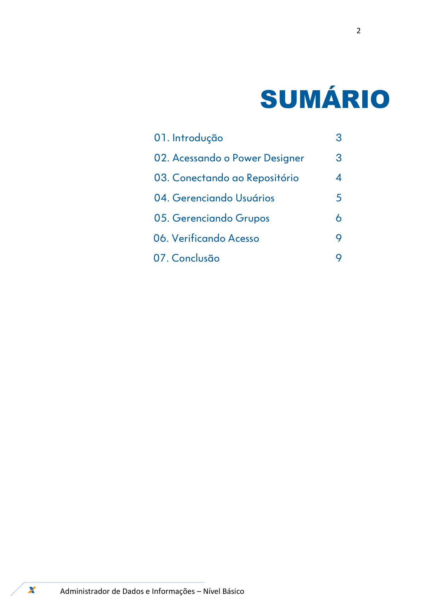
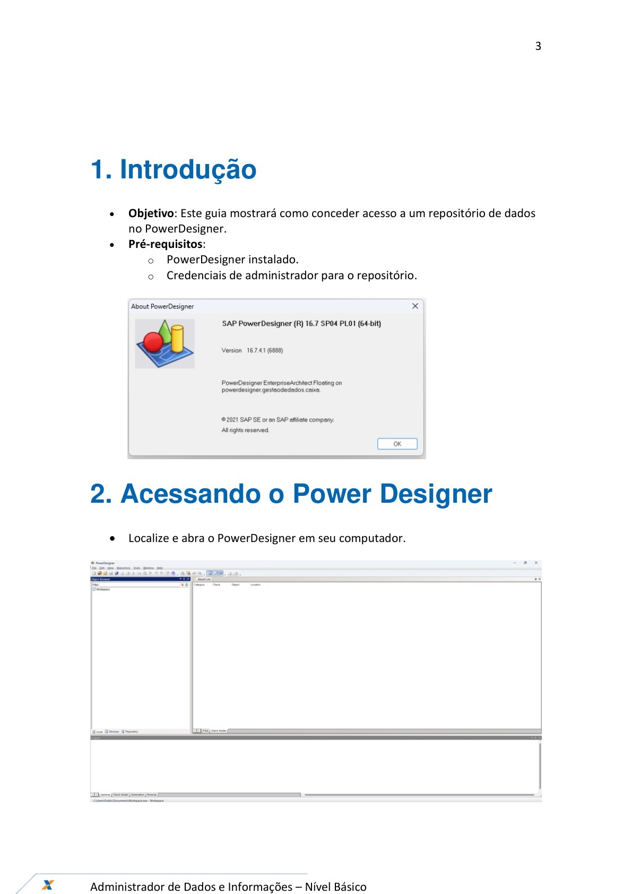
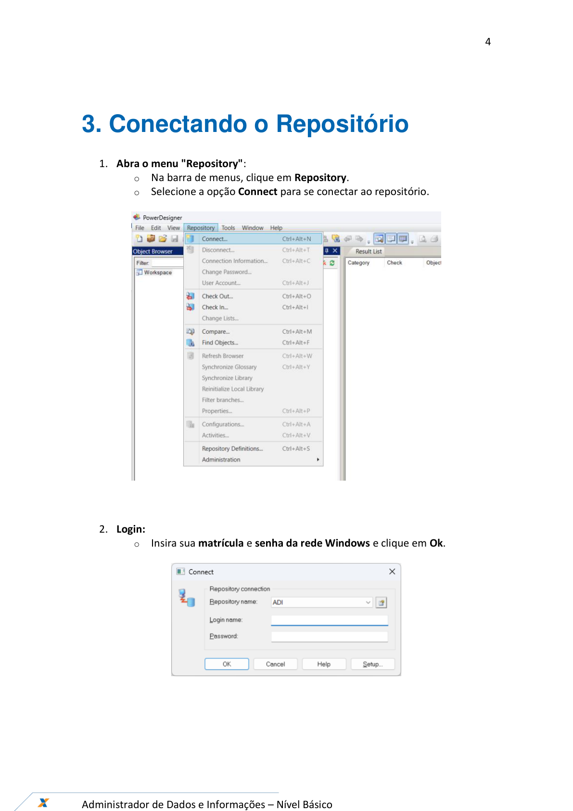
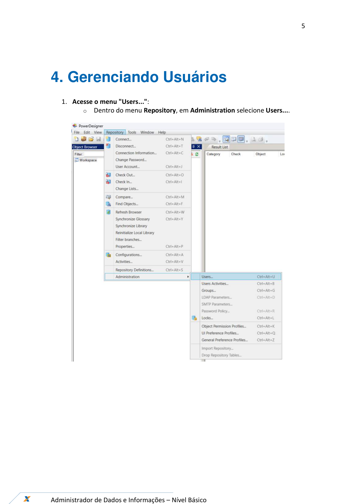
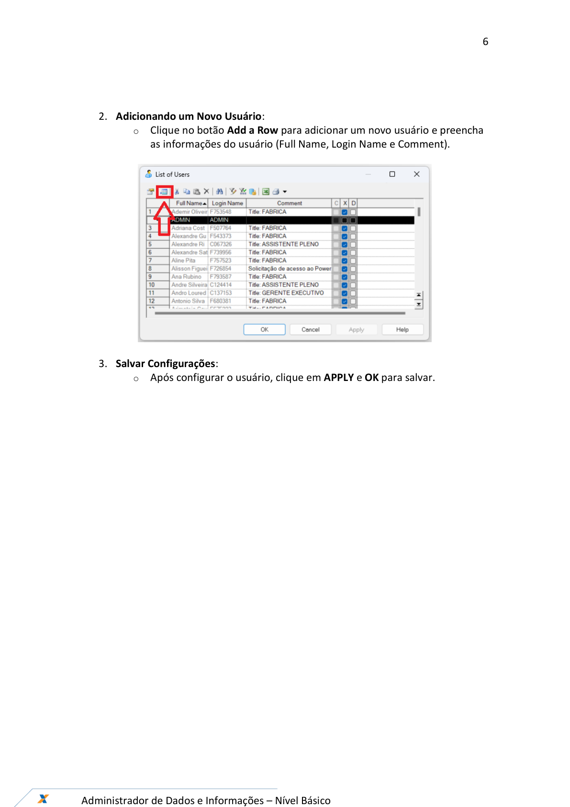
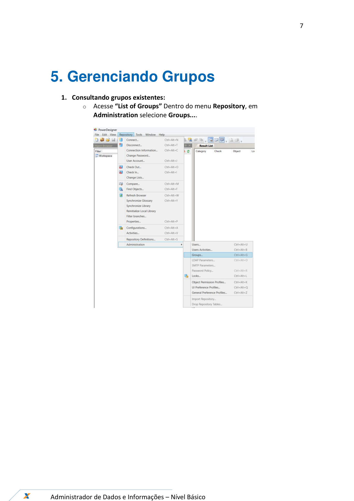
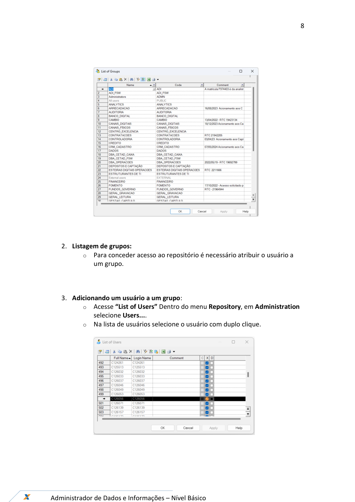
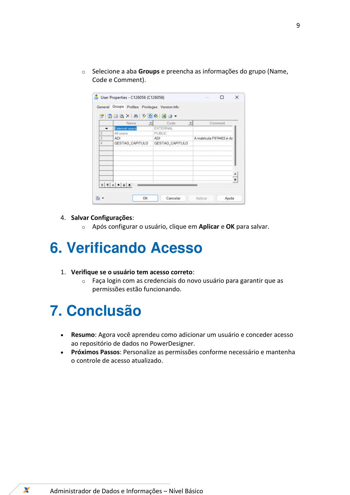

# Orientações_Iniciais_Acesso_Repositorio_Dados_v1

**Arquivo de origem:** `Orientações_Iniciais_Acesso_Repositorio_Dados_v1.pdf`

**Observação:** as imagens abaixo são renderizações das páginas do PDF, preservando fluxos, telas e elementos visuais que podem não aparecer integralmente no texto extraído.

## Página 1

### Texto extraído

Ferramentas – Power Designer
Agosto/2024
Acesso ao Repositório de Dados

## Página 2

### Texto extraído

2

Administrador de Dados e Informações – Nível Básico

SUMÁRIO

                 01. Introdução

          3
                 02. Acessando o Power Designer
3
                 03. Conectando ao Repositório

4
                 04. Gerenciando Usuários

5
                 05. Gerenciando Grupos

6

       06. Verificando Acesso

9

       07. Conclusão

9

## Página 3

### Texto extraído

3

Administrador de Dados e Informações – Nível Básico

1. Introdução
- 
Objetivo: Este guia mostrará como conceder acesso a um repositório de dados
no PowerDesigner.
- 
Pré-requisitos:
  - PowerDesigner instalado.
  - Credenciais de administrador para o repositório.

2. Acessando o Power Designer
- Localize e abra o PowerDesigner em seu computador.

## Página 4

### Texto extraído

4

Administrador de Dados e Informações – Nível Básico

3. Conectando o Repositório
1. Abra o menu "Repository":
  - Na barra de menus, clique em Repository.
  - Selecione a opção Connect para se conectar ao repositório.

2. Login:
  - Insira sua matrícula e senha da rede Windows e clique em Ok.

## Página 5

### Texto extraído

5

Administrador de Dados e Informações – Nível Básico

4. Gerenciando Usuários
1. Acesse o menu "Users...":
  - Dentro do menu Repository, em Administration selecione Users....

## Página 6

### Texto extraído

6

Administrador de Dados e Informações – Nível Básico

2. Adicionando um Novo Usuário:
  - Clique no botão Add a Row para adicionar um novo usuário e preencha
as informações do usuário (Full Name, Login Name e Comment).

3. Salvar Configurações:
  - Após configurar o usuário, clique em APPLY e OK para salvar.

## Página 7

### Texto extraído

7

Administrador de Dados e Informações – Nível Básico

5. Gerenciando Grupos
1. Consultando grupos existentes:
  - Acesse “List of Groups” Dentro do menu Repository, em
Administration selecione Groups....

## Página 8

### Texto extraído

8

Administrador de Dados e Informações – Nível Básico

2. Listagem de grupos:
  - Para conceder acesso ao repositório é necessário atribuir o usuário a
um grupo.

3. Adicionando um usuário a um grupo:
  - Acesse “List of Users” Dentro do menu Repository, em Administration
selecione Users....
  - Na lista de usuários selecione o usuário com duplo clique.

## Página 9

### Texto extraído

9

Administrador de Dados e Informações – Nível Básico

  - Selecione a aba Groups e preencha as informações do grupo (Name,
Code e Comment).

4. Salvar Configurações:
  - Após configurar o usuário, clique em Aplicar e OK para salvar.
6. Verificando Acesso
1. Verifique se o usuário tem acesso correto:
  - Faça login com as credenciais do novo usuário para garantir que as
permissões estão funcionando.
7. Conclusão
- 
Resumo: Agora você aprendeu como adicionar um usuário e conceder acesso
ao repositório de dados no PowerDesigner.
- 
Próximos Passos: Personalize as permissões conforme necessário e mantenha
  - controle de acesso atualizado.

## Página 10

### Texto extraído

10

Administrador de Dados e Informações – Nível Básico

Acesso ao Repositório de Dados
GEPAC11- NPRD
Versão 1 - 10/08/2024
