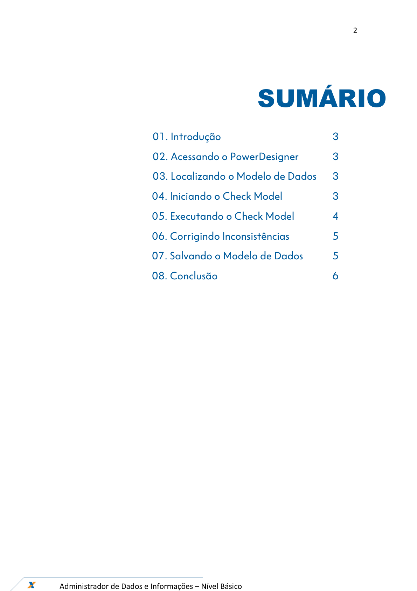
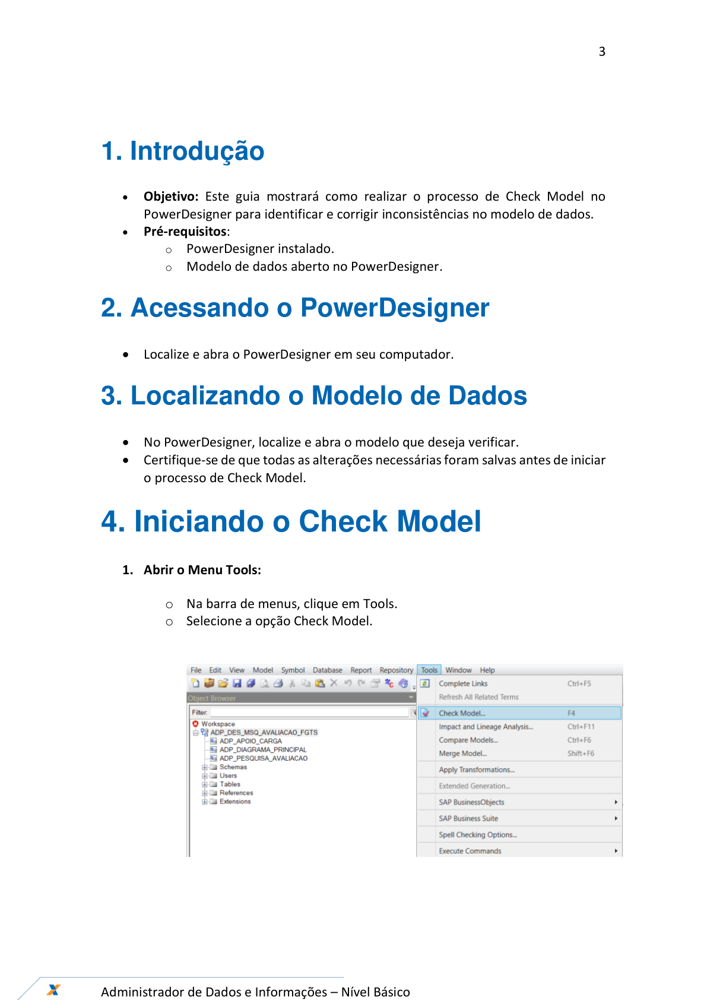
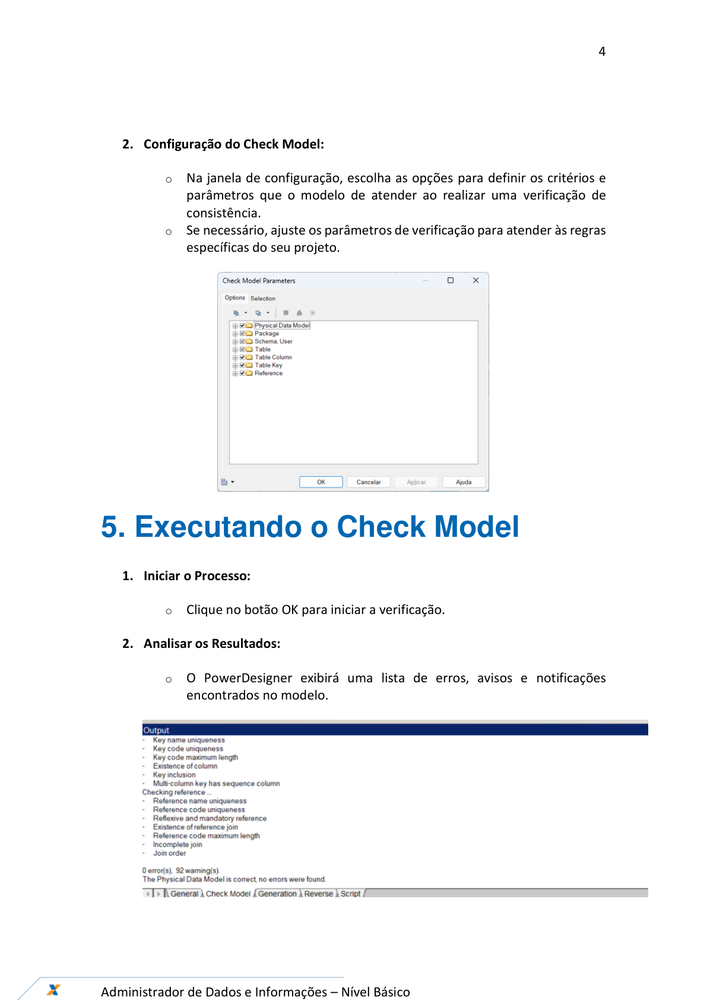
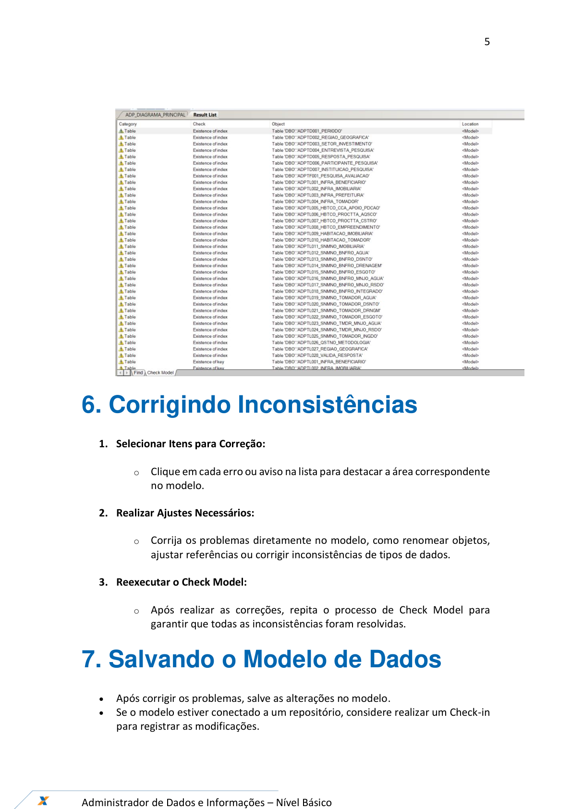
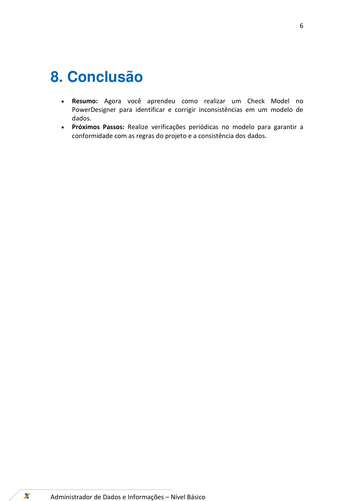

# Orientações_Iniciais_CheckModel_v1

**Arquivo de origem:** `Orientações_Iniciais_CheckModel_v1.pdf`

**Observação:** as imagens abaixo são renderizações das páginas do PDF, preservando fluxos, telas e elementos visuais que podem não aparecer integralmente no texto extraído.

## Página 1

### Texto extraído

Ferramentas – PowerDesigner
Outubro/2024
Check Model do Modelo de Dados

## Página 2

### Texto extraído

2

Administrador de Dados e Informações – Nível Básico

SUMÁRIO

                 01. Introdução

          3
                 02. Acessando o PowerDesigner
3
                 03. Localizando o Modelo de Dados
3

       04. Iniciando o Check Model

3
               05. Executando o Check Model

4

       06. Corrigindo Inconsistências

5

       07. Salvando o Modelo de Dados
5
       08. Conclusão

6

## Página 3

### Texto extraído

3

Administrador de Dados e Informações – Nível Básico

1. Introdução
- 
Objetivo: Este guia mostrará como realizar o processo de Check Model no
PowerDesigner para identificar e corrigir inconsistências no modelo de dados.
- 
Pré-requisitos:
  - PowerDesigner instalado.
  - Modelo de dados aberto no PowerDesigner.
2. Acessando o PowerDesigner
- Localize e abra o PowerDesigner em seu computador.
3. Localizando o Modelo de Dados
- No PowerDesigner, localize e abra o modelo que deseja verificar.
- Certifique-se de que todas as alterações necessárias foram salvas antes de iniciar
  - processo de Check Model.
4. Iniciando o Check Model
1. Abrir o Menu Tools:
  - Na barra de menus, clique em Tools.
  - Selecione a opção Check Model.

## Página 4

### Texto extraído

4

Administrador de Dados e Informações – Nível Básico

2. Configuração do Check Model:
  - Na janela de configuração, escolha as opções para definir os critérios e
parâmetros que o modelo de atender ao realizar uma verificação de
consistência.
  - Se necessário, ajuste os parâmetros de verificação para atender às regras
específicas do seu projeto.

5. Executando o Check Model
1. Iniciar o Processo:
  - Clique no botão OK para iniciar a verificação.
2. Analisar os Resultados:
  - O PowerDesigner exibirá uma lista de erros, avisos e notificações
encontrados no modelo.

## Página 5

### Texto extraído

5

Administrador de Dados e Informações – Nível Básico

6. Corrigindo Inconsistências
1. Selecionar Itens para Correção:
  - Clique em cada erro ou aviso na lista para destacar a área correspondente
no modelo.
2. Realizar Ajustes Necessários:
  - Corrija os problemas diretamente no modelo, como renomear objetos,
ajustar referências ou corrigir inconsistências de tipos de dados.
3. Reexecutar o Check Model:
  - Após realizar as correções, repita o processo de Check Model para
garantir que todas as inconsistências foram resolvidas.
7. Salvando o Modelo de Dados
- 
Após corrigir os problemas, salve as alterações no modelo.
- 
Se o modelo estiver conectado a um repositório, considere realizar um Check-in
para registrar as modificações.

## Página 6

### Texto extraído

6

Administrador de Dados e Informações – Nível Básico

8. Conclusão
- 
Resumo: Agora você aprendeu como realizar um Check Model no
PowerDesigner para identificar e corrigir inconsistências em um modelo de
dados.
- 
Próximos Passos: Realize verificações periódicas no modelo para garantir a
conformidade com as regras do projeto e a consistência dos dados.

## Página 7

### Texto extraído

7

Administrador de Dados e Informações – Nível Básico

Check Model do Modelo de Dados
GEPAC11- NPRD
Versão 1 - 25/10/2024
Fernando de Souza Aires
