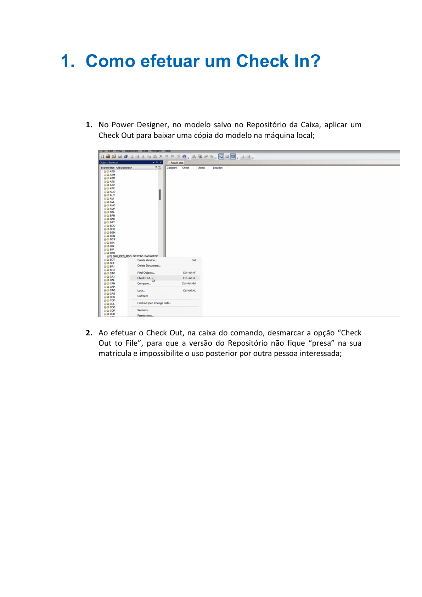
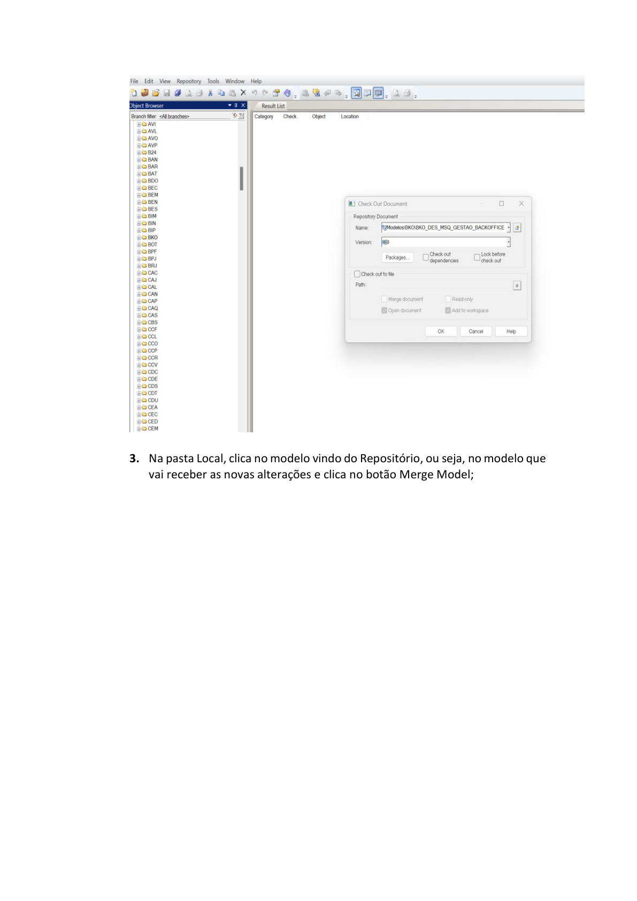
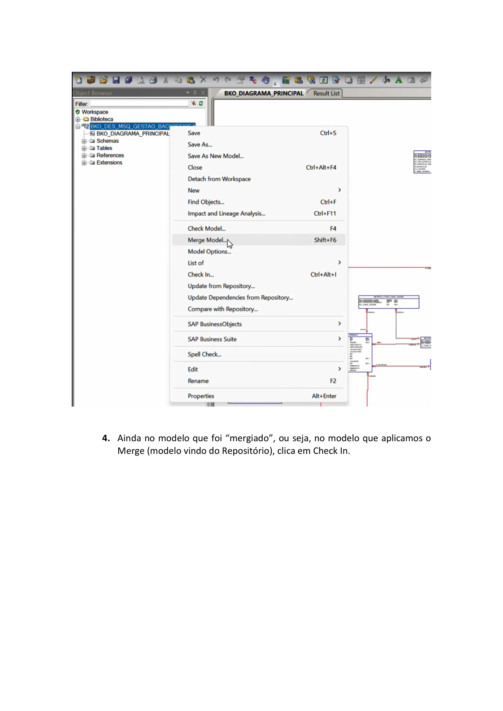
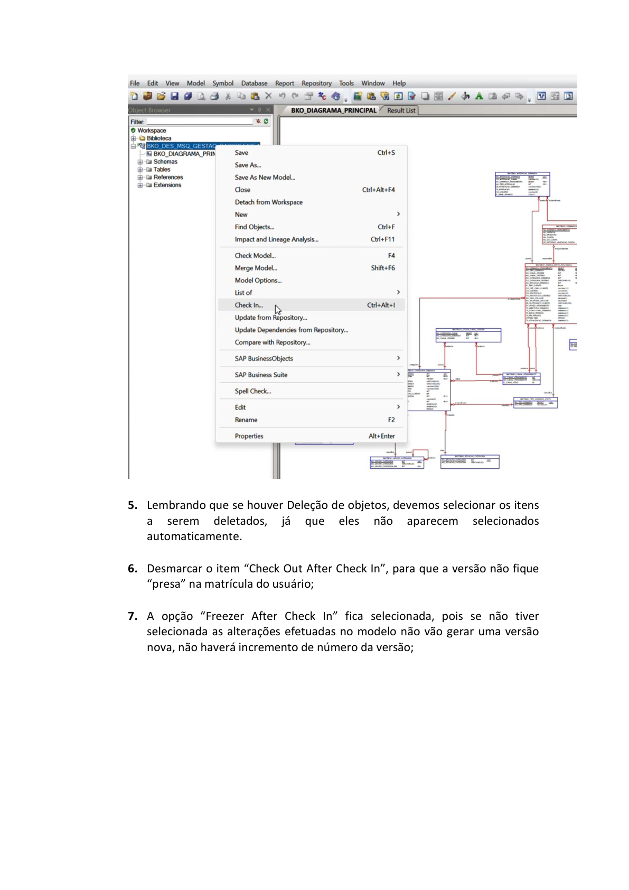
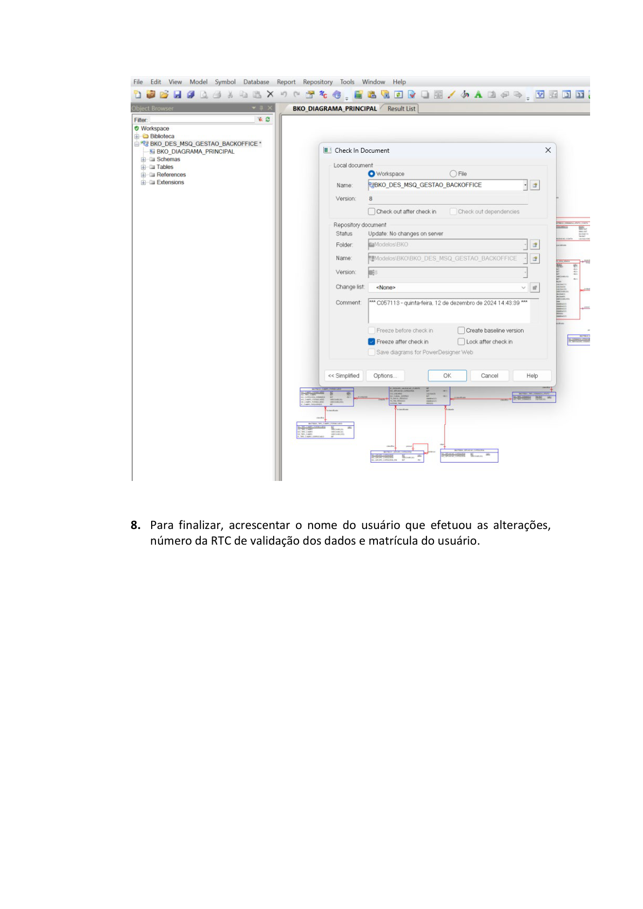

# Orientações_Iniciais_Como_realizar_Check In_v1

**Arquivo de origem:** `Orientações_Iniciais_Como_realizar_Check In_v1.pdf`

**Observação:** as imagens abaixo são renderizações das páginas do PDF, preservando fluxos, telas e elementos visuais que podem não aparecer integralmente no texto extraído.

## Página 1

### Texto extraído

Ferramenta – Power Designer
Como efetuar um Check In?
Dezembro/2024

## Página 2

### Texto extraído

SUMÁRIO

                 01. Introdução

          3
                 02. Como efetuar um Check In?

3
                 03. Conclusão

8

## Página 3

### Texto extraído

1. Como efetuar um Check In?

1. No Power Designer, no modelo salvo no Repositório da Caixa, aplicar um
Check Out para baixar uma cópia do modelo na máquina local;

2. Ao efetuar o Check Out, na caixa do comando, desmarcar a opção “Check
Out to File”, para que a versão do Repositório não fique “presa” na sua
matrícula e impossibilite o uso posterior por outra pessoa interessada;

## Página 4

### Texto extraído

3. Na pasta Local, clica no modelo vindo do Repositório, ou seja, no modelo que
vai receber as novas alterações e clica no botão Merge Model;

## Página 5

### Texto extraído

4. Ainda no modelo que foi “mergiado”, ou seja, no modelo que aplicamos o
Merge (modelo vindo do Repositório), clica em Check In.

## Página 6

### Texto extraído

5. Lembrando que se houver Deleção de objetos, devemos selecionar os itens
a
serem
deletados,
já
que
eles
não
aparecem
selecionados
automaticamente.

6. Desmarcar o item “Check Out After Check In”, para que a versão não fique
“presa” na matrícula do usuário;

7. A opção “Freezer After Check In” fica selecionada, pois se não tiver
selecionada as alterações efetuadas no modelo não vão gerar uma versão
nova, não haverá incremento de número da versão;

## Página 7

### Texto extraído

8. Para finalizar, acrescentar o nome do usuário que efetuou as alterações,
número da RTC de validação dos dados e matrícula do usuário.

## Página 8

### Texto extraído

2. Conclusão:
1. Agora já sabemos como efetuar um Check In e enviarmos uma versão
atualizada e validada por um ADI ao Repositório da Caixa.

## Página 9

### Texto extraído

Como fazer um Check In
GEPAC11- NPRD
Versão 1 - 13/12/2024
