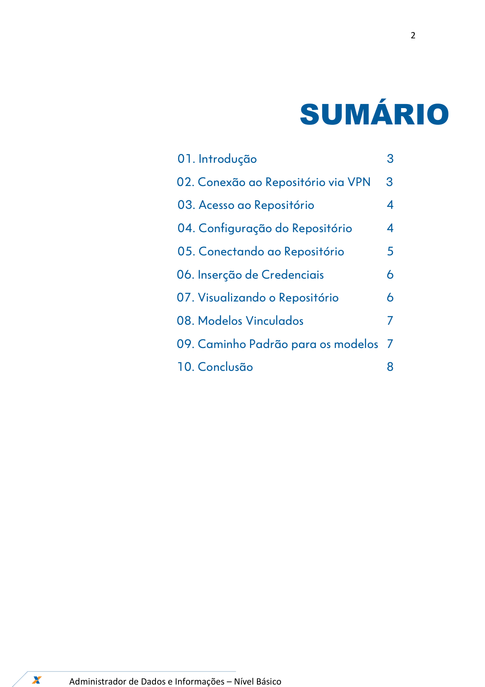
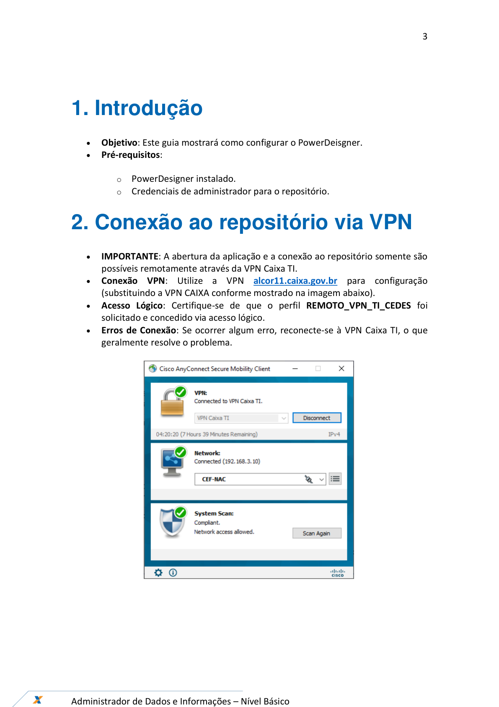
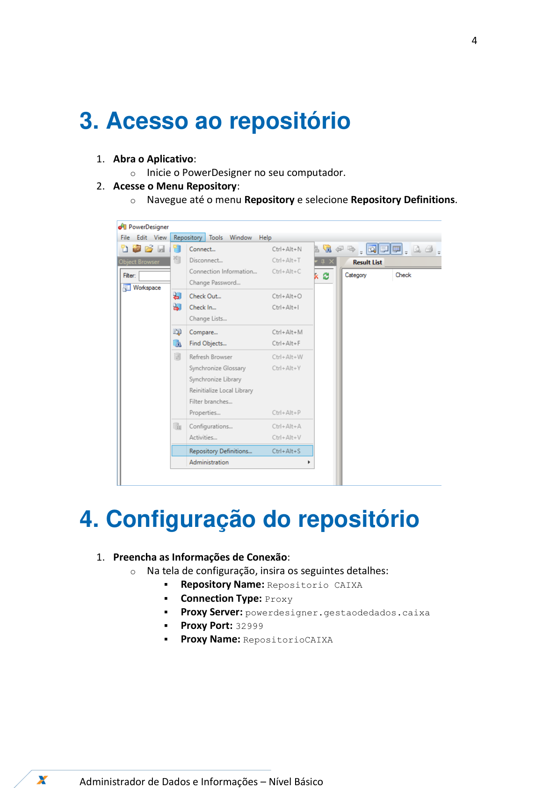
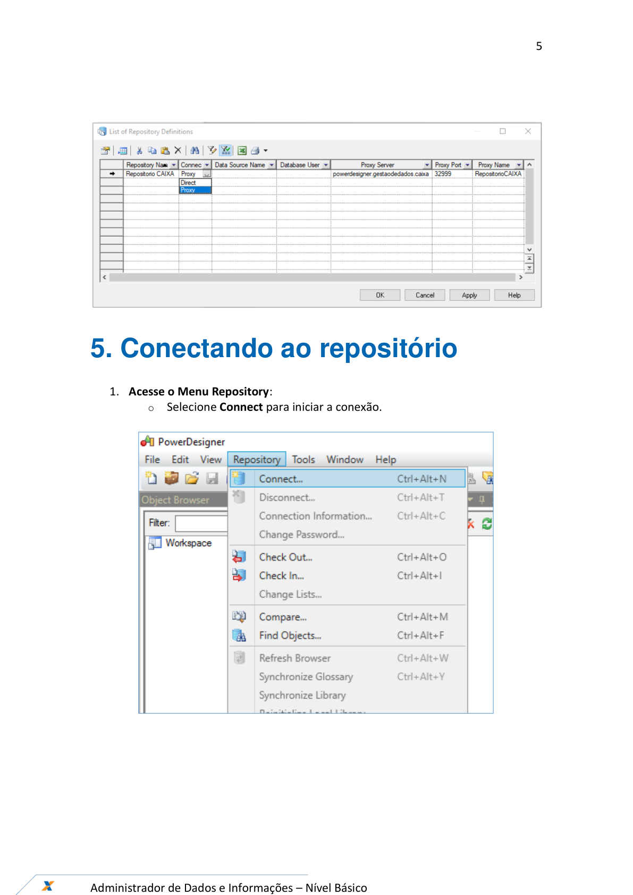
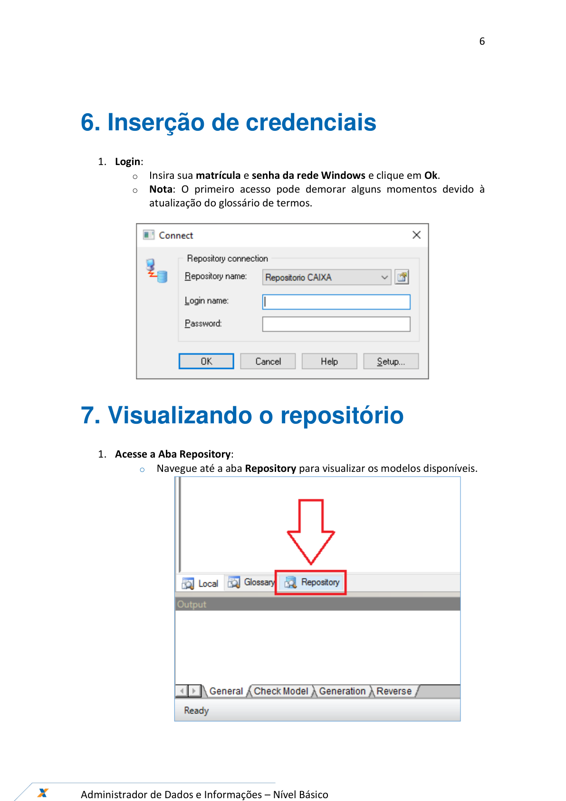
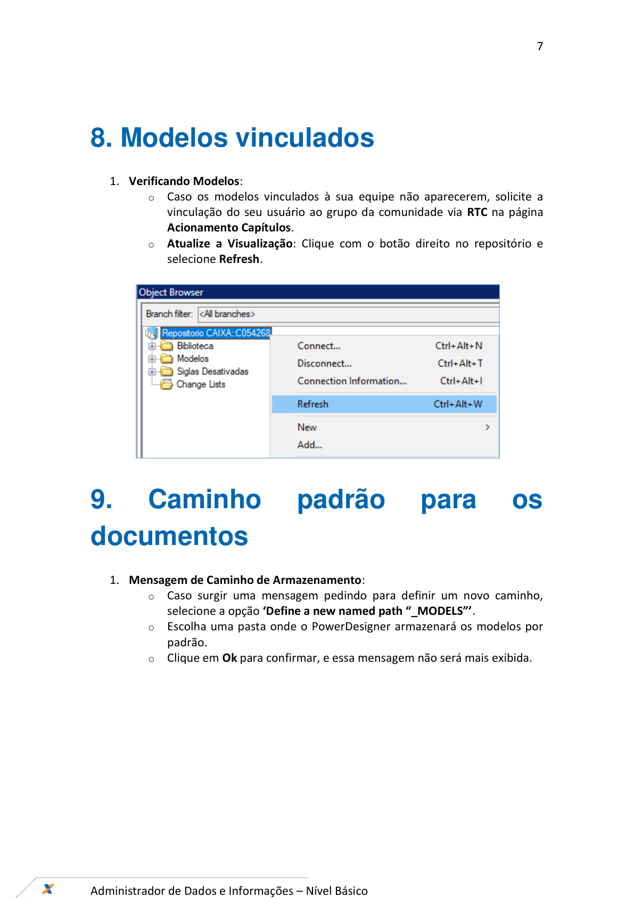
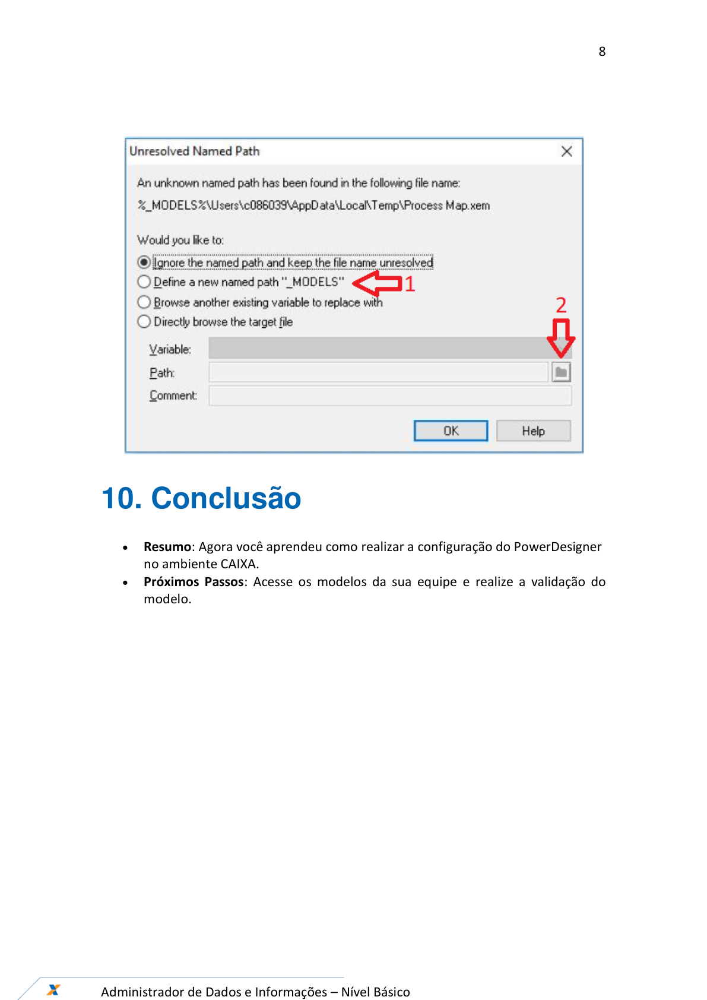

# Orientações_Iniciais_ConfiguracaoFerramenta_v1

**Arquivo de origem:** `Orientações_Iniciais_ConfiguracaoFerramenta_v1.pdf`

**Observação:** as imagens abaixo são renderizações das páginas do PDF, preservando fluxos, telas e elementos visuais que podem não aparecer integralmente no texto extraído.

## Página 1

### Texto extraído

Ferramentas – PowerDesigner
Agosto/2024
Configuração da Ferramenta

## Página 2

### Texto extraído

2

Administrador de Dados e Informações – Nível Básico

SUMÁRIO

                 01. Introdução

3
       02. Conexão ao Repositório via VPN     3
                 03. Acesso ao Repositório

4
                 04. Configuração do Repositório
4
                 05. Conectando ao Repositório

5

       06. Inserção de Credenciais

6

       07. Visualizando o Repositório

6

       08. Modelos Vinculados

7

       09. Caminho Padrão para os modelos 7

       10. Conclusão

8

## Página 3

### Texto extraído

3

Administrador de Dados e Informações – Nível Básico

1. Introdução
- 
Objetivo: Este guia mostrará como configurar o PowerDeisgner.
- 
Pré-requisitos:
  - PowerDesigner instalado.
  - Credenciais de administrador para o repositório.
2. Conexão ao repositório via VPN
- 
IMPORTANTE: A abertura da aplicação e a conexão ao repositório somente são
possíveis remotamente através da VPN Caixa TI.
- 
Conexão VPN: Utilize a VPN alcor11.caixa.gov.br para configuração
(substituindo a VPN CAIXA conforme mostrado na imagem abaixo).
- 
Acesso Lógico: Certifique-se de que o perfil REMOTO_VPN_TI_CEDES foi
solicitado e concedido via acesso lógico.
- 
Erros de Conexão: Se ocorrer algum erro, reconecte-se à VPN Caixa TI, o que
geralmente resolve o problema.

## Página 4

### Texto extraído

4

Administrador de Dados e Informações – Nível Básico

3. Acesso ao repositório
1. Abra o Aplicativo:
  - Inicie o PowerDesigner no seu computador.
2. Acesse o Menu Repository:
  - Navegue até o menu Repository e selecione Repository Definitions.

4. Configuração do repositório
1. Preencha as Informações de Conexão:
  - Na tela de configuração, insira os seguintes detalhes:
- 
Repository Name: Repositorio CAIXA
- 
Connection Type: Proxy
- 
Proxy Server: powerdesigner.gestaodedados.caixa
- 
Proxy Port: 32999
- 
Proxy Name: RepositorioCAIXA

## Página 5

### Texto extraído

5

Administrador de Dados e Informações – Nível Básico

5. Conectando ao repositório
1. Acesse o Menu Repository:
  - Selecione Connect para iniciar a conexão.

## Página 6

### Texto extraído

6

Administrador de Dados e Informações – Nível Básico

6. Inserção de credenciais
1. Login:
  - Insira sua matrícula e senha da rede Windows e clique em Ok.
  - Nota: O primeiro acesso pode demorar alguns momentos devido à
atualização do glossário de termos.

7. Visualizando o repositório
1. Acesse a Aba Repository:
  - Navegue até a aba Repository para visualizar os modelos disponíveis.

## Página 7

### Texto extraído

7

Administrador de Dados e Informações – Nível Básico

8. Modelos vinculados
1. Verificando Modelos:
  - Caso os modelos vinculados à sua equipe não aparecerem, solicite a
vinculação do seu usuário ao grupo da comunidade via RTC na página
Acionamento Capítulos.
  - Atualize a Visualização: Clique com o botão direito no repositório e
selecione Refresh.

9.
Caminho
padrão
para
os
documentos
1. Mensagem de Caminho de Armazenamento:
  - Caso surgir uma mensagem pedindo para definir um novo caminho,
selecione a opção ‘Define a new named path “_MODELS”’.
  - Escolha uma pasta onde o PowerDesigner armazenará os modelos por
padrão.
  - Clique em Ok para confirmar, e essa mensagem não será mais exibida.

## Página 8

### Texto extraído

8

Administrador de Dados e Informações – Nível Básico

10. Conclusão
- 
Resumo: Agora você aprendeu como realizar a configuração do PowerDesigner
no ambiente CAIXA.
- 
Próximos Passos: Acesse os modelos da sua equipe e realize a validação do
modelo.

## Página 9

### Texto extraído

9

Administrador de Dados e Informações – Nível Básico

Configuração da Ferramenta
GEPAC11- NPRD
Versão 1 - 10/08/2024
Fernando de Souza Aires
