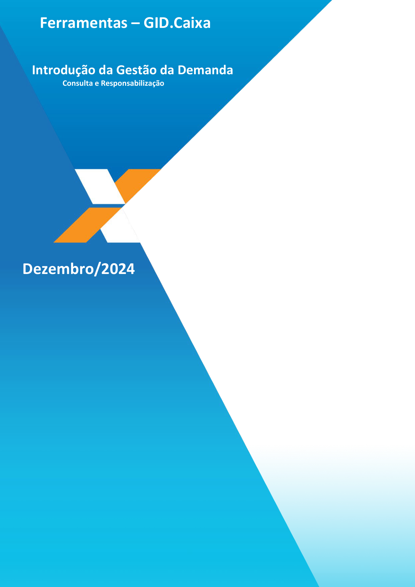
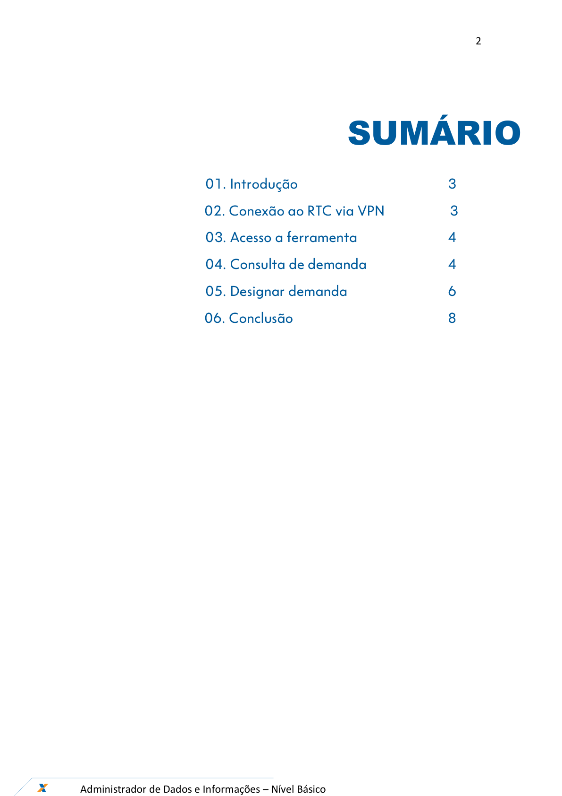
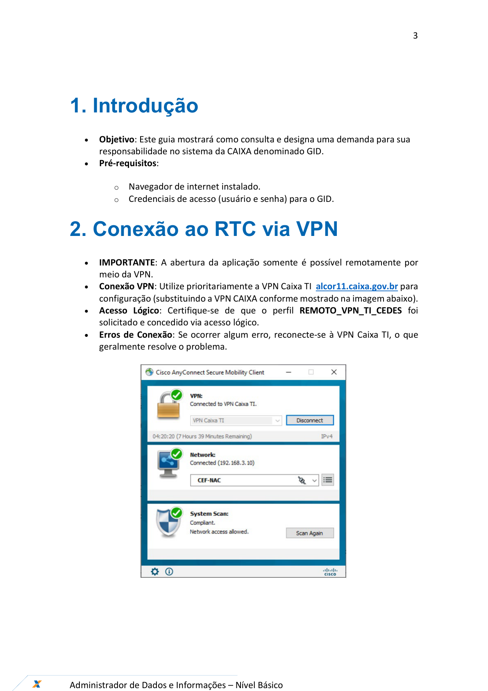
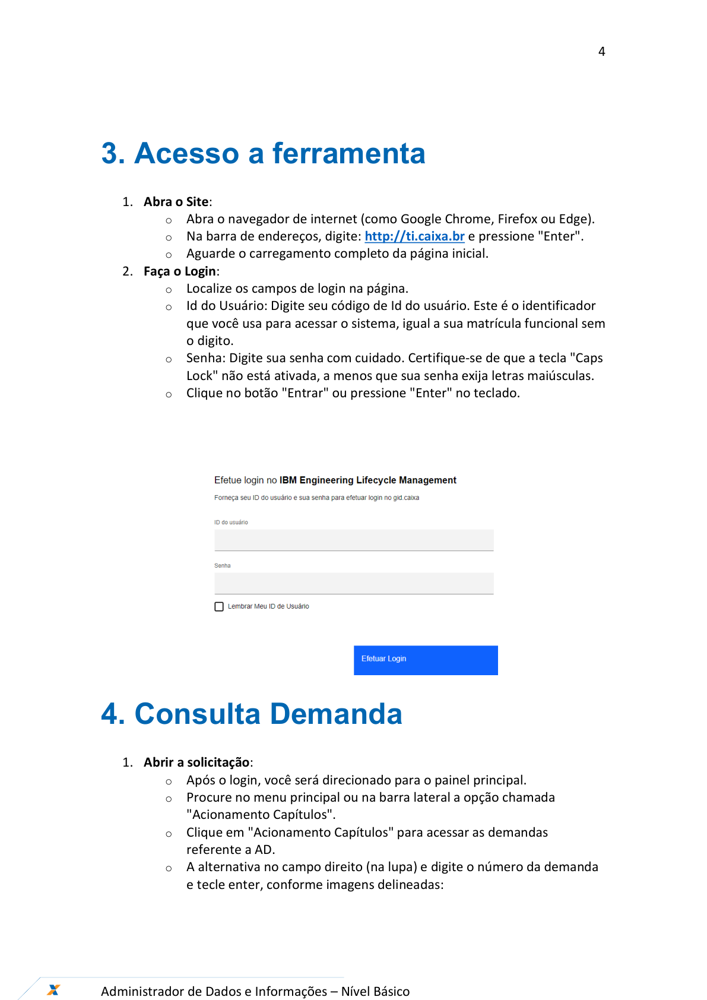
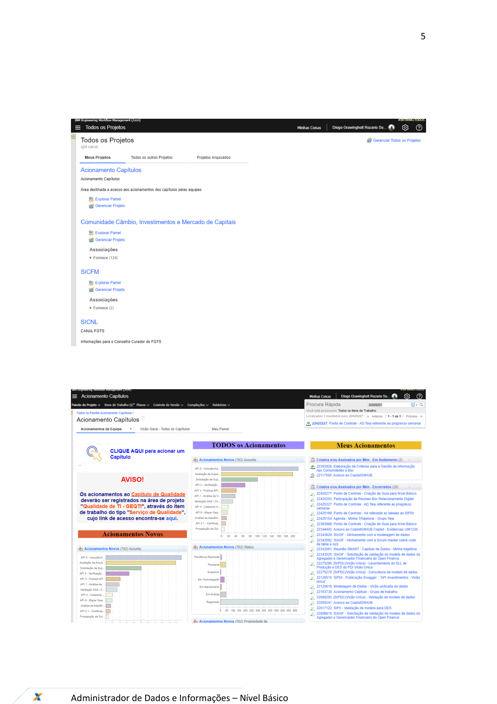
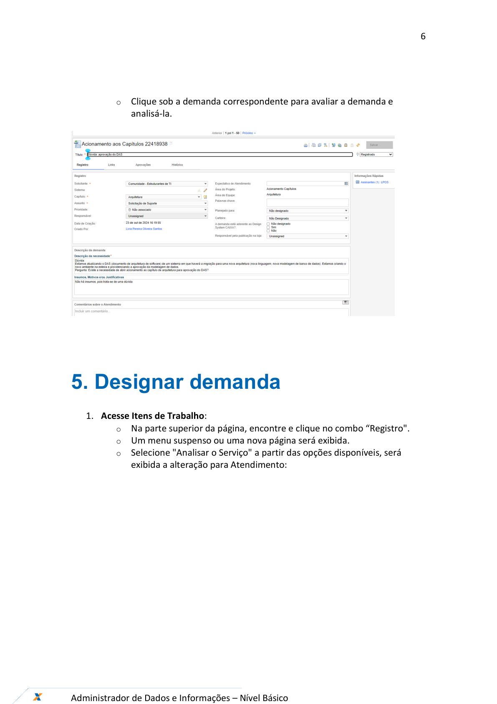
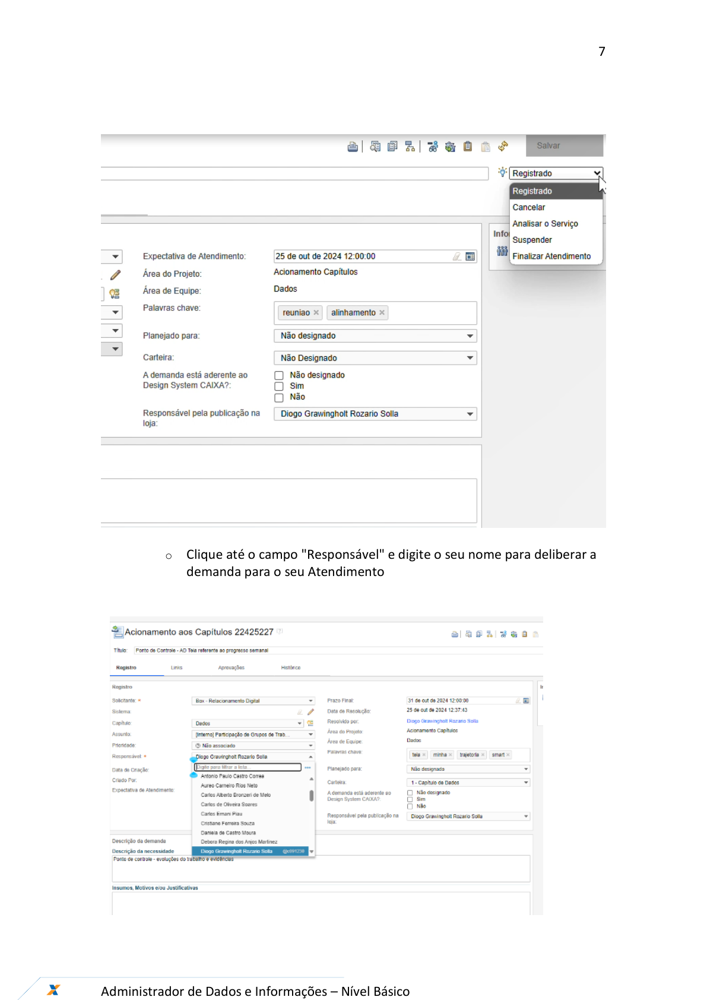
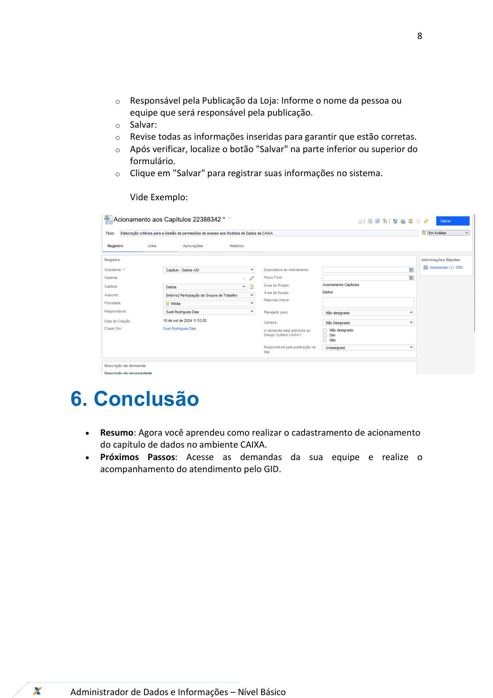
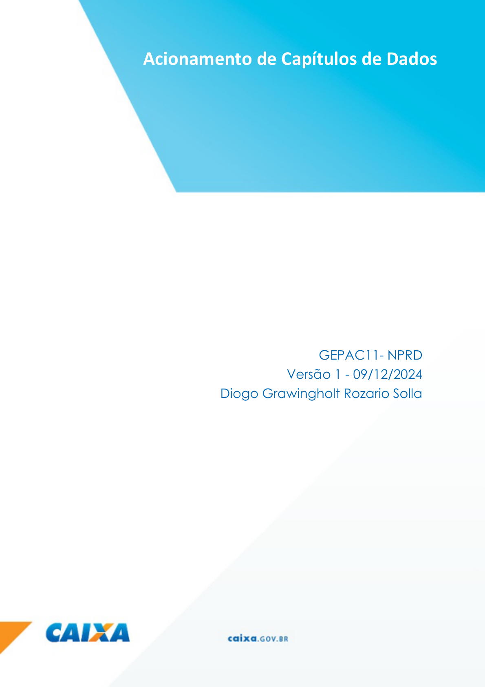

# Orientações_Iniciais_Consulta_Responsabilizacao_v1

**Arquivo de origem:** `Orientações_Iniciais_Consulta_Responsabilizacao_v1.pdf`

**Observação:** as imagens abaixo são renderizações das páginas do PDF, preservando fluxos, telas e elementos visuais que podem não aparecer integralmente no texto extraído.

## Página 1

### Texto extraído

Ferramentas – GID.Caixa
Dezembro/2024
Introdução da Gestão da Demanda
             Consulta e Responsabilização

## Página 2

### Texto extraído

2

Administrador de Dados e Informações – Nível Básico

SUMÁRIO

                 01. Introdução

          3
       02. Conexão ao RTC via VPN                   3
                 03. Acesso a ferramenta
4
                 04. Consulta de demanda

4
                 05. Designar demanda

6

       06. Conclusão

8

## Página 3

### Texto extraído

3

Administrador de Dados e Informações – Nível Básico

1. Introdução
- 
Objetivo: Este guia mostrará como consulta e designa uma demanda para sua
responsabilidade no sistema da CAIXA denominado GID.
- 
Pré-requisitos:
  - Navegador de internet instalado.
  - Credenciais de acesso (usuário e senha) para o GID.
2. Conexão ao RTC via VPN
- 
IMPORTANTE: A abertura da aplicação somente é possível remotamente por
meio da VPN.
- 
Conexão VPN: Utilize prioritariamente a VPN Caixa TI  alcor11.caixa.gov.br para
configuração (substituindo a VPN CAIXA conforme mostrado na imagem abaixo).
- 
Acesso Lógico: Certifique-se de que o perfil REMOTO_VPN_TI_CEDES foi
solicitado e concedido via acesso lógico.
- 
Erros de Conexão: Se ocorrer algum erro, reconecte-se à VPN Caixa TI, o que
geralmente resolve o problema.

## Página 4

### Texto extraído

4

Administrador de Dados e Informações – Nível Básico

3. Acesso a ferramenta
1. Abra o Site:
  - Abra o navegador de internet (como Google Chrome, Firefox ou Edge).
  - Na barra de endereços, digite: http://ti.caixa.br e pressione "Enter".
  - Aguarde o carregamento completo da página inicial.
2. Faça o Login:
  - Localize os campos de login na página.
  - Id do Usuário: Digite seu código de Id do usuário. Este é o identificador
que você usa para acessar o sistema, igual a sua matrícula funcional sem
  - digito.
  - Senha: Digite sua senha com cuidado. Certifique-se de que a tecla "Caps
Lock" não está ativada, a menos que sua senha exija letras maiúsculas.
  - Clique no botão "Entrar" ou pressione "Enter" no teclado.

4. Consulta Demanda
1. Abrir a solicitação:
  - Após o login, você será direcionado para o painel principal.
  - Procure no menu principal ou na barra lateral a opção chamada
"Acionamento Capítulos".
  - Clique em "Acionamento Capítulos" para acessar as demandas
referente a AD.
  - A alternativa no campo direito (na lupa) e digite o número da demanda
e tecle enter, conforme imagens delineadas:

## Página 5

### Texto extraído

5

Administrador de Dados e Informações – Nível Básico

## Página 6

### Texto extraído

6

Administrador de Dados e Informações – Nível Básico

  - Clique sob a demanda correspondente para avaliar a demanda e
analisá-la.

5. Designar demanda
1. Acesse Itens de Trabalho:
  - Na parte superior da página, encontre e clique no combo “Registro".
  - Um menu suspenso ou uma nova página será exibida.
  - Selecione "Analisar o Serviço" a partir das opções disponíveis, será
exibida a alteração para Atendimento:

## Página 7

### Texto extraído

7

Administrador de Dados e Informações – Nível Básico

  - Clique até o campo "Responsável" e digite o seu nome para deliberar a
demanda para o seu Atendimento

## Página 8

### Texto extraído

8

Administrador de Dados e Informações – Nível Básico

  - Responsável pela Publicação da Loja: Informe o nome da pessoa ou
equipe que será responsável pela publicação.
  - Salvar:
  - Revise todas as informações inseridas para garantir que estão corretas.
  - Após verificar, localize o botão "Salvar" na parte inferior ou superior do
formulário.
  - Clique em "Salvar" para registrar suas informações no sistema.
Vide Exemplo:

6. Conclusão
- 
Resumo: Agora você aprendeu como realizar o cadastramento de acionamento
do capítulo de dados no ambiente CAIXA.
- 
Próximos Passos: Acesse as demandas da sua equipe e realize o
acompanhamento do atendimento pelo GID.

## Página 9

### Texto extraído

9

Administrador de Dados e Informações – Nível Básico

Acionamento de Capítulos de Dados
GEPAC11- NPRD
Versão 1 - 09/12/2024
Diogo Grawingholt Rozario Solla
