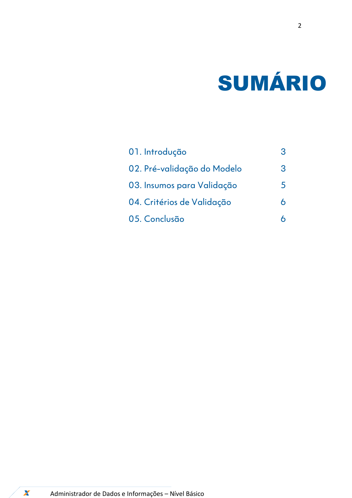
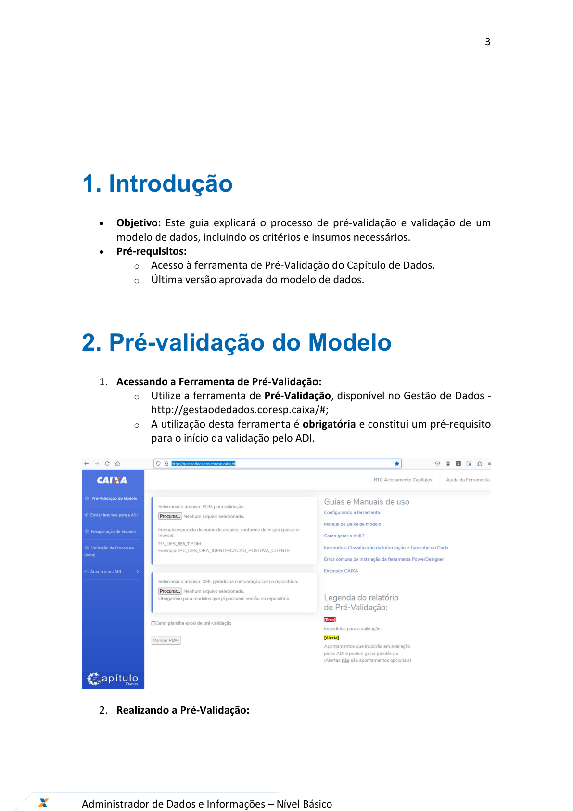
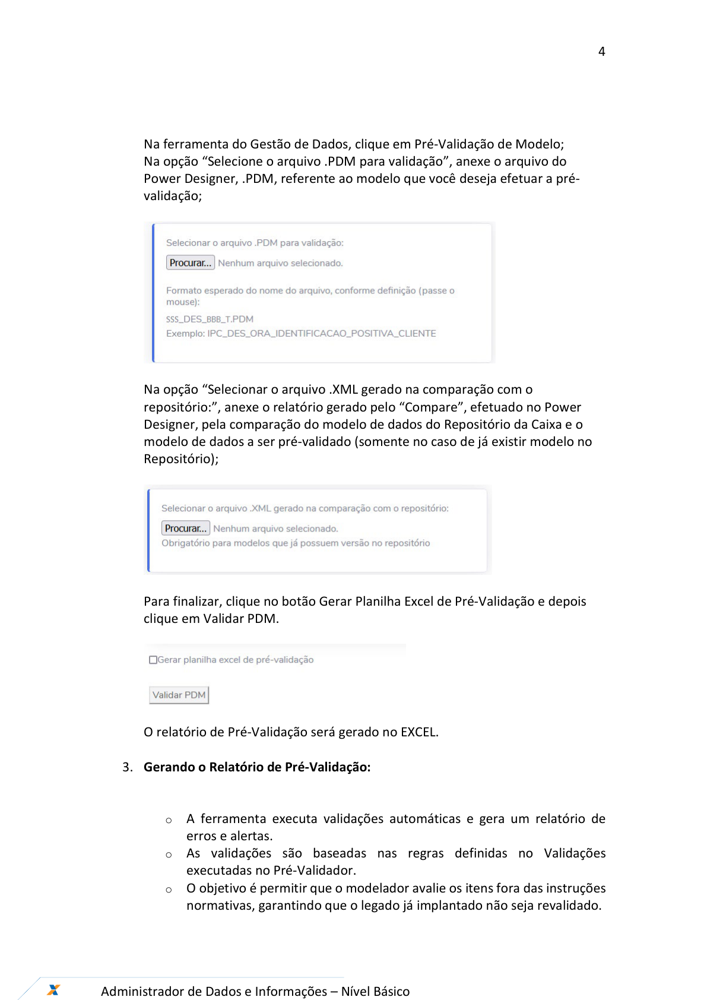
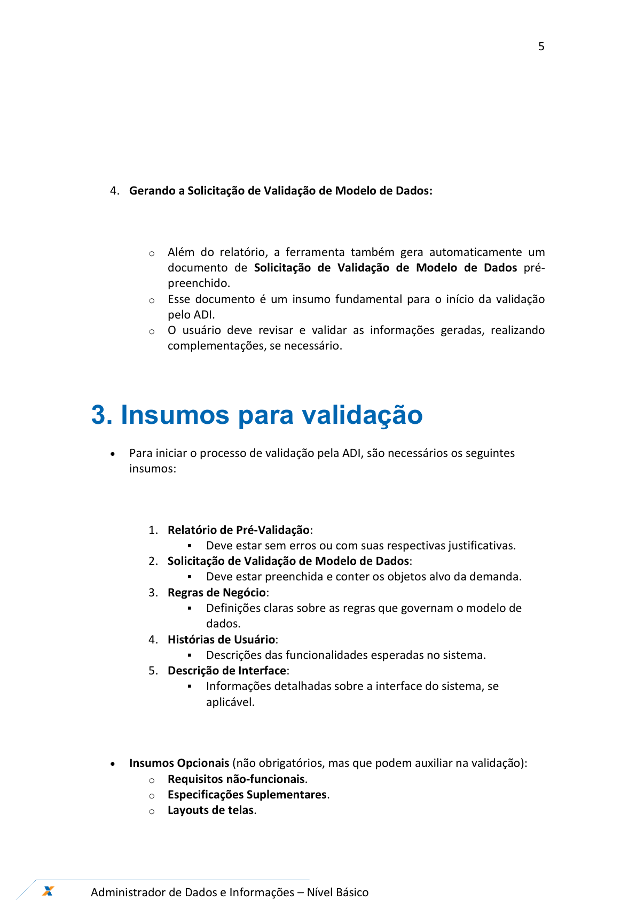
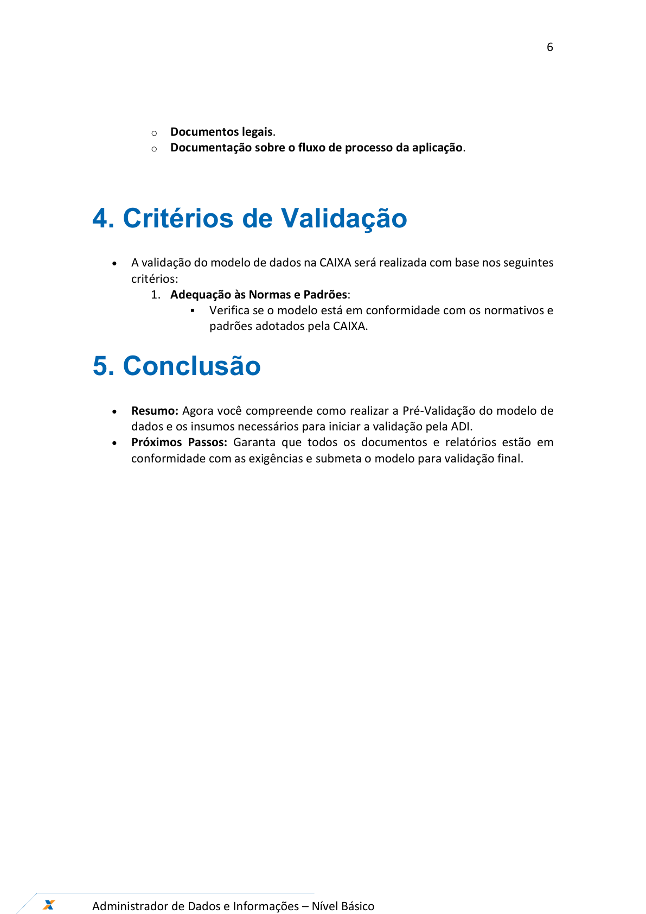
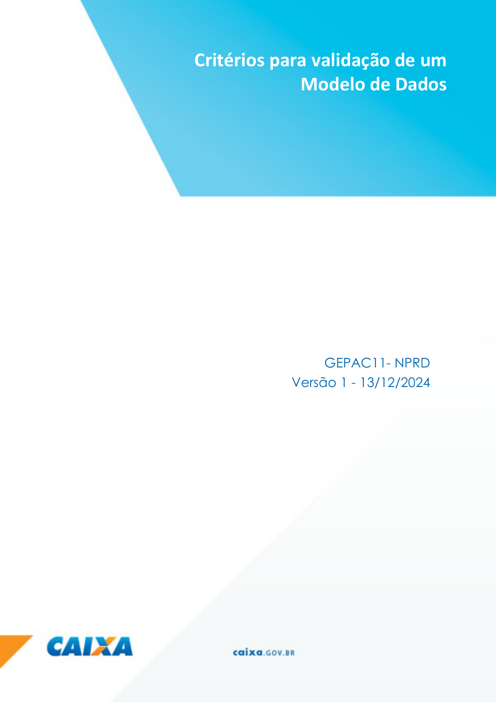

# Orientações_Iniciais_Criterios_Validacao_v1

**Arquivo de origem:** `Orientações_Iniciais_Criterios_Validacao_v1.pdf`

**Observação:** as imagens abaixo são renderizações das páginas do PDF, preservando fluxos, telas e elementos visuais que podem não aparecer integralmente no texto extraído.

## Página 1

### Texto extraído

Ferramentas – Gestão de Dados
Dezembro/2024
Critério para Validação de um
Modelo de Dados

## Página 2

### Texto extraído

2

Administrador de Dados e Informações – Nível Básico

SUMÁRIO

                 01. Introdução

          3
                 02. Pré-validação do Modelo

3
                 03. Insumos para Validação

5
                 04. Critérios de Validação

6
                 05. Conclusão

6

## Página 3

### Texto extraído

3

Administrador de Dados e Informações – Nível Básico

1. Introdução
- 
Objetivo: Este guia explicará o processo de pré-validação e validação de um
modelo de dados, incluindo os critérios e insumos necessários.
- 
Pré-requisitos:
  - Acesso à ferramenta de Pré-Validação do Capítulo de Dados.
  - Última versão aprovada do modelo de dados.

2. Pré-validação do Modelo
1. Acessando a Ferramenta de Pré-Validação:
  - Utilize a ferramenta de Pré-Validação, disponível no Gestão de Dados -
http://gestaodedados.coresp.caixa/#;
  - A utilização desta ferramenta é obrigatória e constitui um pré-requisito
para o início da validação pelo ADI.

2. Realizando a Pré-Validação:

## Página 4

### Texto extraído

4

Administrador de Dados e Informações – Nível Básico

Na ferramenta do Gestão de Dados, clique em Pré-Validação de Modelo;
Na opção “Selecione o arquivo .PDM para validação”, anexe o arquivo do
Power Designer, .PDM, referente ao modelo que você deseja efetuar a pré-
validação;

Na opção “Selecionar o arquivo .XML gerado na comparação com o
repositório:”, anexe o relatório gerado pelo “Compare”, efetuado no Power
Designer, pela comparação do modelo de dados do Repositório da Caixa e o
modelo de dados a ser pré-validado (somente no caso de já existir modelo no
Repositório);

Para finalizar, clique no botão Gerar Planilha Excel de Pré-Validação e depois
clique em Validar PDM.

O relatório de Pré-Validação será gerado no EXCEL.

3. Gerando o Relatório de Pré-Validação:

  - A ferramenta executa validações automáticas e gera um relatório de
erros e alertas.
  - As validações são baseadas nas regras definidas no Validações
executadas no Pré-Validador.
  - O objetivo é permitir que o modelador avalie os itens fora das instruções
normativas, garantindo que o legado já implantado não seja revalidado.

## Página 5

### Texto extraído

5

Administrador de Dados e Informações – Nível Básico

4. Gerando a Solicitação de Validação de Modelo de Dados:

  - Além do relatório, a ferramenta também gera automaticamente um
documento de Solicitação de Validação de Modelo de Dados pré-
preenchido.
  - Esse documento é um insumo fundamental para o início da validação
pelo ADI.
  - O usuário deve revisar e validar as informações geradas, realizando
complementações, se necessário.

3. Insumos para validação
- 
Para iniciar o processo de validação pela ADI, são necessários os seguintes
insumos:

1. Relatório de Pré-Validação:

Deve estar sem erros ou com suas respectivas justificativas.
2. Solicitação de Validação de Modelo de Dados:

Deve estar preenchida e conter os objetos alvo da demanda.
3. Regras de Negócio:

Definições claras sobre as regras que governam o modelo de
dados.
4. Histórias de Usuário:

Descrições das funcionalidades esperadas no sistema.
5. Descrição de Interface:

Informações detalhadas sobre a interface do sistema, se
aplicável.

- 
Insumos Opcionais (não obrigatórios, mas que podem auxiliar na validação):
  - Requisitos não-funcionais.
  - Especificações Suplementares.
  - Layouts de telas.

## Página 6

### Texto extraído

6

Administrador de Dados e Informações – Nível Básico

  - Documentos legais.
  - Documentação sobre o fluxo de processo da aplicação.

4. Critérios de Validação
- 
A validação do modelo de dados na CAIXA será realizada com base nos seguintes
critérios:
1. Adequação às Normas e Padrões:

Verifica se o modelo está em conformidade com os normativos e
padrões adotados pela CAIXA.
5. Conclusão
- 
Resumo: Agora você compreende como realizar a Pré-Validação do modelo de
dados e os insumos necessários para iniciar a validação pela ADI.
- 
Próximos Passos: Garanta que todos os documentos e relatórios estão em
conformidade com as exigências e submeta o modelo para validação final.

## Página 7

### Texto extraído

7

Administrador de Dados e Informações – Nível Básico

Critérios para validação de um
Modelo de Dados
GEPAC11- NPRD
Versão 1 - 13/12/2024
