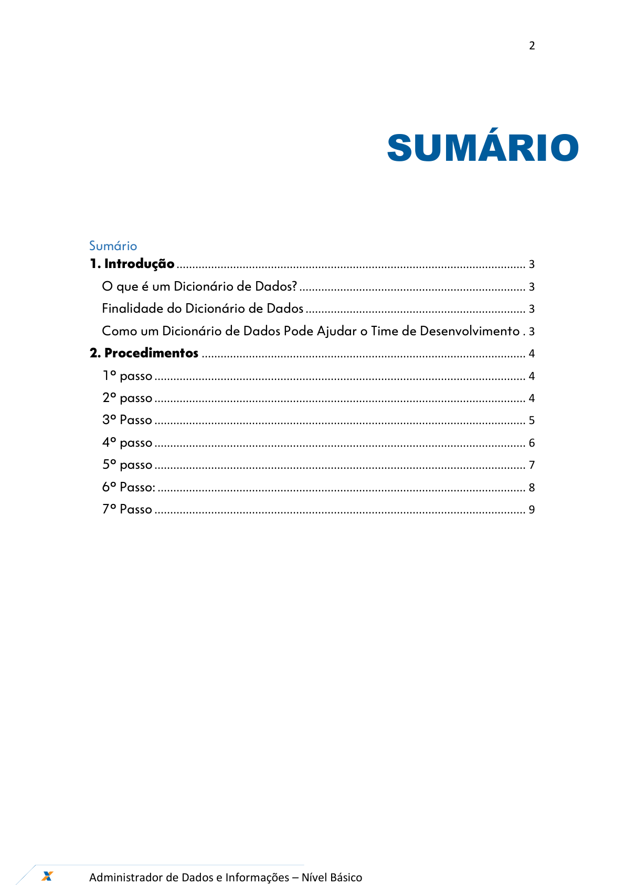
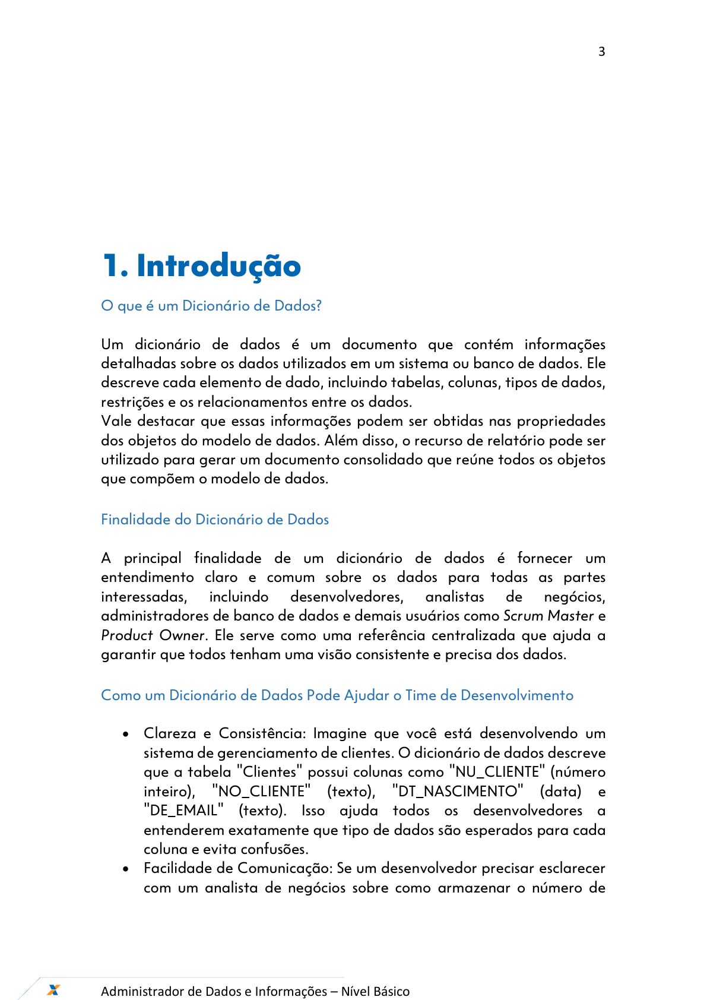
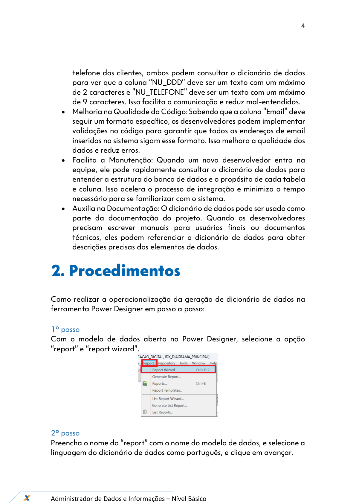
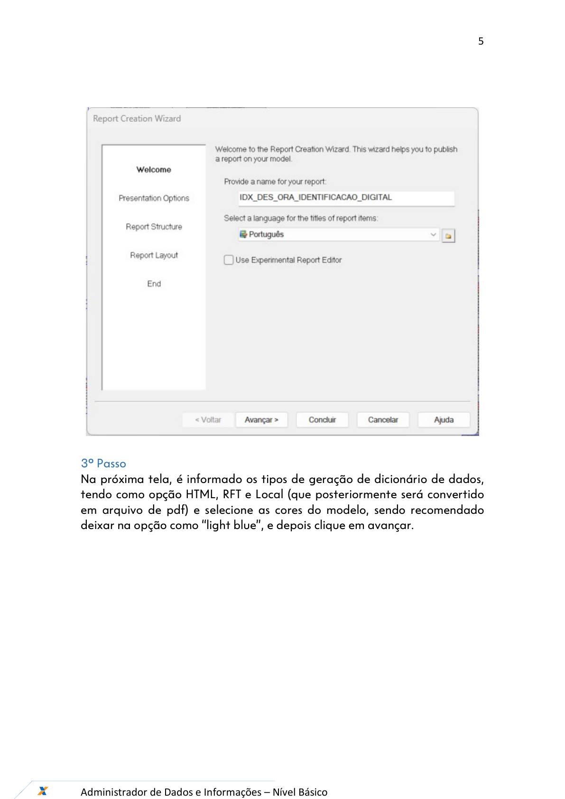
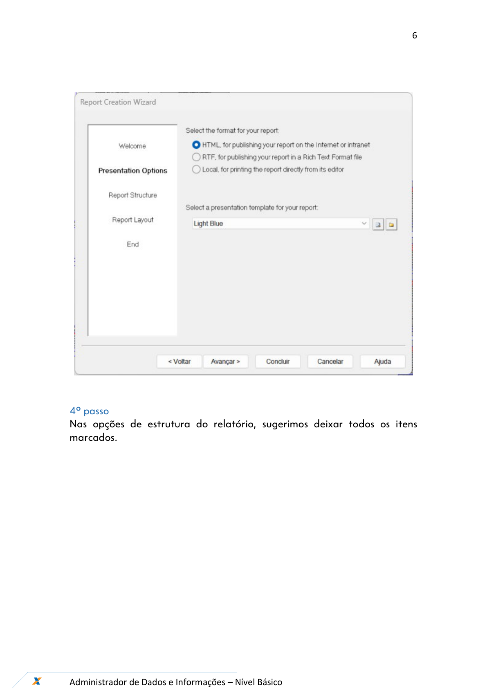
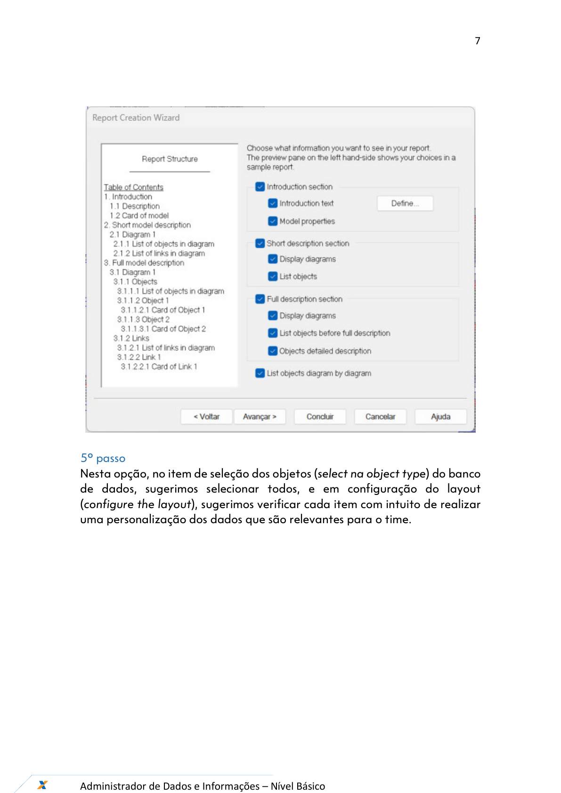
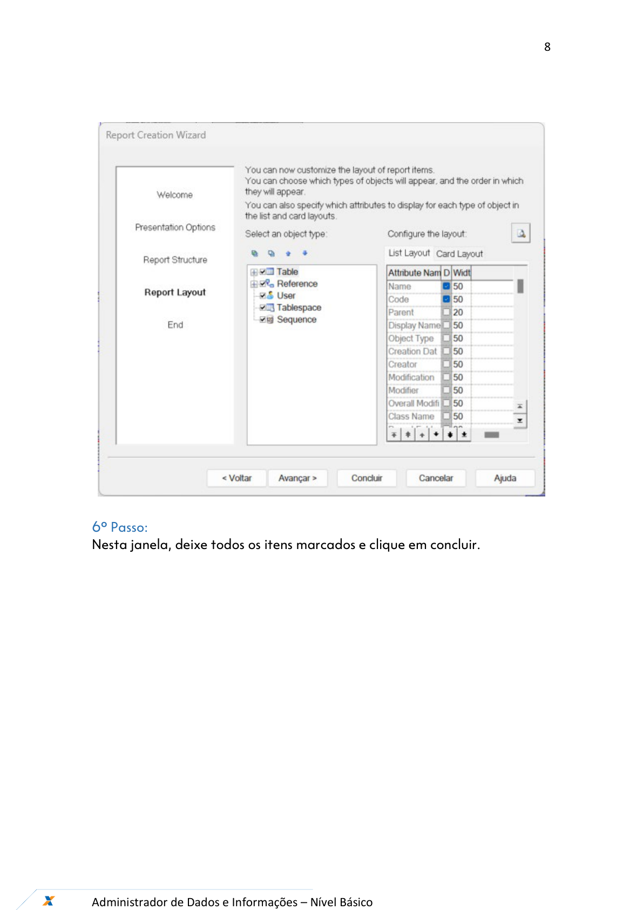
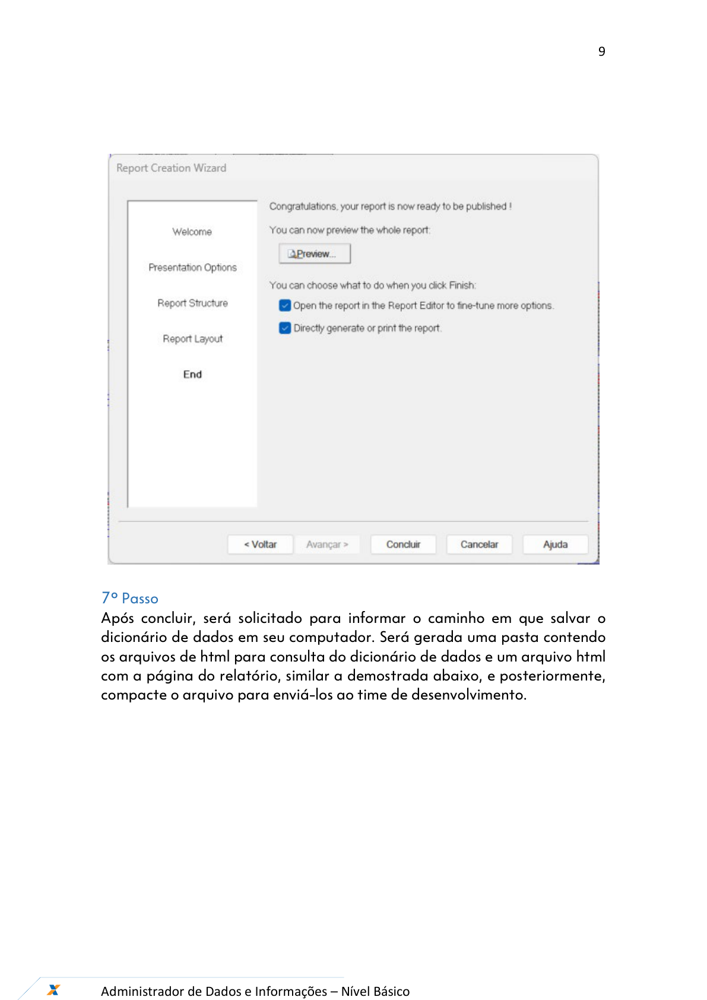
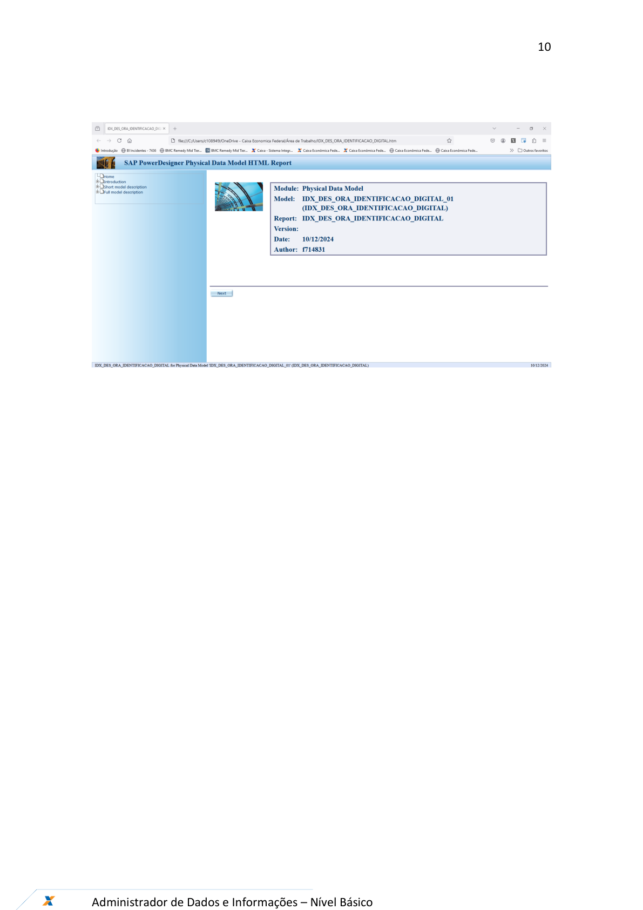
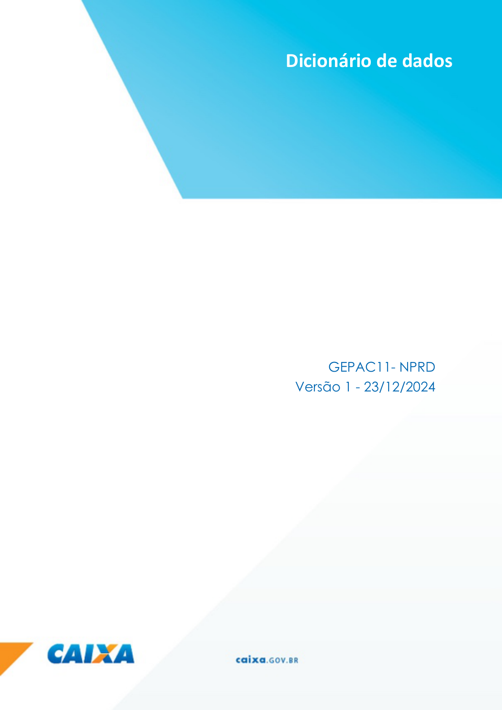

# Orientações_Iniciais_Dicionário_Dados_v1

**Arquivo de origem:** `Orientações_Iniciais_Dicionário_Dados_v1.pdf`

**Observação:** as imagens abaixo são renderizações das páginas do PDF, preservando fluxos, telas e elementos visuais que podem não aparecer integralmente no texto extraído.

## Página 1

### Texto extraído

Ferramentas – Power Designer
Dezembro/2024
Dicionário de Dados

## Página 2

### Texto extraído

2

Administrador de Dados e Informações – Nível Básico

SUMÁRIO

Sumário
1. Introdução ............................................................................................................... 3
O que é um Dicionário de Dados? ........................................................................ 3
Finalidade do Dicionário de Dados ...................................................................... 3
Como um Dicionário de Dados Pode Ajudar o Time de Desenvolvimento . 3
2. Procedimentos ....................................................................................................... 4
1º passo ...................................................................................................................... 4
2º passo ...................................................................................................................... 4
3º Passo ...................................................................................................................... 5
4º passo ...................................................................................................................... 6
5º passo ...................................................................................................................... 7
6º Passo: ..................................................................................................................... 8
7º Passo ...................................................................................................................... 9

## Página 3

### Texto extraído

3

Administrador de Dados e Informações – Nível Básico

1. Introdução
O que é um Dicionário de Dados?

Um dicionário de dados é um documento que contém informações
detalhadas sobre os dados utilizados em um sistema ou banco de dados. Ele
descreve cada elemento de dado, incluindo tabelas, colunas, tipos de dados,
restrições e os relacionamentos entre os dados.
Vale destacar que essas informações podem ser obtidas nas propriedades
dos objetos do modelo de dados. Além disso, o recurso de relatório pode ser
utilizado para gerar um documento consolidado que reúne todos os objetos
que compõem o modelo de dados.

Finalidade do Dicionário de Dados

A principal finalidade de um dicionário de dados é fornecer um
entendimento claro e comum sobre os dados para todas as partes
interessadas,
incluindo
desenvolvedores,
analistas
de
negócios,
administradores de banco de dados e demais usuários como Scrum Master e
Product Owner. Ele serve como uma referência centralizada que ajuda a
garantir que todos tenham uma visão consistente e precisa dos dados.

Como um Dicionário de Dados Pode Ajudar o Time de Desenvolvimento

- Clareza e Consistência: Imagine que você está desenvolvendo um
sistema de gerenciamento de clientes. O dicionário de dados descreve
que a tabela "Clientes" possui colunas como "NU_CLIENTE" (número
inteiro),
"NO_CLIENTE"
(texto),
"DT_NASCIMENTO"
(data)
e
"DE_EMAIL" (texto). Isso ajuda todos os desenvolvedores a
entenderem exatamente que tipo de dados são esperados para cada
coluna e evita confusões.
- Facilidade de Comunicação: Se um desenvolvedor precisar esclarecer
com um analista de negócios sobre como armazenar o número de

## Página 4

### Texto extraído

4

Administrador de Dados e Informações – Nível Básico

telefone dos clientes, ambos podem consultar o dicionário de dados
para ver que a coluna “NU_DDD” deve ser um texto com um máximo
de 2 caracteres e "NU_TELEFONE" deve ser um texto com um máximo
de 9 caracteres. Isso facilita a comunicação e reduz mal-entendidos.
- Melhoria na Qualidade do Código: Sabendo que a coluna "Email" deve
seguir um formato específico, os desenvolvedores podem implementar
validações no código para garantir que todos os endereços de email
inseridos no sistema sigam esse formato. Isso melhora a qualidade dos
dados e reduz erros.
- Facilita a Manutenção: Quando um novo desenvolvedor entra na
equipe, ele pode rapidamente consultar o dicionário de dados para
entender a estrutura do banco de dados e o propósito de cada tabela
e coluna. Isso acelera o processo de integração e minimiza o tempo
necessário para se familiarizar com o sistema.
- Auxilia na Documentação: O dicionário de dados pode ser usado como
parte da documentação do projeto. Quando os desenvolvedores
precisam escrever manuais para usuários finais ou documentos
técnicos, eles podem referenciar o dicionário de dados para obter
descrições precisas dos elementos de dados.
2. Procedimentos

Como realizar a operacionalização da geração de dicionário de dados na
ferramenta Power Designer em passo a passo:

1º passo
Com o modelo de dados aberto no Power Designer, selecione a opção
“report” e “report wizard”.

2º passo
Preencha o nome do “report” com o nome do modelo de dados, e selecione a
linguagem do dicionário de dados como português, e clique em avançar.

## Página 5

### Texto extraído

5

Administrador de Dados e Informações – Nível Básico

3º Passo
Na próxima tela, é informado os tipos de geração de dicionário de dados,
tendo como opção HTML, RFT e Local (que posteriormente será convertido
em arquivo de pdf) e selecione as cores do modelo, sendo recomendado
deixar na opção como “light blue”, e depois clique em avançar.

## Página 6

### Texto extraído

6

Administrador de Dados e Informações – Nível Básico

4º passo
Nas opções de estrutura do relatório, sugerimos deixar todos os itens
marcados.

## Página 7

### Texto extraído

7

Administrador de Dados e Informações – Nível Básico

5º passo
Nesta opção, no item de seleção dos objetos (select na object type) do banco
de dados, sugerimos selecionar todos, e em configuração do layout
(configure the layout), sugerimos verificar cada item com intuito de realizar
uma personalização dos dados que são relevantes para o time.

## Página 8

### Texto extraído

8

Administrador de Dados e Informações – Nível Básico

6º Passo:
Nesta janela, deixe todos os itens marcados e clique em concluir.

## Página 9

### Texto extraído

9

Administrador de Dados e Informações – Nível Básico

7º Passo
Após concluir, será solicitado para informar o caminho em que salvar o
dicionário de dados em seu computador. Será gerada uma pasta contendo
os arquivos de html para consulta do dicionário de dados e um arquivo html
com a página do relatório, similar a demostrada abaixo, e posteriormente,
compacte o arquivo para enviá-los ao time de desenvolvimento.

## Página 10

### Texto extraído

10

Administrador de Dados e Informações – Nível Básico

## Página 11

### Texto extraído

11

Administrador de Dados e Informações – Nível Básico

Dicionário de dados
GEPAC11- NPRD
Versão 1 - 23/12/2024
