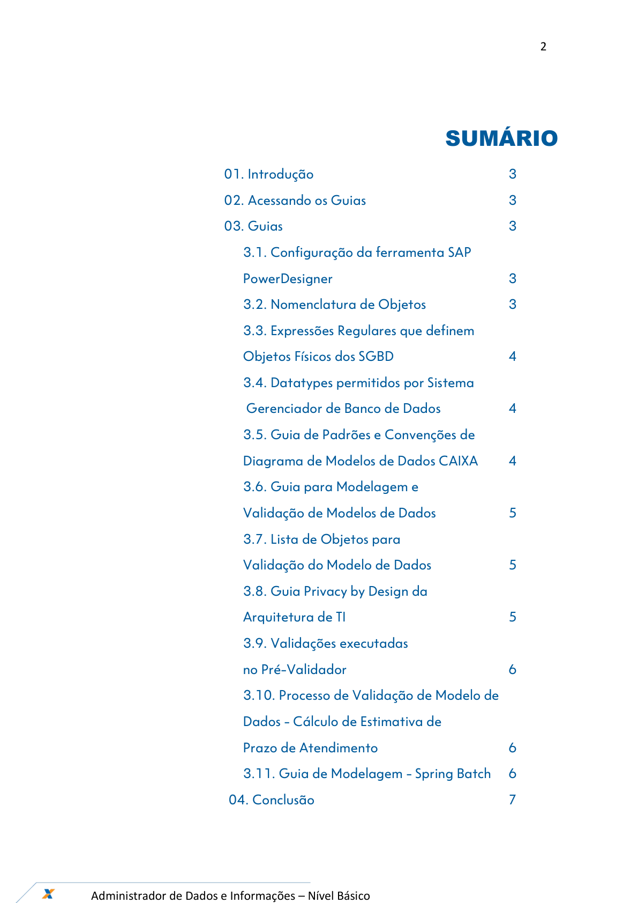
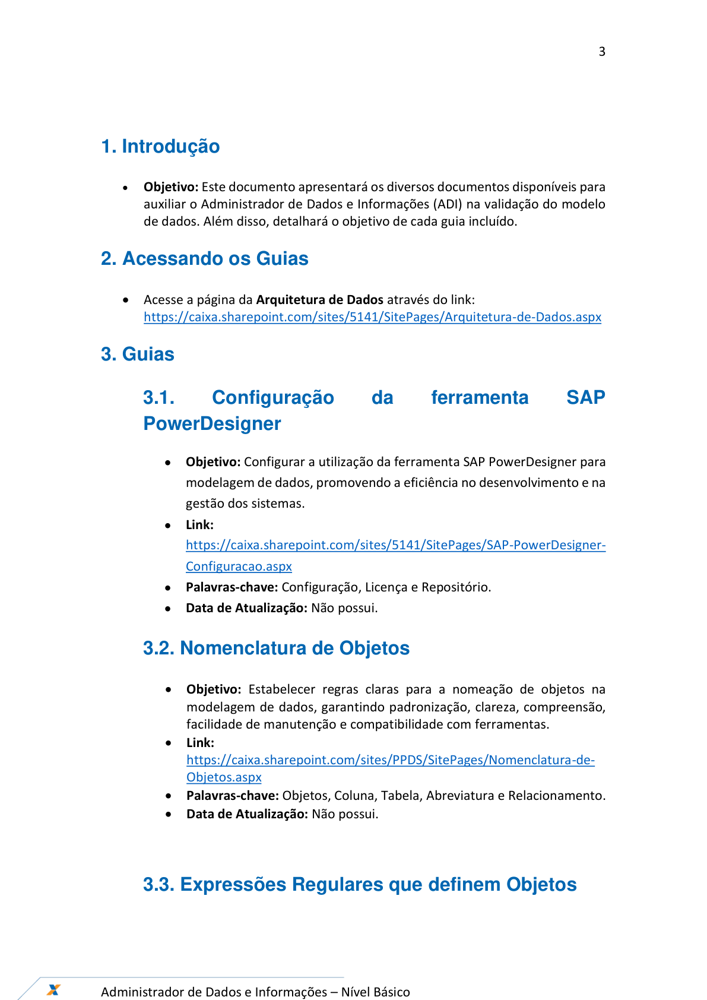
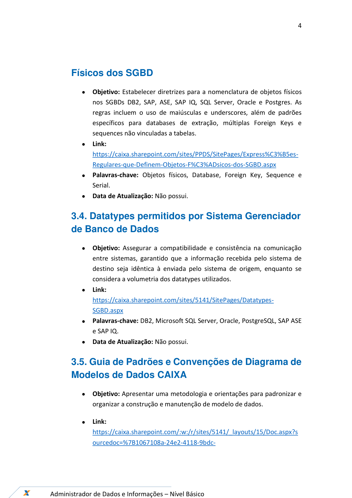
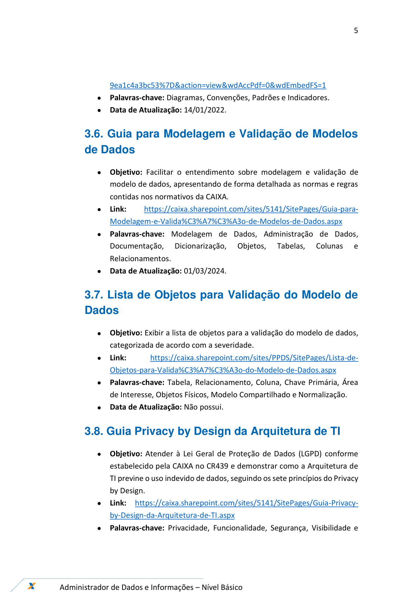
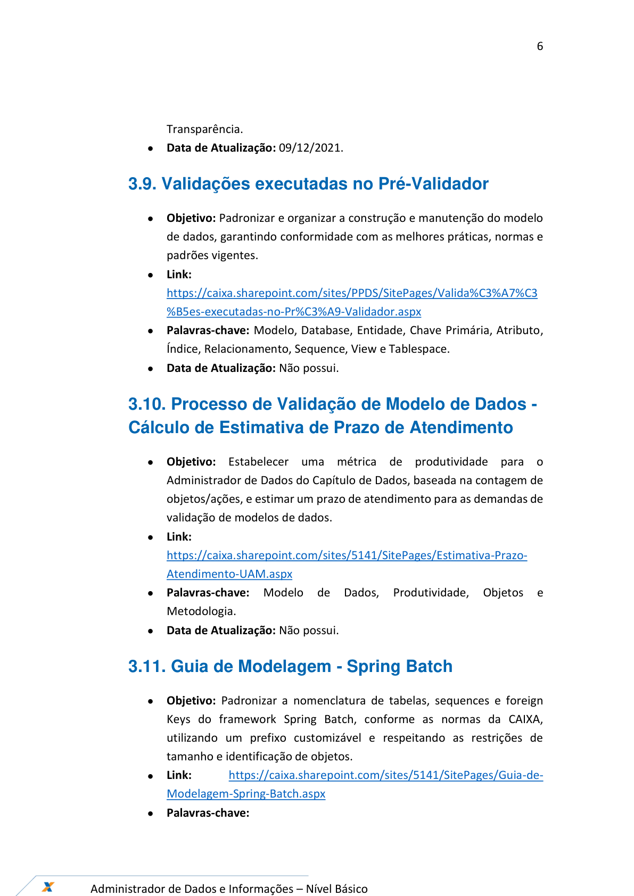
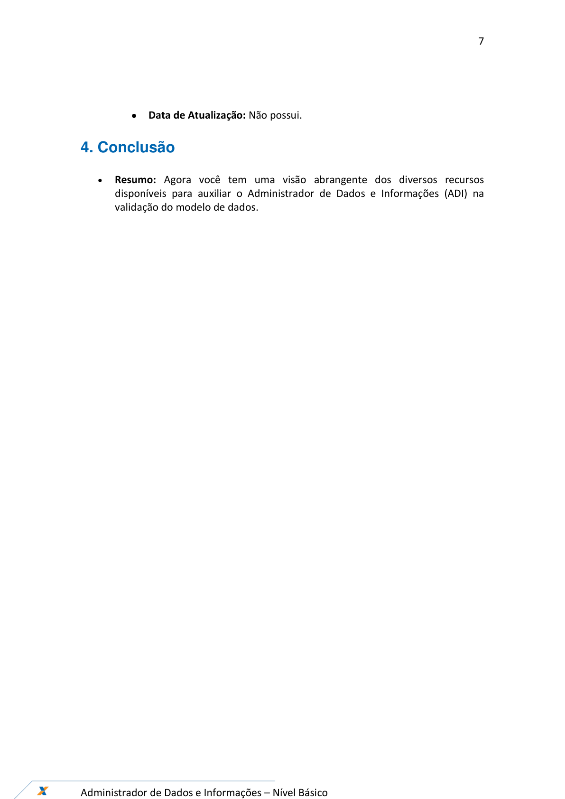

# Orientações_Iniciais_Documentação_AD_v1

**Arquivo de origem:** `Orientações_Iniciais_Documentação_AD_v1.pdf`

**Observação:** as imagens abaixo são renderizações das páginas do PDF, preservando fluxos, telas e elementos visuais que podem não aparecer integralmente no texto extraído.

## Página 1

### Texto extraído

Documentação ADI
Novembro/2024
Guias para Consulta

## Página 2

### Texto extraído

2

Administrador de Dados e Informações – Nível Básico

SUMÁRIO
                 01. Introdução

3
                 02. Acessando os Guias

3
                 03. Guias

3
3.1. Configuração da ferramenta SAP
PowerDesigner

3
3.2. Nomenclatura de Objetos

3
3.3. Expressões Regulares que definem
Objetos Físicos dos SGBD

4
3.4. Datatypes permitidos por Sistema
 Gerenciador de Banco de Dados

4
3.5. Guia de Padrões e Convenções de
Diagrama de Modelos de Dados CAIXA
4
3.6. Guia para Modelagem e
Validação de Modelos de Dados

5
3.7. Lista de Objetos para
Validação do Modelo de Dados

5
3.8. Guia Privacy by Design da
Arquitetura de TI

5
3.9. Validações executadas
no Pré-Validador

6
3.10. Processo de Validação de Modelo de
Dados - Cálculo de Estimativa de
Prazo de Atendimento

6
3.11. Guia de Modelagem - Spring Batch
6

       04. Conclusão

7

## Página 3

### Texto extraído

3

Administrador de Dados e Informações – Nível Básico

1. Introdução
- 
Objetivo: Este documento apresentará os diversos documentos disponíveis para
auxiliar o Administrador de Dados e Informações (ADI) na validação do modelo
de dados. Além disso, detalhará o objetivo de cada guia incluído.
2. Acessando os Guias
- Acesse a página da Arquitetura de Dados através do link:
https://caixa.sharepoint.com/sites/5141/SitePages/Arquitetura-de-Dados.aspx
3. Guias
3.1.
Configuração
da
ferramenta
SAP
PowerDesigner
- Objetivo: Configurar a utilização da ferramenta SAP PowerDesigner para
modelagem de dados, promovendo a eficiência no desenvolvimento e na
gestão dos sistemas.
- Link:
https://caixa.sharepoint.com/sites/5141/SitePages/SAP-PowerDesigner-
Configuracao.aspx
- Palavras-chave: Configuração, Licença e Repositório.
- Data de Atualização: Não possui.
3.2. Nomenclatura de Objetos
- Objetivo: Estabelecer regras claras para a nomeação de objetos na
modelagem de dados, garantindo padronização, clareza, compreensão,
facilidade de manutenção e compatibilidade com ferramentas.
- Link:
https://caixa.sharepoint.com/sites/PPDS/SitePages/Nomenclatura-de-
Objetos.aspx
- Palavras-chave: Objetos, Coluna, Tabela, Abreviatura e Relacionamento.
- Data de Atualização: Não possui.

3.3. Expressões Regulares que definem Objetos

## Página 4

### Texto extraído

4

Administrador de Dados e Informações – Nível Básico

Físicos dos SGBD
- Objetivo: Estabelecer diretrizes para a nomenclatura de objetos físicos
nos SGBDs DB2, SAP, ASE, SAP IQ, SQL Server, Oracle e Postgres. As
regras incluem o uso de maiúsculas e underscores, além de padrões
específicos para databases de extração, múltiplas Foreign Keys e
sequences não vinculadas a tabelas.
- Link:
https://caixa.sharepoint.com/sites/PPDS/SitePages/Express%C3%B5es-
Regulares-que-Definem-Objetos-F%C3%ADsicos-dos-SGBD.aspx
- Palavras-chave: Objetos físicos, Database, Foreign Key, Sequence e
Serial.
- Data de Atualização: Não possui.
3.4. Datatypes permitidos por Sistema Gerenciador
de Banco de Dados
- Objetivo: Assegurar a compatibilidade e consistência na comunicação
entre sistemas, garantido que a informação recebida pelo sistema de
destino seja idêntica à enviada pelo sistema de origem, enquanto se
considera a volumetria dos datatypes utilizados.
- Link:
https://caixa.sharepoint.com/sites/5141/SitePages/Datatypes-
SGBD.aspx
- Palavras-chave: DB2, Microsoft SQL Server, Oracle, PostgreSQL, SAP ASE
e SAP IQ.
- Data de Atualização: Não possui.
3.5. Guia de Padrões e Convenções de Diagrama de
Modelos de Dados CAIXA
- Objetivo: Apresentar uma metodologia e orientações para padronizar e
organizar a construção e manutenção de modelo de dados.
- Link:
https://caixa.sharepoint.com/:w:/r/sites/5141/_layouts/15/Doc.aspx?s
ourcedoc=%7B1067108a-24e2-4118-9bdc-

## Página 5

### Texto extraído

5

Administrador de Dados e Informações – Nível Básico

9ea1c4a3bc53%7D&action=view&wdAccPdf=0&wdEmbedFS=1
- Palavras-chave: Diagramas, Convenções, Padrões e Indicadores.
- Data de Atualização: 14/01/2022.
3.6. Guia para Modelagem e Validação de Modelos
de Dados
- Objetivo: Facilitar o entendimento sobre modelagem e validação de
modelo de dados, apresentando de forma detalhada as normas e regras
contidas nos normativos da CAIXA.
- Link:
https://caixa.sharepoint.com/sites/5141/SitePages/Guia-para-
Modelagem-e-Valida%C3%A7%C3%A3o-de-Modelos-de-Dados.aspx
- Palavras-chave: Modelagem de Dados, Administração de Dados,
Documentação,
Dicionarização,
Objetos,
Tabelas,
Colunas
e
Relacionamentos.
- Data de Atualização: 01/03/2024.
3.7. Lista de Objetos para Validação do Modelo de
Dados
- Objetivo: Exibir a lista de objetos para a validação do modelo de dados,
categorizada de acordo com a severidade.
- Link:
https://caixa.sharepoint.com/sites/PPDS/SitePages/Lista-de-
Objetos-para-Valida%C3%A7%C3%A3o-do-Modelo-de-Dados.aspx
- Palavras-chave: Tabela, Relacionamento, Coluna, Chave Primária, Área
de Interesse, Objetos Físicos, Modelo Compartilhado e Normalização.
- Data de Atualização: Não possui.
3.8. Guia Privacy by Design da Arquitetura de TI
- Objetivo: Atender à Lei Geral de Proteção de Dados (LGPD) conforme
estabelecido pela CAIXA no CR439 e demonstrar como a Arquitetura de
TI previne o uso indevido de dados, seguindo os sete princípios do Privacy
by Design.
- Link: https://caixa.sharepoint.com/sites/5141/SitePages/Guia-Privacy-
by-Design-da-Arquitetura-de-TI.aspx
- Palavras-chave: Privacidade, Funcionalidade, Segurança, Visibilidade e

## Página 6

### Texto extraído

6

Administrador de Dados e Informações – Nível Básico

Transparência.
- Data de Atualização: 09/12/2021.
3.9. Validações executadas no Pré-Validador
- Objetivo: Padronizar e organizar a construção e manutenção do modelo
de dados, garantindo conformidade com as melhores práticas, normas e
padrões vigentes.
- Link:
https://caixa.sharepoint.com/sites/PPDS/SitePages/Valida%C3%A7%C3
%B5es-executadas-no-Pr%C3%A9-Validador.aspx
- Palavras-chave: Modelo, Database, Entidade, Chave Primária, Atributo,
Índice, Relacionamento, Sequence, View e Tablespace.
- Data de Atualização: Não possui.
3.10. Processo de Validação de Modelo de Dados -
Cálculo de Estimativa de Prazo de Atendimento
- Objetivo: Estabelecer uma métrica de produtividade para o
Administrador de Dados do Capítulo de Dados, baseada na contagem de
objetos/ações, e estimar um prazo de atendimento para as demandas de
validação de modelos de dados.
- Link:
https://caixa.sharepoint.com/sites/5141/SitePages/Estimativa-Prazo-
Atendimento-UAM.aspx
- Palavras-chave:
Modelo
de
Dados,
Produtividade,
Objetos
e
Metodologia.
- Data de Atualização: Não possui.
3.11. Guia de Modelagem - Spring Batch
- Objetivo: Padronizar a nomenclatura de tabelas, sequences e foreign
Keys do framework Spring Batch, conforme as normas da CAIXA,
utilizando um prefixo customizável e respeitando as restrições de
tamanho e identificação de objetos.
- Link:
https://caixa.sharepoint.com/sites/5141/SitePages/Guia-de-
Modelagem-Spring-Batch.aspx
- Palavras-chave:

## Página 7

### Texto extraído

7

Administrador de Dados e Informações – Nível Básico

- Data de Atualização: Não possui.
4. Conclusão
- 
Resumo: Agora você tem uma visão abrangente dos diversos recursos
disponíveis para auxiliar o Administrador de Dados e Informações (ADI) na
validação do modelo de dados.

## Página 8

### Texto extraído

8

Administrador de Dados e Informações – Nível Básico

Guias para Consulta
GEPAC11- NPRD
Versão 1 - 13/11/2024
Fernando de Souza Aires
