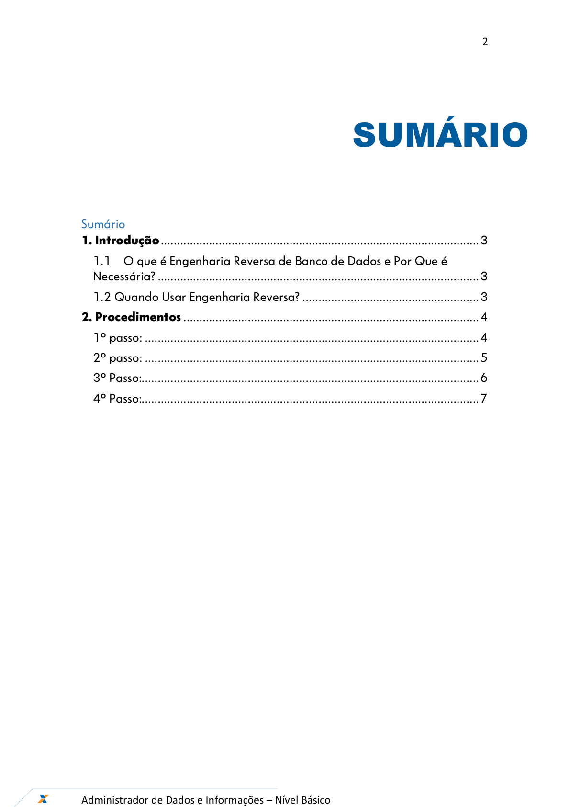
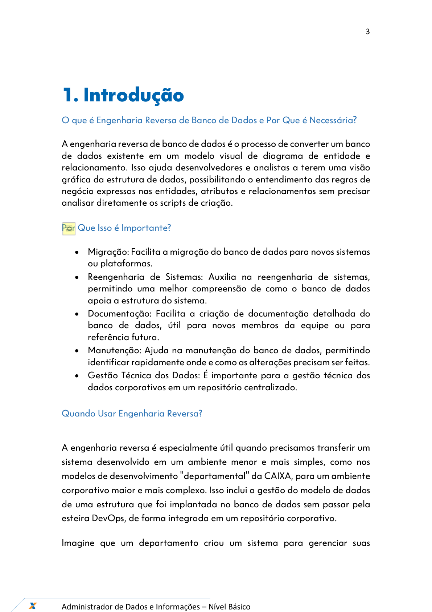
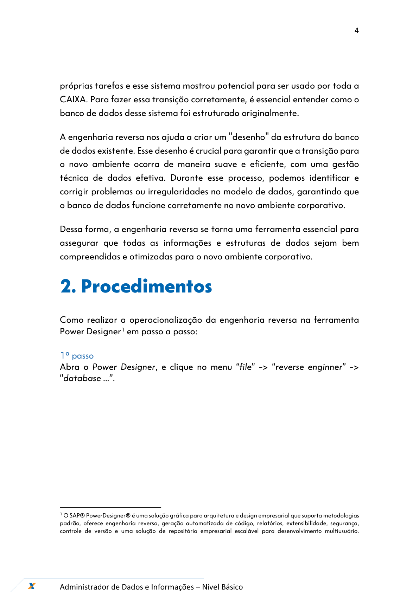
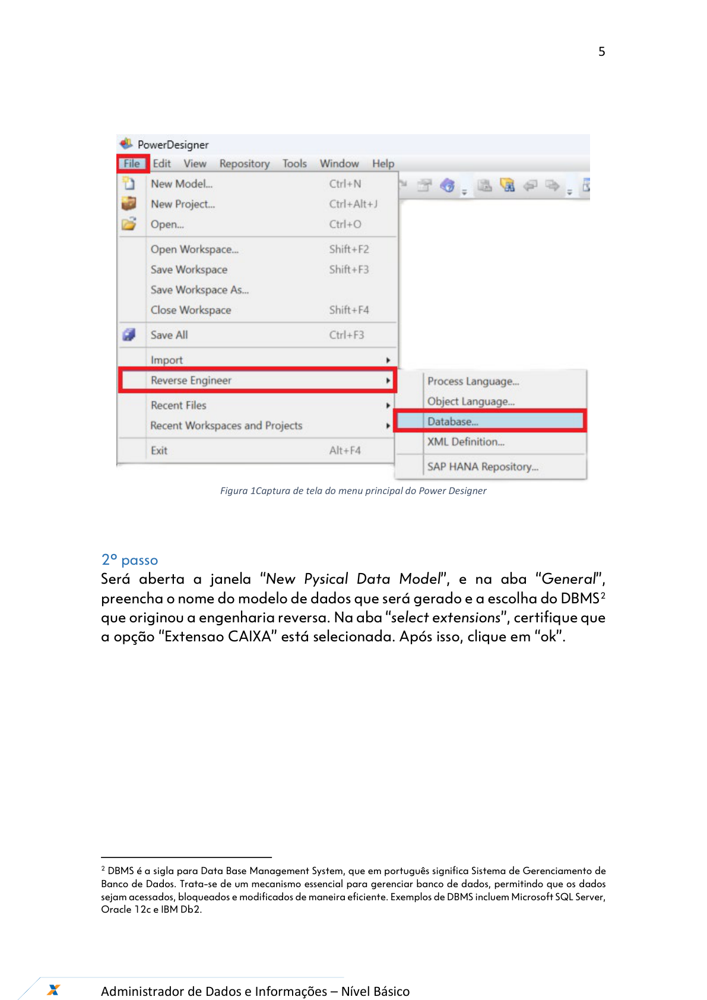
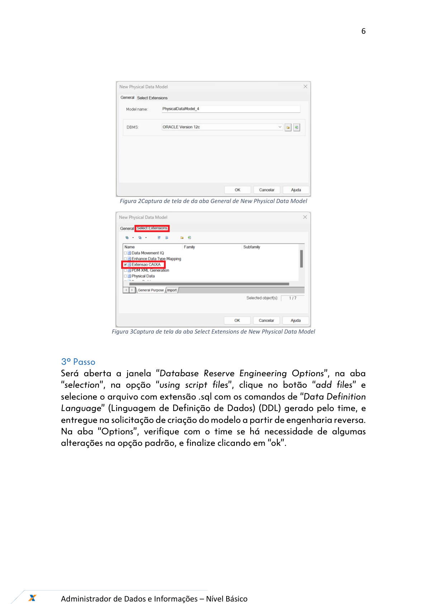
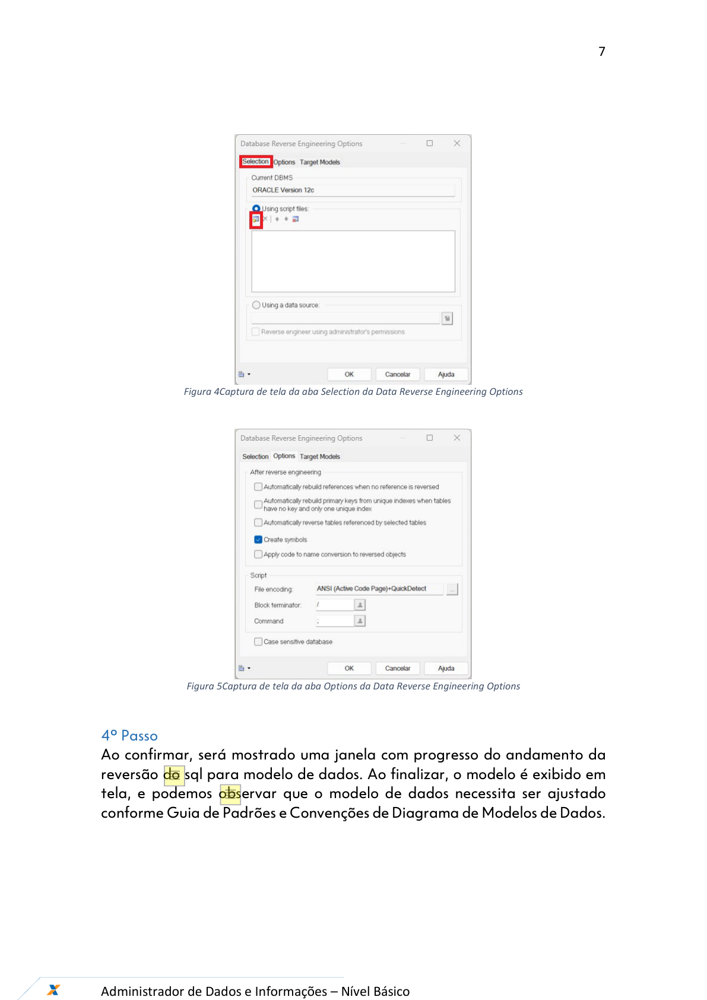

# Orientações_Iniciais_Engenharia_Reversa_v1

**Arquivo de origem:** `Orientações_Iniciais_Engenharia_Reversa_v1.pdf`

**Observação:** as imagens abaixo são renderizações das páginas do PDF, preservando fluxos, telas e elementos visuais que podem não aparecer integralmente no texto extraído.

## Página 1

### Texto extraído

Ferramentas – Power Designer
Dezembro/2024
Engenharia Reversa

## Página 2

### Texto extraído

2

Administrador de Dados e Informações – Nível Básico

SUMÁRIO

Sumário
1. Introdução ................................................................................................... 3
1.1
O que é Engenharia Reversa de Banco de Dados e Por Que é
Necessária? .................................................................................................... 3
1.2 Quando Usar Engenharia Reversa? ....................................................... 3
2. Procedimentos ............................................................................................ 4
1º passo: ........................................................................................................ 4
2º passo: ........................................................................................................ 5
3º Passo:......................................................................................................... 6
4º Passo:......................................................................................................... 7

## Página 3

### Texto extraído

3

Administrador de Dados e Informações – Nível Básico

1. Introdução
O que é Engenharia Reversa de Banco de Dados e Por Que é Necessária?

A engenharia reversa de banco de dados é o processo de converter um banco
de dados existente em um modelo visual de diagrama de entidade e
relacionamento. Isso ajuda desenvolvedores e analistas a terem uma visão
gráfica da estrutura de dados, possibilitando o entendimento das regras de
negócio expressas nas entidades, atributos e relacionamentos sem precisar
analisar diretamente os scripts de criação.

Por Que Isso é Importante?

- Migração: Facilita a migração do banco de dados para novos sistemas
ou plataformas.
- Reengenharia de Sistemas: Auxilia na reengenharia de sistemas,
permitindo uma melhor compreensão de como o banco de dados
apoia a estrutura do sistema.
- Documentação: Facilita a criação de documentação detalhada do
banco de dados, útil para novos membros da equipe ou para
referência futura.
- Manutenção: Ajuda na manutenção do banco de dados, permitindo
identificar rapidamente onde e como as alterações precisam ser feitas.
- Gestão Técnica dos Dados: É importante para a gestão técnica dos
dados corporativos em um repositório centralizado.

Quando Usar Engenharia Reversa?

A engenharia reversa é especialmente útil quando precisamos transferir um
sistema desenvolvido em um ambiente menor e mais simples, como nos
modelos de desenvolvimento "departamental" da CAIXA, para um ambiente
corporativo maior e mais complexo. Isso inclui a gestão do modelo de dados
de uma estrutura que foi implantada no banco de dados sem passar pela
esteira DevOps, de forma integrada em um repositório corporativo.
Imagine que um departamento criou um sistema para gerenciar suas

## Página 4

### Texto extraído

4

Administrador de Dados e Informações – Nível Básico

próprias tarefas e esse sistema mostrou potencial para ser usado por toda a
CAIXA. Para fazer essa transição corretamente, é essencial entender como o
banco de dados desse sistema foi estruturado originalmente.
A engenharia reversa nos ajuda a criar um "desenho" da estrutura do banco
de dados existente. Esse desenho é crucial para garantir que a transição para
  - novo ambiente ocorra de maneira suave e eficiente, com uma gestão
técnica de dados efetiva. Durante esse processo, podemos identificar e
corrigir problemas ou irregularidades no modelo de dados, garantindo que
  - banco de dados funcione corretamente no novo ambiente corporativo.
Dessa forma, a engenharia reversa se torna uma ferramenta essencial para
assegurar que todas as informações e estruturas de dados sejam bem
compreendidas e otimizadas para o novo ambiente corporativo.
2. Procedimentos

Como realizar a operacionalização da engenharia reversa na ferramenta
Power Designer1 em passo a passo:

1º passo
Abra o Power Designer, e clique no menu “file” -> “reverse enginner” ->
“database ...”.

1 O SAP® PowerDesigner® é uma solução gráfica para arquitetura e design empresarial que suporta metodologias
padrão, oferece engenharia reversa, geração automatizada de código, relatórios, extensibilidade, segurança,
controle de versão e uma solução de repositório empresarial escalável para desenvolvimento multiusuário.

## Página 5

### Texto extraído

5

Administrador de Dados e Informações – Nível Básico

Figura 1Captura de tela do menu principal do Power Designer

2º passo
Será aberta a janela “New Pysical Data Model”, e na aba “General”,
preencha o nome do modelo de dados que será gerado e a escolha do DBMS2
que originou a engenharia reversa. Na aba “select extensions”, certifique que
a opção “Extensao CAIXA” está selecionada. Após isso, clique em “ok”.

2 DBMS é a sigla para Data Base Management System, que em português significa Sistema de Gerenciamento de
Banco de Dados. Trata-se de um mecanismo essencial para gerenciar banco de dados, permitindo que os dados
sejam acessados, bloqueados e modificados de maneira eficiente. Exemplos de DBMS incluem Microsoft SQL Server,
Oracle 12c e IBM Db2.

## Página 6

### Texto extraído

6

Administrador de Dados e Informações – Nível Básico

Figura 2Captura de tela de da aba General de New Physical Data Model

Figura 3Captura de tela da aba Select Extensions de New Physical Data Model

3º Passo
Será aberta a janela “Database Reserve Engineering Options”, na aba
“selection”, na opção “using script files”, clique no botão “add files” e
selecione o arquivo com extensão .sql com os comandos de “Data Definition
Language” (Linguagem de Definição de Dados) (DDL) gerado pelo time, e
entregue na solicitação de criação do modelo a partir de engenharia reversa.
Na aba “Options”, verifique com o time se há necessidade de algumas
alterações na opção padrão, e finalize clicando em “ok”.

## Página 7

### Texto extraído

7

Administrador de Dados e Informações – Nível Básico

Figura 4Captura de tela da aba Selection da Data Reverse Engineering Options

Figura 5Captura de tela da aba Options da Data Reverse Engineering Options

4º Passo
Ao confirmar, será mostrado uma janela com progresso do andamento da
reversão do sql para modelo de dados. Ao finalizar, o modelo é exibido em
tela, e podemos observar que o modelo de dados necessita ser ajustado
conforme Guia de Padrões e Convenções de Diagrama de Modelos de Dados.

## Página 8

### Texto extraído

8

Administrador de Dados e Informações – Nível Básico

Engenharia reversa
GEPAC11- NPRD
Versão 1 - 23/12/2024
