# CR 439 009 - Atendimento aos Direitos do Titular - LGPD

**Classificação:** #INTERNO.TODOS  
**Vigência do documento principal:** 11/07/2025  
**Arquivo de origem:** `CR 439.pdf`  
**Conversão:** PDF principal convertido para Markdown e anexos PDF embutidos extraídos e incluídos abaixo.  

> Observação: além do texto extraído, as páginas dos anexos foram renderizadas como imagens em `assets/anexos/` para preservar fluxos, telas e elementos visuais que não aparecem integralmente na extração textual.

## Anexos embutidos extraídos

- ANEXO I - GUIA RÁPIDO — `ANEXO_I_-_GUIA_R_PIDO.pdf` (4 página(s))
- ANEXO II - TABELA DE DADOS PESSOAIS TRATADOS PELA CAIXA — `ANEXO_II_-_TABELA_DE_DADOS_PESSOAIS_TRATADOS_PELA_CAIXA.pdf` (3 página(s))
- ANEXO III - NOVO MODELO ATENDIMENTO LGPD CANAIS — `ANEXO_III_-_NOVO_MODELO_ATENDIMENTO_LGPD_CANAIS.pdf` (1 página(s))
- ANEXO IV - MANUAL ATENDIMENTO SIGPD - AGENCIA PA — `ANEXO_IV_-_MANUAL_ATENDIMENTO_SIGPD_-_AGENCIA_PA.pdf` (11 página(s))
- ANEXO V - MANUAL ATENDIMENTO SIGPD - SAC — `ANEXO_V_-_MANUAL_ATENDIMENTO_SIGPD_-_SAC.pdf` (8 página(s))
- ANEXO VI - MANUAL ATENDIMENTO SIGPD - CENTRALIZADORAS DE ATENDIMENTO (EMPREGADO CAIXA) — `ANEXO_VI_-_MANUAL_ATENDIMENTO_SIGPD_-_CENTRALIZADORAS_DE_ATENDIMENTO_EMPREGADO_CAIXA_.pdf` (12 página(s))

---

# Documento principal

<!-- Página 1 -->

ATENDIMENTO AOS DIREITOS DO TITULAR - LEI GERAL DE PROTEÇÃO A DADOS PESSOAIS (LGPD)

## SUMÁRIO DA NORMA

- 1 FINALIDADE — p. 5
- 2 DEFINIÇÕES — p. 5
- 3 REGRAS — p. 5
- 3.1 DADOS PESSOAIS: CONTEXTO E LEGISLAÇÃO — p. 5
- 3.2 AS HIPÓTESES DE TRATAMENTO DE DADOS PESSOAIS PREVISTAS NA LEI — p. 5
- 3.3 OS DIREITOS DOS TITULARES DE DADOS PESSOAIS — p. 6
- 3.4 POLÍTICA DE RESPONSABILIDADE SOCIAL, AMBIENTAL E CLIMÁTICA — p. 6
- 4 PROCEDIMENTOS — p. 6
- 4.2 DECLARAÇÃO SIMPLIFICADA — p. 6
- 4.2.2 AGÊNCIA/PA — p. 6
- 4.2.3 SAC — p. 7
- 4.2.4 GERIT — p. 7
- 4.3 CORREÇÃO — p. 7
- 4.3.2 AGÊNCIA/PA — p. 7
- 4.3.3 SAC — p. 7
- 4.4 ELIMINAÇÃO — p. 8
- 4.4.2 AGÊNCIA/PA — p. 8
- 4.4.3 SAC — p. 8
- 4.4.4 GERIT — p. 8
- 4.4.5 UR — p. 9
- 4.5 PORTABILIDADE — p. 9
- 4.5.2 AGÊNCIA/PA — p. 9
- 4.5.3 SAC — p. 9
- 4.5.4 GERIT — p. 9
- 4.5.5 UR — p. 9
- 4.6 CONSENTIMENTO E REVOGAÇÃO DO CONSENTIMENTO — p. 9
- 4.6.6 AGÊNCIA/PA — p. 10
- 4.6.7 SAC — p. 10
- 4.6.8 GERIT — p. 10
- 4.6.9 UR — p. 10
- 4.7 DECLARAÇÃO COMPLETA — p. 10
- 4.7.2 AGÊNCIA/PA — p. 10
- 4.7.3 SAC — p. 11
- 4.7.4 GERIT — p. 11
- 4.8 BLOQUEIO — p. 11
- 4.8.2 AGÊNCIA/PA — p. 11
- 4.8.3 SAC — p. 12
- 4.8.4 GERIT — p. 12
- 4.8.5 UR — p. 12
- 4.9 ANONIMIZAÇÃO — p. 12
- 4.9.2 AGÊNCIA/PA — p. 12
- 4.9.3 SAC — p. 12
- 4.9.4 GERIT — p. 13
- 4.9.5 UR — p. 13
- 4.10 REVISÃO DE DECISÕES AUTOMATIZADAS — p. 13
- 4.10.2 AGÊNCIA/PA — p. 13
- 4.10.3 SAC — p. 13
- 4.10.4 GERIT — p. 14

---

<!-- Página 2 -->

- 4.10.5 UR — p. 14
- 4.11 RECLAMAÇÃO — p. 14
- 4.11.2 SAC — p. 14
- 4.11.3 OUVIDORIA — p. 14
- 4.12 CANAL DE ATENDIMENTO DO ENCARREGADO PELO TRATAMENTO DE DADOS PESSOAIS — p. 15
- 5 ANEXOS — p. 15

---

<!-- Página 3 -->

## PREFÁCIO

## TÍTULO
ATENDIMENTO AOS DIREITOS DO TITULAR - LEI GERAL DE PROTEÇÃO A DADOS PESSOAIS (LGPD)

## UNIDADE RESPONSÁVEL
GERIT – GN SEG INF, RISCO CIBERNETICO TEC INF

## PÚBLICO ALVO
Toda as unidades da CAIXA

## ALTERAÇÕES EM RELAÇÃO À VERSÃO ANTERIOR
### Inclusão
Item 5.6, que faz referência ao ANEXO VI - MANUAL ATENDIMENTO SIGPD – CENTRALIZADORAS DE
ATENDIMENTO (EMPREGADO CAIXA)
ANEXO VI - MANUAL ATENDIMENTO SIGPD – CENTRALIZADORAS DE ATENDIMENTO (EMPREGADO CAIXA)

### Alterações
Item 4.1, atualização dos nomes dos anexos com a inclusão da referência ao ANEXO VI.
Item 4.1.1, atualização do MN ES009 que trata da estratégia de gestão do relacionamento com clientes.
Item 5, alteração no nome dos anexos.
ANEXO I - GUIA RÁPIDO: revisão geral.
ANEXO II - TABELA DE DADOS PESSOAIS TRATADOS PELA CAIXA: revisão geral.
ANEXO III - NOVO MODELO ATENDIMENTO LGPD CANAIS: revisão geral.
ANEXO IV - MANUAL ATENDIMENTO SIGPD – AGENCIA PA: revisão geral.
ANEXO V - MANUAL ATENDIMENTO SIGPD – SAC: revisão geral.

## RELAÇÃO COM OUTROS NORMATIVOS
AD055 GESTÃO DOCUMENTAL - ELIMINAÇÃO DE DOCUMENTOS
AD164 SEGURANÇA - SICOD - AUXÍLIO NA CONFERÊNCIA DOCUMENTAL NA IDENTIFICAÇÃO DE CLIENTES
AE045 SERVIÇO DE ATENDIMENTO AO CONSUMIDOR - SAC
AE087 OUVIDORIA - RECLAMAÇÕES E FLUXOS DAS PROPOSIÇÕES
AE118 OUVIDORIA - ATENDIMENTO AO PROCON E ÓRGÃOS DE DEFESA DO CONSUMIDOR
CR400 INSTRUMENTOS E FERRAMENTAS PARA ATUAÇÃO DE LINHAS DEFESA
CR541 PROGRAMA DE GOVERNANÇA EM PRIVACIDADE
ES009 ESTRATÉGIA DE GESTÃO DO RELACIONAMENTO COM CLIENTES GRC
OP526 PROCEDIMENTOS OPERACIONAIS - GERIT
OR069 ATENDIMENTO REMOTO
OR137 Implementação da Política de Responsabilidade Social, Ambiental e Climática
PO001 Política Institucional CAIXA
TE105 PROCEDIMENTOS OPERACIONAIS DO SISTEMA DE CADASTRO DE CLIENTES CAIXA - SICLI

## PRODUTOS RELACIONADOS
Não se aplica

## PROCESSOS RELACIONADOS

---

<!-- Página 4 -->

PR.02338 - 3.4.2.14 Atender as solicitações de direitos dos titulares de dados pessoais (LGPD)

## REGULAMENTAÇÃO UTILIZADA
Lei 13.709, de 14 de agosto de 2018 - Lei Geral de Proteção de Dados Pessoais (LGPD)
Lei nº 13.853, de 8 de julho de 2019
Lei nº 14.010, de 10 de junho de 2020

## DOCUMENTAÇÃO UTILIZADA
Não se aplica

## ROTEIRO PADRÃO
Não se aplica

## NORMATIVOS REVOGADOS
Não se aplica

## ATENDIMENTO DE DÚVIDAS
GERIT – GN SEG INF, RISCO CIBERNETICO TEC INF

---

<!-- Página 5 -->

ATENDIMENTO AOS DIREITOS DO TITULAR - LEI GERAL DE PROTEÇÃO A DADOS PESSOAIS (LGPD)

## 1 FINALIDADE
**1.1** Padronizar os procedimentos para atendimento aos direitos do titular de dados pessoais previstos na Lei geral de
Proteção de Dados Pessoais – LGPD e em consonância com o [MN, CR541] e a [MN, OP526].

## 2 DEFINIÇÕES
**2.1** Disponível em http://dados.caixa/portal/glossario?norma=CR439.

## 3 REGRAS

### 3.1 DADOS PESSOAIS: CONTEXTO E LEGISLAÇÃO
**3.1.1** O uso de dados pessoais é necessário e indissociável da realização das atividades e na tomada de decisões
das Unidades da CAIXA.
**3.1.1.1** Dados são tratados, de forma cíclica e constante, com a finalidade de identificar indivíduos, aprimorar
produtos e serviços e moldando a forma como a CAIXA se relaciona com seus clientes e com os demais agentes de
tratamento.
**3.1.2** A LGPD constitui o primeiro marco regulatório abrangente sobre a proteção de dados pessoais no Brasil, e
estabelece como fundamentos:
- O respeito à privacidade e à inviolabilidade da intimidade,
- A liberdade de expressão, de informação, de comunicação e de opinião,
- O desenvolvimento econômico e tecnológico,
- A inovação,
- A livre concorrência e a livre iniciativa.
**3.1.3** A lei confere ao titular controle sobre os seus dados pessoais e atribui responsabilidades e obrigações a serem
observadas pelos agentes de tratamento de dados pessoais.
**3.1.4** Em linhas gerais, os requisitos da Lei mais relevantes para a CAIXA, enquanto Agente de Tratamento, são:
- Finalidade - Realização do tratamento para propósitos legítimos, específicos, explícitos e informados ao titular.
- Enquadramento Legal - Todo tratamento realizado sobre dados pessoais deve se enquadrar em pelo menos uma
das hipóteses legais, descritas no item [MN, 3.2].
- Necessidade - Limitação do tratamento de dados pessoais ao mínimo necessário para a realização de suas
finalidades.
- Transparência - Garantia, aos titulares, de informações claras, precisas e facilmente acessíveis sobre a realização
do tratamento.
- Direitos do titular - Disponibilização gratuita e facilitada de atendimento a solicitações, realizadas pelo titular de
dados, de acesso, correção, anonimização, bloqueio, eliminação, portabilidade, revogação do consentimento,
revisão das decisões automatizadas, dentre outros.
- Segurança e Sigilo dos dados - Proteção contra destruição, perda, alteração, comunicação ou qualquer forma de
tratamento inadequado ou ilícito.
- Sanções - Aplicação de advertência, multa de até R$50MM por infração, publicização, bloqueio ou eliminação dos
dados.

### 3.2 AS HIPÓTESES DE TRATAMENTO DE DADOS PESSOAIS PREVISTAS NA LEI
**3.2.1** O tratamento de dados pessoais é realizado quando respaldado em pelo menos uma das hipóteses de
tratamento relacionadas na Lei, dentre elas as principais para a CAIXA são:
- Consentimento do titular;
- Cumprimento de obrigação legal ou regulatória do controlador;
- Execução de contrato ou procedimentos preliminares relacionados à contratação;
- Atendimento aos interesses legítimos do controlador ou de terceiros, exceto nos casos previstos na LGPD;

---

<!-- Página 6 -->

- Proteção do crédito;
- Execução de políticas públicas.

### 3.3 OS DIREITOS DOS TITULARES DE DADOS PESSOAIS
**3.3.1** São direitos dos titulares de dados previstos na LGPD:
- Confirmação de forma, duração e finalidade de tratamento de dados - atendido pela CAIXA por meio do fornecimento
Declaração Completa de Dados Pessoais.
- Acesso facilitado aos seus dados - atendido pela CAIXA por meio do fornecimento da Declaração Simplificada de
Dados Pessoais (Declaração Simplificada).
- Correção de seus dados - atendido pela CAIXA com a informação dos canais disponíveis para alteração cadastral.
- Anonimização e bloqueio de dados desnecessários ou tratados em desconformidade - atendido pela CAIXA por
meio de registro de solicitação.
- Eliminação de dados desnecessários ou tratados em desconformidade - atendido pela CAIXA com a informação do
procedimento de eliminação da CAIXA.
- Portabilidade dos seus dados a outro fornecedor - atendido pela CAIXA com a informação da possibilidade de
utilização da Declaração Simplificada pelo cliente de dados para esse fim.
- Possibilidade de não fornecer consentimento e informações sobre as consequências da negativa de consentimento
- atendido pela CAIXA com a informação dos canais que serão disponibilizados para esse fim.
- Revogação de consentimento - atendido pela CAIXA com a informação dos canais que serão disponibilizados para
esse fim.
- Ciência do uso compartilhado de dados e finalidade - atendido pela CAIXA por meio do Declaração Completa de
Dados Pessoais.
- Revisão de decisões automatizadas - atendido pela CAIXA com o registro de solicitação de Revisão de Decisão
Automatizada ou Revisão de Avaliação de Crédito ou Revisão de outra avaliação automatizada.
- Reclamação, que pode ser registrada pelo titular no SAC CAIXA, na Ouvidoria ou através do formulário Fale
Conosco disponibilizado na página de Privacidade no site da CAIXA.
**3.3.2** No atendimento aos direitos dos titulares, o empregado CAIXA deve atentar-se para não vazar dados dos
titulares.
**3.3.3** Quando o titular demonstrar insatisfação com relação às informações prestadas e respostas enviadas em
atendimento aos seus direitos dispostos na LGPD, tanto o atendente do SAC quanto o empregado CAIXA devem
informar os canais institucionais para registro de reclamações na empresa - SAC CAIXA, Ouvidoria Caixa e formulário
Fale Conosco - evitando risco de exposição negativa da imagem da CAIXA com a procura pelo cliente por canais
externos como PROCON, BACEN e ANPD.

### 3.4 POLÍTICA DE RESPONSABILIDADE SOCIAL, AMBIENTAL E CLIMÁTICA
**3.4.1** Visando assegurar o alinhamento da estratégia, gestão, negócios, produtos, serviços, processos, operações,
atividades e relacionamento com as partes interessadas às diretrizes gerais que norteiam a responsabilidade social,
ambiental e climática da CAIXA, deve ser observado o disposto na [MN, PO001] e no [MN, OR137].

## 4 PROCEDIMENTOS
**4.1** Os procedimentos relacionados nesta norma estão descritos nos ANEXO IV - MANUAL ATENDIMENTO SIGPD –
AGENCIA PA, ANEXO V - MANUAL ATENDIMENTO SIGPD – SAC e ANEXO VI - MANUAL ATENDIMENTO SIGPD
- CENTRALIZADORAS DE ATENDIMENTO (EMPREGADO CAIXA).
**4.1.1** No atendimento ao cliente, deve-se observar as diretrizes definidas no [MN, ES009], quanto a especificidades
de cada segmento de clientes.

### 4.2 DECLARAÇÃO SIMPLIFICADA
**4.2.1** O titular de dados solicita a Declaração Simplificada de Dados pessoais para saber quais dos seus dados
pessoais são tratados pela CAIXA.

#### 4.2.2 AGÊNCIA/PA

---

<!-- Página 7 -->

**4.2.2.1** No atendimento presencial, o empregado CAIXA inicia atendimento com a identificação do titular de dados e
conferência da documentação de identificação conforme [MN, AD164].
**4.2.2.1.1** Atualiza o e-mail e telefone celular do cliente no SICLI considerando as orientações do [MN, TE105].
**4.2.2.2** Registra a solicitação no Sistema Gestor de Proteção de Dados - SIGPD disponível no endereço -
https://lgpd.caixa.
**4.2.2.3** Inclui o pedido de Declaração Simplificada.
**4.2.2.4** Fornece de imediato a Declaração Simplificada ao titular de forma impressa ou para o e-mail cadastrado no
SICLI.
**4.2.2.5** Caso o cliente não possua cadastro no SICLI, o empregado registra o pedido de Relatório Simplificado e inclui
o telefone e e-mail de contato do titular na descrição da solicitação.
**4.2.2.6** Para impressão da declaração simplificada, consulte o CPF do titular no SIGPD (https://lgpd.caixa) e faça o
download da declaração simplificada.

#### 4.2.3 SAC
**4.2.3.1** O atendente do SAC consulta o Sistema Gestor de Proteção de Dados - SIGPD disponível no endereço -
https://lgpd.caixa - após a verificação da existência ou não de e-mail registrado para o CPF informado no SICLI.
**4.2.3.2** Caso conste a informação de que o CPF informado possui e-mail registrado, o atendente do SAC solicita a
emissão da Declaração Simplificada no Sistema Gestor de Proteção de Dados - SIGPD disponível no endereço -
https://lgpd.caixa, o qual envia de forma automática a declaração para o e-mail cadastrado.
**4.2.3.3** Se constar a informação de que o CPF informado não possui e-mail registrado, o atendente SAC questiona
se o titular tem conta corrente, conta poupança ou conta CAIXA Fácil e o orienta a cadastrar o e-mail no aplicativo
da CAIXA, disponível para Android, iOS e Windows Phone acessando o menu "Meu Perfil" e depois a opção "Meu
cadastro" e "Meus e-mails", ou na internet no Internet Banking CAIXA acessando o menu "Senhas e Configurações"
e depois a opção "Meus dados" e "Atualizar"; e orienta o cliente a aguardar 7 dias após a atualização cadastral, tempo
necessário para que a alteração esteja no cadastro, para realizar a solicitação da Declaração Simplificada no SAC
CAIXA.
**4.2.3.4** Caso conste informação de que o CPF informado não possui e-mail registrado, o titular informe que não tem
conta, mas tem produto CAIXA (ex.: cartão de crédito, financiamento habitacional), o atendente do SAC orienta o
titular a ir em uma agência/PA CAIXA para atualização cadastral e solicitação da Declaração Simplificada.
**4.2.3.5** Para demais situações o atendente do SAC CAIXA registra a solicitação do titular no Atender.CAIXA.

#### 4.2.4 GERIT
**4.2.4.1** Trata as solicitações cadastradas no Atender.CAIXA e no Sistema Gestor de Proteção de Dados - SIGPD
disponível no endereço - https://lgpd.caixa.
**4.2.4.2** Envia resposta aos titulares em até 7 dias corridos a contar da data do registro SAC ou em até 10 dias úteis
a contar da data do registro no SIGPD.
**4.2.4.3** Se o titular de dados (cliente) tiver e-mail gravado no Sistema de Cadastro de Clientes da CAIXA - SICLI, a
resposta deverá ser enviada para o e-mail cadastrado nesse sistema.
**4.2.4.4** Na reposta às solicitações registradas no SAC CAIXA, o empregado CAIXA deve atentar-se para não vazar
dados dos titulares, se a resposta for enviada para o e-mail cadastrado no Atender.CAIXA.

### 4.3 CORREÇÃO
**4.3.1** O titular de dados solicita a correção de seus dados pessoais que estão incompletos, incorretos ou
desatualizados na CAIXA.

#### 4.3.2 AGÊNCIA/PA
**4.3.2.1** No atendimento presencial, o empregado CAIXA inicia atendimento com a identificação do titular de dados e
conferência da documentação de identificação conforme [MN, AD164].
**4.3.2.1.1** Atualiza o e-mail, telefone celular e realiza as correções cadastrais solicitadas pelo titular no SICLI
considerando as orientações do [MN, TE105].
**4.3.2.1.2** Atualiza dados cadastrais conforme [MN, OR069].

#### 4.3.3 SAC

---

<!-- Página 8 -->

**4.3.3.1** O atendente do SAC CAIXA informa os canais hoje disponíveis para correção de dados pessoais dos titulares
de dados que possuem conta na CAIXA ou adquiriram produtos CAIXA:
- APP CAIXA e IBC (telefone, e-mail, endereço residencial e renda);
- Caixas Eletrônicos (endereço e telefone);
- Agência/PA (dados pessoais e dados pessoais sensíveis constantes do Sistema de Cadastro de Clientes da CAIXA
- SICLI);
- Alô CAIXA 4004-0104 (Capitais) / 0800-104-0104 (Demais cidades), ao acessar opção Conta Corrente e Poupança;
para serviços da sua conta, o cliente consegue atualizar, de forma automatizada, o número do telefone celular.
**4.3.3.2** Esclarece que alteração de dados pessoais de contratos habitacionais pode ser realizada no APP da
Habitação CAIXA; e que alteração do endereço de envio de correspondência do Cartão de Crédito é feita na central
de atendimentos dos Cartões ou no APP Cartões CAIXA.
**4.3.3.3** Avisa que o prazo final de atendimento à solicitação de correção do titular será informado no próprio canal
onde foi realizada a solicitação.
**4.3.3.4** Para demais situações o atendente do SAC CAIXA registra a solicitação do titular no Atender.CAIXA.

### 4.4 ELIMINAÇÃO
**4.4.1** O titular de dados solicita a eliminação de seus dados pessoais, que estão sob a custódia da CAIXA, porém
desnecessários, excessivos ou tratados em desconformidade com o disposto na LGPD.

#### 4.4.2 AGÊNCIA/PA
**4.4.2.1** O empregado esclarece que a CAIXA elimina dados pessoais e cópias de documentos de clientes que contém
dados pessoais nos prazos estabelecidos em lei e após finalizados os tratamentos autorizados pela LGPD.
**4.4.2.2** As regras e prazos de eliminação de documentos constam do [MN, AD055].
**4.4.2.3** Se o titular não ficar satisfeito com a resposta, o empregado CAIXA procede com a identificação do cliente.
**4.4.2.4** No atendimento presencial, o empregado CAIXA confere a documentação de identidade conforme [MN,
AD164].
**4.4.2.4.1** Atualiza o e-mail e telefone celular do cliente no SICLI considerando as orientações do [MN, TE105].
**4.4.2.5** Registra a solicitação no Sistema Gestor de Proteção de Dados – SIGPD , disponível no endereço –
https://lgpd.caixa, informando quais os dados que o titular deseja eliminar.
**4.4.2.6** Caso o cliente não possua cadastro no SICLI, o empregado inclui o telefone e e-mail de contato do titular na
descrição da solicitação.
**4.4.2.7** Informa o prazo de 10 dias úteis a contar da data do registro.

#### 4.4.3 SAC
**4.4.3.1** O atendente do SAC CAIXA informa que a CAIXA elimina dados pessoais e cópias de documentos de clientes
que contém dados pessoais nos prazos estabelecidos em lei e após finalizados os tratamentos autorizados pela
LGPD.
**4.4.3.2** Caso o titular não fique satisfeito com a resposta o atendente do SAC atualiza e-mail e telefone de contato no
Atender.CAIXA, solicita que o cliente informe os dados que deseja eliminar e registra a solicitação ou reclamação no
SAC CAIXA.
**4.4.3.2.1** Após o registro da solicitação ou reclamação, informa o prazo de 7 dias corridos a contar da data do registro,
sendo este improrrogável para fornecimento de resposta.

#### 4.4.4 GERIT
**4.4.4.1** Trata as solicitações cadastradas no Atender.CAIXA e no Sistema Gestor de Proteção de Dados – SIGPD,
disponível no endereço – https://lgpd.caixa.
**4.4.4.2** Solicita em 1 dia útil (D+1) subsídios às UR para respostas aos titulares de dados por e-mail ou
Atender.CAIXA.
**4.4.4.3** Envia resposta aos titulares em até 7 dias corridos a contar da data do registro SAC ou em até 10 dias úteis
a contar da data do registro no SIGPD.

---

<!-- Página 9 -->

**4.4.4.4** Se o titular de dados (cliente) tiver e-mail gravado no Sistema de Cadastro de Clientes da CAIXA – SICLI, a
resposta deverá ser enviada para o e-mail cadastrado nesse sistema.
**4.4.4.5** Na reposta às solicitações registradas no SAC CAIXA, o empregado CAIXA deve atentar-se para não vazar
dados dos titulares, se a resposta for enviada para o e-mail cadastrado no Atender.CAIXA.

#### 4.4.5 UR
**4.4.5.1** A Unidade Responsável fornece subsídios para resposta aos titulares de dados em até 2 dias úteis (D+2) à
GERIT.

### 4.5 PORTABILIDADE
**4.5.1** O titular solicita a portabilidade dos seus dados pessoais a outro fornecedor de serviço ou produto, por meio da
disponibilização da Declaração Simplificada de Dados Pessoais.

#### 4.5.2 AGÊNCIA/PA
**4.5.2.1** O empregado esclarece ao titular que esse direito será regulamentado pela ANDP – Autoridade Nacional de
Proteção de Dados.
**4.5.2.2** Informa também, que a CAIXA fornece gratuitamente a Declaração Simplificada de Dados Pessoais, que pode
ser utilizado para esse fim.
**4.5.2.3** Esclarece ao titular que ele pode obtê-lo e entregá-lo para a empresa ou fornecedor de produtos e serviços
que desejar.

#### 4.5.3 SAC
**4.5.3.1** O atendente do SAC esclarece ao titular que esse direito será regulamentado pela ANDP – Autoridade
Nacional de Proteção de Dados.
**4.5.3.2** Informa também, que a CAIXA fornece gratuitamente a Declaração Simplificada de Dados Pessoais, que pode
ser utilizado para esse fim.
**4.5.3.3** Esclarece ao titular que ele pode obtê-lo e entregá-lo para a empresa ou fornecedor de produtos e serviços
que desejar.
**4.5.3.4** Caso o titular não fique satisfeito com a resposta o atendente do SAC atualiza e-mail e telefone de contato no
Atender.CAIXA e registra a solicitação ou reclamação no SAC CAIXA.
**4.5.3.5** Informa o prazo de 7 dias corridos a contar da data do registro, sendo este improrrogável para fornecimento
de resposta.

#### 4.5.4 GERIT
**4.5.4.1** Trata as solicitações cadastradas no Atender.CAIXA e no Sistema Gestor de Proteção de Dados – SIGPD
disponível no endereço –https://lgpd.caixa.
**4.5.4.2** Solicita em 1 dia útil (D+1) subsídios às UR para respostas aos titulares de dados por e–mail ou
Atender.CAIXA.
**4.5.4.3** Envia resposta aos titulares em até 7 dias corridos a contar da data do registro SAC ou em até 10 dias úteis
a contar da data do registro no SIGPD.
**4.5.4.4** Se o titular de dados (cliente) tiver e-mail gravado no Sistema de Cadastro de Clientes da CAIXA – SICLI, a
resposta deverá ser enviada para o e-mail cadastrado nesse sistema.
**4.5.4.5** Na reposta às solicitações registradas no SAC CAIXA, o empregado CAIXA deve atentar–se para não vazar
dados dos titulares, se a resposta for enviada para o e-mail cadastrado no Atender.CAIXA.

#### 4.5.5 UR
**4.5.5.1** A Unidade Responsável fornece subsídios para resposta aos titulares de dados em até 2 dias úteis (D+2) à
GERIT.

### 4.6 CONSENTIMENTO E REVOGAÇÃO DO CONSENTIMENTO
**4.6.1** O titular de dados pessoais solicita manifestar seu consentimento com o tratamento de seus dados pela CAIXA
para uma finalidade determinada ou solicita a revogação de consentimento autorizado.

---

<!-- Página 10 -->

**4.6.2** A CAIXA atualmente coleta o consentimento dos titulares de dados pessoais via Terminal de Autoatendimento
(SIMAA).
**4.6.3** As finalidades de tratamento para manifestação do consentimento ativos nesse canal são: autorização para
ofertas e promoções e autorização de consulta ao SCR BACEN.
**4.6.4** Na finalidade de tratamento “Autorização para ofertas e promoções” o titular autoriza a CAIXA a consultar e
utilizar os dados do seu cadastro, incluindo dados pessoais, histórico de crédito, pagamentos, movimentação
financeira, entre outros, para possibilitar ofertas personalizadas e adequadas às suas necessidades.
**4.6.5** Na finalidade de tratamento “Autorização de Consulta ao SCR BACEN” o titular autoriza a CAIXA a consultar
informações consolidadas de débitos e/ou operações de crédito ou câmbio que constem em seu nome no Sistema de
Informações de Crédito (SCR) ou dos sistemas que venham complementá-lo ou substituí-lo com a finalidade de
auxiliar nas decisões de crédito e negócios com a CAIXA.

#### 4.6.6 AGÊNCIA/PA
**4.6.6.1** O empregado informa ao titular que a manifestação de seu consentimento para o tratamento de dados
pessoais pela CAIXA via Terminal de Autoatendimento (SIMAA) pode ser realizada escolhendo a opção “Crédito, PIX
e Outras Opções”, “Outras Opções”, “SCR Informação de Crédito”, “Autorizar Informações SCR”. O Termo de
Autorização para as duas finalidades de tratamento aparecerá na tela do Terminal de Autoatendimento. Para a leitura
do documento o titular seleciona a opção “Ler Tudo”. Após a leitura, seleciona a opção “Li e Autorizo” e digita a senha
para concluir.
**4.6.6.2** O empregado esclarece que a revogação do consentimento deve ser realizada de forma individualizada,
escolhendo a opção “Crédito, PIX e Outras Opções”, “Outras Opções”, “SCR Informação de Crédito”, “Revogar
Autorizações”. O titular deverá escolher uma das opções: “Autorização de Ofertas e Promoções” ou “Autorização de
Consulta - SCR BACEN” e informar a senha para concluir o atendimento.

#### 4.6.7 SAC
**4.6.7.1** O atendente do SAC CAIXA esclarece que a CAIXA trata os dados pessoais de clientes de acordo com as
hipóteses legais autorizadoras dispostas na LGPD, como por exemplo, na execução de contratos e procedimentos
preliminares à contratação e no cumprimento de leis, regulamentos e normas.
**4.6.7.2** Informa ao titular que a CAIXA disponibilizará canais para que possa exercer esse direito.
**4.6.7.3** Caso o titular não fique satisfeito com a resposta o atendente do SAC atualiza e-mail e telefone de contato no
Atender.CAIXA e registra a solicitação ou reclamação no SAC CAIXA.
**4.6.7.4** Informa o prazo de 7 dias corridos para fornecimento de resposta.

#### 4.6.8 GERIT
**4.6.8.1** Trata as solicitações cadastradas no Atender.CAIXA e no Sistema Gestor de Proteção de Dados – SIGPD
disponível no endereço - https://lgpd.caixa.
**4.6.8.2** Solicita em 1 dia útil (D+1) subsídios às UR para respostas aos titulares de dados por e-mail ou
Atender.CAIXA.
**4.6.8.3** Envia resposta aos titulares em até 7 dias corridos a contar da data do registro SAC ou em até 10 dias úteis
a contar da data do registro no Sistema Gestor de Proteção de Dados – SIGPD.
**4.6.8.4** Se o titular de dados (cliente) tiver e-mail gravado no Sistema de Cadastro de Clientes da CAIXA - SICLI, a
resposta deverá ser enviada para o e-mail cadastrado nesse sistema.
**4.6.8.5** Na reposta às solicitações registradas no SAC CAIXA, o empregado CAIXA deve atentar-se para não vazar
dados dos titulares, se a resposta for enviada para o e-mail cadastrado no Atender.CAIXA.

#### 4.6.9 UR
**4.6.9.1** A Unidade Responsável fornece subsídios para resposta aos titulares de dados em até 2 dias úteis (D+2) à
GERIT.

### 4.7 DECLARAÇÃO COMPLETA
**4.7.1** O titular de dados solicita saber quais os tratamentos são realizados pela CAIXA com os seus dados pessoais
e para quais finalidades são realizados esses tratamentos.

#### 4.7.2 AGÊNCIA/PA

---

<!-- Página 11 -->

**4.7.2.1** No atendimento presencial, o empregado CAIXA inicia atendimento com a identificação do titular de dados e
conferência da documentação de identificação conforme [MN, AD164].
**4.7.2.2** Atualiza o e-mail e telefone celular do cliente no SICLI considerando as orientações do [MN, TE105].
**4.7.2.3** Registra a solicitação de Declaração Completa no Sistema Gestor de Proteção de Dados – SIGPD disponível
no endereço - https://lgpd.caixa.
**4.7.2.4** A Declaração Completa é fornecida por meio do e-mail cadastrado no SICLI em até 15 dias corridos, contado
do registro da solicitação, conforme prazo definido pela LGPD.
**4.7.2.5** Se o cliente solicitar em meio físico deve ser orientado a retirar o relatório na Agência/PA.
**4.7.2.6** Caso o cliente não possua cadastro no SICLI, o empregado registra o pedido do Declaração Completa e inclui
o telefone e e-mail de contato do titular na descrição da solicitação.

#### 4.7.3 SAC
**4.7.3.1** O atendente do SAC consulta o Sistema Gestor de Proteção de Dados – SIGPD disponível no endereço -
https://lgpd.caixa - e verifica a informação da existência ou não de e-mail registrado para o CPF informado.
**4.7.3.2** Caso conste a informação de que o CPF informado possui e-mail registrado, o atendente do SAC registra a
solicitação do Declaração Completa de Dados Pessoais no Atender.CAIXA.
**4.7.3.3** Se constar a informação de que o CPF informado não possui e-mail registrado, o atendente SAC questiona
se o titular tem conta corrente, conta poupança ou conta CAIXA Fácil e o orienta a cadastrar o e-mail no aplicativo
da CAIXA, disponível para Android, iOS e Windows Phone acessando o menu "Meu Perfil" e depois a opção "Meu
cadastro" e "Meus e-mails", ou na internet no Internet Banking CAIXA acessando o menu "Senhas e Configurações"
e depois a opção "Meus dados" e "Atualizar"; e orienta o cliente a aguardar 7 dias após a atualização cadastral, tempo
necessário para que a alteração esteja no cadastro, para realizar a solicitação da Declaração Completa no SAC
CAIXA.
**4.7.3.4** Caso conste a informação de que o CPF informado não possui e-mail registrado, o titular informe que não tem
conta, mas tem produto CAIXA (ex.: cartão de crédito, financiamento habitacional), o atendente do SAC orienta o
titular a ir em uma agência/PA CAIXA para atendimento.
**4.7.3.5** Para demais situações o SAC CAIXA registra a solicitação do titular no Atender.CAIXA.
**4.7.3.6** Informa que a Declaração Completa é enviado por meio do e-mail registrado no Sistema de Cadastro de
Clientes da CAIXA - SICLI em até 15 (quinze) dias, contado da data do pedido, conforme prazo definido na LGPD.

#### 4.7.4 GERIT
**4.7.4.1** Trata as solicitações cadastradas no Atender.CAIXA e no Sistema Gestor de Proteção de Dados – SIGPD
disponível no endereço - https://lgpd.caixa.
**4.7.4.2** Envia resposta em até 15 dias corridos, a partir da data do registro da solicitação, quando for pedido o
fornecimento do Declaração Completa de Dados Pessoais.
**4.7.4.3** Se o titular de dados (cliente) tiver e-mail gravado no Sistema de Cadastro de Clientes da CAIXA - SICLI, a
resposta deverá ser enviada para o e-mail cadastrado nesse sistema.
**4.7.4.4** Na reposta às solicitações registradas no SAC CAIXA, o empregado CAIXA deve atentar-se para não vazar
dados dos titulares, se a resposta for enviada para o e-mail cadastrado no Atender.CAIXA.

### 4.8 BLOQUEIO
**4.8.1** O titular de dados solicita o bloqueio do tratamento de dados pessoais seus, que estejam sob custódia da
CAIXA, porém desnecessários, excessivos ou tratados em desconformidade com o disposto na LGPD.

#### 4.8.2 AGÊNCIA/PA
**4.8.2.1** No atendimento presencial, o empregado CAIXA inicia atendimento com a identificação do titular de dados e
conferência da documentação de identificação conforme [MN, AD164].
**4.8.2.1.1** Atualiza o e-mail e telefone celular do cliente no SICLI considerando as orientações do [MN, TE105].
**4.8.2.2** Registra a solicitação no Sistema Gestor de Proteção de Dados – SIGPD disponível no endereço -
https://lgpd.caixa/, informando os dados ou tratamentos que deseja bloquear.
**4.8.2.3** Caso o cliente não possua cadastro no SICLI, o empregado inclui o telefone e e-mail de contato do titular na
descrição da solicitação.
**4.8.2.4** Informa o prazo de 10 dias úteis a contar da data do registro.

---

<!-- Página 12 -->

#### 4.8.3 SAC
**4.8.3.1** O atendente do SAC consulta o Sistema Gestor de Proteção de Dados – SIGPD disponível no endereço -
https://lgpd.caixa - e verifica a informação da existência ou não e-mail registrado para o CPF informado.
**4.8.3.2** Se constar a informação de que o CPF informado não possui e-mail registrado, o atendente SAC questiona
se o titular tem conta corrente, conta poupança ou conta CAIXA Fácil e o orienta a cadastrar o e-mail no aplicativo
da CAIXA, disponível para Android, iOS e Windows Phone acessando o menu "Meu Perfil" e depois a opção "Meu
cadastro" e "Meus e-mails", ou na internet no Internet Banking CAIXA acessando o menu "Senhas e Configurações"
e depois a opção "Meus dados" e "Atualizar"; e orienta o cliente a aguardar 7 dias após a atualização cadastral, tempo
necessário para que a alteração esteja no cadastro.
**4.8.3.3** Se constar a informação de que o CPF informado não possui e-mail registrado, o titular informar que não tem
conta, mas tem produto CAIXA (ex.: cartão de crédito, financiamento habitacional), o atendente do SAC orienta o
titular a ir em uma agência/PA CAIXA para atendimento.
**4.8.3.4** Para demais situações o SAC CAIXA registra a solicitação do titular no Atender.CAIXA.
**4.8.3.5** Informa o prazo de 7 dias corridos a contar da data do registro, sendo este improrrogável para fornecimento
de resposta.

#### 4.8.4 GERIT
**4.8.4.1** Trata as solicitações cadastradas no Atender.CAIXA e no Sistema Gestor de Proteção de Dados – SIGPD
disponível no endereço - https://lgpd.caixa.
**4.8.4.2** Solicita em 1 dia útil (D+1) subsídios às UR para respostas aos titulares de dados por e-mail ou
Atender.CAIXA.
**4.8.4.3** Envia resposta aos titulares em até 7 dias corridos a contar da data do registro SAC ou em até 10 dias úteis
a contar da data do registro no SIGPD.
**4.8.4.4** Se o titular de dados (cliente) tiver e-mail gravado no Sistema de Cadastro de Clientes da CAIXA - SICLI, a
resposta deverá ser enviada para o e-mail cadastrado nesse sistema.
**4.8.4.5** Na reposta às solicitações registradas no SAC CAIXA, o empregado CAIXA deve atentar-se para não vazar
dados dos titulares, se a resposta for enviada para o e-mail cadastrado no Atender.CAIXA.

#### 4.8.5 UR
**4.8.5.1** A Unidade Responsável fornece subsídios para resposta aos titulares de dados em até 2 dias úteis (D+2) à
GERIT.

### 4.9 ANONIMIZAÇÃO
**4.9.1** O titular de dados solicita o tratamento anonimizado de dados pessoais seus, que estejam sob custódia da
CAIXA, porém desnecessários, excessivos ou tratados em desconformidade com o disposto na LGPD.

#### 4.9.2 AGÊNCIA/PA
**4.9.2.1** No atendimento presencial, o empregado CAIXA inicia atendimento com a identificação do titular de dados e
conferência da documentação de identificação conforme [MN, AD164].
**4.9.2.1.1** Atualiza o e-mail e telefone celular do cliente no SICLI considerando as orientações do [MN, TE105].
**4.9.2.2** Registra a solicitação no Sistema Gestor de Proteção de Dados – SIGPD disponível no endereço -
https://lgpd.caixa, informando os dados que deseja que sejam tratados de forma anonimizada.
**4.9.2.3** Caso o cliente não possua cadastro no SICLI, o empregado inclui o telefone e e-mail de contato do titular na
descrição da solicitação.
**4.9.2.4** Informa o prazo de 10 dias úteis a contar da data do registro.

#### 4.9.3 SAC
**4.9.3.1** O atendente do SAC consulta o Sistema Gestor de Proteção de Dados – SIGPD disponível no endereço -
https://lgpd.caixa - e verifica a informação da existência ou não e-mail registrado para o CPF informado.
**4.9.3.2** Se constar a informação de que o CPF informado não possui e-mail registrado, o atendente SAC questiona
se o titular tem conta corrente, conta poupança ou conta CAIXA Fácil e o orienta a cadastrar o e-mail no aplicativo
da CAIXA, disponível para Android, iOS e Windows Phone acessando o menu "Meu Perfil" e depois a opção "Meu
cadastro" e "Meus e-mails", ou na internet no Internet Banking CAIXA acessando o menu "Senhas e Configurações"

---

<!-- Página 13 -->

e depois a opção "Meus dados" e "Atualizar"; e orienta o cliente a aguardar 7 dias após a atualização cadastral, tempo
necessário para que a alteração esteja no cadastro.
**4.9.3.3** Se constar a informação de que o CPF informado não possui e-mail registrado, o titular informar que não tem
conta, mas tem produto CAIXA (ex.: cartão de crédito, financiamento habitacional), o atendente do SAC orienta o
titular a ir em uma agência/PA CAIXA para atendimento.
**4.9.3.4** Para demais situações o SAC CAIXA registra a solicitação do titular no Atender.CAIXA.
**4.9.3.5** Após o registro da solicitação de tratamento anonimizado de dados, o atendente do SAC informa o prazo de
**7** dias corridos a contar da data do registro, sendo este improrrogável para fornecimento de resposta.

#### 4.9.4 GERIT
**4.9.4.1** Trata as solicitações cadastradas no Atender.CAIXA e no Sistema Gestor de Proteção de Dados – SIGPD
disponível no endereço - https://lgpd.caixa.
**4.9.4.2** Solicita em 1 dia útil (D+1) subsídios às UR para respostas aos titulares de dados por e-mail ou
Atender.CAIXA.
**4.9.4.3** Envia resposta aos titulares em até 7 dias corridos a contar da data do registro SAC ou em até 10 dias úteis
a contar da data do registro no SIGPD.
**4.9.4.4** Se o titular de dados (cliente) tiver e-mail gravado no Sistema de Cadastro de Clientes da CAIXA - SICLI, a
resposta deverá ser enviada para o e-mail cadastrado nesse sistema.
**4.9.4.5** Na reposta às solicitações registradas no SAC CAIXA, o empregado CAIXA deve atentar-se para não vazar
dados dos titulares, se a resposta for enviada para o e-mail cadastrado no Atender.CAIXA.

#### 4.9.5 UR
**4.9.5.1** A Unidade Responsável fornece subsídios para resposta aos titulares de dados em até 2 dias úteis (D+2) à
GERIT.

### 4.10 REVISÃO DE DECISÕES AUTOMATIZADAS
**4.10.1** O titular dos dados solicita a revisão de decisões tomadas unicamente com base em tratamento automatizado
de dados pessoais que afetem seus interesses, incluídas as decisões destinadas a definir o seu perfil pessoal,
profissional, de consumo e de crédito ou os aspectos de sua personalidade.

#### 4.10.2 AGÊNCIA/PA
**4.10.2.1** No atendimento presencial, o empregado CAIXA inicia atendimento com a identificação do titular de dados
e conferência da documentação de identificação conforme [MN, AD164].
**4.10.2.2** Registra a solicitação no Sistema Gestor de Proteção de Dados – SIGPD disponível no endereço -
https://lgpd.caixa.
**4.10.2.3** Caso o cliente não possua cadastro no SICLI, o empregado inclui o telefone e e-mail de contato do titular na
descrição da solicitação.
**4.10.2.4** Informa o prazo de 10 dias úteis a contar da data do registro.

#### 4.10.3 SAC
**4.10.3.1** No registro da solicitação, o atendente do SAC deve pedir para o cliente informar qual o produto/serviço para
o qual requer a revisão de decisão automatizada realizada.
**4.10.3.2** O atendente do SAC consulta o Sistema Gestor de Proteção de Dados – SIGPD disponível no endereço -
https://lgpd.caixa - e verifica a informação da existência ou não e-mail registrado para o CPF informado.
**4.10.3.3** Se constar a informação de que o CPF informado não possui e-mail registrado, o atendente SAC questiona
se o titular tem conta corrente, conta poupança ou conta CAIXA Fácil e o orienta a cadastrar o e-mail no aplicativo
da CAIXA, disponível para Android, iOS e Windows Phone acessando o menu "Meu Perfil" e depois a opção "Meu
cadastro" e "Meus e-mails", ou na internet no Internet Banking CAIXA acessando o menu "Senhas e Configurações"
e depois a opção "Meus dados" e "Atualizar"; e orienta o cliente a aguardar 7 dias após a atualização cadastral, tempo
necessário para que a alteração esteja no cadastro.
**4.10.3.4** Se constar a informação de que o CPF informado não possui e-mail registrado, o titular informar que não
tem conta, mas tem produto CAIXA (ex.: cartão de crédito, financiamento habitacional), o atendente do SAC orienta
o titular a ir em uma agência/PA CAIXA para atendimento.

---

<!-- Página 14 -->

**4.10.3.5** Para demais situações o SAC CAIXA registra a solicitação do titular no Atender.CAIXA.
**4.10.3.6** No Atender.CAIXA esse direito do titular de dados está categorizado como: Revisão de Avaliação de Crédito
e Revisão de Outras Avaliações Automatizadas.
**4.10.3.7** Após o registro da solicitação de revisão automatizada, o atendente do SAC informa o prazo de 7 dias
corridos a contar da data do registro, sendo este improrrogável para fornecimento de resposta.

#### 4.10.4 GERIT
**4.10.4.1** Trata as solicitações cadastradas no Atender.CAIXA e no Sistema Gestor de Proteção de Dados – SIGPD
disponível no endereço - https://lgpd.caixa.
**4.10.4.2** Solicita em 1 dia útil (D+1) subsídios às UR para respostas aos titulares de dados por e-mail ou
Atender.CAIXA.
**4.10.4.3** Envia resposta aos titulares em até 7 dias corridos a contar da data do registro SAC ou em até 10 dias úteis
a contar da data do registro no SIGPD.
**4.10.4.4** Se o titular de dados (cliente) tiver e-mail gravado no Sistema de Cadastro de Clientes da CAIXA - SICLI, a
resposta deverá ser enviada para o e-mail cadastrado nesse sistema.
**4.10.4.5** Na reposta às solicitações registradas no SAC CAIXA, o empregado CAIXA deve atentar-se para não vazar
dados dos titulares, se a resposta for enviada para o e-mail cadastrado no Atender.CAIXA.

#### 4.10.5 UR
**4.10.5.1** A Unidade Responsável fornece subsídios para resposta aos titulares de dados em até 2 dias úteis (D+2) à
GERIT.

### 4.11 RECLAMAÇÃO
**4.11.1** Quando o titular demonstrar insatisfação com relação às informações prestadas e respostas enviadas em
atendimento aos seus direitos dispostos na LGPD, tanto o atendente do SAC ou o empregado CAIXA deve informar
os canais institucionais para registro de reclamações na empresa - SAC CAIXA e Ouvidoria Caixa - evitando a procura
por canais externos como PROCON, BACEN e ANPD.

#### 4.11.2 SAC
**4.11.2.1** O SAC registra reclamações de 1ª instância, ou seja, registra reclamações de clientes que entram em contato
com a CAIXA para reclamar sobre determinado assunto pela primeira vez.
**4.11.2.2** O titular de dados pessoais reclama no SAC CAIXA por:
- Ter seus dados pessoais vazados;
- Não ser atendidos os seus direitos de titular de dados pessoais (acesso a dados, correção, anonimização,
eliminação, bloqueio, revisão de decisão automatizada, portabilidade e manutenção de consentimento), ou;
- Em razão de problemas de representatividade, como nos casos envolvendo tratamento de dados de menores de
idade.
**4.11.2.3** As regras e procedimentos sobre o tratamento das reclamações registradas no SAC CAIXA estão dispostas
no [MN, AE045].

#### 4.11.3 OUVIDORIA
**4.11.3.1** A Ouvidoria registra reclamações de clientes que não foram resolvidas em outros canais corporativos da
CAIXA ou de órgãos externos, como BACEN, PROCON, dentre outros.
**4.11.3.2** O titular de dados pessoais reclama na Ouvidoria pelos mesmos motivos que ele reclama no SAC:
- Ter seus dados pessoais vazados;
- Não ser atendidos os seus direitos de titular de dados pessoais (acesso a dados, correção, anonimização,
eliminação, bloqueio, revisão de decisão automatizada, portabilidade e manutenção de consentimento), ou;
- Em razão de problemas de representatividade, como nos casos envolvendo tratamento de dados de menores de
idade.
**4.11.3.3** As regras e procedimentos sobre o tratamento das reclamações registradas na Ouvidoria da CAIXA estão
disposta no [MN, AE087] e no [MN, AE118].

---

<!-- Página 15 -->

**4.11.3.4** Se o titular de dados (cliente) tiver e-mail gravado no Sistema de Cadastro de Clientes da CAIXA - SICLI, a
resposta poderá ser enviada pelo e-mail cadastrado nesse sistema, todavia, o atendente da Ouvidoria deverá sempre
atualizar o telefone e o e-mail do cliente no Atender.CAIXA.
**4.11.3.5** Na reposta às reclamações registradas no SAC CAIXA e na Ouvidoria, o empregado CAIXA deve atentar-se
para não vazar dados dos titulares, se a resposta for enviada para o e-mail cadastrado no Atender.CAIXA.

### 4.12 CANAL DE ATENDIMENTO DO ENCARREGADO PELO TRATAMENTO DE DADOS PESSOAIS
**4.12.1** A GERIT analisa as dúvidas, reclamações e solicitações dos titulares de dados pessoais e da própria ANPD e
aciona as UR por meio de CE, caso seja necessária a coleta de subsídios para a conclusão do atendimento.
**4.12.2** A UR elabora e encaminha ao e-mail do Encarregado pelo Tratamento de Dados Pessoais os subsídios
solicitados, contendo explicações e providências adotadas para conclusão da demanda ou justificando a
impossibilidade de atendimento ao solicitado.
**4.12.2.1** A UR fornece os subsídios dentro do prazo de 2 dias úteis informado no corpo da CE encaminhada pela
GERIT.
**4.12.2.2** Caso a UR não encaminhe os subsídios solicitados dentro do prazo estipulado, a GERIT registra a dúvida
ou reclamação do titular de dados via Módulo Requisição CI (http://ciclogrc.caixa/conecta-linhas/) para a UR, com
prazo mínimo para resposta à requisição de 3 dias úteis (D+3) a contar da data do seu cadastramento, nos termos
do [MN, CR400].

## 5 ANEXOS
### 5.1 ANEXO I – GUIA RÁPIDO
### 5.2 ANEXO II – TABELA DE DADOS PESSOAIS TRATADOS PELA CAIXA
### 5.3 ANEXO III – NOVO MODELO ATENDIMENTO LGPD CANAIS
### 5.4 ANEXO IV – MANUAL ATENDIMENTO SIGPD – AGENCIA PA
### 5.5 ANEXO V – MANUAL ATENDIMENTO SIGPD – SAC
### 5.6 ANEXO VI – MANUAL ATENDIMENTO SIGPD – CENTRALIZADORAS DE ATENDIMENTO (EMPREGADO CAIXA)

---

# Anexos

## ANEXO I - GUIA RÁPIDO

### Páginas renderizadas do anexo

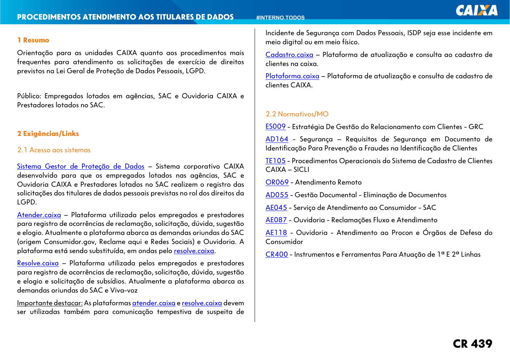

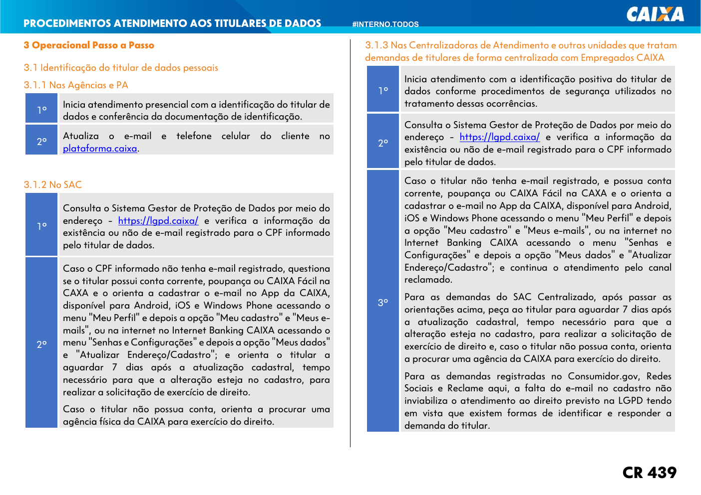

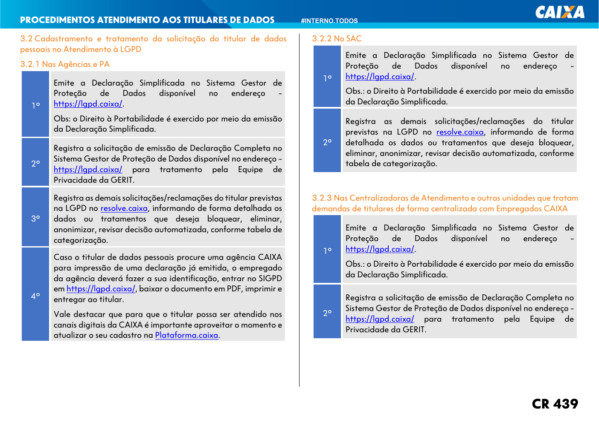

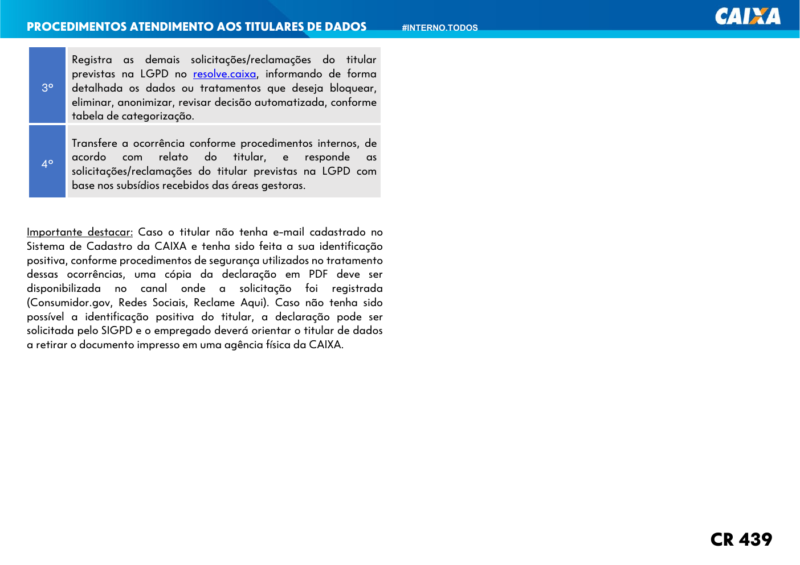

### Texto extraído

<!-- Página 1 -->

PROCEDIMENTOS ATENDIMENTO AOS TITULARES DE DADOS #INTERNO.TODOS

Incidente de Segurança com Dados Pessoais, ISDP seja esse incidente em
**1** Resumo meio digital ou em meio físico.
Orientação para as unidades CAIXA quanto aos procedimentos mais Cadastro.caixa – Plataforma de atualização e consulta ao cadastro de
frequentes para atendimento as solicitações de exercício de direitos clientes na caixa.
previstos na Lei Geral de Proteção de Dados Pessoais, LGPD.
Plataforma.caixa – Plataforma de atualização e consulta de cadastro de
clientes CAIXA.
Público: Empregados lotados em agências, SAC e Ouvidoria CAIXA e
Prestadores lotados no SAC.
### 2.2 Normativos/MO
ES009 - Estratégia De Gestão do Relacionamento com Clientes - GRC
## 2 Exigências/Links
AD164 - Segurança – Requisitos de Segurança em Documento de
### 2.1 Acesso aos sistemas Identificação Para Prevenção a Fraudes na Identificação de Clientes
TE105 - Procedimentos Operacionais do Sistema de Cadastro de Clientes
Sistema Gestor de Proteção de Dados – Sistema corporativo CAIXA
CAIXA – SICLI
desenvolvido para que os empregados lotados nas agências, SAC e
Ouvidoria CAIXA e Prestadores lotados no SAC realizem o registro das OR069 - Atendimento Remoto
solicitações dos titulares de dados pessoais previstas no rol dos direitos da AD055 - Gestão Documental - Eliminação de Documentos
LGPD.
AE045 - Serviço de Atendimento ao Consumidor - SAC
Atender.caixa – Plataforma utilizada pelos empregados e prestadores
AE087 - Ouvidoria - Reclamações Fluxo e Atendimento
para registro de ocorrências de reclamação, solicitação, dúvida, sugestão
e elogio. Atualmente a plataforma abarca as demandas oriundas do SAC AE118 - Ouvidoria - Atendimento ao Procon e Órgãos de Defesa do
(origem Consumidor.gov, Reclame aqui e Redes Sociais) e Ouvidoria. A Consumidor
plataforma está sendo substituída, em ondas pelo resolve.caixa.
CR400 - Instrumentos e Ferramentas Para Atuação de 1ª E 2ª Linhas
Resolve.caixa – Plataforma utilizada pelos empregados e prestadores
para registro de ocorrências de reclamação, solicitação, dúvida, sugestão
e elogio e solicitação de subsídios. Atualmente a plataforma abarca as
demandas oriundas do SAC e Viva-voz
Importante destacar: As plataformas atender.caixa e resolve.caixa devem
ser utilizadas também para comunicação tempestiva de suspeita de

---

<!-- Página 2 -->

PROCEDIMENTOS ATENDIMENTO AOS TITULARES DE DADOS #INTERNO.TODOS

**3** Operacional Passo a Passo 3.1.3 Nas Centralizadoras de Atendimento e outras unidades que tratam
demandas de titulares de forma centralizada com Empregados CAIXA
### 3.1 Identificação do titular de dados pessoais
Inicia atendimento com a identificação positiva do titular de
#### 3.1.1 Nas Agências e PA
1º dados conforme procedimentos de segurança utilizados no
Inicia atendimento presencial com a identificação do titular de tratamento dessas ocorrências.
1º
dados e conferência da documentação de identificação.
Consulta o Sistema Gestor de Proteção de Dados por meio do
Atualiza o e-mail e telefone celular do cliente no endereço - https://lgpd.caixa/ e verifica a informação da
2º 2º
plataforma.caixa. existência ou não de e-mail registrado para o CPF informado
pelo titular de dados.

#### 3.1.2 No SAC Caso o titular não tenha e-mail registrado, e possua conta
corrente, poupança ou CAIXA Fácil na CAXA e o orienta a
Consulta o Sistema Gestor de Proteção de Dados por meio do cadastrar o e-mail no App da CAIXA, disponível para Android,
endereço - https://lgpd.caixa/ e verifica a informação da iOS e Windows Phone acessando o menu "Meu Perfil" e depois
1º a opção "Meu cadastro" e "Meus e-mails", ou na internet no
existência ou não de e-mail registrado para o CPF informado
pelo titular de dados. Internet Banking CAIXA acessando o menu "Senhas e
Configurações" e depois a opção "Meus dados" e "Atualizar
Caso o CPF informado não tenha e-mail registrado, questiona Endereço/Cadastro"; e continua o atendimento pelo canal
se o titular possui conta corrente, poupança ou CAIXA Fácil na reclamado.
CAXA e o orienta a cadastrar o e-mail no App da CAIXA, Para as demandas do SAC Centralizado, após passar as
disponível para Android, iOS e Windows Phone acessando o 3°
orientações acima, peça ao titular para aguardar 7 dias após
menu "Meu Perfil" e depois a opção "Meu cadastro" e "Meus e- a atualização cadastral, tempo necessário para que a
mails", ou na internet no Internet Banking CAIXA acessando o alteração esteja no cadastro, para realizar a solicitação de
2º menu "Senhas e Configurações" e depois a opção "Meus dados" exercício de direito e, caso o titular não possua conta, orienta
e "Atualizar Endereço/Cadastro"; e orienta o titular a a procurar uma agência da CAIXA para exercício do direito.
aguardar 7 dias após a atualização cadastral, tempo
necessário para que a alteração esteja no cadastro, para Para as demandas registradas no Consumidor.gov, Redes
realizar a solicitação de exercício de direito. Sociais e Reclame aqui, a falta do e-mail no cadastro não
inviabiliza o atendimento ao direito previsto na LGPD tendo
Caso o titular não possua conta, orienta a procurar uma em vista que existem formas de identificar e responder a
agência física da CAIXA para exercício do direito. demanda do titular.

---

<!-- Página 3 -->

PROCEDIMENTOS ATENDIMENTO AOS TITULARES DE DADOS #INTERNO.TODOS

**3.2** Cadastramento e tratamento da solicitação do titular de dados 3.2.2 No SAC
pessoais no Atendimento à LGPD
Emite a Declaração Simplificada no Sistema Gestor de
#### 3.2.1 Nas Agências e PA Proteção de Dados disponível no endereço -
1º https://lgpd.caixa/.
Emite a Declaração Simplificada no Sistema Gestor de
Proteção de Dados disponível no endereço - Obs.: o Direito à Portabilidade é exercido por meio da emissão
https://lgpd.caixa/. da Declaração Simplificada.
1º
Obs: o Direito à Portabilidade é exercido por meio da emissão Registra as demais solicitações/reclamações do titular
da Declaração Simplificada. previstas na LGPD no resolve.caixa, informando de forma
2º detalhada os dados ou tratamentos que deseja bloquear,
Registra a solicitação de emissão de Declaração Completa no
eliminar, anonimizar, revisar decisão automatizada, conforme
Sistema Gestor de Proteção de Dados disponível no endereço -
2º tabela de categorização.
https://lgpd.caixa/ para tratamento pela Equipe de
Privacidade da GERIT.

Registra as demais solicitações/reclamações do titular previstas 3.2.3 Nas Centralizadoras de Atendimento e outras unidades que tratam
na LGPD no resolve.caixa, informando de forma detalhada os demandas de titulares de forma centralizada com Empregados CAIXA
3º dados ou tratamentos que deseja bloquear, eliminar,
anonimizar, revisar decisão automatizada, conforme tabela de Emite a Declaração Simplificada no Sistema Gestor de
categorização. Proteção de Dados disponível no endereço -
1º https://lgpd.caixa/.
Caso o titular de dados pessoais procure uma agência CAIXA
para impressão de uma declaração já emitida, o empregado Obs.: o Direito à Portabilidade é exercido por meio da emissão
da Declaração Simplificada.
da agência deverá fazer a sua identificação, entrar no SIGPD
em https://lgpd.caixa/, baixar o documento em PDF, imprimir e
4° entregar ao titular. Registra a solicitação de emissão de Declaração Completa no
Sistema Gestor de Proteção de Dados disponível no endereço -
Vale destacar que para que o titular possa ser atendido nos 2º
https://lgpd.caixa/ para tratamento pela Equipe de
canais digitais da CAIXA é importante aproveitar o momento e
Privacidade da GERIT.
atualizar o seu cadastro na Plataforma.caixa.

---

<!-- Página 4 -->

PROCEDIMENTOS ATENDIMENTO AOS TITULARES DE DADOS #INTERNO.TODOS

Registra as demais solicitações/reclamações do titular
previstas na LGPD no resolve.caixa, informando de forma
3º detalhada os dados ou tratamentos que deseja bloquear,
eliminar, anonimizar, revisar decisão automatizada, conforme
tabela de categorização.

Transfere a ocorrência conforme procedimentos internos, de
acordo com relato do titular, e responde as
4°
solicitações/reclamações do titular previstas na LGPD com
base nos subsídios recebidos das áreas gestoras.

Importante destacar: Caso o titular não tenha e-mail cadastrado no
Sistema de Cadastro da CAIXA e tenha sido feita a sua identificação
positiva, conforme procedimentos de segurança utilizados no tratamento
dessas ocorrências, uma cópia da declaração em PDF deve ser
disponibilizada no canal onde a solicitação foi registrada
(Consumidor.gov, Redes Sociais, Reclame Aqui). Caso não tenha sido
possível a identificação positiva do titular, a declaração pode ser
solicitada pelo SIGPD e o empregado deverá orientar o titular de dados
a retirar o documento impresso em uma agência física da CAIXA.

---

## ANEXO II - TABELA DE DADOS PESSOAIS TRATADOS PELA CAIXA

### Páginas renderizadas do anexo

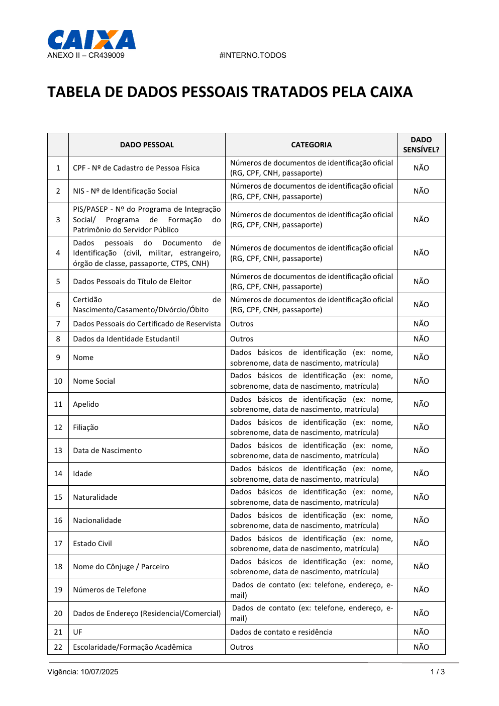

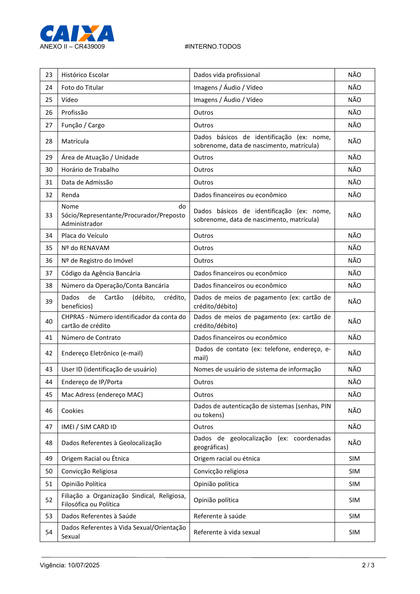

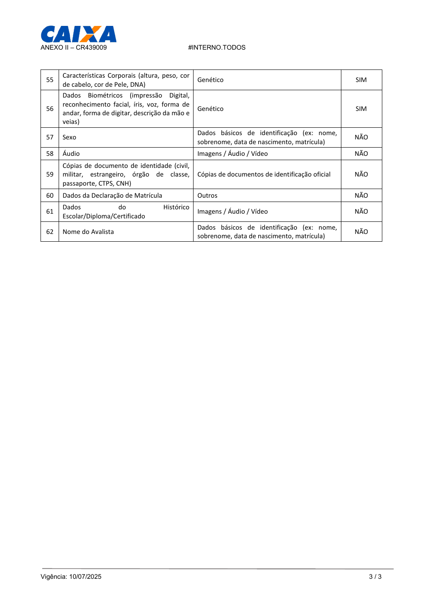

### Tabela extraída em Markdown

| Nº | Dado pessoal | Categoria | Sensível? |
|---:|---|---|:---:|
| 1 | CPF - Nº de Cadastro de Pessoa Física | Números de documentos de identificação oficial (RG, CPF, CNH, passaporte) | NÃO |
| 2 | NIS - Nº de Identificação Social | Números de documentos de identificação oficial (RG, CPF, CNH, passaporte) | NÃO |
| 3 | PIS/PASEP - Nº do Programa de Integração Social/ Programa de Formação do Patrimônio do Servidor Público | Números de documentos de identificação oficial (RG, CPF, CNH, passaporte) | NÃO |
| 4 | Dados pessoais do Documento de Identificação (civil, militar, estrangeiro, órgão de classe, passaporte, CTPS, CNH) | Números de documentos de identificação oficial (RG, CPF, CNH, passaporte) | NÃO |
| 5 | Dados Pessoais do Título de Eleitor | Números de documentos de identificação oficial (RG, CPF, CNH, passaporte) | NÃO |
| 6 | Certidão de Nascimento/Casamento/Divórcio/Óbito | Números de documentos de identificação oficial (RG, CPF, CNH, passaporte) | NÃO |
| 7 | Dados Pessoais do Certificado de Reservista | Outros | NÃO |
| 8 | Dados da Identidade Estudantil | Outros | NÃO |
| 9 | Nome | Dados básicos de identificação (ex: nome, sobrenome, data de nascimento, matrícula) | NÃO |
| 10 | Nome Social | Dados básicos de identificação (ex: nome, sobrenome, data de nascimento, matrícula) | NÃO |
| 11 | Apelido | Dados básicos de identificação (ex: nome, sobrenome, data de nascimento, matrícula) | NÃO |
| 12 | Filiação | Dados básicos de identificação (ex: nome, sobrenome, data de nascimento, matrícula) | NÃO |
| 13 | Data de Nascimento | Dados básicos de identificação (ex: nome, sobrenome, data de nascimento, matrícula) | NÃO |
| 14 | Idade | Dados básicos de identificação (ex: nome, sobrenome, data de nascimento, matrícula) | NÃO |
| 15 | Naturalidade | Dados básicos de identificação (ex: nome, sobrenome, data de nascimento, matrícula) | NÃO |
| 16 | Nacionalidade | Dados básicos de identificação (ex: nome, sobrenome, data de nascimento, matrícula) | NÃO |
| 17 | Estado Civil | Dados básicos de identificação (ex: nome, sobrenome, data de nascimento, matrícula) | NÃO |
| 18 | Nome do Cônjuge / Parceiro | Dados básicos de identificação (ex: nome, sobrenome, data de nascimento, matrícula) | NÃO |
| 19 | Números de Telefone | Dados de contato (ex: telefone, endereço, e- mail) | NÃO |
| 20 | Dados de Endereço (Residencial/Comercial) | Dados de contato (ex: telefone, endereço, e- mail) | NÃO |
| 21 | UF | Dados de contato e residência | NÃO |
| 22 | Escolaridade/Formação Acadêmica | Outros | NÃO |
| 23 | Histórico Escolar | Dados vida profissional | NÃO |
| 24 | Foto do Titular | Imagens / Áudio / Vídeo | NÃO |
| 25 | Vídeo | Imagens / Áudio / Vídeo | NÃO |
| 26 | Profissão | Outros | NÃO |
| 27 | Função / Cargo | Outros | NÃO |
| 28 | Matrícula | Dados básicos de identificação (ex: nome, sobrenome, data de nascimento, matrícula) | NÃO |
| 29 | Área de Atuação / Unidade | Outros | NÃO |
| 30 | Horário de Trabalho | Outros | NÃO |
| 31 | Data de Admissão | Outros | NÃO |
| 32 | Renda | Dados financeiros ou econômico | NÃO |
| 33 | Nome do Sócio/Representante/Procurador/Preposto Administrador | Dados básicos de identificação (ex: nome, sobrenome, data de nascimento, matrícula) | NÃO |
| 34 | Placa do Veículo | Outros | NÃO |
| 35 | Nº do RENAVAM | Outros | NÃO |
| 36 | Nº de Registro do Imóvel | Outros | NÃO |
| 37 | Código da Agência Bancária | Dados financeiros ou econômico | NÃO |
| 38 | Número da Operação/Conta Bancária | Dados financeiros ou econômico | NÃO |
| 39 | Dados de Cartão (débito, crédito, benefícios) | Dados de meios de pagamento (ex: cartão de crédito/débito) | NÃO |
| 40 | CHPRAS - Número identificador da conta do cartão de crédito | Dados de meios de pagamento (ex: cartão de crédito/débito) | NÃO |
| 41 | Número de Contrato | Dados financeiros ou econômico | NÃO |
| 42 | Endereço Eletrônico (e-mail) | Dados de contato (ex: telefone, endereço, e- mail) | NÃO |
| 43 | User ID (identificação de usuário) | Nomes de usuário de sistema de informação | NÃO |
| 44 | Endereço de IP/Porta | Outros | NÃO |
| 45 | Mac Adress (endereço MAC) | Outros | NÃO |
| 46 | Cookies | Dados de autenticação de sistemas (senhas, PIN ou tokens) | NÃO |
| 47 | IMEI / SIM CARD ID | Outros | NÃO |
| 48 | Dados Referentes à Geolocalização | Dados de geolocalização (ex: coordenadas geográficas) | NÃO |
| 49 | Origem Racial ou Étnica | Origem racial ou étnica | SIM |
| 50 | Convicção Religiosa | Convicção religiosa | SIM |
| 51 | Opinião Política | Opinião política | SIM |
| 52 | Filiação a Organização Sindical, Religiosa, Filosófica ou Política | Opinião política | SIM |
| 53 | Dados Referentes à Saúde | Referente à saúde | SIM |
| 54 | Dados Referentes à Vida Sexual/Orientação Sexual | Referente à vida sexual | SIM |
| 55 | Características Corporais (altura, peso, cor de cabelo, cor de Pele, DNA) | Genético | SIM |
| 56 | Dados Biométricos (impressão Digital, reconhecimento facial, íris, voz, forma de andar, forma de digitar, descrição da mão e veias) | Genético | SIM |
| 57 | Sexo | Dados básicos de identificação (ex: nome, sobrenome, data de nascimento, matrícula) | NÃO |
| 58 | Áudio | Imagens / Áudio / Vídeo | NÃO |
| 59 | Cópias de documento de identidade (civil, militar, estrangeiro, órgão de classe, passaporte, CTPS, CNH) | Cópias de documentos de identificação oficial | NÃO |
| 60 | Dados da Declaração de Matrícula | Outros | NÃO |
| 61 | Dados do Histórico Escolar/Diploma/Certificado | Imagens / Áudio / Vídeo | NÃO |
| 62 | Nome do Avalista | Dados básicos de identificação (ex: nome, sobrenome, data de nascimento, matrícula) | NÃO |

### Texto extraído

<!-- Página 1 -->

TABELA DE DADOS PESSOAIS TRATADOS PELA CAIXA

DADO
DADO PESSOAL CATEGORIA
SENSÍVEL?
Números de documentos de identificação oficial
## 1 CPF - Nº de Cadastro de Pessoa Física NÃO
(RG, CPF, CNH, passaporte)
Números de documentos de identificação oficial
## 2 NIS - Nº de Identificação Social NÃO
(RG, CPF, CNH, passaporte)
PIS/PASEP - Nº do Programa de Integração
Números de documentos de identificação oficial
## 3 Social/ Programa de Formação do NÃO
(RG, CPF, CNH, passaporte)
Patrimônio do Servidor Público
Dados pessoais do Documento de
Números de documentos de identificação oficial
## 4 Identificação (civil, militar, estrangeiro, NÃO
(RG, CPF, CNH, passaporte)
órgão de classe, passaporte, CTPS, CNH)
Números de documentos de identificação oficial
## 5 Dados Pessoais do Título de Eleitor NÃO
(RG, CPF, CNH, passaporte)
Certidão de Números de documentos de identificação oficial
## 6 NÃO
Nascimento/Casamento/Divórcio/Óbito (RG, CPF, CNH, passaporte)
## 7 Dados Pessoais do Certificado de Reservista Outros NÃO
## 8 Dados da Identidade Estudantil Outros NÃO
Dados básicos de identificação (ex: nome,
## 9 Nome NÃO
sobrenome, data de nascimento, matrícula)
Dados básicos de identificação (ex: nome,
## 10 Nome Social NÃO
sobrenome, data de nascimento, matrícula)
Dados básicos de identificação (ex: nome,
## 11 Apelido NÃO
sobrenome, data de nascimento, matrícula)
Dados básicos de identificação (ex: nome,
## 12 Filiação NÃO
sobrenome, data de nascimento, matrícula)
Dados básicos de identificação (ex: nome,
## 13 Data de Nascimento NÃO
sobrenome, data de nascimento, matrícula)
Dados básicos de identificação (ex: nome,
## 14 Idade NÃO
sobrenome, data de nascimento, matrícula)
Dados básicos de identificação (ex: nome,
## 15 Naturalidade NÃO
sobrenome, data de nascimento, matrícula)
Dados básicos de identificação (ex: nome,
## 16 Nacionalidade NÃO
sobrenome, data de nascimento, matrícula)
Dados básicos de identificação (ex: nome,
## 17 Estado Civil NÃO
sobrenome, data de nascimento, matrícula)
Dados básicos de identificação (ex: nome,
## 18 Nome do Cônjuge / Parceiro NÃO
sobrenome, data de nascimento, matrícula)
Dados de contato (ex: telefone, endereço, e-
## 19 Números de Telefone NÃO
mail)
Dados de contato (ex: telefone, endereço, e-
## 20 Dados de Endereço (Residencial/Comercial) NÃO
mail)
## 21 UF Dados de contato e residência NÃO
## 22 Escolaridade/Formação Acadêmica Outros NÃO

---

<!-- Página 2 -->

## 23 Histórico Escolar Dados vida profissional NÃO
## 24 Foto do Titular Imagens / Áudio / Vídeo NÃO
## 25 Vídeo Imagens / Áudio / Vídeo NÃO
## 26 Profissão Outros NÃO
## 27 Função / Cargo Outros NÃO
Dados básicos de identificação (ex: nome,
## 28 Matrícula NÃO
sobrenome, data de nascimento, matrícula)
## 29 Área de Atuação / Unidade Outros NÃO
## 30 Horário de Trabalho Outros NÃO
## 31 Data de Admissão Outros NÃO
## 32 Renda Dados financeiros ou econômico NÃO
Nome do
Dados básicos de identificação (ex: nome,
## 33 Sócio/Representante/Procurador/Preposto NÃO
sobrenome, data de nascimento, matrícula)
Administrador
## 34 Placa do Veículo Outros NÃO
## 35 Nº do RENAVAM Outros NÃO
## 36 Nº de Registro do Imóvel Outros NÃO
## 37 Código da Agência Bancária Dados financeiros ou econômico NÃO
## 38 Número da Operação/Conta Bancária Dados financeiros ou econômico NÃO
Dados de Cartão (débito, crédito, Dados de meios de pagamento (ex: cartão de
## 39 NÃO
benefícios) crédito/débito)
CHPRAS - Número identificador da conta do Dados de meios de pagamento (ex: cartão de
## 40 NÃO
cartão de crédito crédito/débito)
## 41 Número de Contrato Dados financeiros ou econômico NÃO
Dados de contato (ex: telefone, endereço, e-
## 42 Endereço Eletrônico (e-mail) NÃO
mail)
## 43 User ID (identificação de usuário) Nomes de usuário de sistema de informação NÃO
## 44 Endereço de IP/Porta Outros NÃO
## 45 Mac Adress (endereço MAC) Outros NÃO
Dados de autenticação de sistemas (senhas, PIN
## 46 Cookies NÃO
ou tokens)
## 47 IMEI / SIM CARD ID Outros NÃO
Dados de geolocalização (ex: coordenadas
## 48 Dados Referentes à Geolocalização NÃO
geográficas)
## 49 Origem Racial ou Étnica Origem racial ou étnica SIM
## 50 Convicção Religiosa Convicção religiosa SIM
## 51 Opinião Política Opinião política SIM
Filiação a Organização Sindical, Religiosa,
## 52 Opinião política SIM
Filosófica ou Política
## 53 Dados Referentes à Saúde Referente à saúde SIM
Dados Referentes à Vida Sexual/Orientação
## 54 Referente à vida sexual SIM
Sexual

---

<!-- Página 3 -->

Características Corporais (altura, peso, cor
## 55 Genético SIM
de cabelo, cor de Pele, DNA)
Dados Biométricos (impressão Digital,
reconhecimento facial, íris, voz, forma de
## 56 Genético SIM
andar, forma de digitar, descrição da mão e
veias)
Dados básicos de identificação (ex: nome,
## 57 Sexo NÃO
sobrenome, data de nascimento, matrícula)
## 58 Áudio Imagens / Áudio / Vídeo NÃO
Cópias de documento de identidade (civil,
**59** militar, estrangeiro, órgão de classe, Cópias de documentos de identificação oficial NÃO
passaporte, CTPS, CNH)
## 60 Dados da Declaração de Matrícula Outros NÃO
Dados do Histórico
## 61 Imagens / Áudio / Vídeo NÃO
Escolar/Diploma/Certificado
Dados básicos de identificação (ex: nome,
## 62 Nome do Avalista NÃO
sobrenome, data de nascimento, matrícula)

---

## ANEXO III - NOVO MODELO ATENDIMENTO LGPD CANAIS

### Páginas renderizadas do anexo

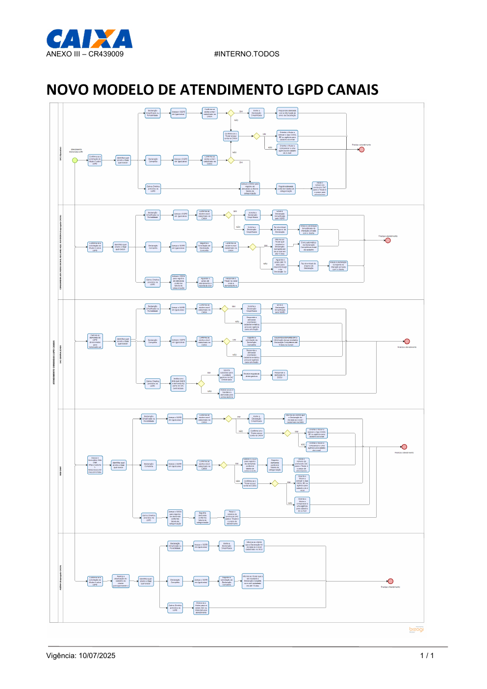

### Texto extraído

<!-- Página 1 -->

NOVO MODELO DE ATENDIMENTO LGPD CANAIS

---

## ANEXO IV - MANUAL ATENDIMENTO SIGPD - AGENCIA PA

### Páginas renderizadas do anexo

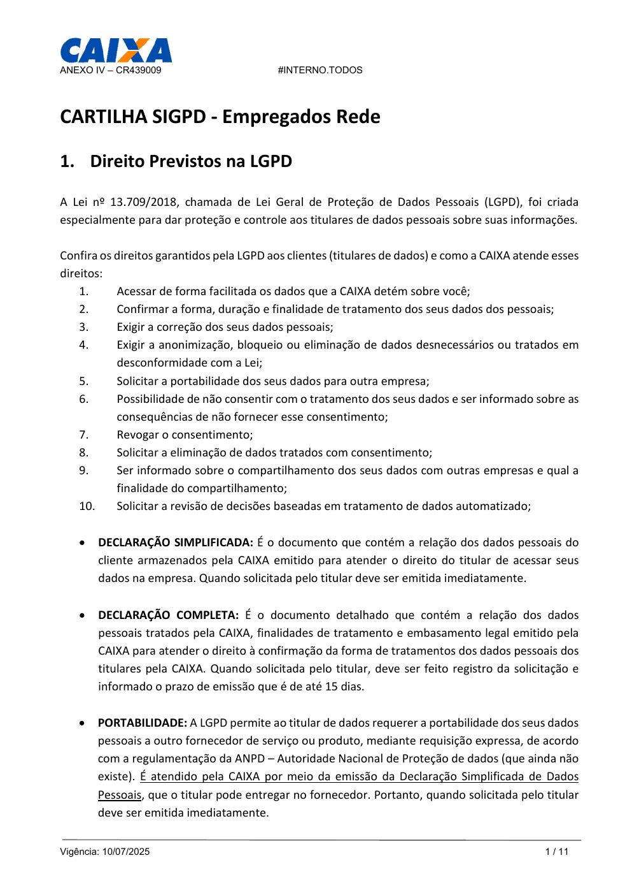

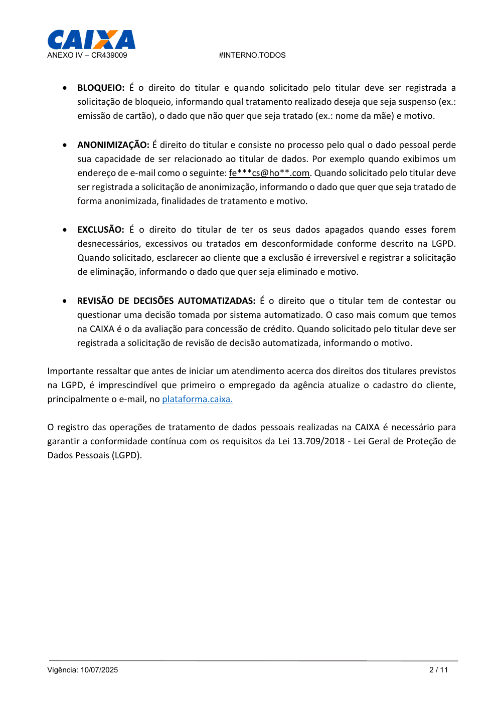

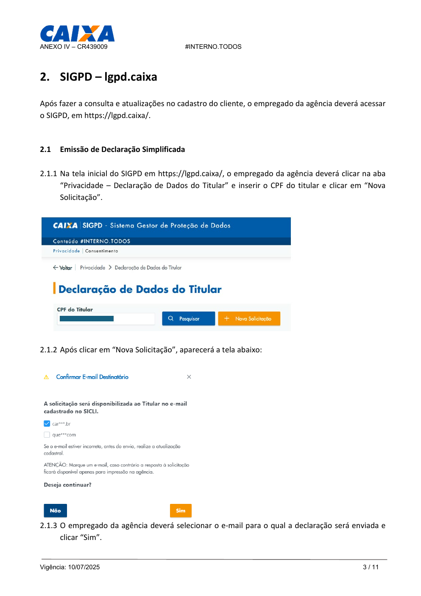

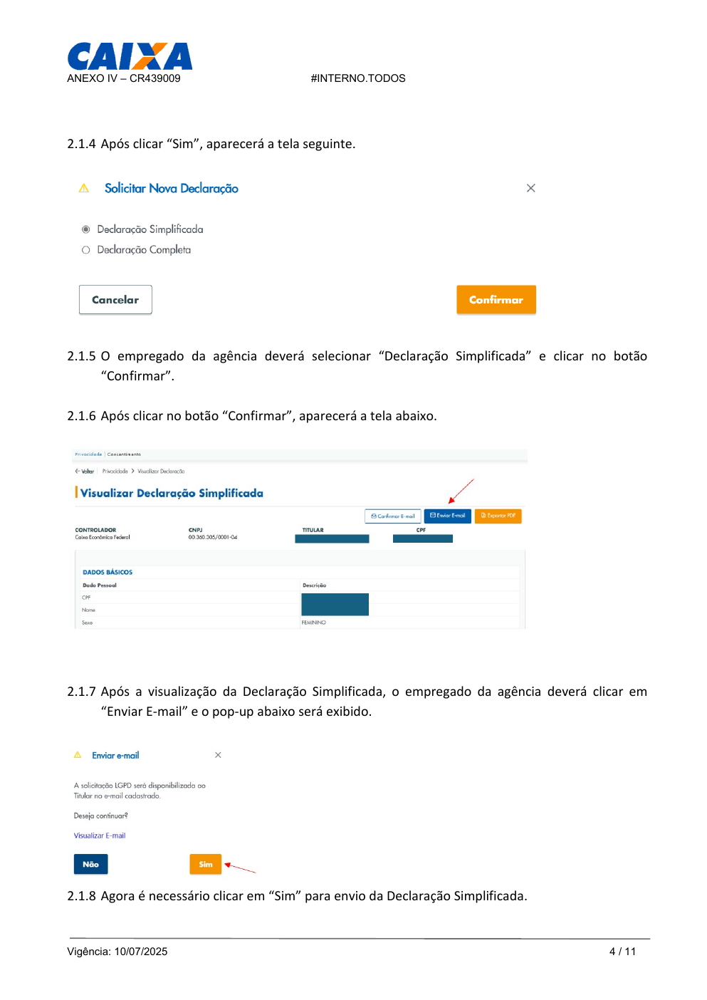

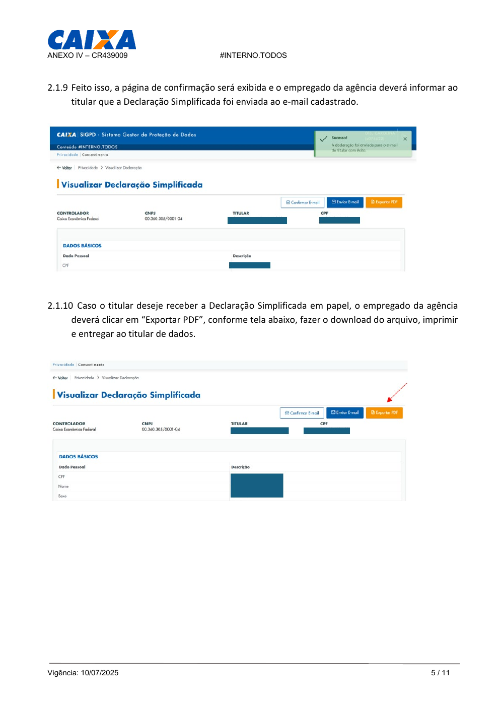

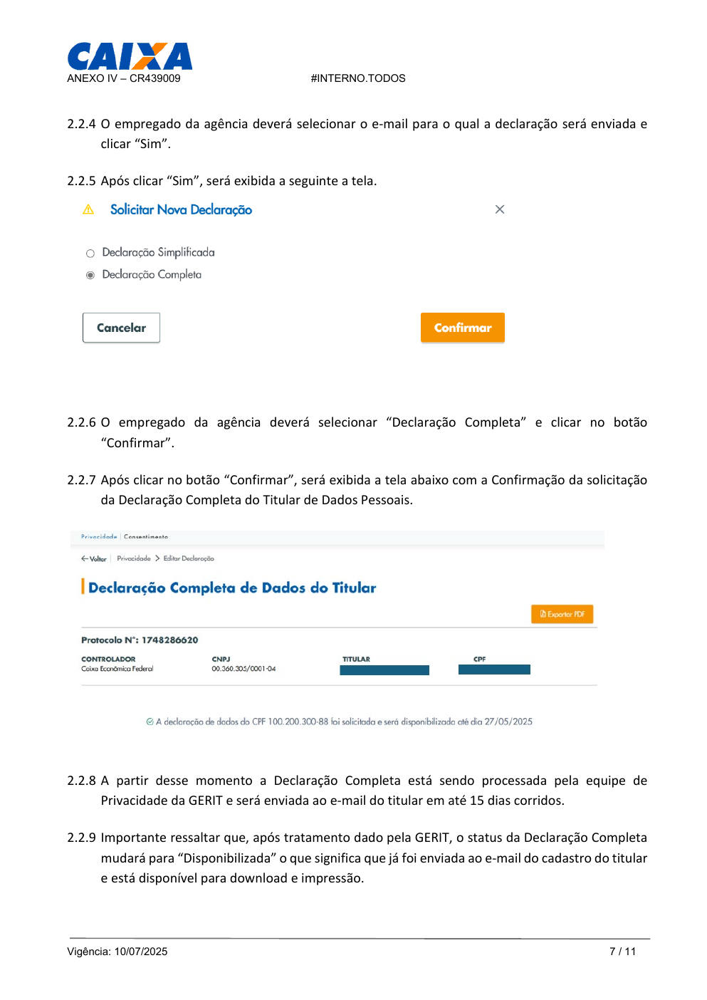

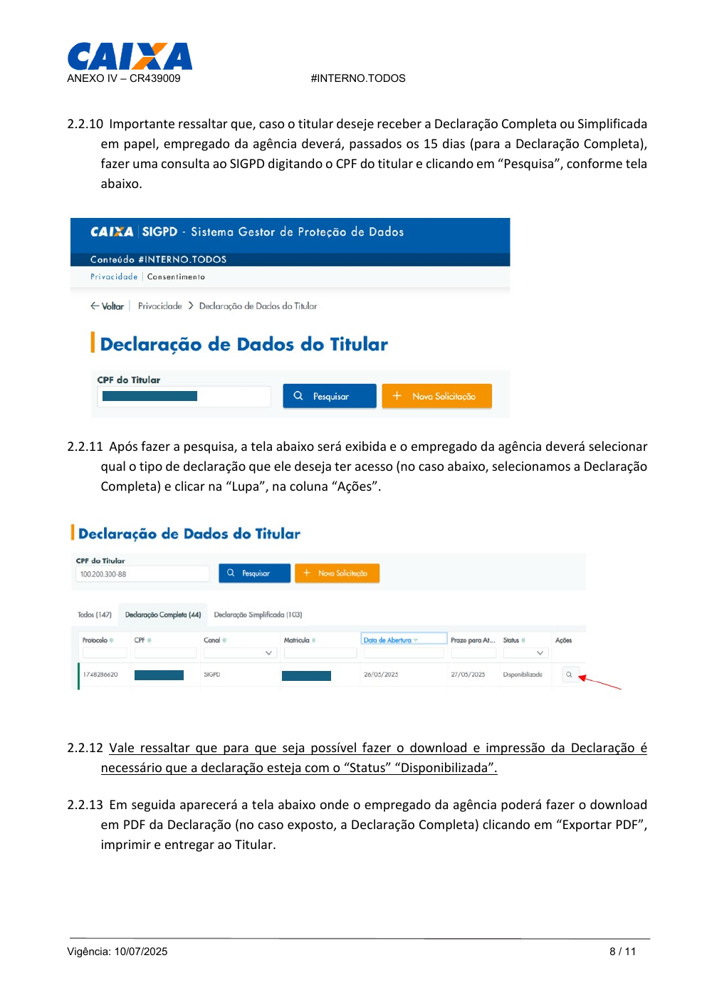

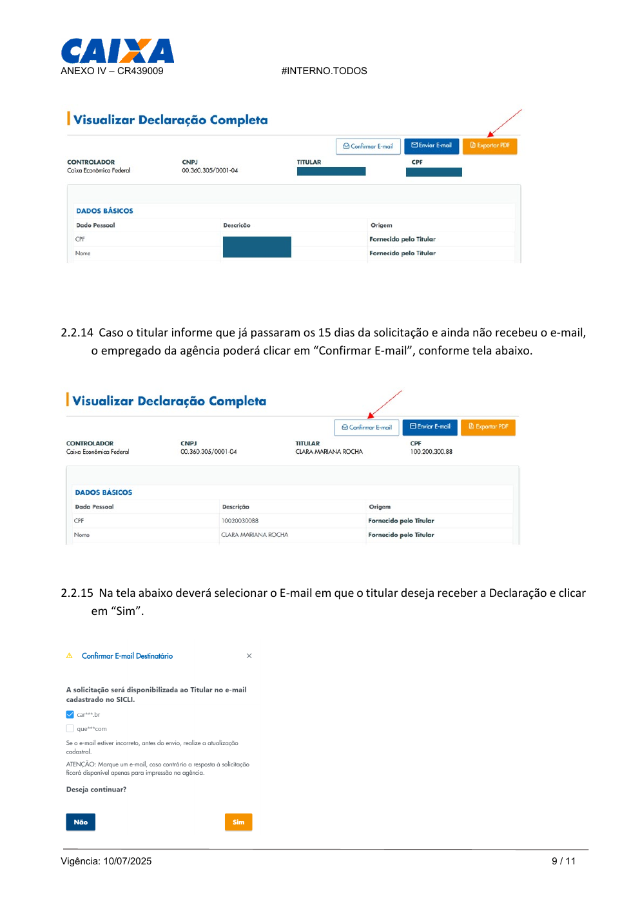

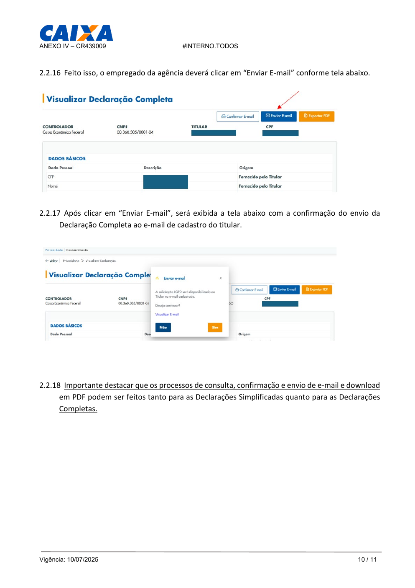

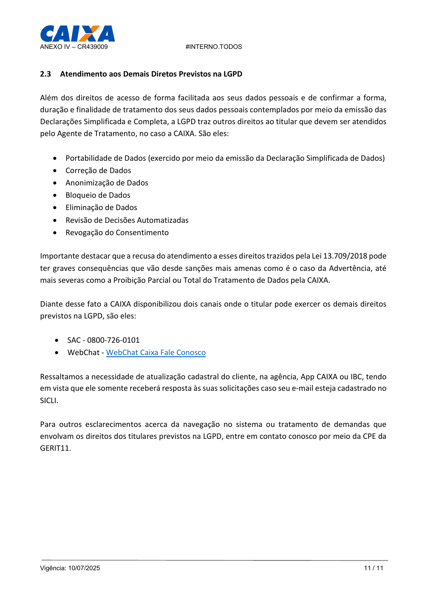

### Texto extraído

<!-- Página 1 -->

CARTILHA SIGPD - Empregados Rede

1. Direito Previstos na LGPD

A Lei nº 13.709/2018, chamada de Lei Geral de Proteção de Dados Pessoais (LGPD), foi criada
especialmente para dar proteção e controle aos titulares de dados pessoais sobre suas informações.

Confira os direitos garantidos pela LGPD aos clientes (titulares de dados) e como a CAIXA atende esses
direitos:
1. Acessar de forma facilitada os dados que a CAIXA detém sobre você;
2. Confirmar a forma, duração e finalidade de tratamento dos seus dados dos pessoais;
3. Exigir a correção dos seus dados pessoais;
4. Exigir a anonimização, bloqueio ou eliminação de dados desnecessários ou tratados em
desconformidade com a Lei;
5. Solicitar a portabilidade dos seus dados para outra empresa;
6. Possibilidade de não consentir com o tratamento dos seus dados e ser informado sobre as
consequências de não fornecer esse consentimento;
7. Revogar o consentimento;
8. Solicitar a eliminação de dados tratados com consentimento;
9. Ser informado sobre o compartilhamento dos seus dados com outras empresas e qual a
finalidade do compartilhamento;
10. Solicitar a revisão de decisões baseadas em tratamento de dados automatizado;

- DECLARAÇÃO SIMPLIFICADA: É o documento que contém a relação dos dados pessoais do
cliente armazenados pela CAIXA emitido para atender o direito do titular de acessar seus
dados na empresa. Quando solicitada pelo titular deve ser emitida imediatamente.

- DECLARAÇÃO COMPLETA: É o documento detalhado que contém a relação dos dados
pessoais tratados pela CAIXA, finalidades de tratamento e embasamento legal emitido pela
CAIXA para atender o direito à confirmação da forma de tratamentos dos dados pessoais dos
titulares pela CAIXA. Quando solicitada pelo titular, deve ser feito registro da solicitação e
informado o prazo de emissão que é de até 15 dias.

- PORTABILIDADE: A LGPD permite ao titular de dados requerer a portabilidade dos seus dados
pessoais a outro fornecedor de serviço ou produto, mediante requisição expressa, de acordo
com a regulamentação da ANPD – Autoridade Nacional de Proteção de dados (que ainda não
existe). É atendido pela CAIXA por meio da emissão da Declaração Simplificada de Dados
Pessoais, que o titular pode entregar no fornecedor. Portanto, quando solicitada pelo titular
deve ser emitida imediatamente.

---

<!-- Página 2 -->

- BLOQUEIO: É o direito do titular e quando solicitado pelo titular deve ser registrada a
solicitação de bloqueio, informando qual tratamento realizado deseja que seja suspenso (ex.:
emissão de cartão), o dado que não quer que seja tratado (ex.: nome da mãe) e motivo.

- ANONIMIZAÇÃO: É direito do titular e consiste no processo pelo qual o dado pessoal perde
sua capacidade de ser relacionado ao titular de dados. Por exemplo quando exibimos um
endereço de e-mail como o seguinte: fe***cs@ho**.com. Quando solicitado pelo titular deve
ser registrada a solicitação de anonimização, informando o dado que quer que seja tratado de
forma anonimizada, finalidades de tratamento e motivo.

- EXCLUSÃO: É o direito do titular de ter os seus dados apagados quando esses forem
desnecessários, excessivos ou tratados em desconformidade conforme descrito na LGPD.
Quando solicitado, esclarecer ao cliente que a exclusão é irreversível e registrar a solicitação
de eliminação, informando o dado que quer seja eliminado e motivo.

- REVISÃO DE DECISÕES AUTOMATIZADAS: É o direito que o titular tem de contestar ou
questionar uma decisão tomada por sistema automatizado. O caso mais comum que temos
na CAIXA é o da avaliação para concessão de crédito. Quando solicitado pelo titular deve ser
registrada a solicitação de revisão de decisão automatizada, informando o motivo.

Importante ressaltar que antes de iniciar um atendimento acerca dos direitos dos titulares previstos
na LGPD, é imprescindível que primeiro o empregado da agência atualize o cadastro do cliente,
principalmente o e-mail, no plataforma.caixa.

O registro das operações de tratamento de dados pessoais realizadas na CAIXA é necessário para
garantir a conformidade contínua com os requisitos da Lei 13.709/2018 - Lei Geral de Proteção de
Dados Pessoais (LGPD).

---

<!-- Página 3 -->

2. SIGPD – lgpd.caixa

Após fazer a consulta e atualizações no cadastro do cliente, o empregado da agência deverá acessar
o SIGPD, em https://lgpd.caixa/.

### 2.1 Emissão de Declaração Simplificada

**2.1.1** Na tela inicial do SIGPD em https://lgpd.caixa/, o empregado da agência deverá clicar na aba
“Privacidade – Declaração de Dados do Titular” e inserir o CPF do titular e clicar em “Nova
Solicitação”.

**2.1.2** Após clicar em “Nova Solicitação”, aparecerá a tela abaixo:

#### 2.1.3 O empregado da agência deverá selecionar o e-mail para o qual a declaração será enviada e
clicar “Sim”.

---

<!-- Página 4 -->

**2.1.4** Após clicar “Sim”, aparecerá a tela seguinte.

**2.1.5** O empregado da agência deverá selecionar “Declaração Simplificada” e clicar no botão
“Confirmar”.

**2.1.6** Após clicar no botão “Confirmar”, aparecerá a tela abaixo.

#### 2.1.7 Após a visualização da Declaração Simplificada, o empregado da agência deverá clicar em
“Enviar E-mail” e o pop-up abaixo será exibido.

**2.1.8** Agora é necessário clicar em “Sim” para envio da Declaração Simplificada.

---

<!-- Página 5 -->

**2.1.9** Feito isso, a página de confirmação será exibida e o empregado da agência deverá informar ao
titular que a Declaração Simplificada foi enviada ao e-mail cadastrado.

#### 2.1.10 Caso o titular deseje receber a Declaração Simplificada em papel, o empregado da agência
deverá clicar em “Exportar PDF”, conforme tela abaixo, fazer o download do arquivo, imprimir
e entregar ao titular de dados.

---

<!-- Página 6 -->

### 2.2 Emissão de Declaração Completa

#### 2.2.1 Após fazer a consulta e atualizações no cadastro do cliente, o empregado da agência deverá
acessar o SIGPD, em https://lgpd.caixa/ e seguir os passos abaixo:

**2.2.2** Na tela inicial do SIGPD em https://lgpd.caixa/, o empregado da agência da agência deverá
clicar na aba “Privacidade – Declaração de Dados do Titular”, inserir o CPF do titular e clicar em
“Nova Solicitação”.

**2.2.3** Após clicar em “Nova Solicitação”, será exibida a tela abaixo:

---

<!-- Página 7 -->

#### 2.2.4 O empregado da agência deverá selecionar o e-mail para o qual a declaração será enviada e
clicar “Sim”.

**2.2.5** Após clicar “Sim”, será exibida a seguinte a tela.

**2.2.6** O empregado da agência deverá selecionar “Declaração Completa” e clicar no botão
“Confirmar”.

**2.2.7** Após clicar no botão “Confirmar”, será exibida a tela abaixo com a Confirmação da solicitação
da Declaração Completa do Titular de Dados Pessoais.

#### 2.2.8 A partir desse momento a Declaração Completa está sendo processada pela equipe de
Privacidade da GERIT e será enviada ao e-mail do titular em até 15 dias corridos.

#### 2.2.9 Importante ressaltar que, após tratamento dado pela GERIT, o status da Declaração Completa
mudará para “Disponibilizada” o que significa que já foi enviada ao e-mail do cadastro do titular
e está disponível para download e impressão.

---

<!-- Página 8 -->

**2.2.10** Importante ressaltar que, caso o titular deseje receber a Declaração Completa ou Simplificada
em papel, empregado da agência deverá, passados os 15 dias (para a Declaração Completa),
fazer uma consulta ao SIGPD digitando o CPF do titular e clicando em “Pesquisa”, conforme tela
abaixo.

**2.2.11** Após fazer a pesquisa, a tela abaixo será exibida e o empregado da agência deverá selecionar
qual o tipo de declaração que ele deseja ter acesso (no caso abaixo, selecionamos a Declaração
Completa) e clicar na “Lupa”, na coluna “Ações”.

#### 2.2.12 Vale ressaltar que para que seja possível fazer o download e impressão da Declaração é
necessário que a declaração esteja com o “Status” “Disponibilizada”.

#### 2.2.13 Em seguida aparecerá a tela abaixo onde o empregado da agência poderá fazer o download
em PDF da Declaração (no caso exposto, a Declaração Completa) clicando em “Exportar PDF”,
imprimir e entregar ao Titular.

---

<!-- Página 9 -->

**2.2.14** Caso o titular informe que já passaram os 15 dias da solicitação e ainda não recebeu o e-mail,
o empregado da agência poderá clicar em “Confirmar E-mail”, conforme tela abaixo.

**2.2.15** Na tela abaixo deverá selecionar o E-mail em que o titular deseja receber a Declaração e clicar
em “Sim”.

---

<!-- Página 10 -->

**2.2.16** Feito isso, o empregado da agência deverá clicar em “Enviar E-mail” conforme tela abaixo.

**2.2.17** Após clicar em “Enviar E-mail”, será exibida a tela abaixo com a confirmação do envio da
Declaração Completa ao e-mail de cadastro do titular.

#### 2.2.18 Importante destacar que os processos de consulta, confirmação e envio de e-mail e download
em PDF podem ser feitos tanto para as Declarações Simplificadas quanto para as Declarações
Completas.

---

<!-- Página 11 -->

### 2.3 Atendimento aos Demais Diretos Previstos na LGPD

Além dos direitos de acesso de forma facilitada aos seus dados pessoais e de confirmar a forma,
duração e finalidade de tratamento dos seus dados pessoais contemplados por meio da emissão das
Declarações Simplificada e Completa, a LGPD traz outros direitos ao titular que devem ser atendidos
pelo Agente de Tratamento, no caso a CAIXA. São eles:

- Portabilidade de Dados (exercido por meio da emissão da Declaração Simplificada de Dados)
- Correção de Dados
- Anonimização de Dados
- Bloqueio de Dados
- Eliminação de Dados
- Revisão de Decisões Automatizadas
- Revogação do Consentimento

Importante destacar que a recusa do atendimento a esses direitos trazidos pela Lei 13.709/2018 pode
ter graves consequências que vão desde sanções mais amenas como é o caso da Advertência, até
mais severas como a Proibição Parcial ou Total do Tratamento de Dados pela CAIXA.

Diante desse fato a CAIXA disponibilizou dois canais onde o titular pode exercer os demais direitos
previstos na LGPD, são eles:

- SAC - 0800-726-0101
- WebChat - WebChat Caixa Fale Conosco

Ressaltamos a necessidade de atualização cadastral do cliente, na agência, App CAIXA ou IBC, tendo
em vista que ele somente receberá resposta às suas solicitações caso seu e-mail esteja cadastrado no
SICLI.

Para outros esclarecimentos acerca da navegação no sistema ou tratamento de demandas que
envolvam os direitos dos titulares previstos na LGPD, entre em contato conosco por meio da CPE da
GERIT11.

---

## ANEXO V - MANUAL ATENDIMENTO SIGPD - SAC

### Páginas renderizadas do anexo

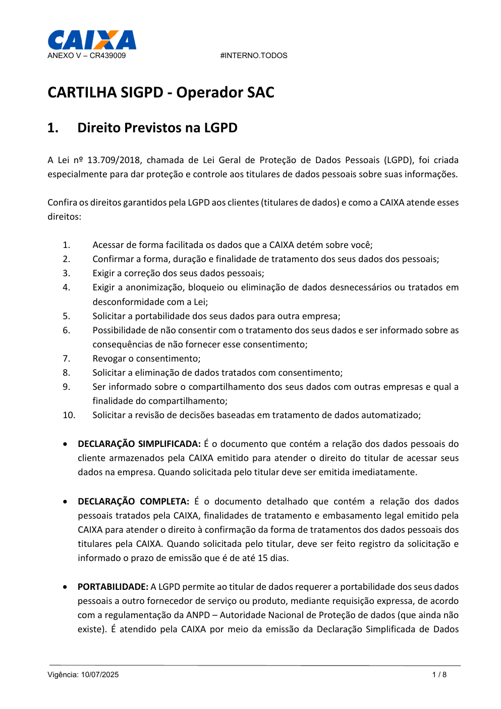

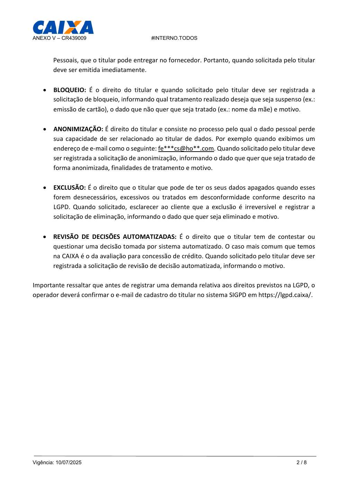

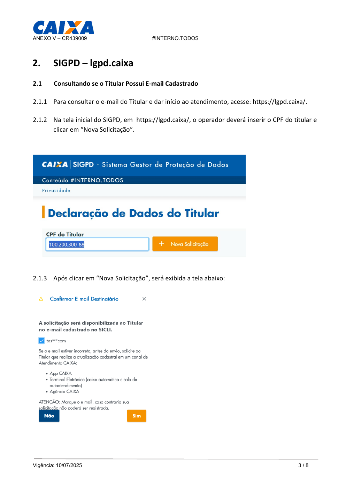

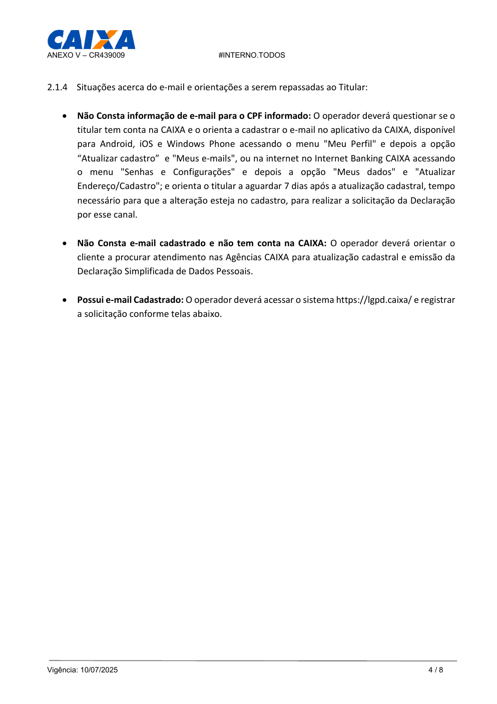

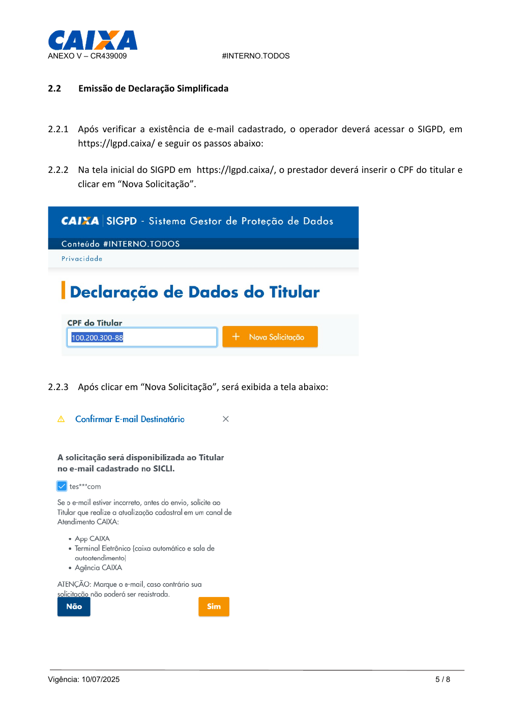

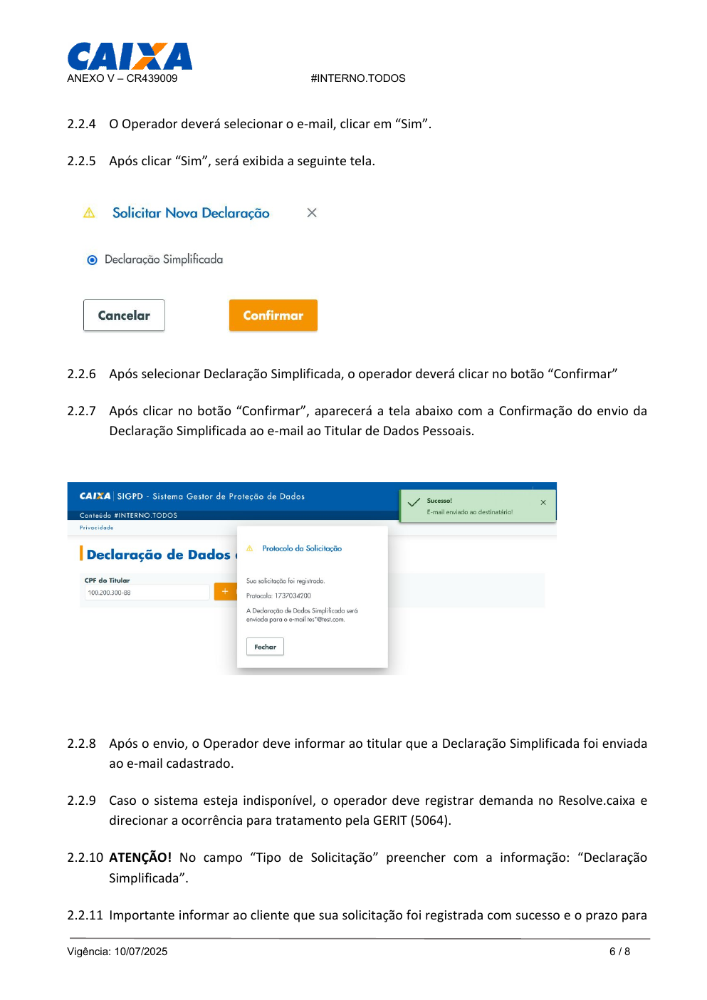

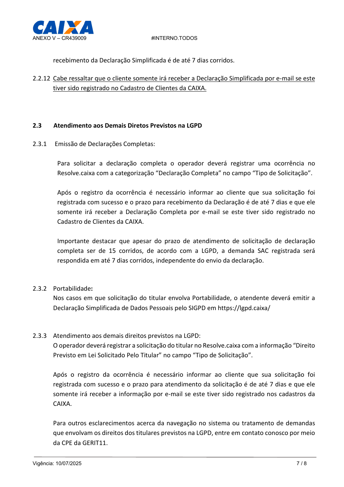

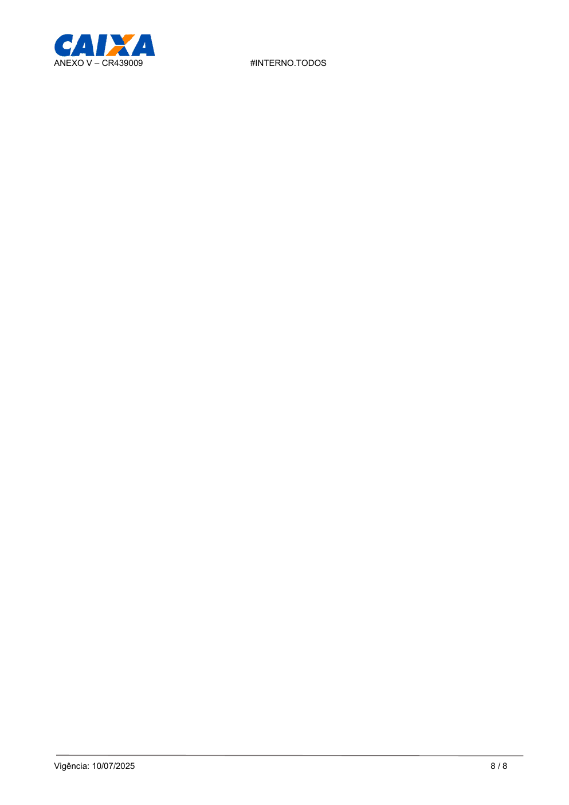

### Texto extraído

<!-- Página 1 -->

CARTILHA SIGPD - Operador SAC

1. Direito Previstos na LGPD

A Lei nº 13.709/2018, chamada de Lei Geral de Proteção de Dados Pessoais (LGPD), foi criada
especialmente para dar proteção e controle aos titulares de dados pessoais sobre suas informações.

Confira os direitos garantidos pela LGPD aos clientes (titulares de dados) e como a CAIXA atende esses
direitos:

1. Acessar de forma facilitada os dados que a CAIXA detém sobre você;
2. Confirmar a forma, duração e finalidade de tratamento dos seus dados dos pessoais;
3. Exigir a correção dos seus dados pessoais;
4. Exigir a anonimização, bloqueio ou eliminação de dados desnecessários ou tratados em
desconformidade com a Lei;
5. Solicitar a portabilidade dos seus dados para outra empresa;
6. Possibilidade de não consentir com o tratamento dos seus dados e ser informado sobre as
consequências de não fornecer esse consentimento;
7. Revogar o consentimento;
8. Solicitar a eliminação de dados tratados com consentimento;
9. Ser informado sobre o compartilhamento dos seus dados com outras empresas e qual a
finalidade do compartilhamento;
10. Solicitar a revisão de decisões baseadas em tratamento de dados automatizado;

- DECLARAÇÃO SIMPLIFICADA: É o documento que contém a relação dos dados pessoais do
cliente armazenados pela CAIXA emitido para atender o direito do titular de acessar seus
dados na empresa. Quando solicitada pelo titular deve ser emitida imediatamente.

- DECLARAÇÃO COMPLETA: É o documento detalhado que contém a relação dos dados
pessoais tratados pela CAIXA, finalidades de tratamento e embasamento legal emitido pela
CAIXA para atender o direito à confirmação da forma de tratamentos dos dados pessoais dos
titulares pela CAIXA. Quando solicitada pelo titular, deve ser feito registro da solicitação e
informado o prazo de emissão que é de até 15 dias.

- PORTABILIDADE: A LGPD permite ao titular de dados requerer a portabilidade dos seus dados
pessoais a outro fornecedor de serviço ou produto, mediante requisição expressa, de acordo
com a regulamentação da ANPD – Autoridade Nacional de Proteção de dados (que ainda não
existe). É atendido pela CAIXA por meio da emissão da Declaração Simplificada de Dados

---

<!-- Página 2 -->

Pessoais, que o titular pode entregar no fornecedor. Portanto, quando solicitada pelo titular
deve ser emitida imediatamente.

- BLOQUEIO: É o direito do titular e quando solicitado pelo titular deve ser registrada a
solicitação de bloqueio, informando qual tratamento realizado deseja que seja suspenso (ex.:
emissão de cartão), o dado que não quer que seja tratado (ex.: nome da mãe) e motivo.

- ANONIMIZAÇÃO: É direito do titular e consiste no processo pelo qual o dado pessoal perde
sua capacidade de ser relacionado ao titular de dados. Por exemplo quando exibimos um
endereço de e-mail como o seguinte: fe***cs@ho**.com. Quando solicitado pelo titular deve
ser registrada a solicitação de anonimização, informando o dado que quer que seja tratado de
forma anonimizada, finalidades de tratamento e motivo.

- EXCLUSÃO: É o direito que o titular que pode de ter os seus dados apagados quando esses
forem desnecessários, excessivos ou tratados em desconformidade conforme descrito na
LGPD. Quando solicitado, esclarecer ao cliente que a exclusão é irreversível e registrar a
solicitação de eliminação, informando o dado que quer seja eliminado e motivo.

- REVISÃO DE DECISÕES AUTOMATIZADAS: É o direito que o titular tem de contestar ou
questionar uma decisão tomada por sistema automatizado. O caso mais comum que temos
na CAIXA é o da avaliação para concessão de crédito. Quando solicitado pelo titular deve ser
registrada a solicitação de revisão de decisão automatizada, informando o motivo.

Importante ressaltar que antes de registrar uma demanda relativa aos direitos previstos na LGPD, o
operador deverá confirmar o e-mail de cadastro do titular no sistema SIGPD em https://lgpd.caixa/.

---

<!-- Página 3 -->

2. SIGPD – lgpd.caixa
### 2.1 Consultando se o Titular Possui E-mail Cadastrado

**2.1.1** Para consultar o e-mail do Titular e dar início ao atendimento, acesse: https://lgpd.caixa/.

**2.1.2** Na tela inicial do SIGPD, em https://lgpd.caixa/, o operador deverá inserir o CPF do titular e
clicar em “Nova Solicitação”.

**2.1.3** Após clicar em “Nova Solicitação”, será exibida a tela abaixo:

---

<!-- Página 4 -->

**2.1.4** Situações acerca do e-mail e orientações a serem repassadas ao Titular:

- Não Consta informação de e-mail para o CPF informado: O operador deverá questionar se o
titular tem conta na CAIXA e o orienta a cadastrar o e-mail no aplicativo da CAIXA, disponível
para Android, iOS e Windows Phone acessando o menu "Meu Perfil" e depois a opção
“Atualizar cadastro” e "Meus e-mails", ou na internet no Internet Banking CAIXA acessando
o menu "Senhas e Configurações" e depois a opção "Meus dados" e "Atualizar
Endereço/Cadastro"; e orienta o titular a aguardar 7 dias após a atualização cadastral, tempo
necessário para que a alteração esteja no cadastro, para realizar a solicitação da Declaração
por esse canal.

- Não Consta e-mail cadastrado e não tem conta na CAIXA: O operador deverá orientar o
cliente a procurar atendimento nas Agências CAIXA para atualização cadastral e emissão da
Declaração Simplificada de Dados Pessoais.

- Possui e-mail Cadastrado: O operador deverá acessar o sistema https://lgpd.caixa/ e registrar
a solicitação conforme telas abaixo.

---

<!-- Página 5 -->

### 2.2 Emissão de Declaração Simplificada

#### 2.2.1 Após verificar a existência de e-mail cadastrado, o operador deverá acessar o SIGPD, em
https://lgpd.caixa/ e seguir os passos abaixo:

**2.2.2** Na tela inicial do SIGPD em https://lgpd.caixa/, o prestador deverá inserir o CPF do titular e
clicar em “Nova Solicitação”.

**2.2.3** Após clicar em “Nova Solicitação”, será exibida a tela abaixo:

---

<!-- Página 6 -->

**2.2.4** O Operador deverá selecionar o e-mail, clicar em “Sim”.

**2.2.5** Após clicar “Sim”, será exibida a seguinte tela.

**2.2.6** Após selecionar Declaração Simplificada, o operador deverá clicar no botão “Confirmar”

**2.2.7** Após clicar no botão “Confirmar”, aparecerá a tela abaixo com a Confirmação do envio da
Declaração Simplificada ao e-mail ao Titular de Dados Pessoais.

**2.2.8** Após o envio, o Operador deve informar ao titular que a Declaração Simplificada foi enviada
ao e-mail cadastrado.

**2.2.9** Caso o sistema esteja indisponível, o operador deve registrar demanda no Resolve.caixa e
direcionar a ocorrência para tratamento pela GERIT (5064).

**2.2.10** ATENÇÃO! No campo “Tipo de Solicitação” preencher com a informação: “Declaração
Simplificada”.

**2.2.11** Importante informar ao cliente que sua solicitação foi registrada com sucesso e o prazo para

---

<!-- Página 7 -->

recebimento da Declaração Simplificada é de até 7 dias corridos.

**2.2.12** Cabe ressaltar que o cliente somente irá receber a Declaração Simplificada por e-mail se este
tiver sido registrado no Cadastro de Clientes da CAIXA.

### 2.3 Atendimento aos Demais Diretos Previstos na LGPD

**2.3.1** Emissão de Declarações Completas:

Para solicitar a declaração completa o operador deverá registrar uma ocorrência no
Resolve.caixa com a categorização “Declaração Completa” no campo “Tipo de Solicitação”.

Após o registro da ocorrência é necessário informar ao cliente que sua solicitação foi
registrada com sucesso e o prazo para recebimento da Declaração é de até 7 dias e que ele
somente irá receber a Declaração Completa por e-mail se este tiver sido registrado no
Cadastro de Clientes da CAIXA.

Importante destacar que apesar do prazo de atendimento de solicitação de declaração
completa ser de 15 corridos, de acordo com a LGPD, a demanda SAC registrada será
respondida em até 7 dias corridos, independente do envio da declaração.

**2.3.2** Portabilidade:
Nos casos em que solicitação do titular envolva Portabilidade, o atendente deverá emitir a
Declaração Simplificada de Dados Pessoais pelo SIGPD em https://lgpd.caixa/

**2.3.3** Atendimento aos demais direitos previstos na LGPD:
O operador deverá registrar a solicitação do titular no Resolve.caixa com a informação “Direito
Previsto em Lei Solicitado Pelo Titular” no campo “Tipo de Solicitação”.

Após o registro da ocorrência é necessário informar ao cliente que sua solicitação foi
registrada com sucesso e o prazo para atendimento da solicitação é de até 7 dias e que ele
somente irá receber a informação por e-mail se este tiver sido registrado nos cadastros da
CAIXA.

Para outros esclarecimentos acerca da navegação no sistema ou tratamento de demandas
que envolvam os direitos dos titulares previstos na LGPD, entre em contato conosco por meio
da CPE da GERIT11.

---

## ANEXO VI - MANUAL ATENDIMENTO SIGPD - CENTRALIZADORAS DE ATENDIMENTO (EMPREGADO CAIXA)

### Páginas renderizadas do anexo

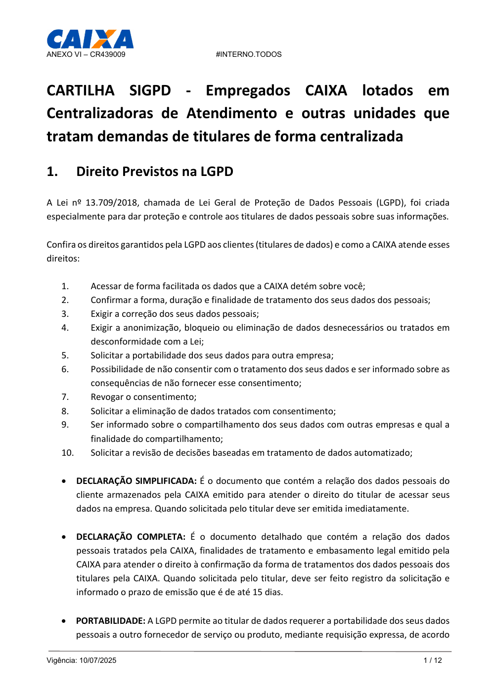

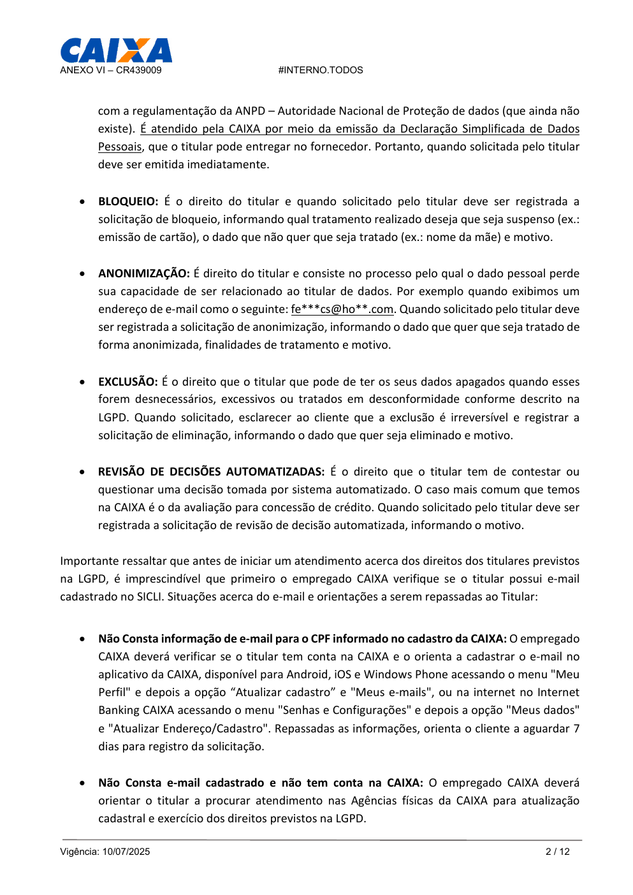

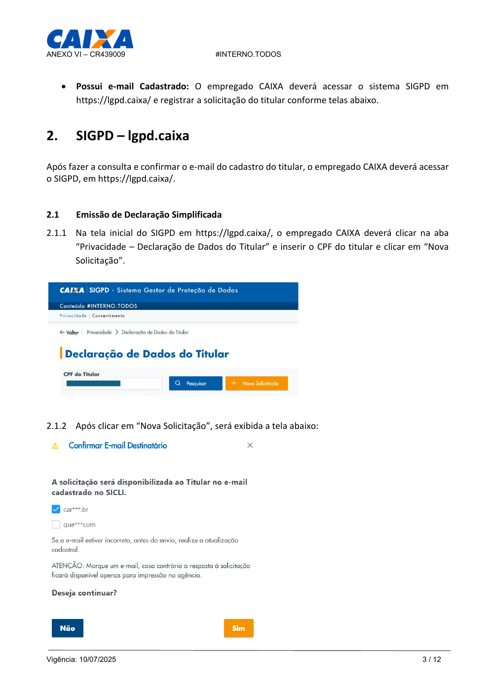

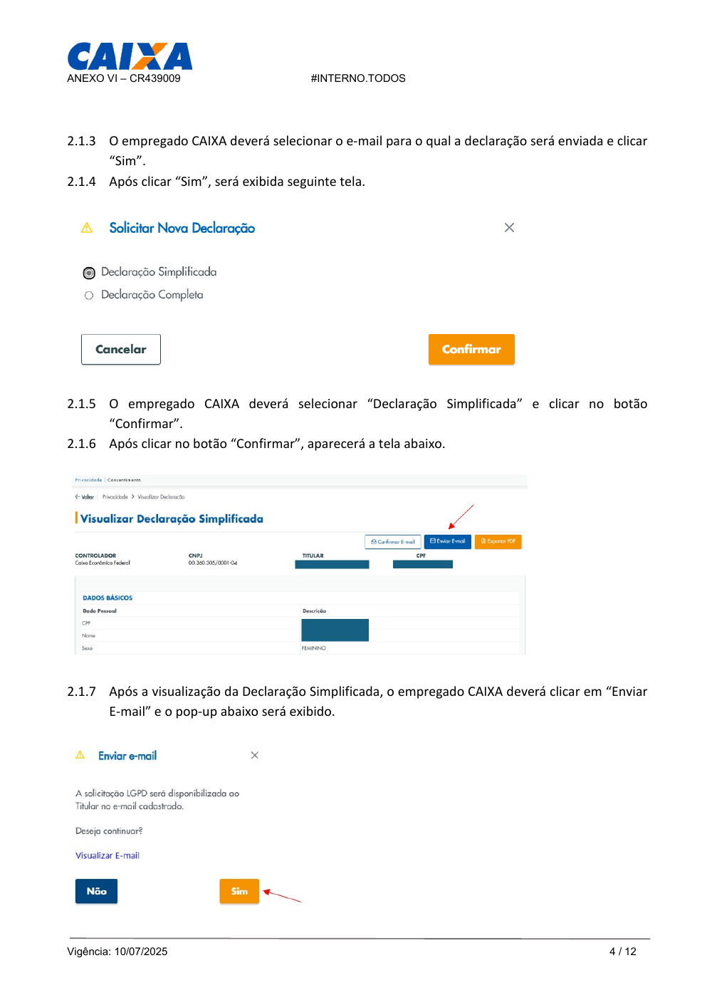

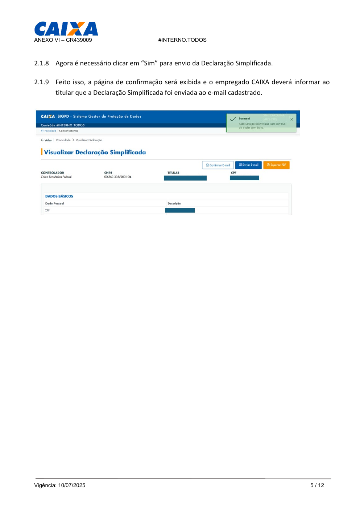

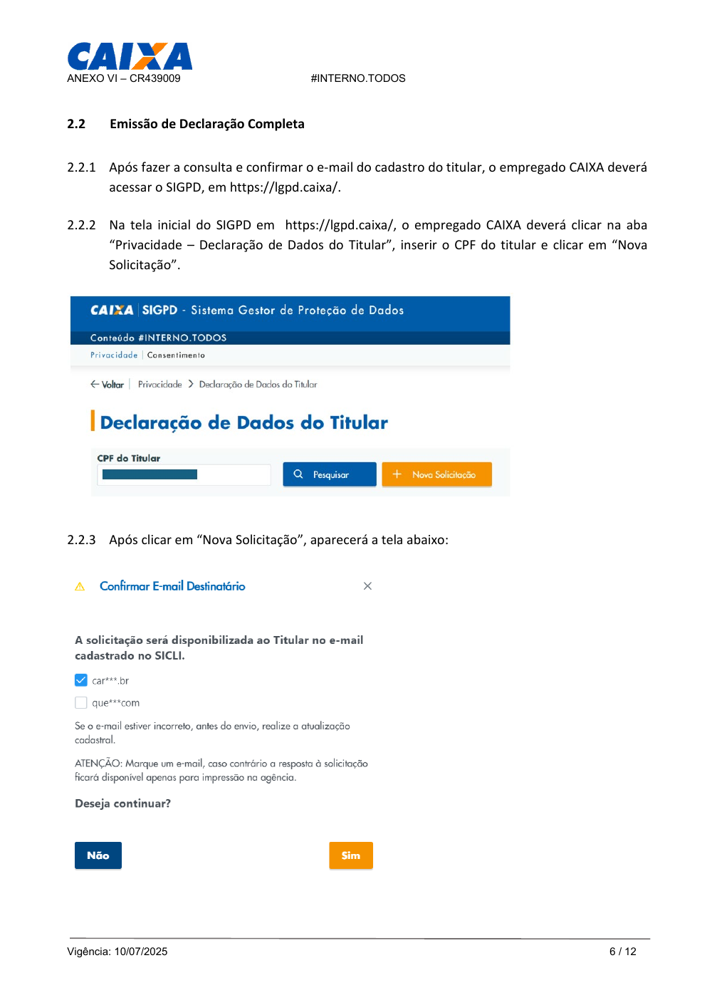

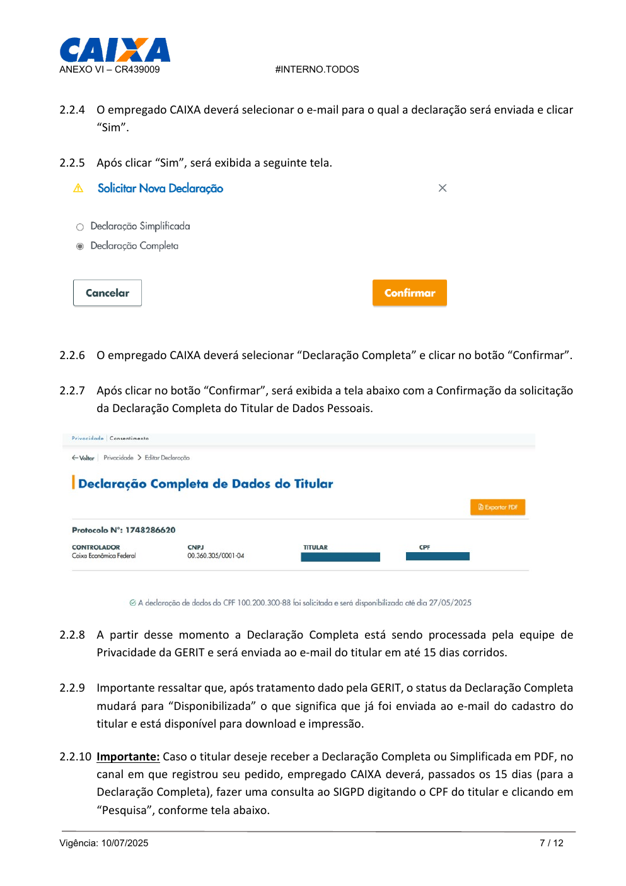

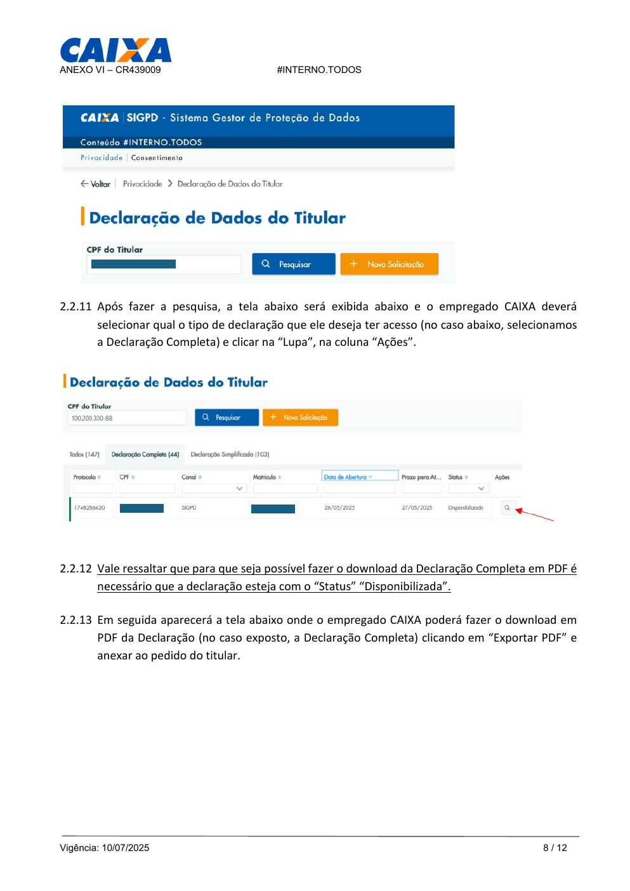

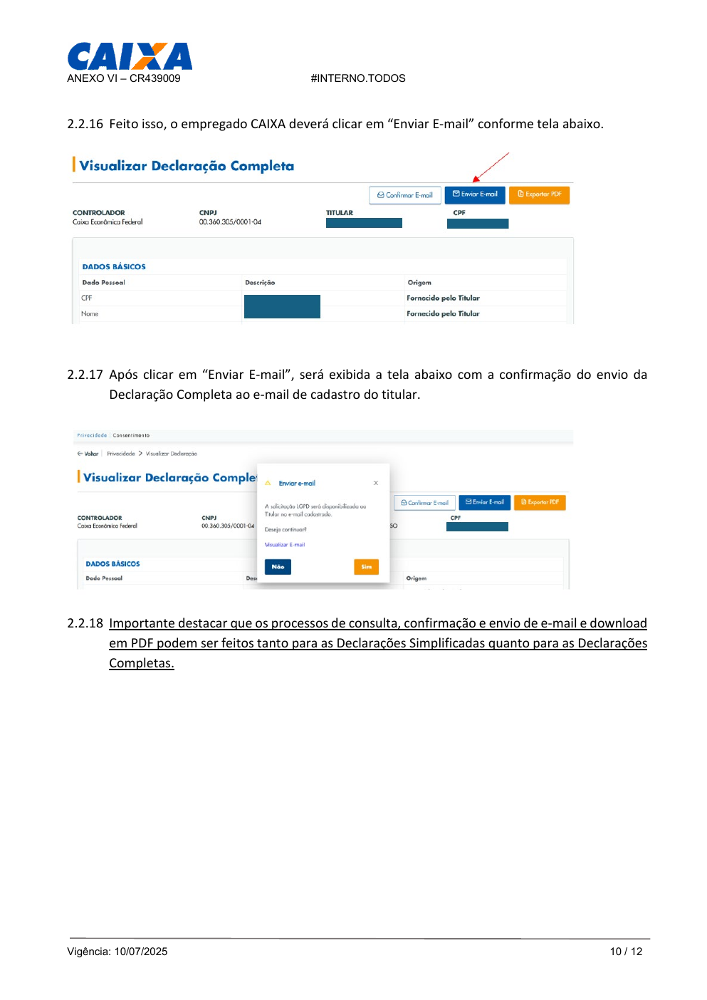

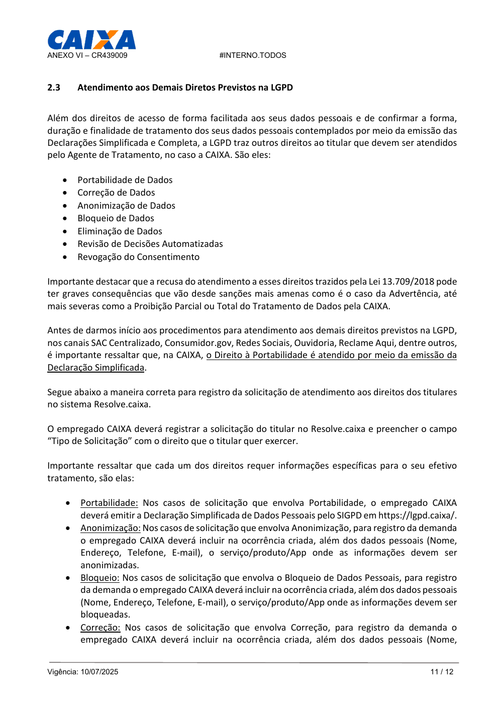

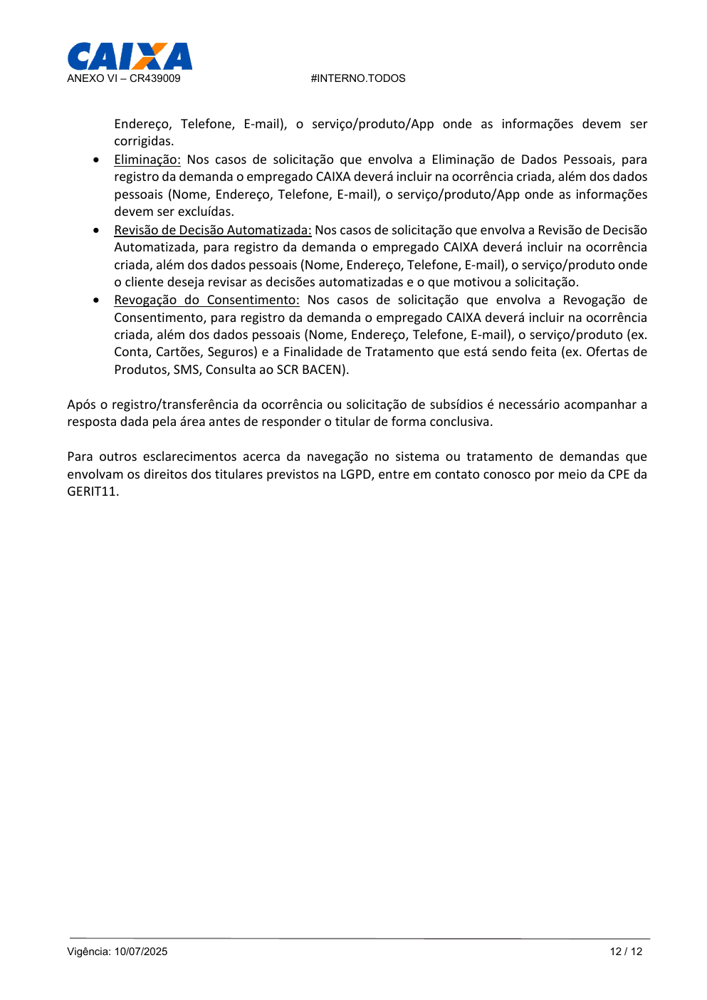

### Texto extraído

<!-- Página 1 -->

CARTILHA SIGPD - Empregados CAIXA lotados em
Centralizadoras de Atendimento e outras unidades que
tratam demandas de titulares de forma centralizada

1. Direito Previstos na LGPD

A Lei nº 13.709/2018, chamada de Lei Geral de Proteção de Dados Pessoais (LGPD), foi criada
especialmente para dar proteção e controle aos titulares de dados pessoais sobre suas informações.

Confira os direitos garantidos pela LGPD aos clientes (titulares de dados) e como a CAIXA atende esses
direitos:

1. Acessar de forma facilitada os dados que a CAIXA detém sobre você;
2. Confirmar a forma, duração e finalidade de tratamento dos seus dados dos pessoais;
3. Exigir a correção dos seus dados pessoais;
4. Exigir a anonimização, bloqueio ou eliminação de dados desnecessários ou tratados em
desconformidade com a Lei;
5. Solicitar a portabilidade dos seus dados para outra empresa;
6. Possibilidade de não consentir com o tratamento dos seus dados e ser informado sobre as
consequências de não fornecer esse consentimento;
7. Revogar o consentimento;
8. Solicitar a eliminação de dados tratados com consentimento;
9. Ser informado sobre o compartilhamento dos seus dados com outras empresas e qual a
finalidade do compartilhamento;
10. Solicitar a revisão de decisões baseadas em tratamento de dados automatizado;

- DECLARAÇÃO SIMPLIFICADA: É o documento que contém a relação dos dados pessoais do
cliente armazenados pela CAIXA emitido para atender o direito do titular de acessar seus
dados na empresa. Quando solicitada pelo titular deve ser emitida imediatamente.

- DECLARAÇÃO COMPLETA: É o documento detalhado que contém a relação dos dados
pessoais tratados pela CAIXA, finalidades de tratamento e embasamento legal emitido pela
CAIXA para atender o direito à confirmação da forma de tratamentos dos dados pessoais dos
titulares pela CAIXA. Quando solicitada pelo titular, deve ser feito registro da solicitação e
informado o prazo de emissão que é de até 15 dias.

- PORTABILIDADE: A LGPD permite ao titular de dados requerer a portabilidade dos seus dados
pessoais a outro fornecedor de serviço ou produto, mediante requisição expressa, de acordo

---

<!-- Página 2 -->

com a regulamentação da ANPD – Autoridade Nacional de Proteção de dados (que ainda não
existe). É atendido pela CAIXA por meio da emissão da Declaração Simplificada de Dados
Pessoais, que o titular pode entregar no fornecedor. Portanto, quando solicitada pelo titular
deve ser emitida imediatamente.

- BLOQUEIO: É o direito do titular e quando solicitado pelo titular deve ser registrada a
solicitação de bloqueio, informando qual tratamento realizado deseja que seja suspenso (ex.:
emissão de cartão), o dado que não quer que seja tratado (ex.: nome da mãe) e motivo.

- ANONIMIZAÇÃO: É direito do titular e consiste no processo pelo qual o dado pessoal perde
sua capacidade de ser relacionado ao titular de dados. Por exemplo quando exibimos um
endereço de e-mail como o seguinte: fe***cs@ho**.com. Quando solicitado pelo titular deve
ser registrada a solicitação de anonimização, informando o dado que quer que seja tratado de
forma anonimizada, finalidades de tratamento e motivo.

- EXCLUSÃO: É o direito que o titular que pode de ter os seus dados apagados quando esses
forem desnecessários, excessivos ou tratados em desconformidade conforme descrito na
LGPD. Quando solicitado, esclarecer ao cliente que a exclusão é irreversível e registrar a
solicitação de eliminação, informando o dado que quer seja eliminado e motivo.

- REVISÃO DE DECISÕES AUTOMATIZADAS: É o direito que o titular tem de contestar ou
questionar uma decisão tomada por sistema automatizado. O caso mais comum que temos
na CAIXA é o da avaliação para concessão de crédito. Quando solicitado pelo titular deve ser
registrada a solicitação de revisão de decisão automatizada, informando o motivo.

Importante ressaltar que antes de iniciar um atendimento acerca dos direitos dos titulares previstos
na LGPD, é imprescindível que primeiro o empregado CAIXA verifique se o titular possui e-mail
cadastrado no SICLI. Situações acerca do e-mail e orientações a serem repassadas ao Titular:

- Não Consta informação de e-mail para o CPF informado no cadastro da CAIXA: O empregado
CAIXA deverá verificar se o titular tem conta na CAIXA e o orienta a cadastrar o e-mail no
aplicativo da CAIXA, disponível para Android, iOS e Windows Phone acessando o menu "Meu
Perfil" e depois a opção “Atualizar cadastro” e "Meus e-mails", ou na internet no Internet
Banking CAIXA acessando o menu "Senhas e Configurações" e depois a opção "Meus dados"
e "Atualizar Endereço/Cadastro". Repassadas as informações, orienta o cliente a aguardar 7
dias para registro da solicitação.

- Não Consta e-mail cadastrado e não tem conta na CAIXA: O empregado CAIXA deverá
orientar o titular a procurar atendimento nas Agências físicas da CAIXA para atualização
cadastral e exercício dos direitos previstos na LGPD.

---

<!-- Página 3 -->

- Possui e-mail Cadastrado: O empregado CAIXA deverá acessar o sistema SIGPD em
https://lgpd.caixa/ e registrar a solicitação do titular conforme telas abaixo.

2. SIGPD – lgpd.caixa

Após fazer a consulta e confirmar o e-mail do cadastro do titular, o empregado CAIXA deverá acessar
o SIGPD, em https://lgpd.caixa/.

### 2.1 Emissão de Declaração Simplificada
**2.1.1** Na tela inicial do SIGPD em https://lgpd.caixa/, o empregado CAIXA deverá clicar na aba
“Privacidade – Declaração de Dados do Titular” e inserir o CPF do titular e clicar em “Nova
Solicitação”.

**2.1.2** Após clicar em “Nova Solicitação”, será exibida a tela abaixo:

---

<!-- Página 4 -->

**2.1.3** O empregado CAIXA deverá selecionar o e-mail para o qual a declaração será enviada e clicar
“Sim”.
**2.1.4** Após clicar “Sim”, será exibida seguinte tela.

**2.1.5** O empregado CAIXA deverá selecionar “Declaração Simplificada” e clicar no botão
“Confirmar”.
**2.1.6** Após clicar no botão “Confirmar”, aparecerá a tela abaixo.

**2.1.7** Após a visualização da Declaração Simplificada, o empregado CAIXA deverá clicar em “Enviar
E-mail” e o pop-up abaixo será exibido.

---

<!-- Página 5 -->

**2.1.8** Agora é necessário clicar em “Sim” para envio da Declaração Simplificada.

#### 2.1.9 Feito isso, a página de confirmação será exibida e o empregado CAIXA deverá informar ao
titular que a Declaração Simplificada foi enviada ao e-mail cadastrado.

---

<!-- Página 6 -->

### 2.2 Emissão de Declaração Completa

**2.2.1** Após fazer a consulta e confirmar o e-mail do cadastro do titular, o empregado CAIXA deverá
acessar o SIGPD, em https://lgpd.caixa/.

**2.2.2** Na tela inicial do SIGPD em https://lgpd.caixa/, o empregado CAIXA deverá clicar na aba
“Privacidade – Declaração de Dados do Titular”, inserir o CPF do titular e clicar em “Nova
Solicitação”.

**2.2.3** Após clicar em “Nova Solicitação”, aparecerá a tela abaixo:

---

<!-- Página 7 -->

**2.2.4** O empregado CAIXA deverá selecionar o e-mail para o qual a declaração será enviada e clicar
“Sim”.

**2.2.5** Após clicar “Sim”, será exibida a seguinte tela.

**2.2.6** O empregado CAIXA deverá selecionar “Declaração Completa” e clicar no botão “Confirmar”.

**2.2.7** Após clicar no botão “Confirmar”, será exibida a tela abaixo com a Confirmação da solicitação
da Declaração Completa do Titular de Dados Pessoais.

#### 2.2.8 A partir desse momento a Declaração Completa está sendo processada pela equipe de
Privacidade da GERIT e será enviada ao e-mail do titular em até 15 dias corridos.

#### 2.2.9 Importante ressaltar que, após tratamento dado pela GERIT, o status da Declaração Completa
mudará para “Disponibilizada” o que significa que já foi enviada ao e-mail do cadastro do
titular e está disponível para download e impressão.

**2.2.10** Importante: Caso o titular deseje receber a Declaração Completa ou Simplificada em PDF, no
canal em que registrou seu pedido, empregado CAIXA deverá, passados os 15 dias (para a
Declaração Completa), fazer uma consulta ao SIGPD digitando o CPF do titular e clicando em
“Pesquisa”, conforme tela abaixo.

---

<!-- Página 8 -->

#### 2.2.11 Após fazer a pesquisa, a tela abaixo será exibida abaixo e o empregado CAIXA deverá
selecionar qual o tipo de declaração que ele deseja ter acesso (no caso abaixo, selecionamos
a Declaração Completa) e clicar na “Lupa”, na coluna “Ações”.

#### 2.2.12 Vale ressaltar que para que seja possível fazer o download da Declaração Completa em PDF é
necessário que a declaração esteja com o “Status” “Disponibilizada”.

#### 2.2.13 Em seguida aparecerá a tela abaixo onde o empregado CAIXA poderá fazer o download em
PDF da Declaração (no caso exposto, a Declaração Completa) clicando em “Exportar PDF” e
anexar ao pedido do titular.

---

<!-- Página 9 -->

**2.2.14** Importante: Caso o titular informe que já passaram os 15 dias da solicitação e ainda não
recebeu o e-mail, o empregado CAIXA poderá clicar em “Confirmar E-mail”, conforme tela
abaixo.

**2.2.15** Na tela abaixo deverá selecionar o E-mail em que o titular deseja receber a Declaração e clicar
em “Sim”.

---

<!-- Página 10 -->

**2.2.16** Feito isso, o empregado CAIXA deverá clicar em “Enviar E-mail” conforme tela abaixo.

**2.2.17** Após clicar em “Enviar E-mail”, será exibida a tela abaixo com a confirmação do envio da
Declaração Completa ao e-mail de cadastro do titular.

#### 2.2.18 Importante destacar que os processos de consulta, confirmação e envio de e-mail e download
em PDF podem ser feitos tanto para as Declarações Simplificadas quanto para as Declarações
Completas.

---

<!-- Página 11 -->

### 2.3 Atendimento aos Demais Diretos Previstos na LGPD

Além dos direitos de acesso de forma facilitada aos seus dados pessoais e de confirmar a forma,
duração e finalidade de tratamento dos seus dados pessoais contemplados por meio da emissão das
Declarações Simplificada e Completa, a LGPD traz outros direitos ao titular que devem ser atendidos
pelo Agente de Tratamento, no caso a CAIXA. São eles:

- Portabilidade de Dados
- Correção de Dados
- Anonimização de Dados
- Bloqueio de Dados
- Eliminação de Dados
- Revisão de Decisões Automatizadas
- Revogação do Consentimento

Importante destacar que a recusa do atendimento a esses direitos trazidos pela Lei 13.709/2018 pode
ter graves consequências que vão desde sanções mais amenas como é o caso da Advertência, até
mais severas como a Proibição Parcial ou Total do Tratamento de Dados pela CAIXA.

Antes de darmos início aos procedimentos para atendimento aos demais direitos previstos na LGPD,
nos canais SAC Centralizado, Consumidor.gov, Redes Sociais, Ouvidoria, Reclame Aqui, dentre outros,
é importante ressaltar que, na CAIXA, o Direito à Portabilidade é atendido por meio da emissão da
Declaração Simplificada.

Segue abaixo a maneira correta para registro da solicitação de atendimento aos direitos dos titulares
no sistema Resolve.caixa.

O empregado CAIXA deverá registrar a solicitação do titular no Resolve.caixa e preencher o campo
“Tipo de Solicitação” com o direito que o titular quer exercer.

Importante ressaltar que cada um dos direitos requer informações específicas para o seu efetivo
tratamento, são elas:

- Portabilidade: Nos casos de solicitação que envolva Portabilidade, o empregado CAIXA
deverá emitir a Declaração Simplificada de Dados Pessoais pelo SIGPD em https://lgpd.caixa/.
- Anonimização: Nos casos de solicitação que envolva Anonimização, para registro da demanda
o empregado CAIXA deverá incluir na ocorrência criada, além dos dados pessoais (Nome,
Endereço, Telefone, E-mail), o serviço/produto/App onde as informações devem ser
anonimizadas.
- Bloqueio: Nos casos de solicitação que envolva o Bloqueio de Dados Pessoais, para registro
da demanda o empregado CAIXA deverá incluir na ocorrência criada, além dos dados pessoais
(Nome, Endereço, Telefone, E-mail), o serviço/produto/App onde as informações devem ser
bloqueadas.
- Correção: Nos casos de solicitação que envolva Correção, para registro da demanda o
empregado CAIXA deverá incluir na ocorrência criada, além dos dados pessoais (Nome,

---

<!-- Página 12 -->

Endereço, Telefone, E-mail), o serviço/produto/App onde as informações devem ser
corrigidas.
- Eliminação: Nos casos de solicitação que envolva a Eliminação de Dados Pessoais, para
registro da demanda o empregado CAIXA deverá incluir na ocorrência criada, além dos dados
pessoais (Nome, Endereço, Telefone, E-mail), o serviço/produto/App onde as informações
devem ser excluídas.
- Revisão de Decisão Automatizada: Nos casos de solicitação que envolva a Revisão de Decisão
Automatizada, para registro da demanda o empregado CAIXA deverá incluir na ocorrência
criada, além dos dados pessoais (Nome, Endereço, Telefone, E-mail), o serviço/produto onde
o cliente deseja revisar as decisões automatizadas e o que motivou a solicitação.
- Revogação do Consentimento: Nos casos de solicitação que envolva a Revogação de
Consentimento, para registro da demanda o empregado CAIXA deverá incluir na ocorrência
criada, além dos dados pessoais (Nome, Endereço, Telefone, E-mail), o serviço/produto (ex.
Conta, Cartões, Seguros) e a Finalidade de Tratamento que está sendo feita (ex. Ofertas de
Produtos, SMS, Consulta ao SCR BACEN).

Após o registro/transferência da ocorrência ou solicitação de subsídios é necessário acompanhar a
resposta dada pela área antes de responder o titular de forma conclusiva.

Para outros esclarecimentos acerca da navegação no sistema ou tratamento de demandas que
envolvam os direitos dos titulares previstos na LGPD, entre em contato conosco por meio da CPE da
GERIT11.

---
