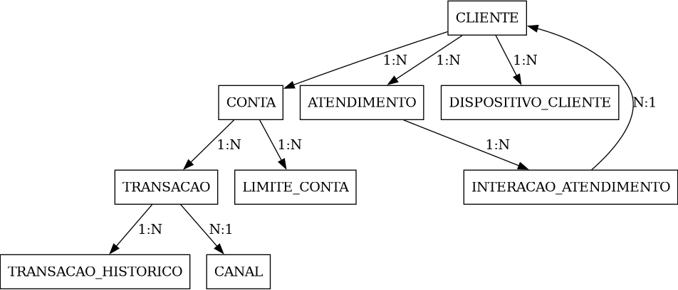
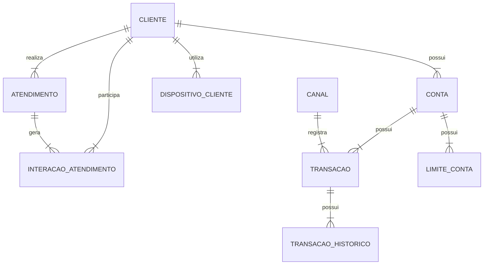

# Formulário de orientação e realização da Produção Temática

**PSI N. 15358**

## 1. Unidade demandante

| Código | Nome |
|---:|---|
| 5229 | GECPA |

## 2. Unidade(s) de provimento

| Código | Nome |
|---:|---|
| 5229 | GECPA |

## 3. Função gratificada

| Código | Nome |
|---:|---|
| 2030 | COOR PROJETOS/PROCESSOS MATRIZ |

## 4. Orientações para a Produção Temática — tema, formatação e informações adicionais

**Tema:** Estudo de Caso do Sistema de Atendimento Digital (SIADL)

**Formatação:**

- Documento técnico em PDF;
- Extensão sugerida: até 10 páginas;
- Fonte Arial tamanho 12.

## 5. Elaboração da Produção Temática

### 1. Contextualização

Uma instituição financeira possui um sistema corporativo de atendimento digital utilizado por milhões de clientes diariamente.

Nos últimos meses, o SIADL passou apresentar:

- Dados inconsistentes;
- Lentidão generalizada da aplicação;
- Timeout em operações críticas;
- Crescimento acelerado de tabelas transacionais;
- Aumento de incidentes operacionais;
- Picos de CPU;
- Consumo excessivo de memória.

A diretoria identificou que os principais problemas estão relacionados ao ambiente de banco de dados relacional do SIADL.

*O candidato atuará como coordenador técnico responsável por diagnosticar os problemas e propor soluções estruturais nos modelos de dados conceitual e físico.*

### 2. Arquitetura do SIADL

- Banco de dados relacional corporativo Microsoft SQL Server 2025;
- Ambiente OLTP crítico;
- Aproximadamente 12 TB de dados;
- Mais de 10 mil usuários simultâneos;
- Processamento médio de 25 mil transações por minuto;
- Não possui integração com APIs e microsserviços;
- Janela reduzida para manutenção.

### 3. Definições e Características Técnicas Atuais dos Objetos do SIADL


# Diagrama Entidade-Relacionamento



## Versão em tabela dos relacionamentos

| Entidade Origem | Cardinalidade | Entidade Destino | Interpretação |
|---|---:|---|---|
| CLIENTE | 1:N | CONTA | Um cliente pode possuir várias contas |
| CLIENTE | 1:N | ATENDIMENTO | Um cliente pode realizar vários atendimentos |
| CLIENTE | 1:N | DISPOSITIVO_CLIENTE | Um cliente pode ter vários dispositivos cadastrados |
| CLIENTE | 1:N | INTERACAO_ATENDIMENTO | Um cliente pode participar de várias interações de atendimento |
| CONTA | 1:N | TRANSACAO | Uma conta pode possuir várias transações |
| CONTA | 1:N | LIMITE_CONTA | Uma conta pode possuir vários registros de limite |
| ATENDIMENTO | 1:N | INTERACAO_ATENDIMENTO | Um atendimento pode gerar várias interações |
| TRANSACAO | 1:N | TRANSACAO_HISTORICO | Uma transação pode possuir vários históricos |
| TRANSACAO | N:1 | CANAL | Várias transações podem estar associadas a um canal |

```mermaid
erDiagram
    %% Relacionamentos do Cliente
    CLIENTE ||--o{ CONTA : "possui"
    CLIENTE ||--o{ ATENDIMENTO : "realiza"
    CLIENTE ||--o{ DISPOSITIVO_CLIENTE : "tem cadastrado"
    CLIENTE ||--o{ INTERACAO_ATENDIMENTO : "participa de"

    %% Relacionamentos da Conta
    CONTA ||--o{ TRANSACAO : "possui"
    CONTA ||--o{ LIMITE_CONTA : "possui"

    %% Relacionamentos do Atendimento
    ATENDIMENTO ||--o{ INTERACAO_ATENDIMENTO : "gera"

    %% Relacionamentos da Transação e Canal
    TRANSACAO ||--o{ TRANSACAO_HISTORICO : "possui"
    CANAL ||--o{ TRANSACAO : "associa"
### 3.1 Definição negocial e técnica dos Objetos

#### CLIENTE

**Descrição**

Representa a entidade central do domínio, responsável por armazenar os dados cadastrais dos clientes da instituição, sejam pessoas físicas ou jurídicas. Esta entidade contém atributos de identificação, classificação e estado do cliente ao longo do ciclo de vida.

**Atributos**

nome, documento, data_cadastro, status_cliente, segmento

**Características técnicas**

- Volume alto (~100 milhões) com crescimento anual contínuo (~10% a.a);
- Baixa taxa de alteração relativa (perfil de dado mestre);
- Alto volume de consulta e junção com entidades operacionais (CONTA, ATENDIMENTO, TRANSACAO indireto).

#### CONTA

**Descrição**

Armazena informações das contas vinculadas a clientes, incluindo identificação bancária, tipo, data de abertura e status. Representa a unidade básica de relacionamento transacional entre cliente e instituição.

**Atributos**

id_cliente, numero_conta, tipo_conta, data_abertura, status_conta

**Características técnicas**

- Volume muito alto (~500 milhões);
- Crescimento elevado (~20% a.a);
- Alta cardinalidade por cliente (1:N);
- Forte dependência em operações transacionais.

#### ATENDIMENTO

**Descrição**

Registra as interações estruturadas de atendimento ao cliente, contemplando abertura, acompanhamento e encerramento de solicitações, reclamações ou serviços.

**Atributos**

id_cliente, canal, data_abertura, data_fechamento, status_atendimento, prioridade

**Características técnicas**

- Volume extremamente alto (~800 milhões);
- Crescimento explosivo (~20% ao mês);
- Alta taxa de inserção e atualização;
- Entidade operacional crítica.

#### INTERACAO_ATENDIMENTO

**Descrição**

Armazena o detalhamento das interações associadas a um atendimento, como mensagens, registros de contato e eventos operacionais. Representa o histórico granular do atendimento.

**Atributos**

id_atendimento, tipo_interacao, data_hora, origem, conteudo_resumido

**Características técnicas**

- Volume massivo (~1 bilhão);
- Crescimento exponencial (~20% ao mês);
- Alta granularidade (múltiplas interações por atendimento).

#### TRANSACAO

**Descrição**

Registra todas as operações financeiras realizadas nas contas, incluindo movimentações monetárias, status e canal de origem.

**Atributos**

id_conta, data_hora_transacao, valor, tipo_transacao, status_transacao, id_canal

**Características técnicas**

- Volume extremamente crítico (~4 bilhões);
- Crescimento altíssimo (~30% ao mês);
- Alta concorrência (OLTP pesado).

#### CANAL

**Descrição**

Tabela de domínio que representa os canais de interação ou execução de transações, como mobile, internet banking, agência, etc.

**Atributos**

descricao_canal, tipo_canal, status_canal

**Características técnicas**

- Baixíssima volumetria (~10 registros);
- Não requer particionamento.

#### DISPOSITIVO_CLIENTE

**Descrição**

Armazena os dispositivos vinculados aos clientes, utilizados para autenticação, segurança e rastreabilidade de acesso.

**Atributos**

id_cliente, tipo_dispositivo, sistema_operacional, hash_dispositivo, data_vinculo

**Características técnicas**

- Volume alto (~150 milhões);
- Crescimento moderado (~10% a.a);
- Forte uso em segurança/antifraud.

#### LIMITE_CONTA

**Descrição**

Gerencia os limites operacionais associados às contas, incluindo valores autorizados e períodos de vigência.

**Atributos**

id_conta, tipo_limite, valor_limite, data_inicio_vigencia, data_fim_vigencia

**Características técnicas**

- Volume alto (~1 bilhão);
- Crescimento relevante (~20% a.a);
- Dados temporais (vigência).

#### TRANSACAO_HISTORICO

**Descrição**

Armazena o histórico de alterações de estado das transações, permitindo rastreabilidade completa das mudanças ao longo do ciclo de vida da transação.

**Atributos**

id_transacao, data_evento, status_anterior, status_novo, origem_evento

**Características técnicas**

- Volume extremamente massivo (~10 bilhões);
- Crescimento muito alto (~30% a.m);
- Alta taxa de inserção;
- Baixíssima atualização (append-only).

### 3.2 DDL Implementada no Banco de Dados SQL Server

```sql
CREATE TABLE CLIENTE (
    id_cliente BIGINT PRIMARY KEY,
    nome_cliente VARCHAR(150) NOT NULL,
    documento_cliente VARCHAR(20) NOT NULL UNIQUE,
    data_cadastro TIMESTAMP NOT NULL,
    status_cliente VARCHAR(20) NOT NULL,
    segmento VARCHAR(30) NOT NULL
);

CREATE TABLE CANAL (
    id_canal INT PRIMARY KEY,
    descricao_canal VARCHAR(80) NOT NULL,
    tipo_canal VARCHAR(30) NOT NULL,
    status_canal VARCHAR(20) NOT NULL
);

CREATE TABLE CONTA (
    id_conta BIGINT PRIMARY KEY,
    id_cliente BIGINT NOT NULL,
    numero_conta VARCHAR(30) NOT NULL UNIQUE,
    tipo_conta VARCHAR(30) NOT NULL,
    data_abertura TIMESTAMP NOT NULL,
    status_conta VARCHAR(20) NOT NULL,
    CONSTRAINT fk_conta_cliente FOREIGN KEY (id_cliente) REFERENCES CLIENTE(id_cliente)
);

CREATE TABLE ATENDIMENTO (
    id_atendimento BIGINT PRIMARY KEY,
    id_cliente BIGINT NOT NULL,
    canal VARCHAR(30) NOT NULL,
    data_abertura TIMESTAMP NOT NULL,
    data_fechamento TIMESTAMP NULL,
    status_atendimento VARCHAR(20) NOT NULL,
    prioridade VARCHAR(20) NOT NULL,
    CONSTRAINT fk_atendimento_cliente FOREIGN KEY (id_cliente) REFERENCES CLIENTE(id_cliente)
);

CREATE TABLE INTERACAO_ATENDIMENTO (
    id_interacao BIGINT PRIMARY KEY,
    id_atendimento BIGINT NOT NULL,
    tipo_interacao VARCHAR(30) NOT NULL,
    data_hora TIMESTAMP NOT NULL,
    origem VARCHAR(30) NOT NULL,
    conteudo_resumido VARCHAR(500) NULL,
    CONSTRAINT fk_interacao_atendimento FOREIGN KEY (id_atendimento) REFERENCES ATENDIMENTO(id_atendimento)
);

CREATE TABLE DISPOSITIVO_CLIENTE (
    id_dispositivo BIGINT PRIMARY KEY,
    id_cliente BIGINT NOT NULL,
    tipo_dispositivo VARCHAR(30) NOT NULL,
    sistema_operacional VARCHAR(30) NOT NULL,
    hash_dispositivo VARCHAR(128) NOT NULL UNIQUE,
    data_vinculo TIMESTAMP NOT NULL,
    CONSTRAINT fk_dispositivo_cliente FOREIGN KEY (id_cliente) REFERENCES CLIENTE(id_cliente)
);

CREATE TABLE LIMITE_CONTA (
    id_limite BIGINT PRIMARY KEY,
    id_conta BIGINT NOT NULL,
    tipo_limite VARCHAR(30) NOT NULL,
    valor_limite DECIMAL(18,2) NOT NULL,
    data_inicio_vigencia TIMESTAMP NOT NULL,
    data_fim_vigencia TIMESTAMP NULL,
    CONSTRAINT fk_limite_conta FOREIGN KEY (id_conta) REFERENCES CONTA(id_conta),
    CONSTRAINT ck_valor_limite CHECK (valor_limite >= 0)
);

CREATE TABLE TRANSACAO (
    id_transacao BIGINT PRIMARY KEY,
    id_conta BIGINT NOT NULL,
    id_canal INT NOT NULL,
    data_hora_transacao TIMESTAMP NOT NULL,
    valor DECIMAL(18,2) NOT NULL,
    tipo_transacao VARCHAR(30) NOT NULL,
    status_transacao VARCHAR(20) NOT NULL,
    CONSTRAINT fk_transacao_conta FOREIGN KEY (id_conta) REFERENCES CONTA(id_conta),
    CONSTRAINT fk_transacao_canal FOREIGN KEY (id_canal) REFERENCES CANAL(id_canal),
    CONSTRAINT ck_valor_transacao CHECK (valor > 0)
);

CREATE TABLE TRANSACAO_HISTORICO (
    id_transacao_historico BIGINT PRIMARY KEY,
    id_transacao BIGINT NOT NULL,
    data_evento TIMESTAMP NOT NULL,
    status_anterior VARCHAR(20) NOT NULL,
    status_novo VARCHAR(20) NOT NULL,
    origem_evento VARCHAR(30) NOT NULL,
    CONSTRAINT fk_hist_transacao FOREIGN KEY (id_transacao) REFERENCES TRANSACAO(id_transacao)
);
```

## 4. Desafio do Candidato

O candidato deverá elaborar uma **proposta técnica e gerencial** contendo:

- Apresentação do modelo de dados conceitual ideal aplicando todos os conceitos da modelagem conceitual;
- Apresentação do modelo de dados físico ideal e caso haja necessidade de intervenção no modelo conceitual em função do contexto apresentado que necessite deixá-lo diferente do modelo de dados conceitual, justificar cada uma das eventuais intervenções;
- Considerando que você será o representante do Capítulo de Administração e Banco de Dados dentro de uma Plataforma de Desenvolvimento e, portanto, guardião do processo de evolução do modelo e do banco de dados e ainda responsável pelos administradores de dados (ADs) e administradores de banco de dados (DBAs) que atuam nos squads desta plataforma:

  a) Elabore um plano de trabalho para a atuação do ADs e DBAs, explicitando as fronteiras de suas atuações, bem como a dinâmica de interação destes com o time de desenvolvimento, visando máxima efetividade e sinergia dentro do squad.

  b) Elabore uma estratégia para a evolução das demandas de banco de dados que conforme ocorre o crescimento vegetativo do banco de dados, haja proativamente sempre que possível e corretivamente de forma tempestiva visando manter o banco o mais adequado ao comportamento atual da solução em termos de desenho/arquitetura, performance, integridade, segurança e disponibilidade.

---

**Versão:** 27.03.2024
