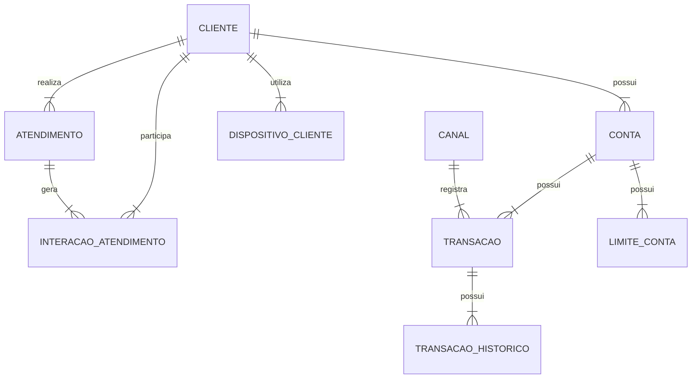

# Diagrama Entidade-Relacionamento



## Versão em tabela dos relacionamentos

| Entidade Origem | Cardinalidade | Entidade Destino | Interpretação |
|---|---:|---|---|
| CLIENTE | 1:N | CONTA | Um cliente pode possuir várias contas |
| CLIENTE | 1:N | ATENDIMENTO | Um cliente pode realizar vários atendimentos |
| CLIENTE | 1:N | DISPOSITIVO_CLIENTE | Um cliente pode ter vários dispositivos cadastrados |
| CLIENTE | 1:N | INTERACAO_ATENDIMENTO | Um cliente pode participar de várias interações de atendimento |
| CONTA | 1:N | TRANSACAO | Uma conta pode possuir várias transações |
| CONTA | 1:N | LIMITE_CONTA | Uma conta pode possuir vários registros de limite |
| ATENDIMENTO | 1:N | INTERACAO_ATENDIMENTO | Um atendimento pode gerar várias interações |
| TRANSACAO | 1:N | TRANSACAO_HISTORICO | Uma transação pode possuir vários históricos |
| TRANSACAO | N:1 | CANAL | Várias transações podem estar associadas a um canal |

```mermaid
erDiagram
    %% Relacionamentos do Cliente
    CLIENTE ||--o{ CONTA : "possui"
    CLIENTE ||--o{ ATENDIMENTO : "realiza"
    CLIENTE ||--o{ DISPOSITIVO_CLIENTE : "tem cadastrado"
    CLIENTE ||--o{ INTERACAO_ATENDIMENTO : "participa de"

    %% Relacionamentos da Conta
    CONTA ||--o{ TRANSACAO : "possui"
    CONTA ||--o{ LIMITE_CONTA : "possui"

    %% Relacionamentos do Atendimento
    ATENDIMENTO ||--o{ INTERACAO_ATENDIMENTO : "gera"

    %% Relacionamentos da Transação e Canal
    TRANSACAO ||--o{ TRANSACAO_HISTORICO : "possui"
    CANAL ||--o{ TRANSACAO : "associa"