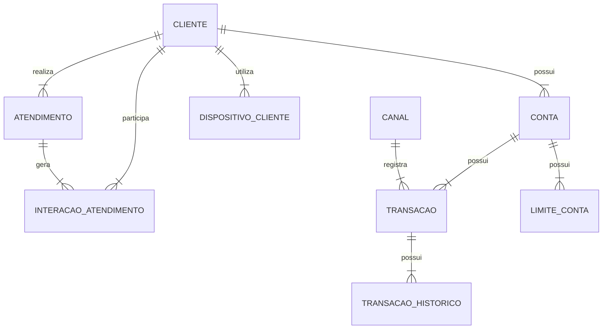

Bloco A — Interpretação do enunciado e expectativa da banca (1–5)
1 Qual é o peso relativo entre as 4 entregas? O enunciado não define pontuação por item — a banca valorizará mais o modelo conceitual/físico (visão técnica) ou o plano AD/DBA e a estratégia de evolução (visão de coordenador, que é a função em disputa)?

R. Todos tem importancia relevante, ou seja e de plena importancia demostrar conhecimento avançado (acima da media) bem como soluções que um proficional com muita experiencia podera dar, sempre aliando com a estrategia de evolução visão do coordenador.Colocar o basico que todos estão esperando sempre espandindo complementando com coisas que somente profissionais diferenciados fazem.

2 O que a banca entende por "todos os conceitos da modelagem conceitual"? A lista de conceitos esperados inclui generalização/especialização (CLIENTE PF × PJ, sugerida pelo atributo segmento?) ou basta entidade forte/fraca, cardinalidade, domínio e histórico?

R. Tem que ser completo quando eles citam que querem todos os conceitos eles querem que abordam tudo, ou seja o simples e depois especifica(deixando tudo coeso com as informações feitas) 

3 A frase "caso haja necessidade de intervenção no modelo conceitual... que necessite deixá-lo diferente do modelo físico" exige que eu apresente divergências, ou apenas que as justifique SE existirem? Um texto sem nenhuma divergência justificada seria interpretado como superficial?
No caso 

R. O apomtamento seria apenas que as justifique SE existirem, não invente nada (a pegadinha pode estar aqui), Basea-se no que é estabelecido como padrão definido pelo seguimento e normas/padrão CAIXA. Caso não tenha nenhuma divergencia não apontar. Porém pode colocar considerações apontamentos de eventuais perigos que podem levar a uma divergencia se não forem observados. 

4 O diagrama da imagem (img01.png) do formulário traz relacionamentos ou detalhes que não estão no texto? Preciso confirmar visualmente o diagrama atual dos objetos para não contradizer o enunciado (ex.: ATENDIMENTO já se relaciona com CANAL no diagrama?).

R. Segue diagrama e tabela
# Diagrama Entidade-Relacionamento

## Versão em tabela dos relacionamentos

| Entidade Origem | Cardinalidade | Entidade Destino | Interpretação |
|---|---:|---|---|
| CLIENTE | 1:N | CONTA | Um cliente pode possuir várias contas |
| CLIENTE | 1:N | ATENDIMENTO | Um cliente pode realizar vários atendimentos |
| CLIENTE | 1:N | DISPOSITIVO_CLIENTE | Um cliente pode ter vários dispositivos cadastrados |
| CLIENTE | 1:N | INTERACAO_ATENDIMENTO | Um cliente pode participar de várias interações de atendimento |
| CONTA | 1:N | TRANSACAO | Uma conta pode possuir várias transações |
| CONTA | 1:N | LIMITE_CONTA | Uma conta pode possuir vários registros de limite |
| ATENDIMENTO | 1:N | INTERACAO_ATENDIMENTO | Um atendimento pode gerar várias interações |
| TRANSACAO | 1:N | TRANSACAO_HISTORICO | Uma transação pode possuir vários históricos |
| TRANSACAO | N:1 | CANAL | Várias transações podem estar associadas a um canal |

5 "Documento técnico em PDF" implica elementos visuais? A banca espera diagrama ER desenhado (conceitual proposto) ou aceita representação textual/tabular? Um DER visual seria diferencial relevante?
No caso tem que que ser representado visualmente no caso tanto , desenhado para isso podemos fazer uma estrategia para todos elementos visuais, no documento principal pode criar utilizando markdown. Após esse diagrama em markdown coloca referencia a um arquivo, nele ira descrever do se trata o diagrama e todas informações nescessarias para que possa contruir esse diagrama no Drawio ou Power Designer. 
Quando não for possivel criar o diagrama em markdown colocar a referencia ao arquivo somente (coloque de cor vermelha para chamar a atenção, ou fonte grande)  

Bloco B — Decisões técnicas do cenário (6–12)

6 O TIMESTAMP da DDL deve ser tratado como erro de sintaxe portado de outro SGBD (DB2/PostgreSQL) ou como uso deliberado de ROWVERSION? A resposta muda o discurso: migração mal feita (provável, pois TIMESTAMP NOT NULL sem default nem seria utilizável para datas) vs. decisão equivocada.

R. NO caso tem que analisar o que a documentação da caixa define para esse tipo de dado e para o banco alvo que é SQL Server as decisoes tem que ser baseado nisso, se a analise proceder menciona e propoe alteração.

7 Crescimento de 30% a.m. em TRANSACAO é fisicamente insustentável (×23 ao ano) — devo questionar o dado junto ao negócio na própria PT (postura de coordenador: validar premissas) ou aceitá-lo e dimensionar para ele?

R. Devera questionar e mais importante propor soluções, para caso a informação esteja errada, e se a informação proceder, ou seja, essa taxa de crescimento ser essa mesmo, sugerir uma solução podendo ela ser de configuração infra ou estruturação ou remodelagem do codigo para consulta a fim de reduzir transação. (levar em conta problemas semelhantes que teve solução adequada)

8 Qual horizonte de retenção online assumir para as tabelas massivas? O enunciado não define política de retenção — assumo premissa explícita (ex.: 90 dias quente, 12 meses morno, arquivo além disso) e a declaro como decisão de projeto pactuada com o gestor da informação?

R. No caso essa decisão é do gestor negocio(PO) temos que fazer a consideração em cima dos tempos possiveis tipo caso 90 dias .... caso 12 meses ... considerando todos informações que foram descrita na PT

9 CHECK (valor > 0) em TRANSACAO: estornos são registrados como novas transações de tipo específico (mantendo o CHECK) ou como valores negativos (removendo o CHECK)? Qual abordagem a banca consideraria mais madura?

R. Cita abordagens que podem ser realizadas ai mostra o que é bom e o que pode não ser tão bom. Leva em conta o que é aplicado comercialmente e o que representa uma melhor abordagem entre o proficionais da area

10 Índice clustered das tabelas massivas: chave composta (data, id) alinhada à partição ou manter id com OPTIMIZE_FOR_SEQUENTIAL_KEY? Preciso escolher e defender uma — qual se alinha melhor à doutrina corporativa de particionamento?

R. Analise o problema e verifique o que melhor encaixa. Coleta mais informações e realize uma nova pergunta descrevendo o problema melhor, com maior contexto.

11 SQL Server 2025 traz recursos novos que valem citação (ex.: otimizações de tempdb, melhorias em columnstore/IQP)? Citar recursos da versão específica demonstra atualização ou arrisca imprecisão?

R. Sim pode citar recursos novos, tudo que sirva para melhorar a solução.

12 LIMITE_CONTA com vigência: a banca esperaria menção a tabelas temporais do SQL Server (system-versioned temporal tables) como alternativa, ou basta o padrão vigência+índice filtrado?
Coleta mais informações e realize uma nova pergunta descrevendo o problema melhor, com maior contexto.

Bloco C — Aderência aos normativos e materiais disponibilizados (13–17)

13 Devo usar a nomenclatura corporativa (TB_, NU_, CO_, DT_, DH_, VR_, IC_) na pseudo-DDL proposta? Isso demonstra aderência ao TE074/Anexo II — ou a banca prefere manter os nomes do enunciado (id_cliente etc.) para facilitar o cotejo antes→depois?

Sim deve citar que o modelo passado não está aderente as normais e nomenclatura caixa e colocar como ficaria correto.

14 O fluxo formal de validação de modelos (modelo DES no PowerDesigner → pré-validador → solicitação de validação → laudo do AD) deve estruturar o plano do item (a)? Referenciar o processo real do Capítulo é diferencial ou expõe informação interna?

Pode citar o plano de validação mais sem entrar em detalhes.

15 Os papéis "AD Tático" e "AD Time" (do portal do Capítulo) devem aparecer no plano, ou uso apenas a divisão genérica AD × DBA do enunciado?

Coleta mais informações e realize uma nova pergunta descrevendo o problema melhor, com maior contexto.

16 O gatilho corporativo de particionamento (análise para tabelas >100 mi linhas/ano, DATA_COMPRESSION PAGE) citado nos materiais deve ser referenciado como critério objetivo no diagnóstico?
Coleta mais informações e realize uma nova pergunta descrevendo o problema melhor, com maior contexto.

17 TE169 (qualidade de dados) e TE174 (metadados) entram na estratégia do item (b)? O ciclo definição→medição→análise→melhoria e o catálogo/linhagem de metadados fortalecem "integridade" e "governança" — ou fogem do escopo de banco de dados?

Em uma primeira analise entram na estrategia porem Coleta mais informações e realize uma nova pergunta descrevendo o problema melhor, com maior contexto.

Bloco D — Formato, estilo e estratégia de entrega (18–20)

18 Qual o equilíbrio ideal entre texto corrido e tabelas? Documento de 10 páginas com muitas tabelas fica denso; a banca de GECPA (perfil técnico de dados) valoriza densidade tabular ou argumentação discursiva?

Creio que os dois são valorizados o que mais importa e se a informação foi passada de forma coesa. Então preserve isso e vamos arrumando conforme evolução da PT

19 Quanto SQL incluir? A pseudo-DDL de 4 tabelas com destaques antes→depois é suficiente, ou a banca esperaria também exemplos de partition function/scheme, índice filtrado e política de manutenção?
Creio que esperaria também  de partition function/scheme, índice filtrado e política de manutenção

20 Como demonstrar o "tom de coordenador" sem perder profundidade técnica? Estratégias: assumir decisões em primeira pessoa, declarar premissas, priorizar com base em risco×impacto, definir critérios de sucesso mensuráveis — quais desses a banca mais valoriza na função Coordenador de Projetos/Processos Matriz?

Creio que tudo.

Caso alguma pergunta não foi suficiente a resposta, Coleta mais informações e realize uma nova pergunta descrevendo o problema melhor, com maior contexto.