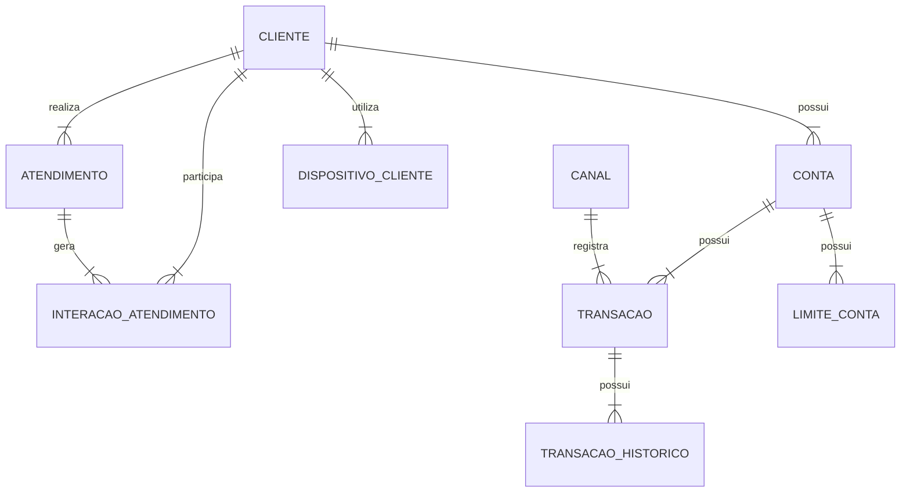

Bloco A — Interpretação do enunciado e expectativa da banca (1–5)
1 Qual é o peso relativo entre as 4 entregas? O enunciado não define pontuação por item — a banca valorizará mais o modelo conceitual/físico (visão técnica) ou o plano AD/DBA e a estratégia de evolução (visão de coordenador, que é a função em disputa)?

R. Todos tem importancia relevante, ou seja e de plena importancia demostrar conhecimento avançado (acima da media) bem como soluções que um proficional com muita experiencia podera dar, sempre aliando com a estrategia de evolução visão do coordenador.Colocar o basico que todos estão esperando sempre espandindo complementando com coisas que somente profissionais diferenciados fazem.

2 O que a banca entende por "todos os conceitos da modelagem conceitual"? A lista de conceitos esperados inclui generalização/especialização (CLIENTE PF × PJ, sugerida pelo atributo segmento?) ou basta entidade forte/fraca, cardinalidade, domínio e histórico?

R. Tem que ser completo quando eles citam que querem todos os conceitos eles querem que abordam tudo, ou seja o simples e depois especifica(deixando tudo coeso com as informações feitas) 

3 A frase "caso haja necessidade de intervenção no modelo conceitual... que necessite deixá-lo diferente do modelo físico" exige que eu apresente divergências, ou apenas que as justifique SE existirem? Um texto sem nenhuma divergência justificada seria interpretado como superficial?
No caso 

R. O apomtamento seria apenas que as justifique SE existirem, não invente nada (a pegadinha pode estar aqui), Basea-se no que é estabelecido como padrão definido pelo seguimento e normas/padrão CAIXA. Caso não tenha nenhuma divergencia não apontar. Porém pode colocar considerações apontamentos de eventuais perigos que podem levar a uma divergencia se não forem observados. 

4 O diagrama da imagem (img01.png) do formulário traz relacionamentos ou detalhes que não estão no texto? Preciso confirmar visualmente o diagrama atual dos objetos para não contradizer o enunciado (ex.: ATENDIMENTO já se relaciona com CANAL no diagrama?).

R. Segue diagrama e tabela
# Diagrama Entidade-Relacionamento

## Versão em tabela dos relacionamentos

| Entidade Origem | Cardinalidade | Entidade Destino | Interpretação |
|---|---:|---|---|
| CLIENTE | 1:N | CONTA | Um cliente pode possuir várias contas |
| CLIENTE | 1:N | ATENDIMENTO | Um cliente pode realizar vários atendimentos |
| CLIENTE | 1:N | DISPOSITIVO_CLIENTE | Um cliente pode ter vários dispositivos cadastrados |
| CLIENTE | 1:N | INTERACAO_ATENDIMENTO | Um cliente pode participar de várias interações de atendimento |
| CONTA | 1:N | TRANSACAO | Uma conta pode possuir várias transações |
| CONTA | 1:N | LIMITE_CONTA | Uma conta pode possuir vários registros de limite |
| ATENDIMENTO | 1:N | INTERACAO_ATENDIMENTO | Um atendimento pode gerar várias interações |
| TRANSACAO | 1:N | TRANSACAO_HISTORICO | Uma transação pode possuir vários históricos |
| TRANSACAO | N:1 | CANAL | Várias transações podem estar associadas a um canal |

5 "Documento técnico em PDF" implica elementos visuais? A banca espera diagrama ER desenhado (conceitual proposto) ou aceita representação textual/tabular? Um DER visual seria diferencial relevante?
No caso tem que que ser representado visualmente no caso tanto , desenhado para isso podemos fazer uma estrategia para todos elementos visuais, no documento principal pode criar utilizando markdown. Após esse diagrama em markdown coloca referencia a um arquivo, nele ira descrever do se trata o diagrama e todas informações nescessarias para que possa contruir esse diagrama no Drawio ou Power Designer. 
Quando não for possivel criar o diagrama em markdown colocar a referencia ao arquivo somente (coloque de cor vermelha para chamar a atenção, ou fonte grande)  

Bloco B — Decisões técnicas do cenário (6–12)

6 O TIMESTAMP da DDL deve ser tratado como erro de sintaxe portado de outro SGBD (DB2/PostgreSQL) ou como uso deliberado de ROWVERSION? A resposta muda o discurso: migração mal feita (provável, pois TIMESTAMP NOT NULL sem default nem seria utilizável para datas) vs. decisão equivocada.

R. NO caso tem que analisar o que a documentação da caixa define para esse tipo de dado e para o banco alvo que é SQL Server as decisoes tem que ser baseado nisso, se a analise proceder menciona e propoe alteração.

7 Crescimento de 30% a.m. em TRANSACAO é fisicamente insustentável (×23 ao ano) — devo questionar o dado junto ao negócio na própria PT (postura de coordenador: validar premissas) ou aceitá-lo e dimensionar para ele?

R. Devera questionar e mais importante propor soluções, para caso a informação esteja errada, e se a informação proceder, ou seja, essa taxa de crescimento ser essa mesmo, sugerir uma solução podendo ela ser de configuração infra ou estruturação ou remodelagem do codigo para consulta a fim de reduzir transação. (levar em conta problemas semelhantes que teve solução adequada)

8 Qual horizonte de retenção online assumir para as tabelas massivas? O enunciado não define política de retenção — assumo premissa explícita (ex.: 90 dias quente, 12 meses morno, arquivo além disso) e a declaro como decisão de projeto pactuada com o gestor da informação?

R. No caso essa decisão é do gestor negocio(PO) temos que fazer a consideração em cima dos tempos possiveis tipo caso 90 dias .... caso 12 meses ... considerando todos informações que foram descrita na PT

9 CHECK (valor > 0) em TRANSACAO: estornos são registrados como novas transações de tipo específico (mantendo o CHECK) ou como valores negativos (removendo o CHECK)? Qual abordagem a banca consideraria mais madura?

R. Cita abordagens que podem ser realizadas ai mostra o que é bom e o que pode não ser tão bom. Leva em conta o que é aplicado comercialmente e o que representa uma melhor abordagem entre o proficionais da area

10 Índice clustered das tabelas massivas: chave composta (data, id) alinhada à partição ou manter id com OPTIMIZE_FOR_SEQUENTIAL_KEY? Preciso escolher e defender uma — qual se alinha melhor à doutrina corporativa de particionamento?

R. Analise o problema e verifique o que melhor encaixa. Coleta mais informações e realize uma nova pergunta descrevendo o problema melhor, com maior contexto.

11 SQL Server 2025 traz recursos novos que valem citação (ex.: otimizações de tempdb, melhorias em columnstore/IQP)? Citar recursos da versão específica demonstra atualização ou arrisca imprecisão?

R. Sim pode citar recursos novos, tudo que sirva para melhorar a solução.

12 LIMITE_CONTA com vigência: a banca esperaria menção a tabelas temporais do SQL Server (system-versioned temporal tables) como alternativa, ou basta o padrão vigência+índice filtrado?
Coleta mais informações e realize uma nova pergunta descrevendo o problema melhor, com maior contexto.

Bloco C — Aderência aos normativos e materiais disponibilizados (13–17)

13 Devo usar a nomenclatura corporativa (TB_, NU_, CO_, DT_, DH_, VR_, IC_) na pseudo-DDL proposta? Isso demonstra aderência ao TE074/Anexo II — ou a banca prefere manter os nomes do enunciado (id_cliente etc.) para facilitar o cotejo antes→depois?

Sim deve citar que o modelo passado não está aderente as normais e nomenclatura caixa e colocar como ficaria correto.

14 O fluxo formal de validação de modelos (modelo DES no PowerDesigner → pré-validador → solicitação de validação → laudo do AD) deve estruturar o plano do item (a)? Referenciar o processo real do Capítulo é diferencial ou expõe informação interna?

Pode citar o plano de validação mais sem entrar em detalhes.

15 Os papéis "AD Tático" e "AD Time" (do portal do Capítulo) devem aparecer no plano, ou uso apenas a divisão genérica AD × DBA do enunciado?

Coleta mais informações e realize uma nova pergunta descrevendo o problema melhor, com maior contexto.

16 O gatilho corporativo de particionamento (análise para tabelas >100 mi linhas/ano, DATA_COMPRESSION PAGE) citado nos materiais deve ser referenciado como critério objetivo no diagnóstico?
Coleta mais informações e realize uma nova pergunta descrevendo o problema melhor, com maior contexto.

17 TE169 (qualidade de dados) e TE174 (metadados) entram na estratégia do item (b)? O ciclo definição→medição→análise→melhoria e o catálogo/linhagem de metadados fortalecem "integridade" e "governança" — ou fogem do escopo de banco de dados?

Em uma primeira analise entram na estrategia porem Coleta mais informações e realize uma nova pergunta descrevendo o problema melhor, com maior contexto.

Bloco D — Formato, estilo e estratégia de entrega (18–20)

18 Qual o equilíbrio ideal entre texto corrido e tabelas? Documento de 10 páginas com muitas tabelas fica denso; a banca de GECPA (perfil técnico de dados) valoriza densidade tabular ou argumentação discursiva?

Creio que os dois são valorizados o que mais importa e se a informação foi passada de forma coesa. Então preserve isso e vamos arrumando conforme evolução da PT

19 Quanto SQL incluir? A pseudo-DDL de 4 tabelas com destaques antes→depois é suficiente, ou a banca esperaria também exemplos de partition function/scheme, índice filtrado e política de manutenção?
Creio que esperaria também  de partition function/scheme, índice filtrado e política de manutenção

20 Como demonstrar o "tom de coordenador" sem perder profundidade técnica? Estratégias: assumir decisões em primeira pessoa, declarar premissas, priorizar com base em risco×impacto, definir critérios de sucesso mensuráveis — quais desses a banca mais valoriza na função Coordenador de Projetos/Processos Matriz?

Creio que tudo.

Caso alguma pergunta não foi suficiente a resposta, Coleta mais informações e realize uma nova pergunta descrevendo o problema melhor, com maior contexto.

Pergunta 10 (reformulada) — Índice clustered das tabelas massivas
Contexto coletado: O TE074 (item 3.2.8) define que o particionamento é analisado pelo ABD com base em: volume inicial, taxa de crescimento ao ano, características negociais e particularidades do SGBD — com gatilho formal de >100 milhões de linhas/ano (item 3.2.8.3). No SQL Server, para que o expurgo via SWITCH OUT de partição funcione, todos os índices (inclusive o clustered) devem estar alinhados à função de particionamento — ou seja, a coluna de data precisa participar da chave de particionamento e, na prática, do índice clustered. TRANSACAO recebe ~25 mil inserções/minuto, o que gera hotspot de última página se o cluster for só id_transacao sequencial.

Nova pergunta: Considerando que (a) o alinhamento partição↔índice praticamente impõe PK clustered composta (data_hora_transacao, id_transacao), (b) isso muda a chave que as FKs de TRANSACAO_HISTORICO referenciam, e (c) a alternativa OPTIMIZE_FOR_SEQUENTIAL_KEY resolve só o hotspot mas não habilita SWITCH de partição — confirma que a PT deve propor a chave composta alinhada à partição como solução principal, mencionando OPTIMIZE_FOR_SEQUENTIAL_KEY apenas como paliativo tático da Fase de correções emergenciais (antes do reparticionamento)? Ou prefere apresentar as duas como opções com trade-offs e deixar a "decisão" para o comitê técnico?

Pergunta 12 (reformulada) — LIMITE_CONTA: vigência aplicativa × tabela temporal
Contexto coletado: O TE074 tem um item específico — 3.2.7 "Tabela Temporal e Tabela de Histórico Temporal" — que remete os padrões ao item 5.3 do Guia para Modelagem e Validação de Modelos de Dados CAIXA. Ou seja: tabelas temporais são um padrão formalmente previsto na doutrina CAIXA, não um recurso exótico. O SQL Server implementa isso nativamente como system-versioned temporal tables (FOR SYSTEM_TIME), que geram histórico automático. Porém, a vigência de LIMITE_CONTA (data_inicio_vigencia/data_fim_vigencia) é vigência de negócio (application-time), que é diferente de versionamento de sistema (system-time): o limite "futuro agendado" e o "vigente" são estados negociais, não versões técnicas da linha.

Nova pergunta: A PT deve: (A) manter vigência aplicativa com par de datas + índice único filtrado (padrão clássico, aderente ao desenho atual do enunciado), citando a tabela temporal do TE074/item 3.2.7 como padrão complementar para auditoria de alterações do limite; (B) propor conversão de LIMITE_CONTA para system-versioned temporal table (histórico automático, mas muda semântica e adiciona tabela de histórico de 1 bi+ linhas); ou (C) apresentar as duas com recomendação pela A? Qual abordagem a banca de GECPA — que escreveu o normativo que referencia tabelas temporais — provavelmente valoriza?

Pergunta 15 (reformulada) — Granularidade dos papéis no plano do item (a)
Contexto coletado: O portal do Capítulo define três papéis reais: ADI/AD dividido em AD Tático ("vinculado ao Capítulo, valida as soluções propostas e presta consultoria técnica ao AD Time") e AD Time ("alocado nas squads por Linha de Negócio, atua diretamente na modelagem das necessidades do time"); e ABD (ou DBA). Já o enunciado da PT fala apenas em "ADs e DBAs que atuam nos squads desta plataforma". O candidato será "representante do Capítulo dentro de uma Plataforma de Desenvolvimento" — exatamente a posição que coordena AD Tático × AD Time.

Nova pergunta: O plano do item (a) deve estruturar-se sobre os três papéis reais (AD Tático no Capítulo + AD Time no squad + ABD), mostrando conhecimento da operação interna — por exemplo: AD Time modela com o squad, AD Tático valida e emite laudo, ABD implementa físico e opera produção? Ou isso ultrapassa o que o enunciado pede ("ADs e DBAs") e arrisca parecer exposição de estrutura interna, sendo mais seguro usar a divisão genérica e apenas mencionar que o papel de AD pode se especializar em atuação tática (capítulo) e de squad (time)?

Pergunta 16 (reformulada) — Gatilhos normativos como critérios objetivos do diagnóstico
Contexto coletado (texto literal do TE074):

3.2.8.3: "Tabelas cujo volume para o período de 1 ano seja superior a 100.000.000 (cem milhões) de linhas são assinaladas... visando alertar o ABD para analisar esse assunto em tempo de implementação física";
3.2.8.6: "Se uma tabela transacional possuir tabelas HISTORICO e/ou AUXILIAR também podem ser candidatas ao mesmo critério de particionamento";
3.2.9.1: "Toda nova tabela criada em SGBD relacional tem a indicação... da forma de compactação... Microsoft SQL Server é indicada na opção PHYSICAL OPTIONS, WITH, DATA_COMPRESSION (PAGE)";
3.2.9.3: "A não utilização de compactação é embasada em relatório técnico elaborado por ABD".
Aplicando ao SIADL: TRANSACAO cresce ~94 bi de linhas/ano (940× o gatilho), e a DDL atual não tem particionamento nem compressão — ou seja, viola objetivamente o padrão vigente, e o TE074 até manda particionar a HISTORICO pelo mesmo critério da transacional.

Nova pergunta: Confirma que o diagnóstico deve citar os itens 3.2.8/3.2.9 do TE074 como régua objetiva de não conformidade (transformando a crítica de "boa prática" em "descumprimento de norma"), e que a proposta física deve registrar a exceção inversa — compressão PAGE é o default normativo e a não-compressão é que exigiria relatório do ABD? Ou a referência normativa explícita (número do item) deve ser evitada e substituída por menção genérica a "padrões corporativos de modelagem"?

Pergunta 17 (reformulada) — TE169/TE174 na estratégia do item (b)
Contexto coletado: O item (b) pede estratégia para manter o banco adequado em "desenho/arquitetura, performance, integridade, segurança e disponibilidade". O TE169 define o Processo de Qualificação de Dados (ciclo definição→medição→análise→melhoria, executado em ambiente próprio — AQD — com papéis do gestor da informação, ADI e ABD). O TE174 define o gerenciamento de metadados (repositório central, linhagem, análise de impacto "onde é usado"). Conexões com o SIADL: o sintoma nº 1 é "dados inconsistentes" → o instrumento normativo para medir e sanear inconsistência é exatamente o TE169; e a análise de impacto via linhagem (TE174) é o que protege os "sistemas consumidores" quando a reestruturação física alterar tipos e estruturas.

Nova pergunta: A estratégia do item (b) deve incorporar explicitamente: (i) um ciclo TE169 para as entidades com inconsistência confirmada (CLIENTE/ATENDIMENTO), ancorando a dimensão "integridade"; e (ii) a linhagem/catálogo TE174 como pré-requisito das mudanças estruturais da reestruturação (análise de impacto antes de cada DDL)? Ou esses dois processos devem aparecer apenas como menção de governança (uma frase cada), mantendo o item (b) focado estritamente em performance/capacidade/manutenção do banco — já que a banca pode considerar qualidade de dados e metadados como escopo do AD e não da "evolução do banco"?

---
Pergunta 10 (reformulada) — Índice clustered das tabelas massivas

R Apresente as duas alternativas com seus respectivos trade-offs.

Proponha a chave composta alinhada à partição como a solução arquitetural definitiva.

O Racional: O alinhamento de índices é um pré-requisito técnico inegociável no SQL Server para operações eficientes de metadados como o SWITCH OUT de partições. Sem isso, a manutenção da tabela de 94 bilhões de linhas/ano colapsa.

Posicionamento do Paliativo: Apresente o OPTIMIZE_FOR_SEQUENTIAL_KEY exatamente como uma mitigação tática e emergencial. Ele estanca a sangria do hotspot de last-page insert no curto prazo, permitindo que a operação respire enquanto a reestruturação pesada (reparticionamento e recriação de chaves/FKs) é desenvolvida e testada. Isso demonstra visão de fases: apagar o incêndio agora (operação) e consertar a planta depois (arquitetura).

A chave clustered composta alinhada à partição deve ser apresentada como alternativa estrutural e preferencial, pois permite o uso de SWITCH OUT e oferece melhor sustentação para o crescimento da tabela. Como contrapartida, exige alterações nas PKs, FKs, índices, consultas e na estrutura de TRANSACAO_HISTORICO.

O OPTIMIZE_FOR_SEQUENTIAL_KEY deve ser classificado como medida de curto prazo, voltada apenas à redução da contenção gerada pelas inserções sequenciais. Ele não substitui o particionamento nem resolve o expurgo por troca de partições.

Assim, a PT recomenda a chave composta para o cenário definitivo, mantendo a decisão de implantação e do desenho físico detalhado sob responsabilidade do ABD

---
Pergunta 12 (reformulada) — LIMITE_CONTA: vigência aplicativa × tabela temporal

Sugiro apresentar as duas abordagens, mas recomendar explicitamente a opção A.

A tabela `LIMITE_CONTA` representa vigência de negócio (application-time), ou seja, qual limite é válido em determinado período. Esse conceito é diferente do versionamento técnico (system-time) implementado pelas system-versioned temporal tables do SQL Server.

Assim, a PT deve manter o modelo de vigência aplicativa com `data_inicio_vigencia` e `data_fim_vigencia`, complementado por restrições e índices que garantam a integridade das regras negociais, como índice único filtrado para evitar múltiplos registros vigentes.

O item 3.2.7 do TE074 pode ser citado para demonstrar que tabelas temporais fazem parte dos padrões da CAIXA, recomendando seu uso como mecanismo complementar de auditoria e rastreabilidade das alterações do limite, quando houver esse requisito.

A conversão de `LIMITE_CONTA` para uma system-versioned temporal table pode ser mencionada como alternativa tecnológica, destacando seus benefícios para auditoria automática, mas também seus impactos em volume de dados, operação e mudança da semântica do modelo.

Dessa forma, a PT demonstra conhecimento dos padrões previstos pelo TE074, diferencia corretamente vigência negocial de versionamento técnico e apresenta uma recomendação aderente ao estudo de caso, deixando a adoção de temporal tables como decisão arquitetural a ser validada pelo ABD e pelo comitê técnico.

O Racional: Misturar tempo de negócio (application-time) com tempo de sistema (system-time) é um erro conceitual grave em modelagem. Limites futuros ou agendados pertencem à regra de negócio; o SQL Server não agenda registros futuros nativamente no system-versioning.

Alinhamento Normativo: Use o desenho clássico (data início/fim + índice único filtrado para garantir apenas um vigente) para o negócio. Em paralelo, cite o item 3.2.7 do TE074, implementando a SYSTEM_VERSIONED TEMPORAL TABLE estritamente para o papel de auditoria e conformidade (quem mudou o limite e quando), isolando a tabela de histórico (1 bi+ linhas) das consultas transacionais diárias.

---
Pergunta 15: Granularidade dos Papéis no Plano de Ação
Use a nomenclatura do enunciado, mas aplique a mecânica do mundo real.

O Racional: Não invente papéis que não estão explícitos na prova, mas demonstre que você entende como a governança funciona. Você pode descrever que a atuação de Arquitetura de Dados ("ADs") deve ocorrer em duas frentes complementares:

Atuação no Squad (desenho): Modelagem ágil junto aos desenvolvedores.

Atuação no Capítulo (governança): Validação técnica, garantia de aderência aos normativos (como o TE074) e emissão de laudos.

O "DBA/ABD" entra na implementação física e homologação. Isso mostra profunda maturidade organizacional sem extrapolar os limites do que foi pedido.

Use a nomenclatura do enunciado, mas aplique a mecânica do mundo real.

O Racional: Não invente papéis que não estão explícitos na prova, mas demonstre que você entende como a governança funciona. Você pode descrever que a atuação de Arquitetura de Dados ("ADs") deve ocorrer em duas frentes complementares:

Atuação no Squad (desenho): Modelagem ágil junto aos desenvolvedores.

Atuação no Capítulo (governança): Validação técnica, garantia de aderência aos normativos (como o TE074) e emissão de laudos.

O "DBA/ABD" entra na implementação física e homologação. Isso mostra profunda maturidade organizacional sem extrapolar os limites do que foi pedido.

---

Pergunta 16: Gatilhos Normativos no Diagnóstico

A resposta deve mostrar que o candidato conhece a norma e sabe aplicá-la ao diagnóstico.

Sim. A PT deve utilizar os itens 3.2.8 e 3.2.9 do TE074 como critérios objetivos do diagnóstico, e não apenas como referência genérica a boas práticas.

No caso da tabela `TRANSACAO`, a volumetria projetada supera amplamente o gatilho de 100 milhões de linhas por ano previsto no item 3.2.8.3, o que caracteriza necessidade de análise formal de particionamento pelo ABD na implementação física. Além disso, o item 3.2.8.6 permite estender o mesmo critério às tabelas de histórico e auxiliares associadas, o que inclui `TRANSACAO_HISTORICO`.

Também deve ser registrado que, para SQL Server, o item 3.2.9 indica compressão de dados como padrão físico, com `DATA_COMPRESSION = PAGE`. Portanto, a proposta física deve tratar a compressão PAGE como diretriz normativa inicial, e não como melhoria opcional. A não utilização de compressão é que deve ser excepcionalizada mediante relatório técnico elaborado pelo ABD, conforme previsto no TE074.

Assim, o diagnóstico deixa de se apoiar apenas em recomendações de mercado e passa a evidenciar não aderência aos padrões corporativos de modelagem e implementação física, fortalecendo a justificativa para particionamento, compressão, revisão de índices e plano de sustentação das tabelas massivas.
ite os normativos e transforme o diagnóstico em uma auditoria técnica de conformidade.

O Racional: Bancas avaliadoras adoram candidatos que conhecem as regras do jogo. Dizer que uma tabela de 94 bi de linhas sem particionamento "fere boas práticas" é fraco. Dizer que ela "descumpre o item 3.2.8.3 do TE074, que estabelece o gatilho formal de 100 milhões de linhas/ano para particionamento" é argumento de especialista sênior.

Compressão: Aplique a mesma lógica para a compressão. Informe que a ausência de compressão PAGE na DDL atual é uma exceção à regra (item 3.2.9.1) e exija o relatório técnico do ABD que justifique essa ausência, ou proponha a adequação imediata ao padrão normativo.

---
Pergunta 17: TE169 e TE174 na Estratégia de Evolução

) deve incorporar explicitamente o TE169 e o TE174, mas de forma controlada e vinculada ao problema do SIADL, sem transformar a resposta em um capítulo genérico de governança de dados.

A melhor abordagem é:

TE169 como instrumento objetivo para tratar a dimensão integridade/qualidade dos dados, especialmente porque o enunciado cita “dados inconsistentes”.
TE174 como instrumento de metadados, linhagem e análise de impacto, necessário antes de mudanças estruturais em tabelas, tipos, chaves, índices, particionamento e integrações com sistemas consumidores.
Manter o núcleo do item (b) em arquitetura, performance, integridade, segurança e disponibilidade, mas mostrar que integridade e impacto estrutural não se resolvem apenas com índice, particionamento e tuning.
Minha resposta direta

Eu não deixaria TE169 e TE174 como uma frase genérica. Também não faria deles o eixo principal do item (b). Usaria como controles normativos dentro da estratégia de sustentação e evolução do banco.

A banca tende a valorizar isso porque demonstra que o candidato não está tratando o banco apenas como objeto físico de performance, mas como ativo corporativo de dados, com qualidade, rastreabilidade, impacto e governança.

A estratégia do item (b) deve incorporar explicitamente os processos previstos no TE169 e no TE174, porém de forma objetiva e vinculada aos sintomas do SIADL.

O TE169 deve ser aplicado como referência para tratar a dimensão de integridade dos dados, especialmente nas entidades em que houver inconsistência confirmada, como `CLIENTE`, `ATENDIMENTO` e demais tabelas relacionais impactadas. A proposta deve prever ciclo de qualificação de dados com definição das regras de qualidade, medição em ambiente apropriado, análise das causas das inconsistências e plano de melhoria, com participação do gestor da informação, ADI/AD e ABD conforme o papel de cada um.

O TE174 deve ser utilizado como referência para governança de metadados, catálogo, linhagem e análise de impacto. Antes de alterações estruturais, como mudanças em chaves, tipos de dados, particionamento, índices, tabelas históricas ou estruturas consumidas por outros sistemas, a PT deve prever consulta ao repositório de metadados e avaliação de “onde é usado”, reduzindo o risco de quebra de integrações e impactos não identificados nos sistemas consumidores.

Dessa forma, o item (b) permanece focado na evolução técnica do banco em desenho, arquitetura, performance, integridade, segurança e disponibilidade, mas demonstra que a reestruturação não será conduzida apenas por tuning físico. Ela será sustentada por qualificação de dados, gestão de metadados, rastreabilidade, análise de impacto e governança corporativa.

Na estratégia para manter o banco adequado, devo inserir explicitamente os processos de Qualidade de Dados (TE169) e Metadados/Linhagem (TE174), ou focar estritamente em performance/capacidade física?

Sugestão de Resposta
Incorpore o TE169 e o TE174 explicitamente como alicerces das dimensões de "integridade" e "manutenção/disponibilidade".

O Racional: Um banco "adequado e sustentável" não vive só de índices e partições. O enunciado acusa "dados inconsistentes"; a ferramenta corporativa para isso é o fluxo de Qualidade de Dados (TE169). Use-o para ancorar a dimensão de integridade.

Proteção via Metadados: Ao propor refatorações físicas pesadas (mudança de chaves, particionamento), o risco de quebrar sistemas consumidores é imenso. Use a análise de impacto estruturada via catálogo de metadados e linhagem (TE174) como o pré-requisito de segurança antes de qualquer DDL ir para produção. Isso eleva a sua proposta de um simples "tuning de banco" para uma verdadeira estratégia de Governança de Dados.

Considerando que você será o representante do Capítulo de Administração e Banco de Dados dentro de uma Plataforma de Desenvolvimento e, portanto, guardião do processo de evolução do modelo e do banco de dados e ainda responsável pelos administradores de dados (ADs) e administradores de banco de dados (DBAs) que atuam nos squads desta plataforma:

  a) Elabore um plano de trabalho para a atuação do ADs e DBAs, explicitando as fronteiras de suas atuações, bem como a dinâmica de interação destes com o time de desenvolvimento, visando máxima efetividade e sinergia dentro do squad.

No item abaixo prescisa de mais material dados que posso capturar para ser mais acertivo? a pergunta se extende para todos os itens.

  b) Elabore uma estratégia para a evolução das demandas de banco de dados que conforme ocorre o crescimento vegetativo do banco de dados, haja proativamente sempre que possível e corretivamente de forma tempestiva visando manter o banco o mais adequado ao comportamento atual da solução em termos de desenho/arquitetura, performance, integridade, segurança e disponibilidade.

  -----------------

  Sim — há lacunas concretas no corpus. Analisando o que os próprios normativos disponibilizados referenciam mas não está capturado, segue a lista priorizada do que buscar, por item da PT:

Materiais referenciados e ausentes (alta prioridade — os normativos apontam para eles)
Material faltante	Onde é citado	Serve para
Guia para Modelagem e Validação de Modelos de Dados CAIXA (SharePoint /sites/5141)	TE074 itens 3.2.7 e 5.3	Crítico para a Pergunta 12: é onde estão os padrões oficiais de tabela temporal e histórico temporal. Sem ele, a recomendação A+auditoria fica sem a régua exata
PPDS — critérios de particionamento e compactação	TE074 itens 3.2.8.5 e 3.2.9.4 ("informações adicionais... disponíveis no PPDS")	Pergunta 10/16: os critérios detalhados (tamanho de partição, função por data, filegroups) que o TE074 delega ao portal
TE197 — Tabelas de Log (já existe no corpus, mas conferir anexos)	TE074 item 3.2.6.1.2	Diagnóstico de TRANSACAO_HISTORICO: o TE074 manda avaliar particionamento de log "conforme TE197"
TE105 — Integração/compartilhamento de dados	Critérios de validação do AD (junto com TE109/TE124)	Item (a): completa o checklist de validação que o AD aplica
OR005 — Estrutura organizacional	Portal do Capítulo ("estrutura definida no OR005")	Item (a): fronteiras formais capítulo × plataforma × squad
Para o item (b) especificamente — material que aumentaria muito a assertividade
Normativo de Gestão de Mudanças (RM/GMUD) — classes de mudança, prazos de antecedência, janelas, rito de aprovação. A estratégia corretiva/proativa precisa encaixar cada intervenção (índice novo, reparticionamento, expurgo) na classe de RM correta. Você já teve contato com esse material no PSI 15339 (pasta Integracao-e-Implantacoes/md) — "Padrões Sugeridos - Preenchimento de RM";
Normativo/manual de monitoramento e observabilidade de TI — ferramentas homologadas (Grafana? Zabbix?), indicadores padrão, alertas — para a estratégia proativa citar instrumentos reais em vez de genéricos. O "Modelo de Uso do Grafana" também está no acervo do 15339;
Normativo de backup/retenção/continuidade (RTO/RPO institucionais, política de backup) — ancora a dimensão "disponibilidade";
Normativo de gestão de capacidade (se existir) — ancora projeção de crescimento × capacidade;
Anexo V do TE074 (UAM — estimativa de prazos) — já está no corpus; usar para dimensionar SLAs do fluxo AD/ABD no item (a);
OR213 (criticidade) — já está no corpus; usar para classificar o SIADL como sistema crítico e justificar rigor.
Para os demais itens
Item conceitual/físico: capturar do PPDS os guias "Fundamentos de banco de dados" (já convertido) e qualquer guia de modelagem relacional (o que você converteu de portais é o dimensional — falta o relacional se existir como página própria);
Diagnóstico: documentação Microsoft de SQL Server 2025 (novidades da versão — otimizações tempdb, IQP) para a Pergunta 11 citar recursos com precisão;
Item (a): se existir, o método/modelo de atuação de capítulos e plataformas (documento do modelo ágil corporativo — papéis, ritos, cerimônias) para a dinâmica squad×capítulo não ser inventada.
O que já está suficiente (não precisa capturar mais)
TE074 completo + anexos (nomenclatura, datatypes, regex de objetos, lista de validação, UAM), TE073, TE169, TE174, OR016, portal do Capítulo, orientações do pré-validador/check-in/dicionário — cobrem conceitual, físico, nomenclatura, validação e qualidade.

Sugestão prática: os 2 itens de maior retorno são o Guia de Modelagem e Validação (SharePoint 5141) e os critérios de particionamento do PPDS — ambos citados nominalmente pelo TE074 e diretamente ligados às decisões técnicas centrais da PT (partição, compressão, temporal). Se conseguir exportá-los (mesmo processo HTML→MD que usamos), coloco no corpus e atualizo o prompt. Quer que eu já consolide as respostas das perguntas 1–20 como premissas no prompt-producao-pt.md enquanto isso?
